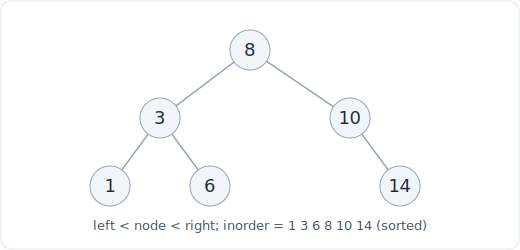

# 06 - Tree and binary search tree

A tree is a hierarchy: a root node with children, each of which is the root of a
subtree, all the way down to leaves. A binary tree limits each node to at most
two children. A binary search tree (BST) adds an ordering rule on top of the
binary tree, and that single rule is what turns an unordered pile of nodes into a
structure with O(log n) search, insert, and delete, as long as it stays balanced.
The recurring theme of this file: every BST cost is O(height), and whether the
height is O(log n) or O(n) is entirely a question of balance.



*A BST: left subtree less than node less than right subtree, so an inorder walk is sorted.*

## What it is

**Tree terminology**, because the interview vocabulary is precise:

- **Root**: the single top node, the one with no parent.
- **Leaf**: a node with no children (the bottom of a branch).
- **Edge**: the link between a parent and a child. A tree with n nodes has exactly
  n - 1 edges.
- **Depth** of a node: the number of edges from the root down to it. The root has
  depth 0.
- **Height** of a node: the number of edges on the longest path from it down to a
  leaf. A leaf has height 0. The **height of the tree** is the height of its root.
  Depth counts down from the top, height counts up from the bottom; they meet in
  the middle and are easy to confuse, so state which you mean.
- **Level**: all nodes at the same depth. Level 0 is just the root.
- **Balanced**: informally, the left and right subtrees of every node differ in
  height by at most a constant, so the height stays O(log n). A **degenerate**
  tree is the opposite: every node has one child, so it is effectively a linked
  list with height n - 1.

A **binary tree** allows each node up to two children (`left` and `right`) with no
ordering constraint. It is just a shape; you traverse it with DFS or BFS.

A **binary search tree** is a binary tree plus the **BST invariant**: for every
node, every value in its left subtree is less than the node's value, and every
value in its right subtree is greater. (Handle duplicates by a fixed convention
or by disallowing them.) Crucially the invariant is recursive and applies to the
whole subtree, not just the immediate children: a value two levels down on the
left must still be less than the ancestor, not merely less than its parent.

## Operations and complexity

Let h be the height of the tree and n the number of nodes.

| Operation | Cost | Note |
|---|---|---|
| Search (BST) | O(h) | Compare and descend left or right; discard half each step when balanced |
| Insert (BST) | O(h) | Search for the empty slot, attach there |
| Delete (BST) | O(h) | Find it, then splice or swap with the in-order successor |
| Find min / max (BST) | O(h) | Walk all the way left (min) or right (max) |
| Predecessor / successor (BST) | O(h) | The in-order neighbor |
| In-order traversal | O(n) | Visits every node once; yields sorted order in a BST |
| Any full traversal (DFS / BFS) | O(n) | You must touch every node |
| Traversal space | O(h) | The recursion stack (or the explicit stack / BFS queue) |

The single most important line: **BST operations are O(h), and h depends entirely
on balance.**

- **Balanced**: h = O(log n), so search, insert, and delete are O(log n). This is
  the number you quote, and it is why a balanced BST is the go-to "keep it sorted
  with fast updates" structure.
- **Degenerate** (inserting already-sorted data into a naive BST produces exactly
  this): h = O(n), so every operation degrades to O(n), no better than scanning a
  linked list. Same code, same invariant, but the shape collapsed.

### Why BST operations are O(height)

Search starts at the root and, at each node, the BST invariant lets you rule out
an entire subtree: if your target is smaller than the current node, it cannot be
anywhere in the right subtree, so you go left and never look right. Each step
drops one level, so the number of steps is bounded by the height. When the tree
is balanced, each step also halves the remaining candidates (like binary search),
giving O(log n). When the tree is a degenerate stick, "descend one level" removes
only one node from consideration, so you are back to O(n).

### Why in-order traversal of a BST is sorted

In-order traversal is: recurse left, visit the node, recurse right. Apply the BST
invariant: everything in the left subtree is smaller than the node, everything in
the right subtree is larger. So "all smaller values, then this value, then all
larger values", applied recursively at every node, emits the values in
non-decreasing order. This is the fact behind a whole class of problems: "k-th
smallest in a BST", "validate a BST" (check the in-order sequence is strictly
increasing), and "convert a BST to a sorted list" are all in-order traversals.

## Python implementation

The canonical node:

```python
class TreeNode:
    def __init__(self, val=0, left=None, right=None):
        self.val = val
        self.left = left
        self.right = right
```

BST search, recursively. Each call discards one side by the invariant:

```python
def search(root, target):
    if root is None or root.val == target:
        return root                 # None means not found
    if target < root.val:
        return search(root.left, target)   # target must be on the left
    return search(root.right, target)      # or the right
```

BST insert, recursively. Walk down as if searching; attach where you fall off:

```python
def insert(root, val):
    if root is None:
        return TreeNode(val)        # found the empty slot; create the node here
    if val < root.val:
        root.left = insert(root.left, val)
    elif val > root.val:
        root.right = insert(root.right, val)
    # val == root.val: duplicate; ignore (or handle per your convention)
    return root
```

In-order traversal, which prints a BST in sorted order:

```python
def inorder(root, out):
    if root is None:
        return
    inorder(root.left, out)         # all smaller values first
    out.append(root.val)            # then this node
    inorder(root.right, out)        # then all larger values
    return out
```

Both `search` and `insert` recurse to a depth of at most the height, so they are
O(h) time and O(h) stack space. `inorder` visits every node once, O(n) time and
O(h) space for the recursion stack.

## When to use it (and when not)

**Use a (balanced) BST when:**

- You need data kept in sorted order *and* fast inserts and deletes. An array
  stays sorted only at O(n) per insert (shifting); a balanced BST does it in
  O(log n).
- You need ordered queries a heap cannot answer cheaply: predecessor, successor,
  range queries, "k-th smallest", floor and ceiling. All are O(log n) or O(h) on
  a balanced BST.
- You want a sorted map or sorted set. In interviews you often simulate this with
  a plain sorted list plus `bisect` when inserts are rare, since Python ships no
  built-in balanced BST.

**Do not use a BST when:**

- You only ever want the single min or max repeatedly. A heap gives O(1) peek and
  a better constant.
- You need O(1) lookup by exact key and never need order. A hash map beats
  O(log n) with O(1) average.
- You cannot guarantee balance and your inserts may arrive sorted. A naive BST
  degenerates to O(n); either use a self-balancing variant or a different
  structure.

## Tradeoffs and gotchas

**The whole game is balance.** A BST's advertised O(log n) is really O(h), and h
is O(log n) only when the tree is balanced. Feed a naive BST already-sorted input
and it builds a straight line of height n, turning every operation into O(n).
Never quote O(log n) for a BST without the word "balanced".

**Validate with the range, not the parent.** A classic bug in "is this a valid
BST" is checking only that each node's children obey the order relative to their
immediate parent. The invariant is over the whole subtree: pass a `(low, high)`
range down and tighten it at each step, or check that the in-order traversal is
strictly increasing.

**Delete is the fiddly one.** Deleting a node with two children requires
replacing it with its in-order successor (the smallest value in the right
subtree) or predecessor, then deleting that. Leaf and single-child deletions are
easy; the two-child case is where bugs live.

**Recursion depth is O(h) space.** DFS on a tree is not O(1) space: every call
frame sits on the stack, so you use O(h) space, O(log n) balanced and O(n)
degenerate. This is the recursion-space caveat from the
[complexity cheat sheet](../complexity.md); do not claim O(1) space for a
recursive tree walk.

### Self-balancing trees (high level)

Production sorted structures do not trust the input to stay balanced; they
rebalance on every insert and delete to keep h = O(log n) guaranteed. You do not
implement these in an interview, but you should be able to name them:

- **AVL tree**: strictly balanced (heights of the two subtrees differ by at most
  1 at every node), enforced by rotations after each update. Fastest lookups;
  more rotations on writes.
- **Red-black tree**: a looser balance guarantee enforced by node "colors" and
  rotations. Fewer rotations on writes, slightly taller trees. This is what backs
  Java's `TreeMap` and C++'s `std::map`.

The shared idea: after an insert or delete threatens balance, a constant number
of local **rotations** restores it in O(log n), so the height, and therefore
every operation, stays logarithmic no matter what order the data arrives in.
Python's standard library ships neither; when you need one in practice you reach
for `sortedcontainers.SortedList` (a different design with the same O(log n)
ordered-op guarantees) or maintain a sorted list with `bisect`.

## Related patterns

- [Tree DFS](../patterns/12-tree-dfs.md): pre/in/post-order traversal, the
  recursive backbone of nearly every tree problem.
- [Tree BFS](../patterns/13-tree-bfs.md): level-order traversal with a queue,
  for "by level" and shortest-path-in-tree questions.
- [BST pattern](../patterns/14-bst.md): the problems that exploit the invariant,
  validate-BST, k-th smallest, range queries, and BST insert/delete.
- [Heap (priority queue)](05-heap.md): the "one extreme, cheaply" alternative
  compared in the heap-vs-BST discussion.
- [Complexity cheat sheet](../complexity.md): the O(h) costs and the recursion
  space caveat that O(h) traversal space comes from.
