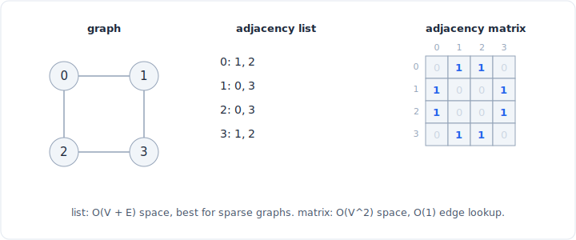

# 08 - Graph

A graph is the general structure for "things and the relationships between them":
nodes (vertices) connected by edges. Trees and linked lists are just graphs with
extra rules, so once you can represent an arbitrary graph you can model almost any
connectivity problem. The single most important decision is how you store the edges,
adjacency list or adjacency matrix, because it fixes the cost of every traversal you
run on top.



*The same graph as an adjacency list (O(V + E) space, best for sparse) and an adjacency matrix (O(V^2) space, O(1) edge lookup).*

## What it is

A graph is a set of **vertices** V and a set of **edges** E, where each edge joins
two vertices. The variations you must recognize:

- **Directed vs undirected.** An undirected edge `(u, v)` means you can go both ways;
  a directed edge `u -> v` means one way only. "Friendship" is undirected;
  "follows" or "prerequisite of" is directed.
- **Weighted vs unweighted.** An unweighted edge just says "connected"; a weighted
  edge carries a number (distance, cost, capacity). BFS handles unweighted shortest
  path; Dijkstra and friends handle weighted.
- **Cyclic vs acyclic.** A directed graph with no cycles (a DAG) is what topological
  sort needs. A cycle in an undirected graph is what union-find detects.

Most interview graphs are **sparse**: the number of edges is closer to O(V) than to
O(V^2). A road map, a course-prerequisite graph, a social follow graph: each node
touches a handful of others, not all of them. That fact drives the storage choice
below.

## Operations and complexity

V is the vertex count, E the edge count, and `degree(u)` the number of edges leaving
`u`. The costs differ by representation, which is exactly why the representation
matters.

| Operation | Adjacency list | Adjacency matrix | Note |
|---|---|---|---|
| Space | O(V + E) | O(V^2) | List stores only real edges |
| Add edge | O(1) | O(1) | Append to a list vs set a cell |
| Has edge `(u, v)`? | O(degree(u)) | O(1) | Matrix wins the point lookup |
| Iterate neighbors of `u` | O(degree(u)) | O(V) | List gives only real neighbors |
| Full traversal (BFS / DFS) | O(V + E) | O(V^2) | You touch every neighbor list once |

A BFS or DFS over an adjacency list is O(V + E): you visit each vertex once and walk
each edge once. The same traversal over a matrix is O(V^2), because reading one
node's neighbors means scanning a full row of V cells whether or not they are edges.
On a sparse graph that is the difference between linear and quadratic. See the
[complexity cheat sheet](../complexity.md) for the container costs underneath.

## Python implementation

The default representation is an adjacency list, and `defaultdict(list)` builds one
without any "does this key exist yet" boilerplate:

```python
from collections import defaultdict, deque

def build_graph(edges, directed=False):
    graph = defaultdict(list)
    for u, v in edges:
        graph[u].append(v)
        if not directed:
            graph[v].append(u)   # undirected: store both directions
    return graph

# weighted variant: store (neighbor, weight) tuples
def build_weighted(edges):
    graph = defaultdict(list)
    for u, v, w in edges:
        graph[u].append((v, w))
        graph[v].append((u, w))
    return graph
```

Traversing it is then the standard BFS:

```python
def bfs(graph, start):
    seen = {start}
    q = deque([start])
    order = []
    while q:
        node = q.popleft()
        order.append(node)
        for nxt in graph[node]:
            if nxt not in seen:
                seen.add(nxt)
                q.append(nxt)
    return order
```

**A grid is an implicit graph.** You almost never build the adjacency list for a
2D grid; the edges are implied by the four (or eight) neighboring cells. The `graph`
is the grid, and the neighbor function is the edge set:

```python
def neighbors(r, c, rows, cols):
    for dr, dc in ((1, 0), (-1, 0), (0, 1), (0, -1)):
        nr, nc = r + dr, c + dc
        if 0 <= nr < rows and 0 <= nc < cols:
            yield nr, nc
```

Every "number of islands", "rotting oranges", "shortest path in a maze" problem is a
graph traversal where you never materialize the graph. Recognizing the grid as an
implicit graph is half the solution.

## When to use it (and when not)

Model a problem as a graph when:

- Entities have **arbitrary pairwise relationships**: networks, dependencies, maps,
  state machines. If "A relates to B" is the core, it is a graph.
- You need **reachability, connectivity, or paths**: "can I get from X to Y", "how
  many separate groups", "shortest route".
- The problem is a **grid, a set of course prerequisites, or word transformations**;
  these are graphs in disguise.

Choose the **adjacency list** by default: it is O(V + E) space and gives you cheap
neighbor iteration, which is what every traversal needs. Choose the **adjacency
matrix** only when the graph is **dense** (E approaches V^2), when you need O(1)
"is there an edge between exactly these two" lookups a lot, or when V is small enough
that O(V^2) space is trivial and the constant-factor simplicity wins.

Pros and cons at a glance:

| | Adjacency list | Adjacency matrix |
|---|---|---|
| Space | O(V + E), stores only real edges | O(V^2) always, even for a sparse graph |
| Edge lookup `(u, v)` | O(degree(u)), scan the neighbor list | O(1), index one cell |
| Iterate neighbors | O(degree(u)), only real neighbors | O(V), scan a whole row |
| Add / remove edge | O(1) add; remove is O(degree) | O(1) both |
| Best for | Sparse graphs (most real problems) | Dense graphs, tiny V, frequent edge tests |
| Cache / simplicity | More pointer chasing | Flat 2D array, simple and cache-friendly |

## Tradeoffs and gotchas

- **Undirected means store both directions.** Insert `(u, v)` and `(v, u)` in the
  list, or set both `m[u][v]` and `m[v][u]` in the matrix. Forgetting the reverse
  edge is the classic bug that makes half your graph unreachable.
- **Mark visited on enqueue, not on dequeue** in BFS. If you wait until you pop a
  node to mark it, the same node gets pushed by several neighbors and you process it
  more than once, breaking the O(V + E) bound and sometimes the correctness.
- **`defaultdict` creates keys on read.** Just checking `graph[node]` for a node with
  no edges inserts an empty list. Usually harmless, but it can corrupt a later
  "is this node in the graph" test. Use `.get(node, [])` if you must not mutate.
- **Matrix space is unforgiving.** A graph with 100,000 vertices needs a
  10^10-cell matrix, which is impossible, while its adjacency list may be a few
  hundred thousand entries. On large sparse graphs the matrix is simply not an
  option.
- **Disconnected graphs need an outer loop.** One BFS or DFS from a single start only
  reaches one component. To cover every vertex (counting components, for instance),
  loop over all vertices and launch a traversal from each unvisited one.

## Related patterns

- [graph traversal](../patterns/16-graph-traversal.md) is BFS and DFS on this
  structure: connectivity, components, flood fill, grid problems.
- [topological sort](../patterns/17-topological-sort.md) orders a DAG built as an
  adjacency list, the tool for dependency and scheduling problems.
- [shortest path](../patterns/19-shortest-path.md) covers BFS for unweighted graphs
  and Dijkstra for weighted ones, both running on the adjacency list.
- [union-find](../patterns/18-union-find.md) is the alternative to traversal when you
  only care about connectivity as edges arrive.
- The [complexity cheat sheet](../complexity.md) has the `deque`, `dict`, and `list`
  costs that the traversals are built on.
