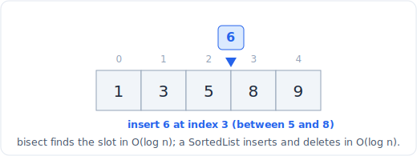

# 10 - Sorted container (bisect and SortedList)

A sorted container keeps its elements in sorted order at all times, so you can ask
"where would x go", "how many elements are below x", or "what is the kth smallest"
in O(log n). Python gives you two levels of this: the stdlib `bisect` module, which
does binary search over an already-sorted list, and `sortedcontainers.SortedList`,
a third-party but interview-permitted structure that keeps itself sorted through
inserts and deletes in O(log n). This is the tool for dynamic order statistics and
range counts when you do not need the arbitrary range aggregates that a
[segment tree](../patterns/29-segment-tree-fenwick.md) provides.



*A sorted container keeps order as values arrive: bisect finds the slot in O(log n), SortedList inserts there in O(log n).*

## What it is

- **`bisect`** performs binary search on a sorted Python list. `bisect_left(a, x)`
  returns the leftmost index where x could be inserted to keep a sorted;
  `bisect_right(a, x)` returns the rightmost such index. The gap between them is the
  count of elements equal to x. `insort` inserts while keeping order.
- **`SortedList`** (from the `sortedcontainers` package) is a list that stays
  sorted automatically. It supports O(log n) `add` and `remove`, O(log n)
  `bisect_left` / `bisect_right`, and O(log n) indexing (`sl[k]` for the kth
  smallest), by storing elements in a list of small lists under the hood.

The distinction that matters: with a plain list, the binary **search** is O(log n)
but the **insertion** is O(n), because the list must shift elements. `SortedList`
makes the insertion O(log n) too, which is what lets it drive a moving window.

## Operations and complexity

| Operation | Cost | Note |
|---|---|---|
| `bisect_left(a, x)`, `bisect_right(a, x)` | O(log n) | Binary search over a sorted list |
| `bisect.insort(a, x)` | O(n) | Search is O(log n), but the shift to insert is O(n) |
| `SortedList.add(x)` | O(log n) | Stays sorted, no O(n) shift |
| `SortedList.remove(x)` | O(log n) | |
| `sl[k]` (kth smallest) | O(log n) | Order statistics |
| `sl.bisect_left(x)` (count below x) | O(log n) | Range counts |
| `x in sl` | O(log n) | |

The takeaway: for a **static** sorted array, `bisect` is all you need. For a
**changing** collection where you insert and delete as you go, use `SortedList` so
every operation stays O(log n).

## Python implementation

```python
import bisect

# Static array: count how many elements fall in [lo, hi], inclusive.
def count_in_range(sorted_a, lo, hi):
    left = bisect.bisect_left(sorted_a, lo)
    right = bisect.bisect_right(sorted_a, hi)
    return right - left

# Dynamic collection: order statistics and range counts while inserting.
from sortedcontainers import SortedList

sl = SortedList()
sl.add(5)
sl.add(1)
sl.add(3)
# sl is now [1, 3, 5]
kth_smallest = sl[0]                 # 1, in O(log n)
below_4 = sl.bisect_left(4)          # 2 elements are < 4
sl.remove(3)                         # O(log n)
```

## When to use it (and when not)

Use a sorted container when:

- You need the **kth smallest or largest** from a collection that keeps changing
  (a [heap](05-heap.md) gives you only the single extreme, not an arbitrary rank).
- You need **range counts** ("how many current values lie in [lo, hi]") as elements
  come and go: two `bisect` calls.
- You are computing a **sliding-window median** or a windowed order statistic:
  `SortedList` supports add, remove, and indexed access all in O(log n).
- You need the **nearest value** to x (predecessor or successor): `bisect` gives
  the insertion point, and the neighbors around it are the candidates.

Do not use it when:

- You need an **arbitrary range aggregate** like a range sum, especially with
  updates. That is a [Fenwick tree or segment tree](../patterns/29-segment-tree-fenwick.md).
  A sorted container answers order and count questions, not sum questions.
- You only ever need the **single min or max**: a [heap](05-heap.md) is lighter.
- The array is **static and only searched**: plain `bisect` on a list, no
  `SortedList` needed.

## Tradeoffs and gotchas

- **`bisect.insort` is O(n), not O(log n).** The search is logarithmic but the
  insertion shifts the tail. Building a sorted list by repeated `insort` is O(n^2);
  use `SortedList` if you insert often.
- **`SortedList` is third-party.** `sortedcontainers` is not in the standard
  library, though it is available in the LeetCode judge. In a from-scratch setting
  without it, you fall back to a BIT or a balanced-BST implementation.
- **`bisect` has no `key` argument before Python 3.10.** On older runtimes you
  sort tuples or decorate values to sort by a custom key.
- **Duplicates.** Use `bisect_left` vs `bisect_right` deliberately: their
  difference is exactly the multiplicity of x, which is often the count you want.

## Related patterns

- [Binary search](../patterns/07-binary-search.md): `bisect` is binary search
  packaged; the same lower-bound / upper-bound logic drives both.
- [Segment tree and Fenwick (BIT)](../patterns/29-segment-tree-fenwick.md): the
  alternative when you need range **aggregates** (sum, min) rather than order
  statistics and counts.
- [Heap (priority queue)](05-heap.md): the lighter choice when you only need the
  single smallest or largest, not an arbitrary rank.
- [Sliding window](../patterns/02-sliding-window.md): windowed median and windowed
  order statistics use a `SortedList` as the window's backing store.
