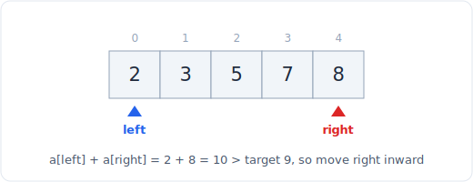

# 01 - Two pointers

> **Problem shape:** "Given a sorted array, find two numbers that add up to a
> target." Or: "reverse the vowels", "remove duplicates in place", "is this a
> palindrome", "container with most water". Two indices walk the array and meet or
> chase each other, turning an O(n^2) pair search into O(n).

The two-pointer pattern replaces a nested loop with a single pass by maintaining
two indices that move under a rule. It is the first pattern to reach for on arrays
and strings, and it is the base that sliding window and fast-slow pointers build
on.



*Two pointers start at both ends of a sorted array and move inward toward the target.*

## The signal

Reach for two pointers when you see:

- **A sorted array (or one you are allowed to sort)** and you need a pair, a
  triplet, or a partition. Sorting makes "move which pointer" decidable.
- **Compare or process from both ends inward**: palindromes, reversing in place,
  "most water between two lines", "trapping rain water".
- **In-place array surgery**: remove duplicates, move zeroes, partition by a
  predicate, all in O(1) extra space. Here one pointer reads and one writes (the
  slow-fast or read-write variant).
- **The brute force is "try every pair"** and the array has structure (sortedness,
  or a monotonic relationship) that tells you which pointer to advance.

The tell is that after inspecting the two ends, you can always rule out one of
them, so you never need to revisit it.

## The idea

Two pointers works because each move is a **provably safe elimination**. In the
sorted two-sum, `left` at the smallest value and `right` at the largest:

- If `a[left] + a[right] < target`, no pair using `left` can ever reach the
  target (its partner is the biggest value and still fell short), so advance
  `left` and never look back.
- If the sum is too big, symmetric: `right` can be discarded, so decrement it.
- Each element is visited at most once from each side, so the whole scan is O(n)
  time and O(1) space.

The two ends variant converges inward. The read-write variant runs both pointers
left to right, with `slow` marking where the next kept element goes and `fast`
scanning ahead.

## The template

**Opposite ends (converging):**

```python
# Time: O(n), Space: O(1)
def two_sum_sorted(a, target):
    left, right = 0, len(a) - 1
    while left < right:
        s = a[left] + a[right]
        if s == target:
            return [left, right]
        if s < target:
            left += 1          # need a bigger sum
        else:
            right -= 1         # need a smaller sum
    return [-1, -1]
```

**Read-write (fast-slow in one direction), remove duplicates from a sorted array:**

```python
# Time: O(n), Space: O(1)
def remove_duplicates(a):
    if not a:
        return 0
    slow = 0                   # last index of the unique prefix
    for fast in range(1, len(a)):
        if a[fast] != a[slow]:
            slow += 1
            a[slow] = a[fast]
    return slow + 1            # length of the deduped prefix
```

The mental model: `slow` is the boundary of the "finished" region, `fast`
explores. You advance `slow` only when `fast` finds something worth keeping.

## Variations

- **Three (or k) sum.** Fix the outer element with a loop, then run the two-pointer
  scan on the rest. Sort first. Skip duplicate values at each level to avoid
  duplicate triplets. O(n^2) for 3Sum.
- **Partition (Dutch national flag).** Three pointers (`low`, `mid`, `high`) sort
  an array of 0s, 1s, 2s in one pass. The template for "sort colors".
- **Merge two sorted arrays / lists.** One pointer per array, take the smaller
  each step. The backbone of merge sort and of merging k lists.
- **Trapping rain water / container with most water.** Opposite ends, move the
  pointer at the shorter wall, because that one bounds the water and cannot
  improve by staying.
- **String cleanup in place.** Reverse a string, reverse vowels, valid palindrome
  ignoring non-alphanumerics: both ends, skip what you must, swap or compare.

## Canonical problems

| # | Problem | Difficulty | What it drills |
|---|---------|-----------|----------------|
| 167 | Two Sum II - Input Array Is Sorted | Medium | The base converging template |
| 125 | Valid Palindrome | Easy | Both ends, skipping characters |
| 283 | Move Zeroes | Easy | Read-write in-place partition |
| 26 | Remove Duplicates from Sorted Array | Easy | Slow-fast dedup |
| 344 | Reverse String | Easy | Both ends swap |
| 11 | Container With Most Water | Medium | Move the shorter wall; greedy elimination |
| 15 | 3Sum | Medium | Fix one, two-pointer the rest, skip dupes |
| 16 | 3Sum Closest | Medium | Track best while converging |
| 75 | Sort Colors | Medium | Dutch national flag, three pointers |
| 42 | Trapping Rain Water | Hard | Both ends bounded by the shorter side |
| 680 | Valid Palindrome II | Easy | Branch on a single allowed deletion |

## Pitfalls

- **Forgetting to sort** when the pair-finding logic depends on order. If the
  problem needs original indices, sort a list of (value, index) pairs, not the
  values alone.
- **Off-by-one on the loop guard.** `while left < right` for converging (never let
  them cross or you double-count); `left <= right` only when a single middle
  element must be inspected.
- **Duplicate results in kSum.** After finding a valid tuple, advance past all
  equal values on both sides, otherwise you emit the same triplet many times.
- **Moving the wrong pointer** in container/water problems. Always move the one at
  the shorter wall; moving the taller one can never increase the area.
- **Mutating while comparing indices.** In the read-write variant, read from
  `a[fast]` and write to `a[slow]`, and make sure `slow` never overtakes `fast`.

## Follow-ups and related patterns

- "What if the array is not sorted and you cannot sort it?" pushes you to
  [hashing](04-hashing.md) (the unsorted two-sum is a hash-map problem, O(n) time,
  O(n) space).
- "What if it is a stream and you cannot index backward?" pushes to
  [sliding window](02-sliding-window.md) or a [heap](24-heap.md).
- "Do it on a linked list" pushes to [fast and slow pointers](10-linked-list.md),
  where you cannot index and must walk with two speeds.
- The converging idea generalizes to [binary search](07-binary-search.md): both
  discard half the remaining candidates per step.
