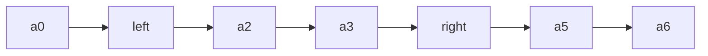

# 02 - Sliding window

> **Problem shape:** "Find the longest substring without repeating characters."
> "Smallest subarray with a sum at least s." "Longest substring with at most k
> distinct characters." Anything asking for the best (longest or shortest)
> *contiguous* run that satisfies a constraint, over an array or string.

Sliding window turns an O(n^2) or O(n^3) scan of all subarrays into a single O(n)
pass by keeping a window `[left, right]` and moving its edges instead of
restarting. It is two pointers specialized to "contiguous range under a
constraint", and it is one of the highest-frequency interview patterns.

## The signal

Reach for sliding window when the problem asks for:

- **A contiguous subarray or substring** (not a subsequence: contiguity is the
  whole point) that is **longest, shortest, or exactly satisfies** some property.
- Constraints phrased as **"at most k", "at least s", "without repeating",
  "containing all of"**. These are window-validity conditions you can maintain
  incrementally.
- A quantity that changes **only at the window edges** as it moves: a running sum,
  a character count, a distinct-count. If adding one element on the right and
  removing one on the left updates the state in O(1), a window applies.

If the answer is a subsequence (non-contiguous), this is not your pattern; that is
usually [DP](22-dp-strings.md).

## The idea

Maintain a window and an invariant. Expand `right` to include new elements. When
the window **violates** the constraint, shrink from `left` until it is valid
again. Every element enters the window once and leaves at most once, so total work
is O(n) even though the window size varies.



*The window spans left..right. Expand by moving right, contract by moving left.*

Two flavors:

- **Variable-size window** (most common): grow right, shrink left to restore
  validity, record the best window seen. "Longest with at most k distinct."
- **Fixed-size window** (size k given): slide a window of constant width, add the
  incoming and drop the outgoing element each step. "Max average subarray of size
  k."

The state inside the window is usually a hash map of counts (for strings) or a
running sum (for numbers).

## The template

**Variable-size, "longest window that stays valid":**

```python
def longest_valid_window(s):
    from collections import defaultdict
    count = defaultdict(int)
    left = 0
    best = 0
    for right, ch in enumerate(s):
        count[ch] += 1
        while not is_valid(count):        # shrink until valid again
            count[s[left]] -= 1
            if count[s[left]] == 0:
                del count[s[left]]
            left += 1
        best = max(best, right - left + 1)
    return best
```

**Variable-size, "shortest window that reaches a target" (minimize):**

```python
def min_subarray_len(target, nums):
    left = 0
    window_sum = 0
    best = float('inf')
    for right, x in enumerate(nums):
        window_sum += x
        while window_sum >= target:       # valid: try to shrink for a smaller answer
            best = min(best, right - left + 1)
            window_sum -= nums[left]
            left += 1
    return best if best != float('inf') else 0
```

**Fixed-size window of width k:**

```python
def max_sum_k(nums, k):
    window_sum = sum(nums[:k])
    best = window_sum
    for right in range(k, len(nums)):
        window_sum += nums[right] - nums[right - k]   # add incoming, drop outgoing
        best = max(best, window_sum)
    return best
```

The direction of the `while` matters: for **longest** you shrink while
**invalid**; for **shortest** you shrink while **still valid** and record on the
way.

## Variations

- **At most k distinct / at most k of something.** Keep a count map; the window is
  invalid when `len(count) > k`. "Longest substring with at most two distinct".
- **Exactly k.** Compute `atMost(k) - atMost(k-1)`. Turning "exactly" into two
  "at most" calls is a standard trick ("subarrays with k different integers",
  "number of nice subarrays").
- **Cover a target set (minimum window substring).** Track how many required
  characters are still missing; the window is valid when nothing is missing, then
  shrink to minimize. The hardest common variation, worth memorizing.
- **Longest without repeats.** The count map degenerates to "each char at most
  once"; you can shortcut with a last-seen-index map and jump `left`.
- **Fixed window plus a monotonic deque** for max or min in the window: see
  [monotonic stack and deque](11-stacks.md) for "sliding window maximum".

## Canonical problems

| # | Problem | Difficulty | What it drills |
|---|---------|-----------|----------------|
| 643 | Maximum Average Subarray I | Easy | The fixed-size template |
| 3 | Longest Substring Without Repeating Characters | Medium | Variable window, last-seen map |
| 209 | Minimum Size Subarray Sum | Medium | Shrink-while-valid (minimize) |
| 424 | Longest Repeating Character Replacement | Medium | Window valid if `size - maxfreq <= k` |
| 340 | Longest Substring with At Most K Distinct | Medium | Count map, invalid when distinct > k |
| 567 | Permutation in String | Medium | Fixed window over a frequency signature |
| 438 | Find All Anagrams in a String | Medium | Fixed window, match count maps |
| 992 | Subarrays with K Different Integers | Hard | Exactly k via atMost(k) - atMost(k-1) |
| 76 | Minimum Window Substring | Hard | Cover a target multiset, then minimize |
| 239 | Sliding Window Maximum | Hard | Fixed window plus a monotonic deque |

## Pitfalls

- **Shrinking in the wrong direction.** Longest: shrink while invalid. Shortest:
  shrink while valid and record before shrinking. Mixing these is the classic bug.
- **Recording the answer at the wrong moment.** For "shortest", record inside the
  shrink loop; for "longest", record after the shrink loop restores validity.
- **Stale counts.** When a count hits zero, delete the key (or the distinct-count
  check `len(count)` is wrong). Numeric sums do not have this issue.
- **Assuming contiguity when the problem wants a subsequence.** Re-read: "subarray"
  and "substring" are contiguous; "subsequence" is not and needs DP.
- **Negative numbers break the monotonic-shrink assumption.** "Minimum size
  subarray sum" with negatives is no longer a plain window; it becomes a prefix-sum
  plus monotonic-deque problem. Windows assume adding elements moves the metric in
  one direction.

## Follow-ups and related patterns

- "The values can be negative, so a bigger window is not always a bigger sum"
  pushes to [prefix sum](03-prefix-sum.md) with a monotonic deque or a sorted
  structure.
- "Give me the max in every window" pushes to the monotonic deque in
  [stacks](11-stacks.md).
- "It is a subsequence, not a substring" pushes to [DP](22-dp-strings.md).
- The window-validity bookkeeping is pure [hashing and frequency
  counting](04-hashing.md); sliding window is that pattern applied to a moving
  range.
