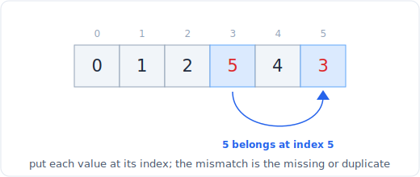

# 06 - Cyclic sort and index-as-hash

> **Problem shape:** "An array holds the numbers 1 to n, one is missing, find
> it." "Find the duplicate in an array of n+1 numbers in the range 1 to n."
> "Find all numbers that disappeared." "Smallest missing positive integer."
> When the values are (or map into) the index range and you want O(n) time with
> O(1) extra space, the array is its own hash table.

Cyclic sort exploits a special promise: the values are a permutation (or near
permutation) of `1..n`, so each value has a home index. Placing every value at
its home in one pass makes missing and duplicate numbers fall out by position, in
O(n) time and O(1) space, no hash set required. The sign-marking variant does the
same trick without even moving elements, by using the sign bit of `a[index]` as a
visited flag.



*Put each value at its index; the one slot that stays wrong reveals the missing or duplicate.*

## The signal

Reach for cyclic sort or index-as-hash when you see:

- **Values confined to `1..n` (or `0..n-1`)** in an array of length about `n`.
  That bijection between values and indices is the entire premise.
- **"Find the missing / duplicate / disappeared number(s)"** in such an array, and
  the follow-up demands **O(1) extra space** (so a hash set is off the table).
- **"First missing positive"**, where you must ignore out-of-range junk and still
  find the smallest absent positive in linear time and constant space.
- **A hint that you may mutate the array** (reorder it, or flip signs), which is
  what buys you the O(1) space.

The tell: the problem practically hands you a permutation of a known range, and it
specifically asks for constant extra space, which rules out the obvious hash-set
answer and points at using the array's own indices as buckets.

## The idea

If an array is a permutation of `1..n`, then value `v` belongs at index `v - 1`.
Cyclic sort walks the array and, whenever `a[i]` is not already at its home index,
swaps it there. Each swap places at least one value permanently home, so the total
number of swaps is at most `n`: the pass is O(n) even though it contains a nested
`while`. After the pass, the first index `i` where `a[i] != i + 1` is exactly
where a number is missing or wrong, which is how missing and duplicate values
reveal themselves by position.

The index-as-hash (sign-marking) variant avoids moving anything. To record "I have
seen value `v`", flip the sign of `a[abs(v) - 1]` to negative. After one pass, any
index still holding a positive value was never visited, so `index + 1` is missing;
an index you try to mark twice reveals a duplicate. You read magnitudes with
`abs()` because the sign now carries the visited bit, not the value. This is a
genuine hash table built inside the array, using the sign of each slot as its one
bit of metadata.

Both give O(n) time and O(1) extra space, beating the O(n) space of a hash set,
at the cost of mutating the input.

## The template

**Cyclic sort (place each value at its home index):**

```python
# Time: O(n), Space: O(1)
def cyclic_sort(a):                 # a is a permutation of 1..n
    i = 0
    while i < len(a):
        home = a[i] - 1             # value v belongs at index v-1
        if a[i] != a[home]:         # not yet home: swap it there
            a[i], a[home] = a[home], a[i]
        else:
            i += 1                  # correct value here (or a dup): advance
    return a
```

**Find the missing number 0..n (missing-number by home index):**

```python
# Time: O(n), Space: O(1)
def missing_number(nums):           # values 0..n with one missing, length n
    i, n = 0, len(nums)
    while i < n:
        home = nums[i]
        if home < n and nums[i] != nums[home]:
            nums[i], nums[home] = nums[home], nums[i]
        else:
            i += 1
    for i in range(n):
        if nums[i] != i:            # first slot whose value is not its index
            return i
    return n
```

**Sign-marking to find all disappeared numbers (index-as-hash, no swaps):**

```python
# Time: O(n), Space: O(1) auxiliary (the returned list is not counted)
def find_disappeared(nums):         # values 1..n, some appear twice
    for x in nums:
        idx = abs(x) - 1            # magnitude, sign is now a visited flag
        if nums[idx] > 0:
            nums[idx] = -nums[idx]  # mark "value idx+1 was seen"
    missing = [i + 1 for i, v in enumerate(nums) if v > 0]
    for i in range(len(nums)):      # restore signs if the caller needs the array
        nums[i] = abs(nums[i])
    return missing
```

**First missing positive (cyclic sort ignoring out-of-range values):**

```python
# Time: O(n), Space: O(1)
def first_missing_positive(nums):
    n = len(nums)
    i = 0
    while i < n:
        home = nums[i] - 1
        if 0 <= home < n and nums[i] != nums[home]:  # only place in-range values
            nums[i], nums[home] = nums[home], nums[i]
        else:
            i += 1
    for i in range(n):
        if nums[i] != i + 1:        # first index missing its home value
            return i + 1
    return n + 1                    # 1..n all present, answer is n+1
```

The loop guard is `while i < n` with a conditional `i += 1`, not a `for`: you only
advance once the current slot is settled, and a swap may bring in a value that
still needs placing.

## Variations

- **Missing number, single.** Either cyclic sort and scan, or the XOR / sum trick
  (`n*(n+1)/2 - sum`). Cyclic sort generalizes to "all missing"; the arithmetic
  trick does not.
- **Duplicate number(s).** After cyclic sort, an index where `a[i] != i + 1` holds
  a duplicate (the value that displaced the missing one). For "find all
  duplicates", the sign-marking pass reports any index you try to mark twice.
- **Find the duplicate without mutating (LeetCode 287).** When you may not modify
  the array, reframe it as a linked-list cycle and use Floyd's tortoise and hare on
  `next = a[i]`. That is the [fast and slow pointers](10-linked-list.md) pattern,
  not cyclic sort, and it is the intended O(1)-space, read-only solution.
- **Set mismatch (one number duplicated, one missing).** Cyclic sort, then the one
  bad index gives both the duplicate (its value) and the missing (its index + 1).
- **First missing positive.** The hard case: out-of-range and non-positive values
  are ignored during placement, so only `1..n` matter, and the first unfilled home
  is the answer.

## Canonical problems

| # | Problem | Difficulty | What it drills |
|---|---------|-----------|----------------|
| 268 | Missing Number | Easy | Home-index placement or XOR trick |
| 448 | Find All Numbers Disappeared in an Array | Easy | Sign-marking, collect positive slots |
| 645 | Set Mismatch | Easy | One bad index gives both dup and missing |
| 442 | Find All Duplicates in an Array | Medium | Sign-marking reports double-marks |
| 287 | Find the Duplicate Number | Medium | Read-only: Floyd's cycle detection |
| 41 | First Missing Positive | Hard | Cyclic sort ignoring out-of-range values |
| 765 | Couples Holding Hands | Hard | Cyclic-swap greedy to fix a permutation |
| 1539 | Kth Missing Positive Number | Easy | Count missing before each index |

## Pitfalls

- **Advancing the index on every step.** Use `while i < n` and only `i += 1` when
  the slot is already correct. A plain `for` loop breaks the "swap may bring in
  another misplaced value" logic.
- **Infinite swap loop on duplicates.** Guard the swap with `a[i] != a[home]`, not
  `a[i] != i + 1`. Comparing values-at-positions stops when the target slot already
  holds the same value (a duplicate), otherwise you swap two equal values forever.
- **Out-of-range values in first missing positive.** Skip anything not in `1..n`
  during placement; trying to home a value like `1000000` or `-3` corrupts the
  scan or throws an index error.
- **Losing the values under sign-marking.** After flipping signs you must read
  magnitudes with `abs()`, and restore the array with `abs()` at the end if the
  caller still needs the real numbers.
- **Zero has no sign.** Sign-marking cannot record a visit to a slot whose value is
  0. Shift the range or use cyclic sort when 0 is a valid value.
- **Assuming you may mutate.** If the problem forbids modifying the input (287),
  cyclic sort and sign-marking are both out; fall back to cycle detection.

## Follow-ups and related patterns

- "You may not modify the array" turns 287 into a
  [fast and slow pointers](10-linked-list.md) cycle-detection problem on
  `next = a[i]`.
- "You may use O(n) extra space" makes the whole family a trivial
  [hashing](04-hashing.md) exercise; cyclic sort is what you reach for precisely
  when a hash set is banned.
- The counting-missing-before-an-index variant (1539) is a
  [binary search](07-binary-search.md) once you see the count is monotonic.
- Placing each value at its home index is a restricted [sort](08-sorting.md): it
  only works because the keys are a known dense range, which is what drops it from
  O(n log n) to O(n).
