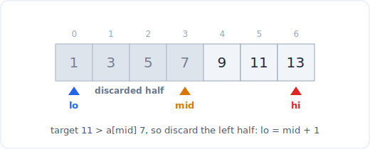

# 07 - Binary search

> **Problem shape:** "Given a sorted array, find a target (or where it would go)."
> Or the sneakier version: "What is the smallest ship capacity / eating speed /
> array-split cost that still finishes in time?" Anything where the search space is
> ordered, or where a yes/no feasibility check flips exactly once from no to yes as
> you dial one number up, collapses from O(n) to O(log n).

Binary search halves the candidate range every step by asking one question whose
answer rules out an entire half. On a sorted array that question is "is the target
left or right of the middle". The deeper, higher-value form is binary search on
the answer: you are not indexing an array at all, you are probing a numeric answer
space against a monotonic feasibility predicate. Both are the same mechanism, and
the loop-invariant framing below is what keeps you off the off-by-one rocks.

## The signal

Reach for binary search when you see:

- **A sorted array (or a rotated-sorted one)** and you need a target, an insertion
  point, or the first/last occurrence of a value.
- **A monotonic predicate over a numeric range.** The problem says "minimum X such
  that it works" or "maximum X such that it still fits", and if X works then every
  larger X works too (or vice versa). That one-way flip is the whole signal.
- **The brute force is "try every candidate value from lo to hi"** and each try is
  cheap to check for feasibility. You are scanning a line you could instead bisect.
- **Answer bounds are huge but checkable.** "Speed can be 1 to 10^9" screams
  log-of-the-range: you cannot enumerate a billion speeds, but you can test one in
  O(n).

The tell for the answer variant: rephrase the goal as `feasible(x)` returning a
bool, and check that `feasible` is monotone in `x`. If it is, you binary search
`x`, not the input.

## The idea

Binary search maintains an invariant over a half-open or closed range and shrinks
it until one candidate remains. Each comparison is a **provably safe elimination**:
after looking at the middle, you discard the half that cannot contain the answer,
so `log2(n)` steps suffice.



*Each step compares against mid and discards the half that cannot hold the answer.*

The trap is not the concept, it is the boundary bookkeeping: inclusive vs exclusive
ends, `mid` rounding down, and whether the loop ends with `lo == hi` or `lo > hi`.
The cure is to fix one invariant and never deviate. For the leftmost/lower-bound
templates below the invariant is: **everything left of `lo` fails the predicate,
everything at or right of `hi` satisfies it**, and the loop drives `lo` and `hi`
together onto the boundary. You never ask "did I find it" mid-loop; you let the
range collapse and read the boundary off at the end.

For binary search on the answer, the sorted array is replaced by an imaginary
array `[feasible(lo), ..., feasible(hi)]` that reads `False False ... False True
True ... True`. Finding the first `True` is exactly lower-bound, so the same
template applies with `feasible(mid)` standing in for `a[mid] >= target`.

## The template

**Canonical bisect on a sorted array (does the target exist, and where):**

```python
# Time: O(log n), Space: O(1)
def binary_search(a, target):
    lo, hi = 0, len(a) - 1          # closed range [lo, hi]
    while lo <= hi:
        mid = (lo + hi) // 2
        if a[mid] == target:
            return mid
        if a[mid] < target:
            lo = mid + 1            # target is strictly right
        else:
            hi = mid - 1            # target is strictly left
    return -1                       # lo is now the insertion point
```

**Lower bound (leftmost): first index with `a[i] >= target`.** Half-open range,
no `+1/-1` juggling, no equality branch. This is the workhorse; memorize it and
derive the rest.

```python
# Time: O(log n), Space: O(1)
def lower_bound(a, target):
    lo, hi = 0, len(a)              # half-open [lo, hi), hi can be len(a)
    while lo < hi:
        mid = (lo + hi) // 2
        if a[mid] < target:
            lo = mid + 1            # mid fails "does not satisfy", drop it
        else:
            hi = mid                # mid satisfies, keep it as a candidate
    return lo                       # first index that satisfies, or len(a)
```

**Upper bound (rightmost boundary): first index with `a[i] > target`.** One
character different from lower bound (`<=` instead of `<`).

```python
# Time: O(log n), Space: O(1)
def upper_bound(a, target):
    lo, hi = 0, len(a)
    while lo < hi:
        mid = (lo + hi) // 2
        if a[mid] <= target:
            lo = mid + 1
        else:
            hi = mid
    return lo
```

The count of `target` in a sorted array is `upper_bound(a, t) - lower_bound(a, t)`,
and "find first and last position" is those two calls minus adjustments.

**Binary search on the answer (the pattern that wins interviews):** define
`feasible(x)` so it is monotone, then lower-bound the smallest feasible `x`.

```python
# Time: O(log(hi - lo) * cost_of_feasible), Space: O(1)
def min_feasible(lo, hi, feasible):
    # feasible is monotone: False...False True...True as x increases.
    # returns the smallest x in [lo, hi] with feasible(x) == True
    while lo < hi:
        mid = (lo + hi) // 2
        if feasible(mid):
            hi = mid                # mid works, maybe a smaller one does too
        else:
            lo = mid + 1            # mid too small, answer is strictly larger
    return lo
```

Example wiring for Koko Eating Bananas (smallest eating speed that finishes in `h`
hours):

```python
import math

# Time: O(n log(max_pile)), Space: O(1)
def min_eating_speed(piles, h):
    def feasible(speed):
        hours = sum(math.ceil(p / speed) for p in piles)
        return hours <= h          # more speed => fewer hours => monotone
    return min_feasible(1, max(piles), feasible)
```

Same skeleton solves ship-packages-in-D-days (`feasible(cap)` = days needed with
that capacity `<= D`, search `lo = max(weights)`, `hi = sum(weights)`) and split
array largest sum (`feasible(cap)` = number of greedy chunks `<= k`).

## One template to rule them all

The insight behind the widely-cited "powerful ultimate binary search template" is
that **every** binary search, including the plain sorted-array search, is a special
case of "find the smallest `k` such that `condition(k)` is True". The canonical
`binary_search` above is just `min_feasible` with `condition(mid)` defined as
`a[mid] >= target`. Once you see that, you can throw away the three separate
templates and carry one, plus a three-line recipe:

1. **Define `condition(k)`** so the answer space reads `False...False True...True`.
   This is the only creative step. For a sorted-array lookup it is `a[k] >= target`;
   for Koko it is `hours(k) <= h`; for "minimum days to make m bouquets" it is
   `bouquets(k) >= m`.
2. **Set the boundaries** `[lo, hi]` wide enough to contain the answer. Use the
   value range for the answer variant (`1` to `max(piles)`), or `0` to `len(a)` for
   an index.
3. **Return `lo`** after the `while lo < hi` loop with the `hi = mid` /
   `lo = mid + 1` split. It lands on the first True.

The whole method reduces to "what is the monotone yes/no question, and what are its
bounds". If you can state those two things, the loop is always the same five lines.
Reach for the specialized `lower_bound` and `upper_bound` above only when a sorted
array makes the `condition` obvious; for everything else, think in `condition(k)`.

## Variations

- **Search insert position.** Exactly `lower_bound`: return where the target is or
  where it would go. No separate code.
- **First and last position of a value.** `lower_bound(a, t)` gives the first;
  `upper_bound(a, t) - 1` gives the last. Guard the empty case where the value is
  absent.
- **Rotated sorted array.** At each step one half is still sorted. Compare `a[mid]`
  to `a[lo]` (or `a[hi]`) to decide which half is the ordered one, test whether the
  target lies inside that sorted half, and recurse into it. Finding the minimum of
  a rotated array is the same idea: compare `a[mid]` to `a[hi]` to locate the pivot.
- **Answer is a real number (not an integer).** Bisect on precision: loop a fixed
  number of iterations or until `hi - lo < eps`. Used for "minimize max distance",
  square roots, and geometric medians.
- **Peak / local maximum (no global sortedness).** Binary search still works if
  each step has a direction to descend: compare `a[mid]` to `a[mid+1]` and walk
  uphill. "Find a peak element."
- **Binary search over a monotone function you compute, not store.** Sqrt(x),
  "smallest divisor given a threshold", "minimum days to make m bouquets": the
  array is virtual, `feasible(mid)` is a computation.

## Canonical problems

| # | Problem | Difficulty | What it drills |
|---|---------|-----------|----------------|
| 704 | Binary Search | Easy | The canonical closed-range bisect |
| 35 | Search Insert Position | Easy | Lower bound is the insertion point |
| 69 | Sqrt(x) | Easy | Binary search a virtual monotone function |
| 34 | Find First and Last Position of Element in Sorted Array | Medium | Lower bound plus upper bound |
| 33 | Search in Rotated Sorted Array | Medium | Which half is sorted, then recurse |
| 153 | Find Minimum in Rotated Sorted Array | Medium | Locate the pivot with `a[mid]` vs `a[hi]` |
| 875 | Koko Eating Bananas | Medium | Answer variant: smallest speed that fits |
| 1011 | Capacity To Ship Packages Within D Days | Medium | Answer variant: smallest capacity in D days |
| 410 | Split Array Largest Sum | Hard | Answer variant: minimize the max chunk |
| 4 | Median of Two Sorted Arrays | Hard | Binary search the partition point across two arrays |

## Pitfalls

- **The infinite loop from `mid` rounding.** With `mid = (lo + hi) // 2`, `mid`
  can equal `lo` but never `hi`, so `hi = mid` is safe but `lo = mid` loops
  forever. Keep the asymmetry: `lo = mid + 1`, `hi = mid`. If you ever need
  `lo = mid`, round `mid` up with `(lo + hi + 1) // 2`.
- **Mixing range conventions mid-solve.** Pick closed `[lo, hi]` with `while lo <=
  hi` OR half-open `[lo, hi)` with `while lo < hi`, and do not blend the `+1/-1`
  rules from one into the other. The half-open lower-bound template is the one to
  standardize on.
- **A non-monotone predicate.** Binary search on the answer is only valid when
  `feasible` flips exactly once. If it can go True, False, True as `x` grows, you
  will land on the wrong boundary. Prove monotonicity before you trust it.
- **Wrong answer bounds.** For ship packages, `lo` must be `max(weights)` (a single
  item must fit), not `1`; too-low a `lo` makes `feasible` false at the bottom and
  is fine, but too-high a `lo` skips the real answer. For "largest sum", `hi =
  sum(nums)` (one chunk holds everything).
- **Integer overflow in other languages.** `(lo + hi) // 2` can overflow fixed-width
  ints; `lo + (hi - lo) // 2` is the portable form. Python ints are unbounded, so
  it is a habit for interviews in C++/Java, not a Python bug.
- **Off-by-one on last position.** `upper_bound` returns the index *after* the last
  match; subtract one, and handle the case where the value never appears.

## Follow-ups and related patterns

- "The array is not sorted, can you still do better than O(n)?" usually pushes to
  [sorting](08-sorting.md) first (pay O(n log n) once, then bisect many queries) or
  to [hashing](04-hashing.md) if you only need existence.
- "Now find the k-th smallest without sorting" pushes to
  [top-k and quickselect](09-top-k-quickselect.md) or a [heap](24-heap.md); note
  that "k-th smallest in a sorted matrix" is itself a binary-search-on-the-answer
  problem.
- The "smallest x that works" framing is the numeric cousin of [greedy](25-greedy.md):
  the feasibility check inside `feasible(x)` is often a greedy simulation.
- The converging-halves intuition is shared with the opposite-ends move in
  [two pointers](01-two-pointers.md): both discard half the candidates per step.
- Virtual-function searches (sqrt, divisors, roots) lean on
  [math and number theory](27-math.md) for the per-step computation.
