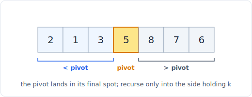

# 09 - Top-K and quickselect

> **Problem shape:** "Find the k-th largest element." "Return the k closest points
> to the origin." "Give me the k most frequent elements." Anytime you need a
> handful of extremes (or one order statistic) out of a big collection and sorting
> the whole thing is more work than the question asks for.

Sorting answers "give me the k largest" but pays O(n log n) to order elements you
will throw away. When you need only the top k, or just the single k-th element,
two cheaper tools exist: **quickselect**, which finds the k-th element in O(n)
average time by partitioning, and a **bounded heap**, which streams the top k in
O(n log k). Choosing between them is the real lesson here, and it comes down to
one question: do you have the whole array at once, or is it arriving over time?

## The signal

Reach for quickselect or a top-k heap when you see:

- **"K-th largest / k-th smallest"**, a single order statistic. Quickselect nails
  this in O(n) average without sorting.
- **"Top k" / "k closest" / "k most frequent"**, a small set of extremes out of
  many. Either partition once (offline) or maintain a size-k heap (streaming).
- **k is much smaller than n.** The whole point is to avoid the `log n` factor of a
  full sort; if k is close to n, just sort.
- **A one-shot query on data you already hold in memory** favors quickselect
  (fastest average, in place). **A stream, or repeated queries as data grows,**
  favors a heap (you cannot partition data you have not seen yet).

If the answer needs the top k *in sorted order*, note that quickselect leaves them
partitioned but unsorted; you sort just the k of them afterward (O(k log k)).

## The idea

**Quickselect** is quicksort that recurses into only one side. Pick a pivot,
partition the array so everything smaller sits left and everything larger sits
right, and look at the pivot's final index `p`. If `p` is the position you want,
done. If your target is left of `p`, recurse left; if right, recurse right. Because
you discard one side each step, the expected work is `n + n/2 + n/4 + ... = O(n)`,
not `O(n log n)`. The worst case is O(n^2) on adversarial pivots, defused by
picking a random pivot (or median-of-medians for a guaranteed O(n)).



*Partition splits the array around a pivot, then quickselect recurses into one side only.*

**Bounded heap** keeps a min-heap of size k while scanning. For "k largest", push
each element and pop the smallest whenever the heap exceeds k, so the heap always
holds the k biggest seen so far and its root is the k-th largest. Each push/pop is
O(log k), total O(n log k). It never needs the whole array in memory at once, which
is exactly why it wins on streams.

The tradeoff in one line: quickselect is faster (O(n) vs O(n log k)) and in place,
but it is **offline and destructive** (it reorders the array and needs it all
present); the heap is **online, non-destructive, and streaming** but pays the log-k
factor.

## The template

**Quickselect for the k-th largest (Lomuto partition, random pivot):**

```python
import random

def kth_largest(nums, k):
    target = len(nums) - k             # k-th largest == this index once sorted
    lo, hi = 0, len(nums) - 1
    while lo <= hi:
        p = partition(nums, lo, hi)
        if p == target:
            return nums[p]
        if p < target:
            lo = p + 1                 # answer is to the right
        else:
            hi = p - 1                 # answer is to the left

def partition(a, lo, hi):
    r = random.randint(lo, hi)         # random pivot defuses O(n^2)
    a[r], a[hi] = a[hi], a[r]
    pivot = a[hi]
    i = lo                             # a[lo..i-1] are < pivot
    for j in range(lo, hi):
        if a[j] < pivot:
            a[i], a[j] = a[j], a[i]
            i += 1
    a[i], a[hi] = a[hi], a[i]          # put pivot in its final place
    return i
```

The loop form above avoids recursion depth issues; the boundary logic is the same
lower/upper reasoning as binary search, narrowing `[lo, hi]` toward `target`.

**Bounded min-heap for the k largest (streaming friendly):**

```python
import heapq

def k_largest(stream, k):
    heap = []                          # min-heap of the k largest so far
    for x in stream:
        heapq.heappush(heap, x)
        if len(heap) > k:
            heapq.heappop(heap)        # evict the smallest, keep the top k
    return heap                        # heap[0] is the k-th largest
```

**K closest points to origin (heap keyed by negative squared distance).** Use a
max-heap of size k so the farthest of the current k sits at the root, ready to be
evicted.

```python
import heapq

def k_closest(points, k):
    heap = []                          # max-heap via negated distance
    for x, y in points:
        d = -(x * x + y * y)           # no sqrt needed; monotone in distance
        heapq.heappush(heap, (d, x, y))
        if len(heap) > k:
            heapq.heappop(heap)        # drop the current farthest
    return [[x, y] for _, x, y in heap]
```

For "k most frequent", count with a `Counter` first, then quickselect or a size-k
heap over the `(count, value)` pairs; `Counter.most_common(k)` uses a heap under
the hood.

## Variations

- **K-th smallest.** Same quickselect with `target = k - 1`, or a max-heap of size
  k. Symmetric to k-th largest.
- **Top k frequent elements / words.** Count, then select. For "top k words" the
  tie-break is lexicographic, so the heap must compare `(count, word)` with the
  right sign, or you bucket by count and sort each bucket's words.
- **K closest / k smallest by a computed key.** Any metric works as long as it is a
  single comparable value: squared distance, absolute difference from a target,
  arrival time. Avoid `sqrt` when the square is monotone in what you need.
- **Median of a stream.** Not a fixed k: use two heaps (a max-heap of the lower
  half, a min-heap of the upper half) kept balanced. See [heap](24-heap.md).
- **Guaranteed O(n) selection.** Median-of-medians picks a provably good pivot so
  quickselect is worst-case linear. Rarely needed in interviews (random pivot is
  expected O(n) and simpler) but good to name.
- **Partition-based top-k in sorted order.** Quickselect to isolate the k largest,
  then sort just those k: O(n) average plus O(k log k), beating a full sort when k
  is small.

## Canonical problems

| # | Problem | Difficulty | What it drills |
|---|---------|-----------|----------------|
| 215 | Kth Largest Element in an Array | Medium | Quickselect vs a size-k heap |
| 973 | K Closest Points to Origin | Medium | Size-k max-heap on squared distance |
| 347 | Top K Frequent Elements | Medium | Count then select (heap or bucket) |
| 692 | Top K Frequent Words | Medium | Count then select with a lexicographic tie-break |
| 703 | Kth Largest Element in a Stream | Easy | Streaming: size-k heap, not quickselect |
| 658 | Find K Closest Elements | Medium | Selection by absolute difference from a target |
| 378 | Kth Smallest Element in a Sorted Matrix | Medium | Heap-of-rows, or binary search on the value |
| 451 | Sort Characters By Frequency | Medium | Full order by count (contrast with top-k) |
| 295 | Find Median from Data Stream | Hard | Two-heap balance, the streaming order statistic |

## Pitfalls

- **Using quickselect on a stream.** It cannot work: quickselect needs random
  access to the whole array to partition. If data arrives over time or does not fit
  in memory, you must use the size-k heap.
- **Forgetting quickselect is destructive.** It reorders the input array. If the
  caller still needs the original order, copy first, or use the heap.
- **The O(n^2) pivot trap.** A fixed pivot (always first or last) degrades to
  O(n^2) on sorted or adversarial input. Randomize the pivot, always.
- **Wrong heap polarity.** For the k *largest* you keep a *min*-heap (evict the
  smallest); for the k *closest* you keep a *max*-heap by distance (evict the
  farthest). Inverting this silently returns the wrong k. In Python, negate the key
  to fake a max-heap.
- **Sorting when you only need selection.** A full O(n log n) sort for "the single
  k-th element" is the classic over-solve; quickselect is O(n).
- **Tie-break sign errors in top-k words.** When count ties, the lexicographically
  smaller word should rank higher, but a size-k *min*-heap evicts the "smallest",
  so you must negate the count and keep the word ascending, a common off-by-a-sign
  bug. Bucketing by count then sorting words avoids the confusion.

## Follow-ups and related patterns

- This pattern is the twin of [heap and priority queue](24-heap.md): the heap is
  the streaming, non-destructive engine for every top-k here, and the median-of-a-
  stream and merge-k-lists problems live there.
- "Just sort the whole thing" is [sorting and custom comparators](08-sorting.md);
  quickselect is what you reach for when a full sort is more than the question asks.
- "Find the k-th smallest in a *sorted* structure" often becomes
  [binary search](07-binary-search.md) on the value (binary search on the answer),
  a cheaper route than a heap for sorted-matrix problems.
- The partition step is the same machinery as quicksort and shares its
  pivot-and-recurse shape with the divide step behind many
  [math](27-math.md)-flavored selection proofs.
- Counting frequencies before selecting is [hashing and frequency
  counting](04-hashing.md); top-k frequent is that pattern feeding this one.
