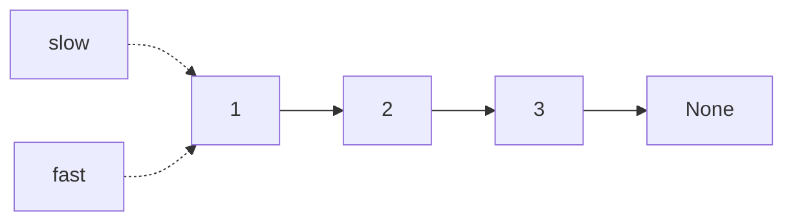

# 10 - Linked list techniques

> **Problem shape:** "Reverse a linked list." "Detect if it has a cycle." "Find
> the middle node in one pass." "Merge two sorted lists." "Remove the nth node
> from the end." Anything where you cannot index randomly, only walk node by node,
> and the answer is a rewiring of `next` pointers rather than a value computation.

Linked lists strip away random access, so array tricks that rely on indexing do
not port over. What you get instead is cheap splicing: rewiring a `next` pointer
is O(1) and needs no shifting. The whole pattern is about walking with one or two
pointers and rewiring safely, and two small tools (a dummy head and two pointers
at different speeds) cover almost every list problem you will see.



*Walk node by node. Fast and slow pointers start together, then fast moves two steps for every one of slow.*

## The signal

Reach for these techniques when you see:

- **"Reverse the list" or "reverse a sublist between positions m and n"**: an
  in-place pointer flip, no extra memory.
- **"Find the middle", "detect a cycle", "find where the cycle starts", "kth from
  the end"**: two pointers at different speeds or with a fixed gap, one pass, O(1)
  space.
- **"Merge two sorted lists", "remove a node", "insert into a sorted list",
  "partition around a value"**: splicing problems where the head itself might
  change, which is the tell for a dummy node.
- **Any list edit where the head can be deleted or replaced.** The moment the
  first node is not guaranteed to survive, a dummy head removes an entire class of
  null checks.

The common thread: you are rewiring `next` pointers, and the hard part is not the
logic but keeping the pointers valid across the rewire so you do not lose the rest
of the list or dereference null.

## The idea

Two mechanisms carry most of the weight.

**In-place reversal** walks the list once, flipping each `next` to point backward.
You hold three pointers: `prev` (the reversed part behind you), `curr` (the node
you are flipping), and a saved `nxt` (so you do not lose the forward chain the
instant you overwrite `curr.next`). Each step is O(1), the whole reverse is O(n)
time and O(1) space.

**Fast and slow pointers** exploit relative speed. If `slow` moves one step and
`fast` moves two, then when `fast` reaches the end `slow` is exactly at the middle.
If there is a cycle, `fast` laps `slow` and they collide inside the loop (Floyd's
tortoise and hare), because the gap between them shrinks by one every step. A fixed
*gap* variant (advance `fast` k nodes first, then move both together) lands `slow`
on the kth node from the end when `fast` falls off.

The **dummy head** is the quiet hero. You allocate one throwaway node whose `next`
is the real head, build or edit the list hanging off it, and return `dummy.next`.
It works because now every real node, including the original first one, has a
predecessor you can point at. No special case for "what if I delete the head" or
"what if the result is empty".

## The template

**Node definition:**

```python
class ListNode:
    def __init__(self, val=0, next=None):
        self.val = val
        self.next = next
```

**Iterative reversal (prev / curr / next):**

```python
def reverse_list(head):
    prev, curr = None, head
    while curr:
        nxt = curr.next     # save the rest before we clobber the link
        curr.next = prev    # flip
        prev = curr         # advance the reversed frontier
        curr = nxt
    return prev             # new head is the last node we saw
```

**Fast and slow: middle, cycle detection, and cycle start:**

```python
def middle(head):
    slow = fast = head
    while fast and fast.next:
        slow = slow.next
        fast = fast.next.next
    return slow             # on even length, this is the second middle

def has_cycle(head):
    slow = fast = head
    while fast and fast.next:
        slow, fast = slow.next, fast.next.next
        if slow is fast:
            return True
    return False

def cycle_start(head):
    slow = fast = head
    while fast and fast.next:
        slow, fast = slow.next, fast.next.next
        if slow is fast:                 # they met inside the loop
            walk = head
            while walk is not slow:      # distance head->start == meet->start
                walk, slow = walk.next, slow.next
            return walk
    return None
```

**Dummy head + merge two sorted lists (the pattern that shows why dummy helps):**

```python
def merge_two_lists(a, b):
    dummy = ListNode()
    tail = dummy
    while a and b:
        if a.val <= b.val:
            tail.next, a = a, a.next
        else:
            tail.next, b = b, b.next
        tail = tail.next
    tail.next = a or b       # attach whichever still has nodes
    return dummy.next
```

`tail` always has somewhere to hang the next node, and we never had to special-case
choosing the first output node. That is the dummy paying off.

## Variations

- **Reverse a sublist (Reverse Linked List II).** Put a dummy before the head, walk
  to the node just before position m, then do m..n reversals by repeatedly pulling
  the node after the cursor and splicing it to the front of the reversed segment
  (head-insertion). The dummy is what lets `m == 1` work without a branch.
- **Reverse in k-sized groups.** Count k nodes ahead; if a full group exists,
  reverse exactly those k and recurse (or iterate) on the rest, wiring the group's
  new head to the previous group's tail. Leftover tail under k stays as is.
- **Kth from the end (fixed-gap two pointers).** Advance `fast` k steps, then move
  `fast` and `slow` together until `fast` falls off. `slow` is the kth from the
  end; use a dummy so removing the head (k == length) is not a special case.
- **Palindrome list.** Find the middle with fast/slow, reverse the second half in
  place, compare the two halves node by node. O(n) time, O(1) space, and you can
  restore the list afterward if asked.
- **Reorder list (L0->Ln->L1->Ln-1...).** Find middle, reverse the second half,
  then merge the two halves alternately. A composition of three primitives above.
- **Floyd's why-it-works.** Let the tail before the loop be length `a` and the loop
  length `L`. They meet after `slow` has walked `a + b` where `b` is the offset
  into the loop; the algebra gives `a = L - b (mod L)`, so a fresh pointer from
  head and `slow` from the meeting point converge exactly at the loop start.

## Canonical problems

| # | Problem | Difficulty | What it drills |
|---|---------|-----------|----------------|
| 206 | Reverse Linked List | Easy | The prev/curr/next iterative flip |
| 21 | Merge Two Sorted Lists | Easy | Dummy head + splice-the-smaller |
| 876 | Middle of the Linked List | Easy | Fast/slow, second-middle convention |
| 141 | Linked List Cycle | Easy | Floyd detection, collision inside loop |
| 234 | Palindrome Linked List | Easy | Middle + reverse-half + compare, O(1) space |
| 92 | Reverse Linked List II | Medium | Head-insertion reversal of a sublist |
| 142 | Linked List Cycle II | Medium | Floyd + the head-and-meet convergence |
| 19 | Remove Nth Node From End | Medium | Fixed-gap two pointers, dummy for head case |
| 143 | Reorder List | Medium | Compose middle + reverse + alternating merge |
| 25 | Reverse Nodes in k-Group | Hard | Grouped reversal with tail rewiring |

## Pitfalls

- **Losing the rest of the list on a flip.** You must save `curr.next` into a temp
  *before* you overwrite it, or the forward chain is gone. This is the number-one
  reversal bug.
- **Advancing `fast` without null-guarding.** `fast = fast.next.next` explodes if
  `fast` or `fast.next` is null. The loop guard must be `while fast and fast.next`.
- **Off-by-one on "second middle vs first middle".** `slow = fast = head` gives the
  second middle on even length; start `fast = head.next` (or count differently) if
  the problem wants the first. Reorder and palindrome care which one you pick.
- **Forgetting the dummy when the head can change.** Deleting the head, merging into
  an empty result, or reversing from position 1: without a dummy each becomes a
  separate null-branch you will get wrong under pressure.
- **Not terminating the tail.** After splitting a list (find middle, cut the first
  half), set the last node's `next = None`. A dangling `next` into the second half
  turns a clean split into an accidental cycle.
- **Comparing values instead of identity for the cycle meet.** Use `is` (node
  identity), not `==` (which may compare `val`), when checking if two pointers are
  the same node.

## Follow-ups and related patterns

- "Do the two-pointer idea, but on an array you can index" goes back to
  [two pointers](01-two-pointers.md); the list version is the same logic without
  random access.
- "Merge k sorted lists, not two" pushes the merge into a
  [heap](24-heap.md): pop the smallest head across k lists each step.
- "Give me the max in a sliding view over the list" or any monotonic-structure edit
  connects to [stacks](11-stacks.md).
- "It is a tree, not a list" (reverse levels, find a middle path) generalizes the
  BFS walk in [tree BFS and level-order](13-tree-bfs.md).
