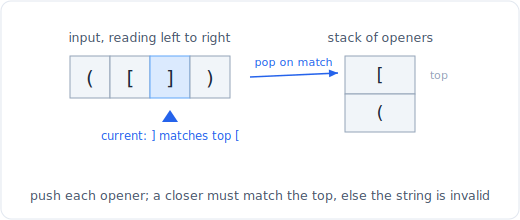

# 11 - Stacks: monotonic and parsing

> **Problem shape:** "For each element, find the next greater one." "How many days
> until a warmer temperature?" "Largest rectangle in a histogram." "Is this
> string of brackets valid?" "Evaluate this reverse Polish expression." "Decode
> `3[a2[c]]`." Anything where the answer for an element depends on the most recent
> unresolved element, so a last-in-first-out order is exactly what you need.

A stack shines when the thing you need next is always the most recently seen thing
still waiting to be resolved. Two families dominate interviews: the **monotonic
stack**, which keeps its contents sorted so each new element resolves a batch of
older ones in amortized O(1), and **stack parsing**, which uses the stack to track
nesting and defer computation until a closing token arrives. Both replace an
O(n^2) "look back over everything" scan with a single O(n) pass.


*Monotonic stack: each incoming bar pops every taller bar it beats, then pushes itself.*

## The signal

Reach for a stack when you see:

- **"Next greater / next smaller element", "days until warmer", "stock span".** For
  each item you want the nearest later (or earlier) item beating it. This is the
  monotonic stack's home turf.
- **"Largest rectangle in histogram", "maximal rectangle", "trapping rain water".**
  You need, for each bar, how far it can extend before a shorter (or taller) bar
  stops it. That "how far until something breaks the trend" is monotonic-stack
  bookkeeping.
- **"Maximum of every sliding window of size k".** A monotonic *deque* (a stack open
  at both ends) keeps window candidates in decreasing order.
- **Matched or nested delimiters**: brackets, tags, `decode 3[a2[c]]`, nested
  expressions. The stack mirrors the nesting: push on open, pop and resolve on
  close.
- **Evaluate an expression given in postfix, or an infix calculator with `+ - ( )`.**
  Operands and pending operators or subtotals wait on a stack until an operator or
  a closing paren tells you to combine them.
- **"Design a stack with O(1) min/max".** Store an auxiliary running extreme
  alongside each value.

## The idea

**Monotonic stack.** Keep the stack sorted (say increasing). Before pushing a new
value, pop every element that violates the order. The key insight: *the new element
is the answer to each thing it pops.* If the stack holds indices of a
strictly-increasing sequence and the incoming bar is smaller, then for every popped
(taller) bar the incoming bar is its "next smaller to the right", and whatever is
now on top of the stack is its "previous smaller to the left". One push and a run of
pops resolves a whole neighborhood. Every index is pushed once and popped once, so
the total work is O(n) even though any single step may pop many times.

Direction and strictness pick the variant:
- Increasing stack, pop when incoming is smaller: resolves **next smaller** for the
  popped and **previous smaller** for the survivor.
- Decreasing stack, pop when incoming is larger: resolves **next greater**.

For **histogram largest rectangle**, each bar's rectangle is bounded on the left by
the previous shorter bar and on the right by the next shorter bar; an increasing
stack hands you both boundaries at the moment you pop. For **trapping rain water**,
a decreasing stack pops a valley when a taller right wall arrives, and the water on
that valley is bounded by `min(left wall, right wall)` times the gap.

**Monotonic deque** (sliding window maximum) is the same idea with removals from the
front too: keep indices in decreasing value order, drop the front when it slides out
of the window, drop the back while it is smaller than the incoming value. The front
is always the current window's max.



*The other use of a stack: parsing. Push each opener; a closer must match the top of the stack, or the string is invalid.*

**Stack parsing.** The stack encodes "what am I in the middle of". Push when you
enter a new scope (an open bracket, an operand, a repeat count) and pop to resolve
when you close it. For **valid parentheses**, push openers and require each closer to
match the top. For **postfix (RPN)**, push operands and, on an operator, pop two and
push the result. For **decode string**, push the (multiplier, string-so-far) pair on
`[` and combine on `]`. For a **basic calculator**, push the sign and running total
on `(` and restore on `)`. **Min stack** keeps a parallel record of the minimum
visible at each level so `getMin` is O(1).

## The template

**Monotonic stack, next greater element (returns index of next greater, or -1):**

```python
# Time: O(n), Space: O(n)
def next_greater(nums):
    n = len(nums)
    ans = [-1] * n
    stack = []                      # holds indices, values strictly decreasing
    for i, x in enumerate(nums):
        while stack and nums[stack[-1]] < x:
            ans[stack.pop()] = i    # x is the next greater for the popped index
        stack.append(i)
    return ans
```

**Largest rectangle in histogram (increasing stack, sentinel flush):**

```python
# Time: O(n), Space: O(n)
def largest_rectangle(heights):
    stack = []                      # indices, heights increasing
    best = 0
    for i, h in enumerate(heights + [0]):   # trailing 0 flushes everything
        while stack and heights[stack[-1]] >= h:
            top = stack.pop()
            left = stack[-1] if stack else -1   # previous shorter bar
            width = i - left - 1                # bounded by next shorter (i) and prev shorter
            best = max(best, heights[top] * width)
        stack.append(i)
    return best
```

**Monotonic deque, sliding window maximum:**

```python
from collections import deque

# Time: O(n), Space: O(k)
def max_sliding_window(nums, k):
    dq = deque()                    # indices, values decreasing
    out = []
    for i, x in enumerate(nums):
        if dq and dq[0] <= i - k:   # front slid out of the window
            dq.popleft()
        while dq and nums[dq[-1]] <= x:
            dq.pop()                # x dominates smaller trailing candidates
        dq.append(i)
        if i >= k - 1:
            out.append(nums[dq[0]]) # front is the window max
    return out
```

**Stack parsing, valid parentheses:**

```python
# Time: O(n), Space: O(n)
def is_valid(s):
    match = {')': '(', ']': '[', '}': '{'}
    stack = []
    for ch in s:
        if ch in match:
            if not stack or stack.pop() != match[ch]:
                return False        # nothing to match, or wrong opener
        else:
            stack.append(ch)
    return not stack                # leftover openers means unbalanced
```

## Variations

- **Next greater in a circular array.** Iterate `2n` times using `i % n`, so
  elements can find a greater one that wraps around. Only the first pass fills the
  stack; the second resolves wrap-around cases.
- **Trapping rain water, stack version.** Decreasing stack; when a taller bar
  arrives, pop the valley, and add water `= (min(left, right) - valley) * width`.
  The two-pointer version (see two pointers) is O(1) space if you prefer it.
- **Maximal rectangle in a binary matrix.** Build a histogram per row (heights of
  consecutive 1s) and run largest-rectangle on each row. Reuses the histogram
  template as an inner loop.
- **Reverse Polish (RPN).** Push numbers; on an operator pop two, apply, push back.
  Mind operand order for `-` and `/` (second popped is the left operand).
- **Basic calculator with parentheses.** Keep a running `result`, a current
  `sign`, and on `(` push `(result, sign)` then reset; on `)` pop and fold. Handles
  `1 - (2 + 3)` without recursion.
- **Decode string `k[...]`.** Push `(count, current_string)` on `[`; on `]` pop and
  set `current = prev_string + count * current`. Nesting falls out for free.
- **Min stack.** Store `(value, current_min)` pairs, or keep a second stack of
  minima. Every push records the min visible so far, so pop and getMin stay O(1).

## Canonical problems

| # | Problem | Difficulty | What it drills |
|---|---------|-----------|----------------|
| 20 | Valid Parentheses | Easy | Push openers, match on close |
| 496 | Next Greater Element I | Easy | Monotonic stack, then a lookup map |
| 155 | Min Stack | Medium | Track the running min per level |
| 739 | Daily Temperatures | Medium | Monotonic stack over indices (gap to warmer) |
| 150 | Evaluate Reverse Polish Notation | Medium | Operand stack, operator folds two |
| 394 | Decode String | Medium | Nested (count, string) frames on a stack |
| 84 | Largest Rectangle in Histogram | Hard | Increasing stack, both boundaries on pop |
| 42 | Trapping Rain Water | Hard | Decreasing stack pops valleys on a taller wall |
| 239 | Sliding Window Maximum | Hard | Monotonic deque, front is the window max |
| 224 | Basic Calculator | Hard | Push sign+total on `(`, fold on `)` |

## Pitfalls

- **Strict vs non-strict comparison.** `<` versus `<=` when popping decides whether
  equal elements count as "greater/smaller". Get it wrong and rectangles double-count
  or "next greater" skips ties. Pick deliberately per problem.
- **Storing values instead of indices.** For "days until" or histogram widths you
  need positions to compute distances. Push indices and read the value via
  `nums[idx]`.
- **Forgetting to flush the stack at the end.** Elements never popped still need
  their answer. Use a sentinel (append a `0` height, or a `+inf`) or a final drain
  loop, or their results stay uninitialized.
- **Deque: not evicting the out-of-window front.** In sliding window max you must
  pop the front once its index falls outside `[i-k+1, i]`, or the max is stale.
- **RPN operand order.** For non-commutative operators the *first* value popped is
  the right operand. `a b -` means `a - b`, so `left = second_pop`,
  `right = first_pop`.
- **Calculator sign handling.** Track the sign as `+1 / -1` and apply it when you
  hit a number or a `(`; a lone `-` before a paren is the classic failure. Push and
  restore `(result, sign)` across parentheses.

## Follow-ups and related patterns

- "Give me the max of every window" is where sliding window and the monotonic deque
  meet; see [sliding window](02-sliding-window.md) for the windowing half.
- "Trap rain water in O(1) space" swaps the stack for converging
  [two pointers](01-two-pointers.md).
- "The kth largest, not the next greater" moves you to a
  [heap](24-heap.md) or [quickselect](09-top-k-quickselect.md).
- "Process nesting level by level rather than by scope" mirrors the queue walk in
  [tree BFS and level-order](13-tree-bfs.md).
