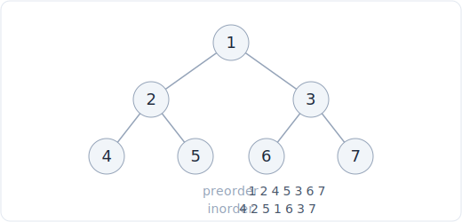

# 12 - Tree DFS and recursion

> **Problem shape:** "Find the maximum depth of a binary tree." "Compute the
> diameter." "Does any root-to-leaf path sum to a target?" "Find the lowest common
> ancestor of two nodes." Anything where the answer at a node is defined in terms of
> answers on its subtrees, and a single recursive walk collects them.

Tree DFS is the workhorse pattern for binary trees: one recursive function that
visits every node once, in O(n) time and O(h) stack space where h is the height.
The whole skill is learning to phrase a problem as "what does each node return to
its parent", so the recursion writes itself.

## The signal

Reach for tree DFS when you see:

- **A binary tree and a quantity defined recursively**: depth, height, size, sum,
  balance, "is this a valid X". The value at a node depends only on the node plus
  the values from its two children.
- **Root-to-leaf paths**: path sum, all paths, sum of all root-to-leaf numbers.
  DFS naturally threads a path from root down to each leaf.
- **"Lowest common ancestor", "diameter", "max path sum"**: the answer lives at
  some internal node and is assembled from what each subtree reports upward.
- **Structural transforms**: invert the tree, flatten it, build it from
  traversals. You recurse, fix the current node, and let the calls handle the rest.

The tell is that you can describe the solution as a base case (empty node or leaf)
plus a rule that combines the two child results. If you can, DFS is the pattern.

## The idea

DFS on a tree is just recursion with the two children as subproblems. The base
case is almost always the empty node (`None`), which returns an identity value (0
for heights and sums, `True` for "all-satisfy" checks). Every non-empty node
recurses left, recurses right, then combines.



*Preorder (node, left, right): 1, 2, 4, 5, 3, 6, 7. Inorder (left, node, right): 4, 2, 5, 1, 6, 3, 7. Postorder (left, right, node): 4, 5, 2, 6, 7, 3, 1.*

The one decision that shapes everything is **direction of information flow**:

- **Bottom-up (return state up).** Each call returns an aggregate computed from its
  children: height, subtree sum, "is balanced". This is the "return an aggregate up
  from children" model, and it covers most hard tree problems. You often keep a
  side variable (a best-so-far) that you update while returning, as in diameter and
  max path sum, where the value you *return* to the parent differs from the value
  you *record* as the answer.
- **Top-down (pass state down).** You carry accumulated context into the recursion
  as parameters: the running path sum, the current depth, the allowed value bounds.
  The leaves make the decision using state handed down from the root.

Because every node is touched once, DFS is O(n) time. Stack depth is the tree
height h, which is O(log n) for a balanced tree and O(n) for a degenerate one.

## The template

**The node definition and the core bottom-up shape:**

```python
# Space: O(1)
class TreeNode:
    # Time: O(1)
    def __init__(self, val=0, left=None, right=None):
        self.val = val
        self.left = left
        self.right = right

# Time: O(n), Space: O(h)  (h = tree height, the recursion stack)
def max_depth(root):
    if not root:                       # base case: empty subtree has depth 0
        return 0
    left = max_depth(root.left)        # aggregate from children
    right = max_depth(root.right)
    return 1 + max(left, right)        # combine, return up to parent
```

**Bottom-up with a side answer (diameter and max path sum share this shape):**

```python
# Time: O(n), Space: O(h)  (h = tree height, the recursion stack)
def diameter(root):
    best = 0
    def height(node):
        nonlocal best
        if not node:
            return 0
        lh = height(node.left)
        rh = height(node.right)
        best = max(best, lh + rh)      # record: path THROUGH this node
        return 1 + max(lh, rh)         # return: height, what the parent needs
    height(root)
    return best
```

**Top-down (pass state down), root-to-leaf path sum:**

```python
# Time: O(n), Space: O(h)  (h = tree height, the recursion stack)
def has_path_sum(root, target):
    if not root:
        return False
    remaining = target - root.val
    if not root.left and not root.right:   # at a leaf, check the accumulated sum
        return remaining == 0
    return has_path_sum(root.left, remaining) or has_path_sum(root.right, remaining)
```

The mental split: bottom-up returns the answer through the return value; top-down
threads the answer through the parameters and decides at the leaves.

## Variations

- **Three traversal orders.** Preorder (node, left, right) processes a node before
  its children: use it to serialize a tree or copy it top-down. Inorder (left,
  node, right) visits a BST in sorted order: use it for validation and kth-smallest
  (see [BST](14-bst.md)). Postorder (left, right, node) processes children before
  the node: use it whenever the node needs results from both subtrees first, which
  is every bottom-up aggregate (heights, sums, deletes, "is balanced").
- **Build a tree from traversals.** Preorder gives you the root; find it in inorder
  to split left and right subtrees; recurse. The same idea works for
  postorder-plus-inorder (root is the last preorder / last postorder element).
- **Lowest common ancestor (LCA).** Postorder search: a node returns non-null if it
  or a descendant is one of the two targets. The first node that sees both sides
  come back non-null is the LCA. O(n), one pass, no parent pointers needed.
- **Max path sum.** Like diameter but summing values, and a subtree contributes
  only if its best downward sum is positive (otherwise clamp to 0). Return the best
  single-arm sum up; record the best two-arm sum through the node.
- **Path enumeration.** Carry a list as you descend, append the current value,
  recurse, then pop on the way out (backtracking). This lists all root-to-leaf
  paths or all paths hitting a target.

## Canonical problems

| # | Problem | Difficulty | What it drills |
|---|---------|-----------|----------------|
| 104 | Maximum Depth of Binary Tree | Easy | The base bottom-up template |
| 226 | Invert Binary Tree | Easy | Structural transform via recursion |
| 112 | Path Sum | Easy | Top-down, pass the running total down |
| 543 | Diameter of Binary Tree | Easy | Return height, record the through-path |
| 110 | Balanced Binary Tree | Easy | Bottom-up height with an early-exit signal |
| 236 | Lowest Common Ancestor of a Binary Tree | Medium | Postorder "found on both sides" |
| 105 | Construct Binary Tree from Preorder and Inorder | Medium | Root from preorder, split on inorder |
| 129 | Sum Root to Leaf Numbers | Medium | Top-down accumulated number |
| 124 | Binary Tree Maximum Path Sum | Hard | Clamp negatives, record two-arm, return one-arm |

## Pitfalls

- **Confusing the returned value with the recorded value.** In diameter and max
  path sum, the parent needs the best *single* arm, but the answer is the best
  *two-arm* path through the node. Return one, record the other, or you get wrong
  answers on skewed trees.
- **Wrong base case.** Empty subtree returns 0 for height and sum, but a single
  leaf is depth 1. Off-by-one here breaks depth and path problems.
- **Forgetting to backtrack in path enumeration.** If you append to a shared list
  and do not pop after recursing, sibling paths inherit each other's nodes.
- **Negative values in max path sum.** A subtree with a negative best sum should
  contribute 0, not drag the total down. `max(0, arm)` before adding.
- **Deep, skewed trees blow the stack.** Python's default recursion limit is about
  1000. For adversarial linear trees, either raise the limit or convert to an
  explicit stack.
- **Leaf test is "no left and no right", not "is None".** Checking only one child
  misclassifies a node with a single child as a leaf.

## Follow-ups and related patterns

- "Process the tree level by level instead of branch by branch" pushes to
  [tree BFS](13-tree-bfs.md), which uses a queue and is the natural fit for
  shortest-depth and per-level answers.
- "The tree is a binary *search* tree" lets inorder DFS exploit sorted order for
  validation and kth-smallest, covered in [binary search tree](14-bst.md).
- "It is a general graph, not a tree, and may have cycles" pushes to
  [graph traversal](16-graph-traversal.md), where you add a visited set.
- Path enumeration with a shared, mutated list is exactly the append-recurse-pop
  motion of [backtracking](20-backtracking.md).
