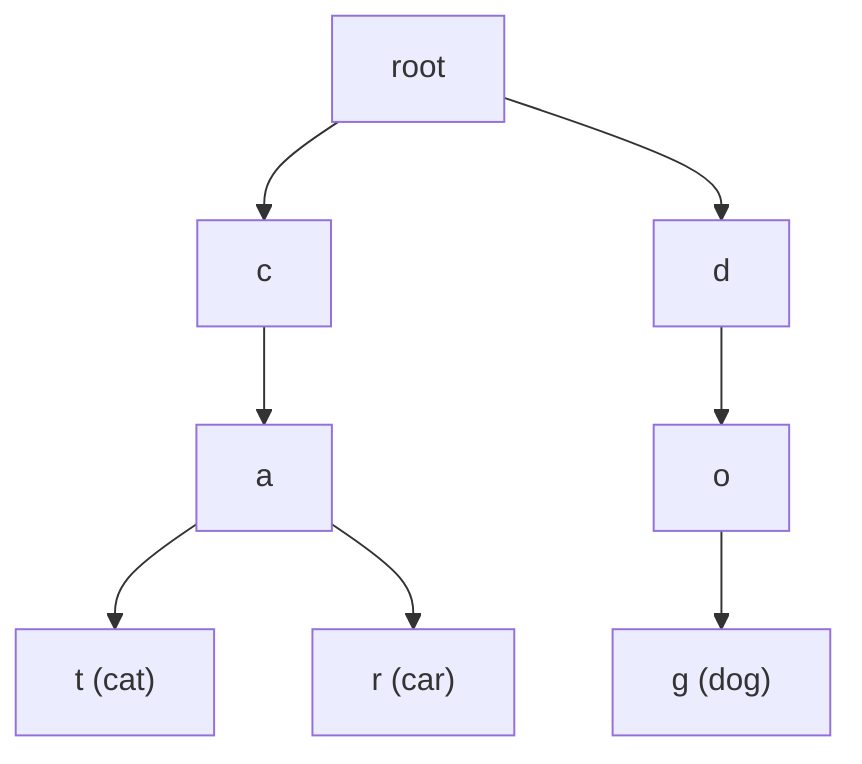

# 15 - Trie

> **Problem shape:** "Implement a prefix tree with insert, search, and
> startsWith." "Design a dictionary that supports `.` as a wildcard." "Find every
> dictionary word hidden in a letter grid." "Given an array of integers, find the
> maximum XOR of any two of them." Anything about shared prefixes, incremental
> character-by-character matching, or greedy bit-by-bit choices.

A trie (prefix tree) stores a set of strings by sharing common prefixes along a
path from the root. Each edge is one character, so a word of length L costs O(L) to
insert or look up, independent of how many words are stored. That prefix-sharing is
what makes it beat a hash set for prefix queries, wildcard matching, and
grid-word-search pruning, and its bitwise cousin powers max-XOR problems.

## The signal

Reach for a trie when you see:

- **Prefix queries at scale**: "does any word start with this prefix", autocomplete,
  "count words with prefix". A hash set answers "is this exact word present" but
  cannot answer prefix questions without scanning everything.
- **Incremental matching against a dictionary**: you consume input one character at
  a time and want to know, at each step, whether you are still on a valid prefix.
- **Wildcard or fuzzy search over a word list**: "search with `.` matching any
  letter". The trie lets you branch a DFS only where needed instead of testing
  every stored word.
- **Word search in a grid**: matching many target words at once. Building a trie of
  the words lets one grid DFS prune the instant the current path leaves every
  word's prefix.
- **Maximum XOR / bitwise-greedy pair problems**: numbers stored as fixed-width bit
  strings in a binary trie, so you can greedily chase the opposite bit at each level
  to maximize XOR.

The tell is "many strings (or bit patterns) sharing structure, queried by prefix or
built up symbol by symbol".

## The idea

A trie node holds a map from the next character to a child node, plus a flag
marking whether a complete word ends there. Insertion walks (creating missing
children) one node per character; the terminal node gets `is_word = True`. Search
walks the same path and checks the flag; `startsWith` walks the path and just needs
to arrive, flag irrelevant.



*Words "cat", "car", "dog". The "ca" prefix of cat and car is stored once as a shared spine; a completed word is flagged at its terminal node.*

The power comes from two properties:

- **Shared prefixes are stored once.** "app", "apple", "apply" share the `a-p-p`
  spine, so space is proportional to distinct prefixes, and any prefix query is O(L)
  regardless of dictionary size.
- **The tree structure prunes search.** For wildcards, a `.` fans the DFS across all
  children, but every non-wildcard character still collapses to one child, so you
  explore only live prefixes. For grid word search, the moment the grid path spells
  a string that is no child in the trie, you abandon that branch immediately.

The bitwise trie is the same structure with an alphabet of just `{0, 1}`: store
each number's bits from the most significant down, and to maximize `x XOR y` you
walk `x`'s bits greedily preferring the opposite bit at every level (opposite bits
XOR to 1, and higher bits dominate).

## The template

**Standard trie: insert, search, startsWith.**

```python
class TrieNode:
    def __init__(self):
        self.children = {}      # char -> TrieNode
        self.is_word = False

class Trie:
    def __init__(self):
        self.root = TrieNode()

    def insert(self, word):
        node = self.root
        for ch in word:
            if ch not in node.children:
                node.children[ch] = TrieNode()
            node = node.children[ch]
        node.is_word = True

    def search(self, word):
        node = self._walk(word)
        return node is not None and node.is_word

    def startsWith(self, prefix):   # LeetCode 208 requires this exact method name
        return self._walk(prefix) is not None

    def _walk(self, s):
        node = self.root
        for ch in s:
            if ch not in node.children:
                return None
            node = node.children[ch]
        return node
```

**Wildcard search (`.` matches any letter): DFS over the trie.**

```python
class WordDictionary:
    def __init__(self):
        self.root = TrieNode()

    def add_word(self, word):
        node = self.root
        for ch in word:
            node = node.children.setdefault(ch, TrieNode())
        node.is_word = True

    def search(self, word):
        def dfs(node, i):
            if i == len(word):
                return node.is_word
            ch = word[i]
            if ch == '.':
                return any(dfs(child, i + 1) for child in node.children.values())
            return ch in node.children and dfs(node.children[ch], i + 1)
        return dfs(self.root, 0)
```

**Word Search II: build a trie of the words, DFS the grid pruning by trie.**

```python
def find_words(board, words):
    root = TrieNode()
    for w in words:                     # build the trie of targets
        node = root
        for ch in w:
            node = node.children.setdefault(ch, TrieNode())
        node.word = w                   # stash the full word at its end node

    rows, cols = len(board), len(board[0])
    found = []

    def dfs(r, c, node):
        ch = board[r][c]
        nxt = node.children.get(ch)
        if not nxt:                     # this prefix is in no word: prune
            return
        if getattr(nxt, 'word', None):
            found.append(nxt.word)
            nxt.word = None             # de-dup: do not report twice
        board[r][c] = '#'               # mark visited
        for dr, dc in ((1, 0), (-1, 0), (0, 1), (0, -1)):
            nr, nc = r + dr, c + dc
            if 0 <= nr < rows and 0 <= nc < cols and board[nr][nc] != '#':
                dfs(nr, nc, nxt)
        board[r][c] = ch                # restore (backtrack)

    for r in range(rows):
        for c in range(cols):
            dfs(r, c, root)
    return found
```

**Binary trie for maximum XOR of two numbers.**

```python
def find_maximum_xor(nums, bits=31):
    root = {}
    for x in nums:                      # insert each number's bits, MSB first
        node = root
        for i in range(bits, -1, -1):
            b = (x >> i) & 1
            node = node.setdefault(b, {})

    best = 0
    for x in nums:
        node, cur = root, 0
        for i in range(bits, -1, -1):
            b = (x >> i) & 1
            want = 1 - b                # greedily chase the opposite bit
            if want in node:
                cur |= (1 << i)         # that bit of the XOR is 1
                node = node[want]
            else:
                node = node[b]
        best = max(best, cur)
    return best
```

## Variations

- **Terminal marker vs. stored word.** Use a boolean `is_word` for membership, or
  stash the full string / a payload at the end node when you need to emit it (Word
  Search II, autocomplete result lists).
- **Array children instead of a dict.** For a fixed lowercase alphabet, a length-26
  array of child pointers is faster and cache-friendlier than a hash map. Dict is
  cleaner for sparse or unknown alphabets.
- **Count / frequency at nodes.** Store a `prefix_count` per node to answer "how
  many words share this prefix" in O(L), or a word count for multiset tries.
- **Deletion.** Unset the terminal flag; optionally prune nodes that become childless
  and non-terminal on the way back up.
- **Suffix / reversed tries.** Insert reversed words to answer suffix queries, or
  combine a forward and a backward trie for "search a word by prefix and suffix".
- **Bitwise trie extensions.** Add per-node counts to support deletion, enabling
  "max XOR with elements added and removed" or "max XOR under a limit" query
  variants.

## Canonical problems

| # | Problem | Difficulty | What it drills |
|---|---------|-----------|----------------|
| 208 | Implement Trie (Prefix Tree) | Medium | Insert, search, startsWith core |
| 211 | Design Add and Search Words Data Structure | Medium | Wildcard DFS over the trie |
| 212 | Word Search II | Hard | Trie plus grid backtracking, prune by prefix |
| 421 | Maximum XOR of Two Numbers in an Array | Medium | Binary trie, greedy opposite-bit walk |
| 648 | Replace Words | Medium | Shortest-prefix lookup during a scan |
| 677 | Map Sum Pairs | Medium | Prefix-sum aggregation over trie nodes |
| 1268 | Search Suggestions System | Medium | Prefix autocomplete, top matches per prefix |
| 720 | Longest Word in Dictionary | Medium | Words buildable one character at a time |

## Pitfalls

- **Confusing search with startsWith.** `search` must check `is_word` at the end
  node; `startsWith` must not. Returning the flag for a prefix query reports missing
  words, and ignoring it for `search` reports prefixes as full words.
- **Wildcard search without pruning.** Implementing `.` by testing every stored word
  defeats the point. Branch the DFS only over `node.children`, so non-wildcard
  characters still collapse to one child.
- **Forgetting to backtrack in grid word search.** Restore `board[r][c]` after the
  DFS returns, or the cell stays marked and other words cannot reuse it.
- **Reporting duplicates in Word Search II.** Null out the stored word once found
  (or use a set) so the same word is not emitted for multiple grid paths.
- **Wrong bit order in the XOR trie.** Insert and query from the most significant
  bit down; higher bits dominate the XOR value, so a greedy choice only works
  top-down. Also fix the bit width to cover the largest input.
- **Memory blow-up.** A dict-per-node trie over a huge alphabet or millions of long
  words is heavy; switch to arrays, compress single-child chains (a radix tree), or
  reconsider whether a hash set suffices when you only need exact lookups.

## Follow-ups and related patterns

- "I only need exact membership, not prefixes" means a plain hash set beats a trie;
  reach for a trie specifically when *prefix* structure is queried.
- Word Search II is a trie fused with [backtracking](20-backtracking.md): the grid
  DFS is standard backtracking, and the trie is the pruning oracle.
- The grid walk with visited-marking and restore is [graph traversal](16-graph-traversal.md)
  on an implicit grid graph.
- The binary-trie greedy-bit trick lives next to [bit manipulation](26-bit-manipulation.md);
  the same MSB-first, higher-bits-dominate reasoning shows up in XOR and subset
  problems.
- "Match many patterns in one text pass" generalizes the trie to Aho-Corasick
  (a trie with failure links), the multi-pattern cousin of string matching.
