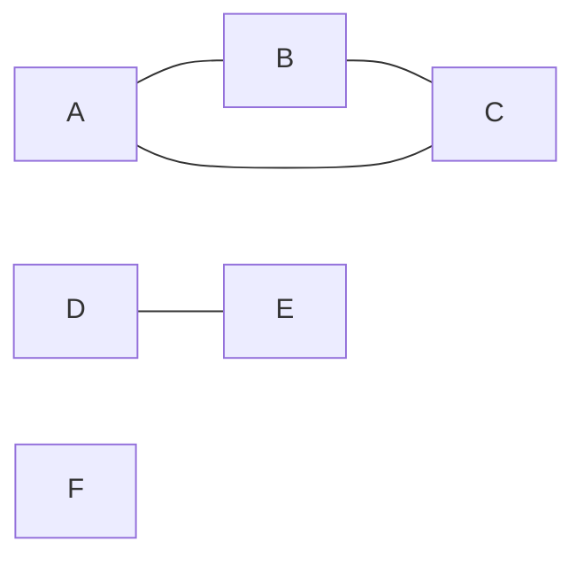

# 16 - Graph traversal and grids

> **Problem shape:** "Count the number of islands in a grid." "Clone this graph."
> "How many minutes until every orange rots." "Shortest path from top-left to
> bottom-right in an unweighted maze." Anything where you must visit every node
> reachable from a start, or spread outward level by level, over an explicit graph
> or an implicit one hiding inside a 2D grid.

Graph traversal is the workhorse of graph problems: BFS and DFS both visit every
reachable node exactly once, and the only real decisions are which order you visit
in (breadth vs depth) and how you represent neighbors (an adjacency list vs the
four or eight cells around a grid square). Get the visited-set discipline right and
most "medium" graph problems collapse into one of two templates.



*Three connected components: {A, B, C}, {D, E}, and the isolated node {F}. One traversal per unvisited node counts them.*

## The signal

Reach for a plain traversal (BFS or DFS) when you see:

- **A grid of cells** where you flood outward from a starting cell: count regions,
  fill a region, measure area. The grid is a graph in disguise, each cell is a
  node, its up/down/left/right neighbors are the edges.
- **"Connected components", "islands", "provinces", "regions", "friend circles".**
  You are partitioning nodes into reachability classes. One traversal per unvisited
  node, count how many traversals you launch.
- **Shortest path in an unweighted graph** (every edge costs 1). BFS finds it,
  because BFS visits nodes in nondecreasing distance from the source.
- **"Rot", "spread", "infect", "distance from the nearest X".** Often multi-source
  BFS: seed the queue with all sources at distance 0 and expand once.
- **Reach every node from a start** to clone, color, or validate. DFS is the
  natural fit when order does not matter.

The tell is that edges are unweighted (or all equal) and you care about
reachability or hop-count, not about minimizing a sum of varying edge costs. The
moment weights differ, you are in [shortest path](19-shortest-path.md) territory.

## The idea

Both BFS and DFS work because a **visited set** guarantees each node is expanded
once. Without it you loop forever on cycles or redo exponential work. With it,
every node and every edge is touched O(1) times, so traversal is O(V + E) time and
O(V) space.

The one difference that matters:

- **BFS** uses a queue (FIFO). It expands nodes in waves of increasing distance
  from the source, so the first time you pop a node you have reached it by a
  shortest path. This is why BFS, and only BFS, gives shortest hop-count for free.
- **DFS** uses a stack (or the call stack via recursion). It plunges as deep as
  possible before backtracking. It does not give shortest paths, but it is simpler
  to write for "just visit everything" tasks like counting components or flood
  fill.

For a grid, the "adjacency list" is implicit: the neighbors of `(r, c)` are the
in-bounds cells among `(r+1, c), (r-1, c), (r, c+1), (r, c-1)`. You never build an
edge list, you compute neighbors on the fly.

## The template

**Grid DFS (recursive), number of islands / flood fill:**

```python
def num_islands(grid):
    if not grid:
        return 0
    rows, cols = len(grid), len(grid[0])

    def dfs(r, c):
        if r < 0 or r >= rows or c < 0 or c >= cols or grid[r][c] != '1':
            return
        grid[r][c] = '0'                     # mark visited in place
        dfs(r + 1, c); dfs(r - 1, c)
        dfs(r, c + 1); dfs(r, c - 1)

    count = 0
    for r in range(rows):
        for c in range(cols):
            if grid[r][c] == '1':            # a new, unvisited land cell
                count += 1                   # launch one traversal per component
                dfs(r, c)
    return count
```

**BFS on a graph given as an adjacency list (shortest hop-count from `src`):**

```python
from collections import deque

def bfs_shortest(adj, src, dst):
    visited = {src}
    q = deque([(src, 0)])                    # (node, distance)
    while q:
        node, dist = q.popleft()
        if node == dst:
            return dist
        for nxt in adj[node]:
            if nxt not in visited:
                visited.add(nxt)             # mark on ENQUEUE, not on dequeue
                q.append((nxt, dist + 1))
    return -1                                # unreachable
```

**Multi-source BFS (rotting oranges), all sources start at distance 0:**

```python
from collections import deque

def oranges_rotting(grid):
    rows, cols = len(grid), len(grid[0])
    q = deque()
    fresh = 0
    for r in range(rows):
        for c in range(cols):
            if grid[r][c] == 2:
                q.append((r, c, 0))          # seed every rotten cell
            elif grid[r][c] == 1:
                fresh += 1

    minutes = 0
    while q:
        r, c, t = q.popleft()
        minutes = max(minutes, t)
        for dr, dc in ((1, 0), (-1, 0), (0, 1), (0, -1)):
            nr, nc = r + dr, c + dc
            if 0 <= nr < rows and 0 <= nc < cols and grid[nr][nc] == 1:
                grid[nr][nc] = 2             # infect and mark in one step
                fresh -= 1
                q.append((nr, nc, t + 1))
    return minutes if fresh == 0 else -1
```

The single most important habit: mark a node visited **the moment you enqueue it**,
not when you dequeue it. Marking on dequeue lets the same node get pushed by several
neighbors before any of them pops, which reinflates the queue and can break the
distance guarantee.

## Variations

- **Iterative DFS with an explicit stack.** Same as recursive but you push neighbors
  onto a `list` and pop from the end. Use it when recursion depth could blow the
  call stack (a grid that is one giant snake of land can recurse 10,000 deep).
- **Eight-directional grids.** Some problems (shortest path in binary matrix)
  connect diagonally too. Extend the neighbor list to all eight offsets.
- **Multi-source BFS for "distance to nearest".** "01 Matrix" and "walls and gates"
  seed the queue with every zero (or every gate) at distance 0, then a single BFS
  fills every cell with its distance to the closest source. Much cheaper than one
  BFS per cell.
- **Connected components on an explicit graph.** Loop over all nodes, launch a
  traversal from each unvisited one, count the launches. Same skeleton as counting
  islands.
- **Clone / copy a graph.** DFS or BFS while keeping a `{original: copy}` map, which
  doubles as the visited set: presence in the map means already cloned.
- **Bipartite check / 2-coloring.** BFS or DFS coloring neighbors the opposite
  color, conflict means not bipartite.

## Canonical problems

| # | Problem | Difficulty | What it drills |
|---|---------|-----------|----------------|
| 733 | Flood Fill | Easy | The base grid DFS / BFS, mark-and-spread |
| 200 | Number of Islands | Medium | One traversal per unvisited component |
| 133 | Clone Graph | Medium | Traversal with a visited/clone map |
| 994 | Rotting Oranges | Medium | Multi-source BFS, distance in waves |
| 542 | 01 Matrix | Medium | Multi-source BFS from all zeros |
| 1091 | Shortest Path in Binary Matrix | Medium | BFS shortest path, 8 directions |
| 130 | Surrounded Regions | Medium | Traverse from the border inward |
| 417 | Pacific Atlantic Water Flow | Medium | Two multi-source floods, intersect |
| 127 | Word Ladder | Hard | Implicit graph, BFS for fewest steps |
| 785 | Is Graph Bipartite? | Medium | Traversal with 2-coloring |

## Pitfalls

- **Marking visited on dequeue instead of enqueue.** The most common BFS bug. It
  lets duplicates pile into the queue, wastes time, and can produce wrong distances.
  Add to the visited set at the instant you push.
- **Using DFS for a shortest-path question.** DFS finds *a* path, not the shortest.
  Unweighted shortest path is BFS, always.
- **Forgetting bounds checks on grids.** Every neighbor step needs
  `0 <= r < rows and 0 <= c < cols` before you index, or you wrap around / crash.
- **Recursion depth overflow.** A large or snake-shaped grid can exceed Python's
  default recursion limit (~1000). Switch to iterative DFS or BFS.
- **Mutating the grid as your visited set, then needing the original.** Marking in
  place is fine when the grid is disposable. If the caller needs it intact, use a
  separate `visited` set.
- **Counting the source in distance.** For "minutes to rot" or "steps in a ladder",
  decide up front whether the start counts as step 0 or step 1 and stay consistent.

## Follow-ups and related patterns

- "The edges have different weights now" pushes you to
  [shortest path](19-shortest-path.md): Dijkstra, 0-1 BFS, or Bellman-Ford.
- "There are prerequisites / a dependency order" pushes to
  [topological sort](17-topological-sort.md), which is BFS or DFS with in-degree or
  post-order bookkeeping.
- "I only need to know if two nodes are connected, with lots of union queries"
  pushes to [union-find](18-union-find.md), which beats repeated traversals for
  incremental connectivity.
- Level-order traversal on a tree is just BFS with a guaranteed-acyclic graph, see
  [tree BFS](13-tree-bfs.md); recursive DFS mirrors [tree DFS](12-tree-dfs.md).
- "Enumerate all paths, not just reach every node" pushes to
  [backtracking](20-backtracking.md), where you undo the visited mark on the way
  back up.
