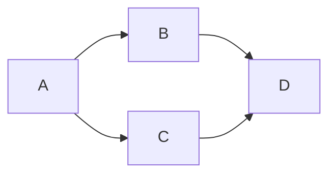

# 17 - Topological sort

> **Problem shape:** "Can you finish all courses given these prerequisites?" "Return
> a valid order to take the courses." "Given a sorted list of alien words, recover
> the alphabet." Anything that gives you a set of items plus "X must come before Y"
> constraints and asks for a valid linear order, or just whether one exists.

Topological sort produces a linear ordering of a directed acyclic graph (DAG) such
that every edge `u -> v` points forward: `u` appears before `v`. It exists if and
only if the graph has no cycle, so topo sort doubles as directed cycle detection.
Two algorithms compute it, Kahn's (BFS on in-degree) and DFS with post-order, and
knowing both means you can pick whichever reads cleaner for the problem.



*A prerequisite DAG: A unlocks B and C, and both must finish before D. Valid orders include A, B, C, D and A, C, B, D.*

## The signal

Reach for topological sort when you see:

- **Dependency or ordering constraints:** "prerequisite", "must be built first",
  "X depends on Y", "compile order", "task scheduling with dependencies".
- **A request for a valid order** over items with precedence rules, or a yes/no on
  whether a consistent order is even possible (which is the same as "is there a
  cycle").
- **A directed graph where you must detect a cycle.** Kahn's algorithm reports a
  cycle for free: if you cannot output all nodes, a cycle blocked them.
- **Recovering an unknown order from pairwise evidence:** the alien dictionary,
  where adjacent words reveal one precedence each, then you topo sort the letters.

The tell is precedence between items, not distance or connectivity. If the edges
were undirected or you wanted shortest hops, this is not the pattern. Topo sort only
makes sense on a **directed** graph, and only yields an order on an **acyclic** one.

## The idea

Both algorithms exploit the same fact: in a DAG, at least one node has no incoming
edges (nothing depends on it), and you can safely place it first.

- **Kahn's algorithm (BFS).** Compute every node's in-degree. Start a queue with all
  in-degree-0 nodes. Repeatedly pop one, append it to the order, and decrement the
  in-degree of each neighbor; whenever a neighbor's in-degree hits 0, it has no
  remaining unmet dependency, so enqueue it. If you output fewer than `V` nodes, the
  leftovers sit in a cycle. O(V + E).
- **DFS with post-order.** Run DFS; a node is finished only after all its
  descendants finish, so appending nodes in post-order and reversing gives a valid
  topo order. To catch cycles you need three states per node (unvisited, in the
  current recursion stack, fully done): revisiting a node that is still on the stack
  means a back edge, hence a cycle.

Kahn's is usually easier to reason about for "does an order exist" because the cycle
check is just a count. The DFS version is natural when you are already doing a DFS
for other reasons.

## The template

**Kahn's algorithm (BFS on in-degree), returns an order or `[]` if a cycle exists:**

```python
from collections import deque

# Time: O(V + E), Space: O(V + E)
def topo_sort_kahn(num_nodes, edges):        # edges: list of (u, v) meaning u -> v
    adj = [[] for _ in range(num_nodes)]
    indeg = [0] * num_nodes
    for u, v in edges:
        adj[u].append(v)
        indeg[v] += 1

    q = deque(n for n in range(num_nodes) if indeg[n] == 0)
    order = []
    while q:
        node = q.popleft()
        order.append(node)
        for nxt in adj[node]:
            indeg[nxt] -= 1                   # one dependency satisfied
            if indeg[nxt] == 0:              # all deps met, ready to place
                q.append(nxt)

    return order if len(order) == num_nodes else []   # [] means a cycle blocked some node
```

**DFS with three-color cycle detection and post-order:**

```python
# Time: O(V + E), Space: O(V)
def topo_sort_dfs(num_nodes, adj):
    WHITE, GRAY, BLACK = 0, 1, 2             # unseen, on stack, done
    color = [WHITE] * num_nodes
    order = []
    ok = True

    def dfs(u):
        nonlocal ok
        color[u] = GRAY
        for v in adj[u]:
            if color[v] == GRAY:            # back edge to a node on the stack: cycle
                ok = False
            elif color[v] == WHITE:
                dfs(v)
        color[u] = BLACK
        order.append(u)                      # post-order: children finished first

    for n in range(num_nodes):
        if color[n] == WHITE:
            dfs(n)
    return order[::-1] if ok else []         # reverse post-order is the topo order
```

The GRAY state is the whole trick for DFS cycle detection: a plain visited flag
cannot tell "already fully processed on another branch" (fine) from "still open on
the current path" (a cycle).

## Variations

- **Course Schedule I (feasibility only).** You only need "is there a valid order",
  so run Kahn's and return `len(order) == num_courses`. No need to keep the order.
- **Course Schedule II (return the order).** Same run, return the `order` list, or
  `[]` when a cycle exists.
- **Lexicographically smallest topo order.** Replace the queue with a min-heap so you
  always emit the smallest available in-degree-0 node. O((V + E) log V).
- **Alien dictionary.** First *build* the graph: compare each adjacent pair of words,
  find the first differing character, that yields one edge (earlier letter -> later
  letter). Watch the invalid case where a longer word is a prefix of the earlier one
  ("abc" before "ab"), which has no valid order. Then topo sort the letters.
- **Counting the number of distinct topo orders**, or detecting a *unique* order
  (the queue never holds more than one node at a time). Useful for "is the ordering
  fully determined".

## Canonical problems

| # | Problem | Difficulty | What it drills |
|---|---------|-----------|----------------|
| 207 | Course Schedule | Medium | Cycle detection via Kahn's count |
| 210 | Course Schedule II | Medium | Emit a valid topo order |
| 269 | Alien Dictionary | Hard | Build the graph from evidence, then sort |
| 802 | Find Eventual Safe States | Medium | Reverse-graph topo / DFS coloring |
| 310 | Minimum Height Trees | Medium | Trim leaves layer by layer (Kahn-style) |
| 444 | Sequence Reconstruction | Medium | Unique topo order check |
| 1136 | Parallel Courses | Medium | Topo levels = minimum semesters |
| 630 | Course Schedule III | Hard | Greedy + heap (contrast: not pure topo) |

## Pitfalls

- **Reporting a cycle wrong in Kahn's.** The signal is `len(order) < num_nodes`, not
  an empty queue mid-run. Compare the output count to the node count at the end.
- **Using a plain visited flag for DFS cycle detection.** You need the three-state
  color. A two-state visited marks a finished node the same as an on-stack node and
  misses back edges (or falsely flags cross edges).
- **Forgetting to reverse the DFS post-order.** Post-order appends dependencies
  first; the topo order is its reverse. Skipping the reverse gives the exact wrong
  direction.
- **Alien dictionary prefix trap.** If word A comes before word B, A is a prefix of
  B, and A is longer (like "abc" then "ab"), the input is invalid: return "". Handle
  this before you look for a differing character.
- **Not seeding every in-degree-0 node.** All roots must go into the initial queue,
  not just node 0. A disconnected DAG has several starting points.
- **Miscounting nodes.** With `k` letters or `n` courses, size your in-degree and
  adjacency structures to the full node set, including isolated nodes that appear in
  no edge but still need to be emitted.

## Follow-ups and related patterns

- "Just detect the cycle, I do not need an order" is the same machinery, see the
  directed-cycle check here and the undirected version in
  [union-find](18-union-find.md).
- "The dependencies form levels and I want the minimum number of rounds" is Kahn's
  processed one full layer at a time, cousin of [tree BFS](13-tree-bfs.md)
  level-order.
- "Now the edges have weights and I want the longest / shortest path in the DAG"
  combines topo order with a one-pass relaxation, related to
  [shortest path](19-shortest-path.md) and [linear DP](21-dp-linear-knapsack.md).
- Building the graph before sorting it (alien dictionary) reuses plain
  [graph traversal](16-graph-traversal.md) intuition for representing edges.
