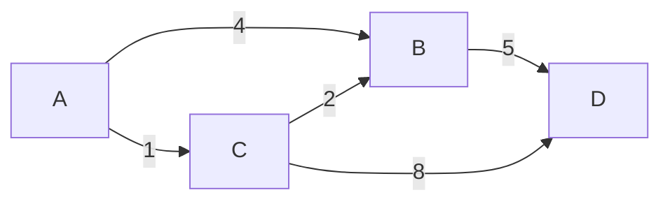

# 19 - Shortest path

> **Problem shape:** "Minimum time for a signal to reach every node." "Cheapest
> flight from A to B with at most k stops." "Path in a grid that minimizes the
> maximum climb." Anything asking for the least-cost route through a weighted graph,
> where the edges carry varying costs and you must minimize a sum (or a max) along
> the way.

Shortest path is a family, not one algorithm, and picking the right member depends
entirely on the **edge weights**. Uniform weights: plain BFS. Weights of only 0 and
1: 0-1 BFS with a deque. Arbitrary non-negative weights: Dijkstra with a heap.
Negative edges, or a hard cap on the number of edges used: Bellman-Ford. Reading
the weight structure off the problem statement is the whole skill; the code for each
is short once you know which one you need.



*A weighted directed graph. The shortest path from A to D is A, C, B, D at cost 1 + 2 + 5 = 8, cheaper than the direct A to B edge of weight 4.*

## The signal

Reach for a shortest-path algorithm when the problem asks to **minimize a cost**
along a route, and match the algorithm to the weights:

- **All edges cost the same** (unweighted, or every step is "1"): plain **BFS**.
  Waves of increasing distance reach each node by a shortest path on first pop. See
  [graph traversal](16-graph-traversal.md).
- **Edges cost only 0 or 1** (free moves vs paid moves, "minimum obstacles to
  remove"): **0-1 BFS** with a deque, push 0-cost neighbors to the front, 1-cost to
  the back. O(V + E).
- **Non-negative varying weights** ("network delay time", "path with minimum
  effort", "minimum cost to reach"): **Dijkstra** with a min-heap. O(E log V).
- **Negative edges allowed, or a limit on hops** ("cheapest flights within k
  stops"): **Bellman-Ford**, which relaxes all edges `V - 1` times (or exactly `k+1`
  times when hops are capped). O(V x E).

The tell is a **sum of costs to minimize** and edges that are not all equal. If the
edges were all equal you would not need any of this beyond BFS; if you wanted to
touch every node rather than reach one cheaply, that is plain traversal or
[topological sort](17-topological-sort.md).

## The idea

Every shortest-path algorithm relaxes edges: if the known distance to `u` plus the
edge `u -> v` beats the known distance to `v`, update `v`. They differ in the
*order* they relax, which is what buys correctness and speed.

- **Dijkstra** always finalizes the closest unfinished node next. A min-heap keyed
  by distance hands you that node in O(log V). Once you pop a node, its distance is
  final, which is exactly why **negative edges break Dijkstra**: a later, cheaper
  detour could undercut an already-finalized node, and Dijkstra never revisits it.
- **0-1 BFS** is Dijkstra's special case. With only 0/1 weights, a deque keeps the
  frontier sorted for free: 0-weight neighbors go to the front (same distance),
  1-weight neighbors to the back (distance + 1). No heap needed.
- **Bellman-Ford** makes no assumption about weights. It relaxes *every* edge, `V-1`
  full passes, because a shortest path has at most `V - 1` edges. Capping the passes
  at `k + 1` naturally answers "at most k stops". It also detects negative cycles: a
  `V`-th pass that still relaxes something means a negative cycle exists.

Dijkstra is fastest when it applies (non-negative weights). Fall back to
Bellman-Ford only when you must (negative edges or a hop constraint), because it is
slower.

## The template

**Dijkstra with a heap (non-negative weights), distance from `src` to all nodes:**

```python
import heapq

def dijkstra(adj, src, n):                   # adj[u] = list of (v, weight)
    dist = [float('inf')] * n
    dist[src] = 0
    heap = [(0, src)]                        # (distance so far, node)
    while heap:
        d, u = heapq.heappop(heap)
        if d > dist[u]:                      # stale entry, a better one was processed
            continue
        for v, w in adj[u]:
            nd = d + w
            if nd < dist[v]:                # relax: found a cheaper route to v
                dist[v] = nd
                heapq.heappush(heap, (nd, v))
    return dist
```

**0-1 BFS with a deque (edge weights 0 or 1):**

```python
from collections import deque

def zero_one_bfs(adj, src, n):               # adj[u] = list of (v, weight in {0,1})
    dist = [float('inf')] * n
    dist[src] = 0
    dq = deque([src])
    while dq:
        u = dq.popleft()
        for v, w in adj[u]:
            if dist[u] + w < dist[v]:
                dist[v] = dist[u] + w
                if w == 0:
                    dq.appendleft(v)         # same distance, process first
                else:
                    dq.append(v)             # distance + 1, process later
    return dist
```

**Bellman-Ford capped at k+1 relaxations (cheapest flights within k stops):**

```python
def cheapest_flight(n, flights, src, dst, k):
    dist = [float('inf')] * n
    dist[src] = 0
    for _ in range(k + 1):                   # at most k stops = k+1 edges
        snapshot = dist[:]                   # relax from the PREVIOUS round only
        for u, v, w in flights:
            if snapshot[u] + w < dist[v]:
                dist[v] = snapshot[u] + w
    return dist[dst] if dist[dst] != float('inf') else -1
```

Two habits that matter: in Dijkstra, **skip stale heap entries** with the
`d > dist[u]` guard (you push a node multiple times and only the smallest pop is
valid); in the hop-capped Bellman-Ford, **relax off a snapshot** of the previous
round so one pass cannot chain several flights and blow past the stop limit.

## Variations

- **Grid Dijkstra.** Nodes are cells, weights come from cell values or the move
  cost. "Path with minimum effort" minimizes the *maximum* edge on the path instead
  of the sum: relax with `max(effort_so_far, abs(height diff))` in place of a sum,
  the heap logic is otherwise identical.
- **Dijkstra for "minimum cost / maximum probability".** For maximizing a product of
  probabilities, use a max-heap and multiply; it is Dijkstra with a different
  monoid.
- **A\* search.** Dijkstra plus an admissible heuristic that biases the heap toward
  the goal. Same skeleton, key by `dist + heuristic`.
- **0-1 BFS variants.** "Minimum obstacle removal", "making a maze passable":
  passable moves cost 0, breaking a wall costs 1.
- **Bellman-Ford negative-cycle detection.** Run one extra pass; if anything still
  relaxes, a negative cycle exists on some shortest path.
- **When BFS suffices.** If every edge weight is the same constant, do *not* reach
  for Dijkstra: plain BFS is simpler and O(V + E) with no log factor. Only uneven
  weights justify the heap.

## Canonical problems

| # | Problem | Difficulty | What it drills |
|---|---------|-----------|----------------|
| 743 | Network Delay Time | Medium | Textbook Dijkstra to all nodes |
| 787 | Cheapest Flights Within K Stops | Medium | Bellman-Ford with a hop cap |
| 1631 | Path With Minimum Effort | Medium | Grid Dijkstra minimizing the max edge |
| 1091 | Shortest Path in Binary Matrix | Medium | BFS when all weights are equal |
| 1514 | Path with Maximum Probability | Medium | Dijkstra with a max-heap over products |
| 1368 | Minimum Cost to Make at Least One Valid Path in a Grid | Hard | 0-1 BFS on a grid |
| 1293 | Shortest Path in a Grid with Obstacles Elimination | Hard | BFS over an augmented (cell, budget) state |
| 505 | The Maze II | Medium | Dijkstra where an edge is a full roll |
| 882 | Reachable Nodes In Subdivided Graph | Hard | Dijkstra on a subdivided graph |

## Pitfalls

- **Running Dijkstra with negative edges.** It silently returns wrong answers,
  because a finalized node is never reconsidered. Use Bellman-Ford (or SPFA) when any
  edge can be negative.
- **Forgetting the stale-entry guard in Dijkstra.** Without `if d > dist[u]:
  continue`, you reprocess outdated heap entries; results can still be right but the
  work balloons, and with in-place mutation you can get bugs.
- **Bellman-Ford chaining edges within one pass.** For the k-stops constraint you
  must relax from a *snapshot* of the previous round; relaxing in place lets a single
  pass take multiple flights and exceed k.
- **Off-by-one on stops vs edges.** "At most k stops" means at most `k + 1` edges.
  Loop `k + 1` times, not `k`.
- **Using Dijkstra where BFS was enough.** Equal weights do not need a heap; the log
  factor is wasted and the code is more error-prone.
- **Minimizing a sum when the problem wants the min of the max edge.** "Minimum
  effort" is not a sum; relax with a `max`, not `+`, or you optimize the wrong
  quantity.

## Follow-ups and related patterns

- "All the edges are equal" collapses back to BFS in
  [graph traversal](16-graph-traversal.md); shortest path is its weighted
  generalization.
- "The heap is the bottleneck" is the same priority-queue machinery as
  [heap and priority queue](24-heap.md); Dijkstra is a heap problem in disguise.
- "It is a DAG, exploit the order" lets you drop the heap and relax in
  [topological sort](17-topological-sort.md) order in O(V + E).
- "Minimum spanning tree, not shortest path" is a different objective, see Prim and
  Kruskal via [union-find](18-union-find.md) and [greedy](25-greedy.md).
- The hop-capped Bellman-Ford is really a [linear DP](21-dp-linear-knapsack.md) over
  rounds: `dist[i][v]` = cheapest cost to `v` using at most `i` edges.
