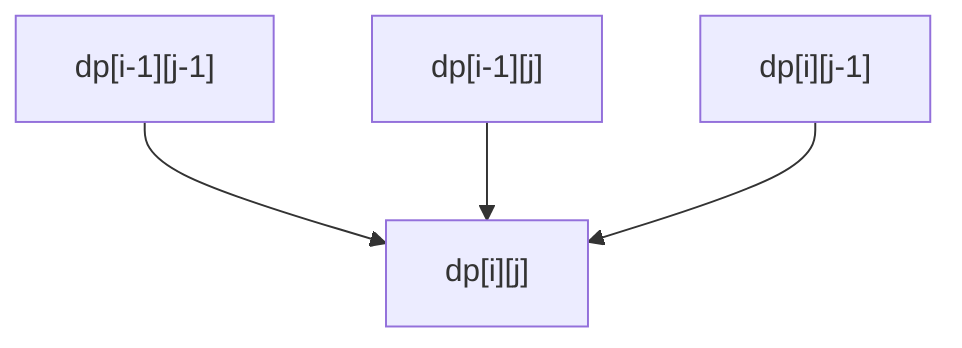

# 22 - DP II: subsequences and strings

> **Problem shape:** "Length of the longest increasing subsequence." "Longest
> common subsequence of two strings." "Fewest edits to turn word A into word B."
> "Longest palindromic substring." "How many ways does one string appear as a
> subsequence of another?" Anything where the answer ranges over subsequences or
> alignments of one or two strings, and the state is an index (or a pair of
> indices) into them.

This file covers DP where the sequence is a string (or two) and the objects are
subsequences, not contiguous windows. The recurring move is a two-index grid:
`dp[i][j]` compares a prefix of one string against a prefix of the other, and the
transition asks whether the current pair of characters matches. Master LCS and
edit distance and most of the family falls out.



*Two-string grid: a cell reads its diagonal (match extends it) plus the up and left neighbors (mismatch takes the best).*

## The signal

Reach for subsequence/string DP when you see:

- **"Subsequence"** (not "substring"): order preserved, gaps allowed. The moment
  gaps are allowed, sliding window is out and DP is in.
- **Two strings compared** for a common structure, an alignment, or a transform:
  LCS, edit distance, distinct subsequences, interleaving, wildcard/regex match.
  Two inputs almost always means a 2D `dp[i][j]` over the two prefixes.
- **Palindrome questions** phrased as "longest palindromic subsequence/substring"
  or "min insertions/deletions to make a palindrome". These are DP over a range
  `[i, j]` that grows outward.
- **"Longest/shortest/how-many" over an ordering** where a greedy pass fails
  because a locally shorter choice can enable a longer chain later (LIS is the
  canonical trap for greedy).

If the target is contiguous, revisit [sliding window](02-sliding-window.md):
"substring" that must be contiguous and match a simple constraint is often a
window, but palindromic *substring* is still DP because validity depends on the
interior.

## The idea

The core object is a table indexed by how much of each string you have consumed.
For two strings `s` and `t`, define `dp[i][j]` over the first `i` characters of
`s` and the first `j` of `t`, and drive the transition off whether
`s[i-1] == t[j-1]`:

- **Characters match**: the answer extends a smaller aligned pair, typically
  `dp[i-1][j-1] + 1` (LCS) or `dp[i-1][j-1]` (edit distance, a free match).
- **Characters differ**: you take the best of skipping one character from either
  string, `max` or `min` of `dp[i-1][j]` and `dp[i][j-1]` (plus a cost for edit
  distance).

This "match extends the diagonal, mismatch takes the best neighbor" shape is the
skeleton of the whole two-string family. The grid has `(m+1) * (n+1)` cells, each
filled in `O(1)`, so the cost is `O(m * n)` time. Because each row depends only on
the row above (and the current row to the left), you can compress to `O(min(m, n))`
space with two rolling rows.

For single-string range DP (palindromes), the state is an interval `dp[i][j]` over
`s[i..j]`, and the transition looks at the two ends `s[i]` and `s[j]`. The critical
detail is **evaluation order**: `dp[i][j]` depends on shorter ranges, so iterate by
increasing length (or `i` descending and `j` ascending).

The complexity you buy: LCS/edit distance go from exponential (enumerate all
subsequences or all edit scripts) to `O(m * n)`, and LIS goes from `O(2^n)` to
`O(n^2)`, then to `O(n log n)` with the patience trick below.

## The template

**LIS in O(n^2) (each element extends the best chain ending earlier and smaller):**

```python
def lis_quadratic(nums):
    n = len(nums)
    dp = [1] * n                           # dp[i] = LIS ending exactly at i
    for i in range(n):
        for j in range(i):
            if nums[j] < nums[i]:
                dp[i] = max(dp[i], dp[j] + 1)
    return max(dp) if dp else 0
```

**LIS in O(n log n) (patience sorting: `tails[k]` = smallest tail of a length-k+1
chain):**

```python
from bisect import bisect_left

def lis_nlogn(nums):
    tails = []
    for x in nums:
        i = bisect_left(tails, x)          # first tail >= x
        if i == len(tails):
            tails.append(x)                # x extends the longest chain
        else:
            tails[i] = x                   # x gives a smaller tail for length i+1
    return len(tails)                      # length only, not the sequence itself
```

**LCS (the two-string grid, match extends the diagonal):**

```python
def lcs(s, t):
    m, n = len(s), len(t)
    dp = [[0] * (n + 1) for _ in range(m + 1)]
    for i in range(1, m + 1):
        for j in range(1, n + 1):
            if s[i - 1] == t[j - 1]:
                dp[i][j] = dp[i - 1][j - 1] + 1
            else:
                dp[i][j] = max(dp[i - 1][j], dp[i][j - 1])
    return dp[m][n]
```

**Edit distance (min insert/delete/replace to turn `s` into `t`):**

```python
def edit_distance(s, t):
    m, n = len(s), len(t)
    dp = [[0] * (n + 1) for _ in range(m + 1)]
    for i in range(m + 1):
        dp[i][0] = i                       # delete all of s's prefix
    for j in range(n + 1):
        dp[0][j] = j                       # insert all of t's prefix
    for i in range(1, m + 1):
        for j in range(1, n + 1):
            if s[i - 1] == t[j - 1]:
                dp[i][j] = dp[i - 1][j - 1]         # match, no cost
            else:
                dp[i][j] = 1 + min(dp[i - 1][j],    # delete from s
                                   dp[i][j - 1],    # insert into s
                                   dp[i - 1][j - 1])# replace
    return dp[m][n]
```

**Longest palindromic subsequence (range DP, grow the interval outward):**

```python
def longest_palindrome_subseq(s):
    n = len(s)
    dp = [[0] * n for _ in range(n)]
    for i in range(n - 1, -1, -1):
        dp[i][i] = 1                       # single char is a palindrome
        for j in range(i + 1, n):
            if s[i] == s[j]:
                dp[i][j] = dp[i + 1][j - 1] + 2
            else:
                dp[i][j] = max(dp[i + 1][j], dp[i][j - 1])
    return dp[0][n - 1]
```

## Variations

- **Distinct subsequences (count how many times `t` appears in `s`).** Counting
  version of LCS: on a match, `dp[i][j] = dp[i-1][j-1] + dp[i-1][j]` (use this
  match or skip this `s` char); on a mismatch, `dp[i][j] = dp[i-1][j]`.
- **Longest palindromic substring.** Contiguity changes the recurrence:
  `s[i..j]` is a palindrome iff `s[i] == s[j]` and `s[i+1..j-1]` is one. Either
  fill a boolean range table, or use the simpler expand-around-center in
  `O(n^2)` time and `O(1)` space.
- **Min insertions/deletions to make a palindrome.** Equals `n` minus the longest
  palindromic subsequence, or LCS of `s` with `reverse(s)`. A reduction, not a new
  DP.
- **Interleaving / wildcard / regex matching.** Same two-index grid; the transition
  branches on the pattern character (`*`, `?`, `.`) instead of a plain equality.
- **Reconstructing the sequence, not just its length.** Store parent pointers or
  walk the filled table backward from `dp[m][n]`, choosing the neighbor that
  produced each value. Length-only DP discards this, so keep the full table if you
  need the actual subsequence.

## The subsequence vs substring distinction

This one word decides the whole approach, so read the statement carefully:

- **Substring / subarray**: contiguous. Often a [sliding window](02-sliding-window.md)
  or [two pointers](01-two-pointers.md) problem, though palindromic substring stays
  DP because its validity depends on the enclosed characters.
- **Subsequence**: order-preserving but gaps allowed. Almost always DP, because you
  must consider "skip this character" as a real choice, which a window cannot
  express.

When a problem says "longest common substring" (contiguous), the recurrence resets
to zero on a mismatch (`dp[i][j] = 0`) and you track the global max; "longest
common subsequence" (gaps allowed) takes the best neighbor on a mismatch. Same
grid, one line different, completely different answer.

## Canonical problems

| # | Problem | Difficulty | What it drills |
|---|---------|-----------|----------------|
| 300 | Longest Increasing Subsequence | Medium | `O(n^2)` DP and `O(n log n)` patience |
| 1143 | Longest Common Subsequence | Medium | The two-string grid skeleton |
| 72 | Edit Distance | Medium | Insert/delete/replace on the grid |
| 5 | Longest Palindromic Substring | Medium | Range validity / expand-around-center |
| 516 | Longest Palindromic Subsequence | Medium | Interval DP grown outward |
| 115 | Distinct Subsequences | Hard | Counting version of LCS |
| 1092 | Shortest Common Supersequence | Hard | LCS plus reconstruction |
| 583 | Delete Operation for Two Strings | Medium | Edit distance restricted to deletes |

## Pitfalls

- **Confusing subsequence with substring.** The single most expensive misread: it
  flips the mismatch transition (reset to zero vs take the best neighbor) and can
  flip the whole pattern from DP to sliding window.
- **Off-by-one on the `+1` offset.** With a `(m+1) x (n+1)` table, `s[i-1]` and
  `t[j-1]` are the characters at DP indices `i` and `j`. Mixing up the string index
  and the table index corrupts every match check.
- **Wrong evaluation order in range DP.** `dp[i][j]` needs `dp[i+1][j-1]` (a shorter
  interval), so you must fill shorter ranges first: iterate `i` downward or by
  increasing length. A plain `i` ascending loop reads uncomputed cells.
- **Forgetting the base row and column.** Edit distance needs `dp[i][0] = i` and
  `dp[0][j] = j` (transform to/from the empty string). Leaving them zero silently
  under-counts.
- **Assuming LIS `O(n log n)` gives you the sequence.** The `tails` array is not the
  LIS itself, only its length. Recovering the actual sequence needs parent
  pointers.
- **Space-compressing before it works.** The diagonal dependency `dp[i-1][j-1]` is
  easy to clobber when rolling to one row; get the 2D version correct first, then
  compress with a saved-diagonal temporary.

## Follow-ups and related patterns

- "It is over a single sequence with a capacity or take/skip budget" steps back to
  [DP I: linear and knapsack](21-dp-linear-knapsack.md).
- "It is a grid path, an interval merge, or a bitmask over a subset" pushes to
  [DP III: grids, intervals, bitmask](23-dp-grids-intervals.md); the palindrome
  interval DP here is the gateway to interval DP there.
- "Give me the `O(n log n)` LIS" leans on [binary search](07-binary-search.md) over
  the `tails` array.
- "The target is contiguous, not a subsequence" pushes to
  [sliding window](02-sliding-window.md) or [two pointers](01-two-pointers.md).
- "Enumerate all the common subsequences, do not just measure them" pushes back to
  [backtracking](20-backtracking.md).
