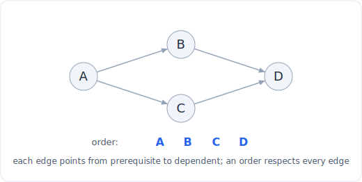

# Walkthrough: Course Schedule (LC 207)

A worked example that runs the six-step framework on one problem end to end.
The goal is to show the process, not just the answer.

## The problem

**LeetCode 207, Medium.** There are `numCourses` courses labeled `0` to
`numCourses - 1`. You are given `prerequisites`, a list of pairs
`[a, b]` meaning you must take course `b` before course `a`. Return `True` if you
can finish all the courses, and `False` otherwise.

Example: `numCourses = 2`, `prerequisites = [[1, 0]]` returns `True` (take 0, then
1). But `numCourses = 2`, `prerequisites = [[1, 0], [0, 1]]` returns `False`, since
each course requires the other.



*Topological order of a DAG. See the full pattern in the linked file below.*

## 1. Clarify and restate

The questions I would ask:

- **What does the pair mean, exactly?** `[a, b]` means `b` is a prerequisite of
  `a`, so the dependency edge points `b -> a` ("b enables a"). Getting this
  direction right is half the problem; I will restate it back to confirm before
  coding.
- **What am I really being asked?** Whether there is any valid order to take all
  courses. There is a valid order if and only if the dependency graph has **no
  cycle**. If courses depend on each other in a loop, no order can satisfy all of
  them. So the boolean I return is "is this directed graph acyclic?"
- **Input types.** `numCourses` is a positive integer; `prerequisites` is a list of
  integer pairs, possibly empty. Nodes exist even with no edges.
- **Constraints.** `numCourses` up to `2000`, prerequisites up to `5000`. That is a
  sparse graph, so an O(V + E) traversal is the target, and O(V + E) is well within
  budget.
- **Edge cases.** No prerequisites at all (trivially `True`); a **self loop**
  `[0, 0]` (course 0 requires itself, an instant cycle, `False`); a long dependency
  chain with no cycle (`True`); duplicate edges; disconnected components (some
  courses with no prerequisites at all).

Restated: build the directed dependency graph and return `True` exactly when it has
no cycle, that is, when a full topological ordering exists.

## 2. Work an example by hand

`numCourses = 4`, `prerequisites = [[1, 0], [2, 1], [3, 2]]`. Reading each pair as
`b -> a`: `0 -> 1 -> 2 -> 3`. I will use **in-degree**, the number of unmet
prerequisites each course still has.

- In-degrees: course 0 has 0, course 1 has 1 (needs 0), course 2 has 1 (needs 1),
  course 3 has 1 (needs 2).
- Only course 0 has in-degree 0, so it is the only one I can take now. Take it.
  Taking 0 removes its outgoing edge `0 -> 1`, dropping course 1's in-degree to 0.
- Now course 1 is takeable. Take it, drop course 2 to in-degree 0.
- Take course 2, drop course 3 to 0.
- Take course 3. All four taken.

I took all 4 courses, so the answer is `True`. Now compare with the cycle case
`[[1, 0], [0, 1]]`: in-degrees are both 1, no course starts at 0, so I can never
begin. I take 0 courses, which is fewer than `numCourses`, so the answer is
`False`. That gap ("did I manage to take every course, or did I get stuck?") is the
whole test.

## 3. Brute force

The literal reading is "does a cycle exist?" A naive way is depth-first search from
every node, tracking the path, and reporting a cycle if I ever revisit a node on my
current path.

```python
def can_finish_brute(num_courses, prerequisites):
    adj = [[] for _ in range(num_courses)]
    for a, b in prerequisites:
        adj[b].append(a)

    def has_cycle_from(node, visiting, path):
        path.add(node)
        for nxt in adj[node]:
            if nxt in path:            # back edge onto the current path
                return True
            if nxt not in visiting and has_cycle_from(nxt, visiting, path):
                return True
        path.discard(node)
        visiting.add(node)             # fully explored, no cycle through here
        return False

    visiting = set()
    for course in range(num_courses):
        if course not in visiting:
            if has_cycle_from(course, visiting, set()):
                return False
    return True
```

Done carefully with a "fully finished" set, this is actually O(V + E). Done
carelessly (re-exploring nodes, passing fresh path sets without memoizing finished
nodes) it degrades badly and is easy to get subtly wrong on the "on the current
path" versus "seen before" distinction. That fragility is the motivation to reach
for a cleaner, harder-to-botch formulation.

## 4. Find the bottleneck and pick the pattern

The real bottleneck is not speed, it is correctness and clarity: recursive cycle
detection has to distinguish "node on the current DFS path" (a real cycle) from
"node already fully explored on some other path" (fine), and mixing those up is the
classic bug. I want a formulation where the cycle check falls out naturally.

That is **topological sort via Kahn's algorithm**. The idea maps directly onto how
I solved it by hand: repeatedly take any course with **in-degree 0** (no unmet
prerequisites), then decrement the in-degree of everything it unlocks. A queue
holds the currently-takeable courses. If I manage to take all `numCourses`, a full
topological order exists and the graph is acyclic. If the queue empties early
(because every remaining course still has an unmet prerequisite), the remaining
courses form a cycle and I return `False`.

The cycle test becomes a simple count: compare the number of courses taken against
`numCourses`. No path-tracking sets, no recursion depth to reason about. Kahn's
turns "detect a cycle" into "can I drain the graph one zero-in-degree node at a
time", which is much harder to get wrong.

## 5. Code it

```python
from collections import deque

def can_finish(num_courses, prerequisites):
    indeg = [0] * num_courses          # unmet prerequisites per course
    adj = [[] for _ in range(num_courses)]
    for course, pre in prerequisites:  # pair is [course, prerequisite]
        adj[pre].append(course)        # edge pre -> course
        indeg[course] += 1

    queue = deque(c for c in range(num_courses) if indeg[c] == 0)
    taken = 0
    while queue:
        node = queue.popleft()
        taken += 1                     # this course is now takeable, take it
        for nxt in adj[node]:
            indeg[nxt] -= 1            # one prerequisite satisfied
            if indeg[nxt] == 0:
                queue.append(nxt)      # newly unblocked, ready to take
    return taken == num_courses        # took everything iff acyclic
```

I seed the queue with every course that starts with no prerequisites. Each time I
pop a course I count it and relax its outgoing edges, and any neighbor whose last
prerequisite just cleared joins the queue. The loop invariant: `indeg[c]` always
equals the number of `c`'s prerequisites that have not yet been taken, and the
queue holds exactly the courses whose prerequisites are all satisfied but which
have not been taken yet. If a cycle exists, its courses can never reach in-degree 0
(each is blocked by another in the cycle), so they never enter the queue and
`taken` falls short.

## 6. Test, trace, and analyze

Trace `numCourses = 2`, `prerequisites = [[1, 0]]`. Edge `0 -> 1`, in-degrees
`[0, 1]`.

| queue (front..back) | pop | taken | edges relaxed | queue after |
|---------------------|-----|-------|---------------|-------------|
| [0] | 0 | 1 | 1's indeg 1 -> 0, enqueue 1 | [1] |
| [1] | 1 | 2 | none | [] |

Queue empty, `taken = 2 == numCourses`, return `True`. Correct.

Now the cycle case `numCourses = 2`, `prerequisites = [[1, 0], [0, 1]]`. Edges
`0 -> 1` and `1 -> 0`, in-degrees `[1, 1]`. The initial queue is empty because no
course has in-degree 0, so the loop never runs, `taken = 0`, and `0 != 2` returns
`False`. Correct.

Edge cases:
- **No prerequisites**, `numCourses = 3`, `prerequisites = []`: all three
  in-degrees are 0, all three enter the queue, all get taken, `taken = 3`, returns
  `True`. Disconnected nodes with no edges are handled for free.
- **Self loop**, `numCourses = 1`, `prerequisites = [[0, 0]]`: the edge is
  `0 -> 0`, so course 0 has in-degree 1 and never reaches 0. Queue starts empty,
  `taken = 0 != 1`, returns `False`. Correct, a course cannot be its own
  prerequisite.
- **Three-cycle**, `numCourses = 3`, `prerequisites = [[0, 1], [1, 2], [2, 0]]`:
  every in-degree is 1, queue starts empty, returns `False`. Correct.

**Complexity: O(V + E) time**, where `V = numCourses` and `E = len(prerequisites)`:
building the graph touches every edge once, and Kahn's loop visits each node once
and each edge once when relaxing it. **O(V + E) space** for the adjacency list and
in-degree array plus the queue. This comfortably clears the 2000-node, 5000-edge
limits.

With more time I would note the follow-up LC 210, "Course Schedule II", which asks
for an actual valid ordering rather than just a yes/no. It is the same Kahn's loop,
except I append each popped node to a result list and return that list (or an empty
list if a cycle is detected), so this walkthrough is one line away from that
problem.

## What the interviewer is really testing

Whether you can translate a word problem ("can I finish all the courses?") into the
right graph abstraction: a directed graph where the question is really "is this
acyclic?" The first leap is modeling prerequisites as directed edges and getting
the direction right; the second is recognizing that "finish all courses" equals
"a topological order exists" equals "no cycle". Kahn's algorithm with in-degrees is
the clean way to test that, and the tell that a candidate understands it is the
final `taken == numCourses` check, which quietly does the cycle detection without
any explicit cycle-hunting code.

> Pattern: [17 topological sort](../patterns/17-topological-sort.md)
