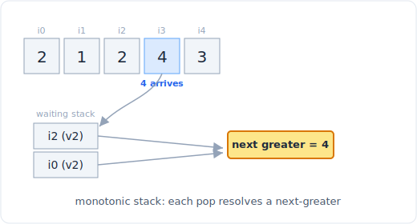

# Walkthrough: Daily Temperatures (LC 739)

A worked example that runs the six-step framework on one problem end to end.
The goal is to show the process, not just the answer.

## The problem

**LeetCode 739, Medium.** Given a list `temperatures` of daily temperatures,
return an array `answer` where `answer[i]` is the number of days you have to wait
after day `i` to get a warmer temperature. If no future day is warmer, put `0`.

Example: `temperatures = [73, 74, 75, 71, 69, 72, 76, 73]` returns
`[1, 1, 4, 2, 1, 1, 0, 0]`.



*A monotonic stack of unresolved indices. See the full pattern in the linked file below.*

## 1. Clarify and restate

Questions before coding:

- **Input types.** A list of integers (temperatures, in practice bounded like
  30 to 100 but I will not rely on that). Non-empty? Assume it can have one
  element. Values can repeat, and "warmer" means strictly greater, so an equal
  temperature does not count.
- **What do I return?** A list of the same length, each entry a day-count offset
  (not an index, a distance), with `0` when nothing warmer follows.
- **Constraints.** Length up to `10^5`. Reading `n`: `10^5` makes O(n^2) about
  `10^10` operations, too slow. The target is O(n).
- **Edge cases.** Single day (answer `[0]`), strictly decreasing temperatures
  (every answer `0`), strictly increasing (every answer `1` except the last),
  all equal (every answer `0`, since equal is not warmer).

Restated: for each day, find the distance to the next strictly warmer day, in
O(n).

## 2. Work an example by hand

`temperatures = [73, 74, 75, 71, 69, 72, 76, 73]`.

- Day 0 (73): next warmer is day 1 (74). Wait 1.
- Day 1 (74): next warmer is day 2 (75). Wait 1.
- Day 2 (75): 71, 69, 72 are all colder; day 6 (76) is warmer. Wait 4.
- Day 3 (71): day 5 (72) is warmer. Wait 2.
- Day 4 (69): day 5 (72) is warmer. Wait 1.
- Day 5 (72): day 6 (76) is warmer. Wait 1.
- Day 6 (76): nothing later is warmer. Wait 0.
- Day 7 (73): last day, nothing later. Wait 0.

Result `[1, 1, 4, 2, 1, 1, 0, 0]`. Notice day 2's answer of 4 was resolved by a
day far to its right, and days 3, 4 were both resolved by the same warmer day 5.
A day stays "open and waiting" until some later, warmer day closes it.

## 3. Brute force

For each day, scan forward to the first warmer day.

```python
def daily_temperatures_brute(temperatures):
    n = len(temperatures)
    answer = [0] * n
    for i in range(n):
        for j in range(i + 1, n):
            if temperatures[j] > temperatures[i]:
                answer[i] = j - i
                break
    return answer
```

Nested scan, **O(n^2) time**, **O(n) space** for the output. Correct but too slow
at `n = 10^5`.

## 4. Find the bottleneck and pick the pattern

The brute force rescans the same future days over and over. Look at days 3 and 4
in the example: both scan forward and both land on day 5. That forward re-scanning
is the repeated work.

The structural observation: as I move left to right, I accumulate days that are
still **waiting** for a warmer future. Those waiting days, read from most-recent
back to oldest, are in **increasing** temperature order. Why? If an older waiting
day were colder than a newer waiting day, the newer (warmer) day would already
have closed... no: the newer day cannot close the older one because it is not
warmer than it. So the waiting days always form a strictly decreasing sequence of
temperatures from oldest to newest, equivalently increasing from newest to oldest.
That is a **monotonic stack**.

The mechanism: keep a stack of indices whose answer is not yet known, with their
temperatures decreasing down the stack. When a new day arrives, it resolves every
waiting day on top of the stack that is colder than it. Each **popped index** is a
day whose "next warmer day" is exactly today, so its answer is `today - popped`.
The new day is then pushed to wait for its own warmer future. Each index is pushed
once and popped at most once, giving O(n) total.

## 5. Code it

```python
def daily_temperatures(temperatures):
    n = len(temperatures)
    answer = [0] * n
    stack = []                       # indices of days still waiting, temps decreasing

    for today in range(n):
        # today resolves every warmer-day-seeker colder than today's temp
        while stack and temperatures[today] > temperatures[stack[-1]]:
            prev = stack.pop()       # this earlier day's next-warmer is today
            answer[prev] = today - prev
        stack.append(today)          # today now waits for its own warmer day

    return answer                    # days left on the stack keep their default 0
```

The invariant: at all times the temperatures at the stacked indices are strictly
decreasing from bottom to top. Any index still on the stack at the end never found
a warmer day, and its `answer` stays at the initialized `0`, so no special
handling is needed for them.

## 6. Test, trace, and analyze

Trace `[73, 74, 75, 71, 69, 72, 76, 73]`. Stack holds indices; I show temps in
parentheses.

| today | temp | pops (resolved) | answer set | stack after |
|-------|------|-----------------|-----------|-------------|
| 0 | 73 | none | | [0] |
| 1 | 74 | pop 0 (73) | answer[0] = 1 | [1] |
| 2 | 75 | pop 1 (74) | answer[1] = 1 | [2] |
| 3 | 71 | none | | [2, 3] |
| 4 | 69 | none | | [2, 3, 4] |
| 5 | 72 | pop 4 (69), pop 3 (71) | answer[4] = 1, answer[3] = 2 | [2, 5] |
| 6 | 76 | pop 5 (72), pop 2 (75) | answer[5] = 1, answer[2] = 4 | [6] |
| 7 | 73 | none | | [6, 7] |

Days 6 and 7 remain on the stack, keeping answer `0`. Final
`[1, 1, 4, 2, 1, 1, 0, 0]`, matching the hand trace. Note day 5 resolved two
waiting days (4 then 3) in one arrival, and day 6 resolved day 2 from four
positions back, exactly the far-reaching case the brute force paid for by
re-scanning.

Edge cases:
- **Single day**, `[50]`: the loop pushes index 0, never pops, returns `[0]`.
  Correct.
- **Strictly decreasing**, `[80, 70, 60]`: nothing is ever warmer, every day is
  pushed and none popped, returns `[0, 0, 0]`. Correct.
- **Strictly increasing**, `[60, 70, 80]`: each day pops exactly the one before,
  returns `[1, 1, 0]`. Correct.
- **All equal**, `[70, 70, 70]`: the `>` is strict, so equal never triggers a pop,
  returns `[0, 0, 0]`. Correct.

**Complexity: O(n) time** (each index pushed and popped at most once, so the inner
while loop does O(n) total work across the whole run, not O(n) per iteration) and
**O(n) space** for the stack in the worst case (a strictly decreasing input keeps
every index waiting). This hits the target and beats the O(n^2) brute force.

With more time I would note the same monotonic-stack skeleton solves "next greater
element", "next smaller element", and stock-span problems by flipping the
comparison and what you store.

## What the interviewer is really testing

Whether you see that "next warmer day" is a next-greater-element problem and that
the repeated forward scan can be replaced by a stack of unresolved indices. The
insight to articulate is *what a pop means*: popping index `prev` when day `today`
arrives is the moment you learn `prev`'s answer, because `today` is the first day
warmer than it. Candidates who can state that invariant, and argue the amortized
O(n) (each index pops once), have understood the pattern rather than pattern-matched
the shape.

> Pattern: [11 stacks (monotonic stack)](../patterns/11-stacks.md)
