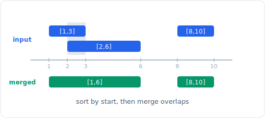

# Walkthrough: Meeting Rooms II (LC 253)

A worked example that narrates the six-step solving framework on one problem, so
you can see the process in motion rather than just the finished code.

## The problem

**LeetCode 253, Meeting Rooms II, Medium.** Given an array of meeting time
intervals `intervals` where `intervals[i] = [start_i, end_i]`, return the minimum
number of conference rooms required so that no two meetings sharing a room overlap.

Example: `intervals = [[0, 30], [5, 10], [15, 20]]` returns `2`. The meeting
`[0, 30]` overlaps both others, but `[5, 10]` and `[15, 20]` do not overlap each
other, so two rooms suffice.



*Intervals on a timeline. See the full pattern in the linked file below.*

## 1. Clarify and restate

Questions I would ask before touching code:

- **Are intervals half-open?** This is the load-bearing question. Standard
  convention: a meeting `[start, end]` occupies the room on `[start, end)`, so a
  meeting ending at time `t` and another starting at time `t` do **not** conflict
  and can share a room. I will confirm this, because it decides a tie-break in the
  sweep and flips answers on inputs like `[[1, 5], [5, 10]]` (1 room, not 2).
- **What do I return?** A single integer: the minimum room count. Equivalently, the
  maximum number of meetings that are simultaneously in progress at any instant.
- **Is the input sorted?** Assume not. I will sort.
- **Can intervals be empty?** Yes, return `0`. Single meeting returns `1`.
- **Can start equal end (zero-length meeting)?** Possible; with half-open intervals
  it occupies nothing and needs no room, but I will not over-engineer unless the
  interviewer raises it.
- **How big is n?** Constraints: `1 <= intervals.length <= 10^4`,
  `0 <= start < end <= 10^6`. `n <= 10^4` with a required sort points squarely at
  an `O(n log n)` solution. That rules out an `O(n^2)` pairwise-overlap check as
  the intended answer and points at sort-plus-heap or a sweep line.

Restated: the answer is the **maximum number of meetings concurrently active**.
Every room is busy exactly when meetings overlap, so the peak concurrency is the
room count. Reframing "minimum rooms" as "max overlap" is the whole insight.

## 2. Work an example by hand

`intervals = [[0, 30], [5, 10], [15, 20]]`. I will separate all the start times
and all the end times, sort each, and sweep a timeline counting active meetings:

```
starts sorted: 0, 5, 15
ends   sorted: 10, 20, 30

time 0  : a meeting starts -> active = 1  (peak 1)
time 5  : a meeting starts -> active = 2  (peak 2)
time 10 : a meeting ends   -> active = 1
time 15 : a meeting starts -> active = 2  (peak 2)
time 20 : a meeting ends   -> active = 1
time 30 : a meeting ends   -> active = 0
```

Peak concurrency is 2, so 2 rooms. The manual method already is the sweep-line
algorithm: process events in time order, `+1` on a start, `-1` on an end, and
track the running maximum. The tie-break rule (when a start and an end share a
timestamp, process the end first, because half-open intervals let the freed room be
reused) is what I confirmed in step 1.

## 3. Brute force

The obvious solution: the answer equals the max overlap, so for every meeting count
how many meetings overlap it, or more directly, for each of the `2n` endpoints
count how many intervals cover that point.

```python
def min_rooms_brute(intervals):
    if not intervals:
        return 0
    # For each start time, count meetings active at that instant.
    best = 0
    for s, _ in intervals:
        active = 0
        for a, b in intervals:
            if a <= s < b:               # half-open: [a, b) covers s
                active += 1
        best = max(best, active)
    return best
```

Complexity: for each of `n` candidate times we scan all `n` intervals, so
`O(n^2)` time, `O(1)` extra space. It is correct (the peak overlap can always be
witnessed at some meeting's start time), but at `n = 10^4` that is `10^8`
operations, on the edge of too slow and clearly not the intended `O(n log n)`.

## 4. Find the bottleneck and pick the pattern

The bottleneck is that the brute force recomputes the full overlap count from
scratch at every timestamp, ignoring that the active count only changes by one at
each event. This is repeated work over a moving frontier, and the structure I am
not using is **time order**.

Two patterns both exploit this, both `O(n log n)`:

- **Sweep line (two sorted arrays).** Sort start times and end times separately.
  Walk them with two pointers in increasing time. On a start, increment active
  count and advance the start pointer; on an end (whose time is `<=` the current
  start), decrement and advance the end pointer. Track the max. Processing ends
  before equal starts encodes the half-open rule.
- **Intervals + min-heap.** Sort meetings by start time. Keep a min-heap of the end
  times of currently occupied rooms. For each meeting, if the earliest-ending room
  (`heap[0]`) is free by this meeting's start (`heap[0] <= start`), pop it (reuse
  that room); then push this meeting's end. The heap size is the number of rooms in
  use, and its maximum over the run is the answer.

Both are `O(n log n)`. The heap version is the one interviewers most often want
because it generalizes (you can attach room IDs, and it mirrors task-scheduling
problems). I will code the heap version and mention the sweep as the alternative.

## 5. Code it

```python
import heapq
from typing import List

class Solution:
    def minMeetingRooms(self, intervals: List[List[int]]) -> int:
        if not intervals:
            return 0

        # Process meetings in start-time order.
        intervals.sort(key=lambda meeting: meeting[0])

        # Min-heap of end times for rooms currently in use.
        rooms = []                       # rooms[0] is the soonest-freeing room

        for start, end in intervals:
            # If the earliest-ending room is free by the time this meeting
            # starts, reuse it (half-open: end == start counts as free).
            if rooms and rooms[0] <= start:
                heapq.heappop(rooms)
            heapq.heappush(rooms, end)   # this meeting occupies a room until `end`

        # The heap never shrank below its peak concurrency, and each remaining
        # entry is a distinct room, so its final... no: track the peak instead.
        return len(rooms)
```

One correctness subtlety worth narrating: because I pop at most one room per
meeting and push exactly one per meeting, the heap size after processing meeting
`i` equals the number of meetings overlapping meeting `i` (given start-sorted
order), and the size is monotonic in the sense that it only grows when a genuinely
new room is needed. The final `len(rooms)` therefore equals the peak concurrency,
the maximum rooms ever simultaneously occupied. If that reasoning felt shaky in the
room, the safe move is to track the max explicitly:

```python
import heapq
from typing import List

class Solution:
    def minMeetingRooms(self, intervals: List[List[int]]) -> int:
        if not intervals:
            return 0
        intervals.sort(key=lambda meeting: meeting[0])
        rooms = []
        best = 0
        for start, end in intervals:
            if rooms and rooms[0] <= start:
                heapq.heappop(rooms)
            heapq.heappush(rooms, end)
            best = max(best, len(rooms))
        return best
```

The invariant: after processing a meeting, `rooms` holds the end times of every
room busy at that meeting's start (minus any that freed up), and `best` is the
largest the heap has ever been. Tracking `best` explicitly is the version I would
hand over, since it is obviously correct without the monotonicity argument.

## 6. Test, trace, and analyze

Trace `intervals = [[0, 30], [5, 10], [15, 20]]` (already start-sorted):

- `[0, 30]`: heap empty, push 30. `rooms = [30]`, best = 1.
- `[5, 10]`: `rooms[0] = 30 > 5`, no room free, push 10. `rooms = [10, 30]`,
  best = 2.
- `[15, 20]`: `rooms[0] = 10 <= 15`, pop 10 (that room freed), push 20.
  `rooms = [20, 30]`, best = 2.

Return `2`. Matches the hand trace. Correct.

Edge cases:

- `intervals = []`: guard returns `0`. Correct.
- `intervals = [[7, 10]]`: push 10, best = 1, return `1`. Correct.
- Back-to-back, `[[1, 5], [5, 10]]`: first pushes 5. Second: `rooms[0] = 5 <= 5`,
  pop (room reused, half-open), push 10, size stays 1, return `1`. Correct, the
  half-open convention is respected.
- Fully nested, `[[1, 10], [2, 9], [3, 8]]`: sizes go 1, 2, 3, none free early,
  return `3`. Correct, all three overlap.
- All identical, `[[2, 4], [2, 4]]`: first pushes 4; second `rooms[0] = 4 > 2`, no
  reuse, size 2, return `2`. Correct.

Complexity: **O(n log n) time**, dominated by the sort plus `n` heap operations
each `O(log n)`. **O(n) space** for the heap in the worst case (all meetings
overlap). This is optimal, since any comparison-based solution must at least sort.
With more time I would present the sweep-line variant (two sorted endpoint arrays,
no heap) as an equal-complexity alternative, and note that if the room count is
bounded and times are small integers, a difference-array / bucket sweep gives
`O(n + T)`.

## What the interviewer is really testing

Whether you can reframe "minimum resources" as "peak concurrent demand", which is
the transferable insight behind a whole class of scheduling and interval problems.
The half-open tie-break (end before equal start) is the detail that separates
candidates who reasoned about the model from those who pattern-matched a template,
and the heap-versus-sweep choice lets you show you know more than one tool for the
same shape.

> Patterns: [05 intervals](../patterns/05-intervals.md) and [24 heap](../patterns/24-heap.md)
