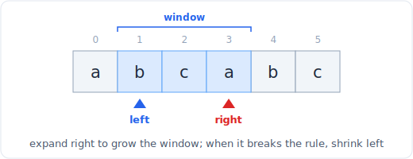

# 02 - 滑动窗口
> 中文版。English: [02-sliding-window](../patterns/02-sliding-window.md)

> **问题形态：** 「找出不含重复字符的最长子串。」「和至少为 s 的最短子数组。」「至多包含 k 个不同字符的最长子串。」凡是在一个数组或字符串上，要求满足某约束的最优（最长或最短）*连续*区间的问题。

滑动窗口通过维护一个窗口 `[left, right]`、移动它的边缘而非重新开始，把对所有子数组做 O(n^2) 或 O(n^3) 的扫描，变成一次 O(n) 的遍历。它是双指针针对「某约束下的连续区间」的特化，也是面试中出现频率最高的模式之一。

## 信号特征

当题目要求以下内容时，考虑使用滑动窗口：

- **一段连续的子数组或子串**（不是子序列：连续性正是关键所在），要求它**最长、最短，或恰好满足**某个性质。
- 约束表述为 **「至多 k 个」、「至少 s」、「不含重复」、「包含全部」**。这些是可以增量维护的窗口有效性条件。
- 一个只在窗口边缘随移动而变化的量：运行和、字符计数、不同元素的个数。如果在右侧加入一个元素、从左侧移除一个元素能在 O(1) 内更新状态，就适用窗口。

如果答案是子序列（不连续），那这就不是你要的模式；那通常是 [DP](22-dp-strings.md)。

## 核心思想

维护一个窗口和一个不变式。扩展 `right` 以纳入新元素。当窗口**违反**约束时，从 `left` 收缩，直到它重新有效。每个元素进入窗口一次、离开至多一次，因此即使窗口大小在变化，总工作量仍是 O(n)。



*窗口横跨 left..right。通过移动 right 来扩展，通过移动 left 来收缩。*

两种风格：

- **可变大小窗口**（最常见）：扩展 right，收缩 left 以恢复有效性，记录见过的最优窗口。「至多 k 个不同元素的最长窗口。」
- **固定大小窗口**（给定大小 k）：滑动一个恒定宽度的窗口，每步加入进来的、丢弃出去的元素。「大小为 k 的最大平均值子数组。」

窗口内的状态通常是一个计数的哈希表（用于字符串）或一个运行和（用于数字）。

## 模板

**可变大小，「保持有效的最长窗口」：**

```python
# Time: O(n), Space: O(k) for the count map (k = distinct chars in the window, bounded by the alphabet)
def longest_valid_window(s):
    from collections import defaultdict
    count = defaultdict(int)
    left = 0
    best = 0
    for right, ch in enumerate(s):
        count[ch] += 1
        while not is_valid(count):        # shrink until valid again
            count[s[left]] -= 1
            if count[s[left]] == 0:
                del count[s[left]]
            left += 1
        best = max(best, right - left + 1)
    return best
```

**可变大小，「达到目标的最短窗口」（最小化）：**

```python
# Time: O(n), Space: O(1)
def min_subarray_len(target, nums):
    left = 0
    window_sum = 0
    best = float('inf')
    for right, x in enumerate(nums):
        window_sum += x
        while window_sum >= target:       # valid: try to shrink for a smaller answer
            best = min(best, right - left + 1)
            window_sum -= nums[left]
            left += 1
    return best if best != float('inf') else 0
```

**宽度为 k 的固定大小窗口：**

```python
# Time: O(n), Space: O(1)
def max_sum_k(nums, k):
    window_sum = sum(nums[:k])
    best = window_sum
    for right in range(k, len(nums)):
        window_sum += nums[right] - nums[right - k]   # add incoming, drop outgoing
        best = max(best, window_sum)
    return best
```

`while` 的方向很关键：对**最长**问题，你在**无效**时收缩；对**最短**问题，你在**仍然有效**时收缩，并在过程中记录。

## 变体

- **至多 k 个不同 / 至多 k 个某物。** 维护一个计数表；当 `len(count) > k` 时窗口无效。「至多两个不同字符的最长子串」。
- **恰好 k 个。** 计算 `atMost(k) - atMost(k-1)`。把「恰好」转化为两次「至多」调用是一个标准技巧（「K 个不同整数的子数组」、「优美子数组的数目」）。
- **覆盖一个目标集合（最小覆盖子串）。** 记录还缺多少个必需字符；当什么都不缺时窗口有效，然后收缩以最小化。这是最难的常见变体，值得记牢。
- **不含重复的最长子串。** 计数表退化为「每个字符至多一次」；你可以用一个记录上次出现位置的表来抄近路，直接跳转 `left`。
- **固定窗口配合单调双端队列**求窗口内的最大或最小值：参见 [单调栈与双端队列](11-stacks.md) 的「滑动窗口最大值」。

## 经典题目

| # | 题目 | 难度 | 训练点 |
|---|---------|-----------|----------------|
| 643 | Maximum Average Subarray I | 简单 | 固定大小模板 |
| 3 | Longest Substring Without Repeating Characters | 中等 | 可变窗口，记录上次出现位置 |
| 209 | Minimum Size Subarray Sum | 中等 | 有效时收缩（最小化） |
| 424 | Longest Repeating Character Replacement | 中等 | 当 `size - maxfreq <= k` 时窗口有效 |
| 340 | Longest Substring with At Most K Distinct | 中等 | 计数表，不同元素 > k 时无效 |
| 567 | Permutation in String | 中等 | 在频率签名上的固定窗口 |
| 438 | Find All Anagrams in a String | 中等 | 固定窗口，匹配计数表 |
| 992 | Subarrays with K Different Integers | 困难 | 恰好 k，用 atMost(k) - atMost(k-1) |
| 76 | Minimum Window Substring | 困难 | 覆盖目标多重集，然后最小化 |
| 239 | Sliding Window Maximum | 困难 | 固定窗口配合单调双端队列 |

## 陷阱

- **收缩方向错误。** 最长：无效时收缩。最短：有效时收缩，并在收缩前记录。把这两者搞混是经典 bug。
- **在错误的时机记录答案。** 对「最短」，在收缩循环内部记录；对「最长」，在收缩循环恢复有效性之后记录。
- **过期的计数。** 当某个计数降到零时，删除该键（否则基于 `len(count)` 的不同元素判断会出错）。数值和没有这个问题。
- **在题目要子序列时却假设连续。** 重读题：「子数组」和「子串」是连续的；「子序列」不是，需要 DP。
- **负数会破坏单调收缩的假设。** 含负数的「最小尺寸子数组和」不再是普通窗口；它变成一个前缀和加单调双端队列的问题。窗口假设加入元素会让度量朝一个方向变化。

## 延伸与相关模式

- 「值可以为负，所以更大的窗口未必是更大的和」会推向 [前缀和](03-prefix-sum.md) 配合单调双端队列或有序结构。
- 「给我每个窗口里的最大值」会推向 [栈](11-stacks.md) 里的单调双端队列。
- 「它是子序列，不是子串」会推向 [DP](22-dp-strings.md)。
- 窗口有效性的记账纯粹是 [哈希与频率计数](04-hashing.md)；滑动窗口就是把那个模式应用到一个移动的区间上。
