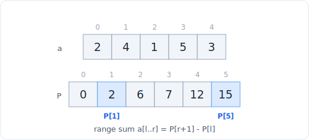

# 03 - 前缀和与差分数组
> 中文版。English: [03-prefix-sum](../patterns/03-prefix-sum.md)

> **问题形态：** 「有多少个子数组的和等于 k？」「快速回答大量区间求和查询。」「矩阵中某个矩形区域的和。」「施加数百次区间更新，然后读取数组。」凡是反复询问某区间上的总和，或批量施加区间更新的问题，无论在数组还是网格上。

前缀和预先算好累积总和，从而把任意区间和变成一次减法而非一趟循环。它用 O(n) 的预处理换来每次查询 O(1)，而它的逆操作，即差分数组，则对批量区间更新做同样的事。二者都是把工作从查询时挪出，放进一次性的遍历里。



*前缀数组 P 把任意区间和变成一次减法：a[l..r] = P[r+1] - P[l]。*

## 信号特征

看到以下情形时，考虑使用前缀和：

- **对静态数组的反复区间求和查询。** 如果你会不止一次地问「`a[i..j]` 的和」，就预先算好前缀，然后每次 O(1) 回答。
- **「统计和等于 / 能被 k 整除的子数组数目」。** 子数组和 `a[i..j]` 等于 `prefix[j+1] - prefix[i]`，于是目标和就变成对见过的前缀值的一次查表（哈希表就是在这里登场的）。
- **一个带矩形求和问题的二维网格**（积分图）。预先算好矩阵上的累积和，然后任意子矩阵就是四次数组读取。
- **多次区间更新，最后一次读取**（「给 `[l, r]` 里每个下标加 v」，反复进行）。这就是差分数组：在两个边界处记录变化量，最后积分一次。
- **前缀 XOR**，当问题问的是某区间上的异或而非求和时。XOR 是它自己的逆运算，所以同样的减法技巧用 `^` 也成立。

判断依据是：朴素解法会重复计算彼此重叠的和，而这些重叠恰恰是累积数组让你能够复用的部分。

## 核心思想

定义 `prefix[k] = a[0] + a[1] + ... + a[k-1]`，其中 `prefix[0] = 0`。那么闭区间 `a[i..j]` 的和就是 `prefix[j+1] - prefix[i]`。两个共享的端点相互抵消，这就是为什么一次减法能替代一趟循环。构建这个数组是一趟 O(n)；此后每次区间查询都是 O(1)。

「子数组和等于 k」的技巧反过来读同一个恒等式。你要找满足 `prefix[j+1] - prefix[i] == k` 的对 `(i, j)`。遍历数组，维护运行前缀 `s`；每一步合法起点的数目，就是等于 `s - k` 的更早前缀的数目。一个记录「每个前缀值出现过多少次」的哈希表能在 O(1) 内回答这个问题，因此整个计数是一趟 O(n)。

差分数组是对偶。如果你想给 `[l, r]` 里每个元素加 `v`，就记录 `diff[l] += v` 和 `diff[r+1] -= v`。所有更新完成后，对 `diff` 做一次前缀和就重建出最终数组：每个元素累积了每一个范围始于它之前或它本身、且尚未结束的更新。N 次更新每次 O(1)，最后一次 O(n) 的积分把结果具体化。

## 模板

**一维前缀和，用于区间查询：**

```python
# Time: O(n), Space: O(n)
def build_prefix(a):
    prefix = [0] * (len(a) + 1)
    for i, x in enumerate(a):
        prefix[i + 1] = prefix[i] + x
    return prefix

# Time: O(1), Space: O(1)
def range_sum(prefix, i, j):        # sum of a[i..j] inclusive
    return prefix[j + 1] - prefix[i]
```

**子数组和等于 k（前缀计数哈希表）：**

```python
# Time: O(n), Space: O(n)
def subarray_sum(nums, k):
    from collections import defaultdict
    seen = defaultdict(int)
    seen[0] = 1                     # empty prefix, enables subarrays from index 0
    s = 0
    count = 0
    for x in nums:
        s += x
        count += seen[s - k]        # earlier prefixes that make the window sum to k
        seen[s] += 1
    return count
```

**二维前缀和（积分图），O(1) 求矩形和：**

```python
# Time: O(mn), Space: O(mn)
def build_2d(mat):
    rows, cols = len(mat), len(mat[0])
    p = [[0] * (cols + 1) for _ in range(rows + 1)]
    for r in range(rows):
        for c in range(cols):
            p[r + 1][c + 1] = mat[r][c] + p[r][c + 1] + p[r + 1][c] - p[r][c]
    return p

# Time: O(1), Space: O(1)
def region_sum(p, r1, c1, r2, c2):  # inclusive corners
    return p[r2 + 1][c2 + 1] - p[r1][c2 + 1] - p[r2 + 1][c1] + p[r1][c1]
```

**差分数组，用于批量区间更新：**

```python
# Time: O(n + q), Space: O(n)  (q = number of updates)
def range_updates(n, updates):      # updates: list of (l, r, v), r inclusive
    diff = [0] * (n + 1)
    for l, r, v in updates:
        diff[l] += v
        diff[r + 1] -= v
    out = [0] * n
    running = 0
    for i in range(n):
        running += diff[i]
        out[i] = running
    return out
```

二维读取用了容斥：加上大矩形，减去两条超出的条带，再把被减了两次的角加回来。

## 变体

- **和能被 k 整除的子数组。** 按 `s % k` 而非按精确值对前缀分桶。同一个余数类中的两个前缀所界定的区间，其和是 k 的倍数。当心负余数：先算 `s % k`，再归一化到 `[0, k)`。
- **和为 k 的最长子数组，或 0 和 1 数量相等的最长子数组。** 存储每个前缀值首次出现的下标，那么每一步的答案就是 `i - first[s - k]`。对于 0 和 1 相等的问题，把 0 映射为 -1，然后寻找重复出现的前缀。
- **前缀 XOR。** 把 `+` 换成 `^`，把减法换成 `^`（XOR 是它自己的逆）。「统计异或等于 k 的子数组数目」就是用 `seen[s ^ k]` 的哈希表技巧。
- **前缀积**（用于「除自身以外数组的乘积」这类问题），不过除零迫使你改用左积/右积的两趟形式。
- **二维差分数组。** 区间更新的网格类比：标记每个矩形的四个角，然后做一次二维前缀和把它们全部应用。
- **无需数组的运行前缀。** 当你只遍历一次时（那些子数组计数问题），维护单个累加器而非完整的前缀列表。数组形式是为随机访问查询准备的。

## 经典题目

| # | 题目 | 难度 | 训练点 |
|---|---------|-----------|----------------|
| 303 | Range Sum Query - Immutable | 简单 | 基础一维前缀构建与查询 |
| 724 | Find Pivot Index | 简单 | 一趟前缀里的左和对右和 |
| 560 | Subarray Sum Equals K | 中等 | 哈希表中的前缀计数 |
| 974 | Subarray Sums Divisible by K | 中等 | 按模 k 余数对前缀分桶 |
| 523 | Continuous Subarray Sum | 中等 | 首次出现的余数下标，长度约束 |
| 525 | Contiguous Array | 中等 | 把 0 映射为 -1，找重复前缀 |
| 304 | Range Sum Query 2D - Immutable | 中等 | 积分图，容斥 |
| 1248 | Count Number of Nice Subarrays | 中等 | 在奇偶性上做前缀计数，恰好-k 的框架 |
| 1094 | Car Pooling | 中等 | 在上下车上做差分数组 |
| 370 | Range Addition | 中等 | 基础差分数组模板 |
| 1738 | Find Kth Largest XOR Coordinate Value | 中等 | 二维前缀 XOR |

## 陷阱

- **值下标与前缀下标之间的差一错误。** `prefix` 的长度是 `n + 1` 且 `prefix[0] = 0`。`a[i..j]` 的和是 `prefix[j+1] - prefix[i]`，不是 `prefix[j] - prefix[i]`。写对一次，然后信任它。
- **在「子数组和等于 k」中忘记 `seen[0] = 1`。** 没有这个空前缀的种子，你会漏掉每一个从下标 0 开始的子数组。
- **能被 k 整除变体里的负模。** 在 Python 里 `%` 本就返回非负结果，但如果你移植到一个并非如此的语言，就要归一化，否则会漏掉匹配。
- **差分数组边界上的差一错误。** 递减发生在 `r + 1` 处，所以把差分数组的大小设为 `n + 1`，以容纳那个末尾标记而不越界。
- **二维容斥的符号。** 被减了两次的角必须加回来。搞错一个符号会通过小测试而在大测试上失败；从图上推导它，别盲目记忆。
- **溢出**，在使用定宽整数的语言里（不是 Python）。累积和会增长；相应地设定累加器的大小。

## 延伸与相关模式

- 「子数组必须连续，而你要的是最优窗口而非计数」往往又翻回 [滑动窗口](02-sliding-window.md)：当所有值非负时，它就是带一个移动左边缘的前缀和。
- 「值可以为负，所以窗口技巧失效」正是为什么由前缀和加一个 [哈希](04-hashing.md) 表（或 [栈](11-stacks.md) 里的单调双端队列）接手。
- 「现在数组会在查询之间改变」会越过静态前缀，推向树状数组或线段树；参见 [设计](28-design.md) 里的单点更新、区间查询结构。
- 「前缀加哈希表」的计数动作纯粹是 [哈希](04-hashing.md)；这个模式就是把那次查表应用到累积和上。
