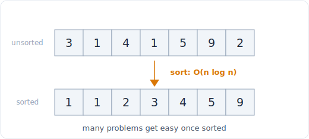

# 08 - 排序与自定义比较器

> 中文版。English: [08-sorting](../patterns/08-sorting.md)

> **问题形态：** 「排列这些数字，组成尽可能大的数。」
> 「合并所有重叠区间。」「按频率给字符排序。」「一个人能否参加所有这些会议？」
> 每当答案在*数据被摆到正确顺序之后*变得显而易见，或者一条比 `<`
> 更丰富的比较规则决定了那个顺序，排序就是破局的钥匙，而整道题就是选出那个 key。

排序本身很少是答案；它是那步 O(n log n) 的预处理，把一个纠缠的问题变成一次线性扫描。
真正的技巧是看出排序能让难度坍缩，然后写出恰好编码你所需顺序的比较器。Python
给你两个旋钮：一个 `key=` 函数（快，每个元素一个值）和 `functools.cmp_to_key`
（一个成对比较器，用于顺序取决于两个元素如何组合的场景）。



*许多问题一旦排序就变简单：一趟 O(n log n)，然后一次线性扫描。*

## 信号

当你看到以下情况时，考虑排序：

- **「答案不依赖原始顺序。」** 如果你可以自由重排输入，排序几乎总是合法且能理清思路的第一步。
- **相邻元素在排序后变得可比较。** 合并区间、去重、找最近的一对、检测重叠：
  一旦排序都变得平凡，因为唯一的交互只发生在相邻元素之间。
- **你需要一个自定义的「更小」概念。** 按派生的 key 排序（先长度，再字典序）、
  按频率再按值，或按一条没有单个 key 能捕捉的成对规则（「哪个拼接更大」）。
  那是比较器的活。
- **一个贪心或双指针步骤需要有序的前提。** 区间调度、会议室以及许多
  [贪心](25-greedy.md) 证明都以「按结束时间排序」或「按开始时间排序」开场。
- **有界的、狭小的值域。** 如果值是已知窄带内的整数，计数排序或桶排序能给你
  O(n)，并完全绕开比较排序的下界。

## 思路

比较排序在最坏情况下无法击败 **O(n log n)**：有 `n!` 种可能的排列，
每次比较产生一个比特，你至少需要 `log2(n!) ~ n log n` 次比较。那个下界正是为什么
「排序然后扫描」是这些问题诚实的复杂度，也是为什么计数/桶排序（它们不比较，而是索引）
在值有界时能打破它。

Python 中指定顺序的两种方式：

- **`key=f`** 把每个元素映射到一个排序 key；Python 按 key 的自然顺序排序，
  且对每个元素只调用一次 `f`（一种 Schwartzian 变换，所以很快）。
  返回元组来做平局裁决：`key=lambda x: (-freq[x], x)` 先按频率降序，再按值升序。
- **`cmp_to_key(cmp)`** 包装一个返回负 / 零 / 正的成对比较器。只有当顺序由
  *组合两个元素* 定义、无法归约为逐元素 key 时你才需要它。「最大数」是典型例子：
  把 `a+b` 与 `b+a` 作为字符串比较。

Python 的 `sort` 是 Timsort：稳定（相等元素保持输入顺序，你可以利用这一点做多级排序）
且自适应（近乎有序的输入接近 O(n) 运行）。

## 模板

**按派生 key 排序，用元组做平局裁决：**

```python
from collections import Counter

# Time: O(n log n), Space: O(n)
def sort_by_frequency(nums):
    freq = Counter(nums)
    # most frequent first; break ties by smaller value
    return sorted(nums, key=lambda x: (-freq[x], x))
```

**用 `cmp_to_key` 做成对比较（由拼接组成最大数）：**

```python
from functools import cmp_to_key

# Time: O(n log n), Space: O(n)
def largest_number(nums):
    strs = list(map(str, nums))
    # a should come before b if a+b is the larger concatenation
    def cmp(a, b):
        if a + b > b + a:
            return -1              # a first
        if a + b < b + a:
            return 1              # b first
        return 0
    strs.sort(key=cmp_to_key(cmp))
    result = ''.join(strs)
    return '0' if result[0] == '0' else result   # all-zeros edge case
```

**排序然后扫描（合并重叠区间）：**

```python
# Time: O(n log n), Space: O(n)
def merge_intervals(intervals):
    intervals.sort(key=lambda iv: iv[0])          # by start
    merged = []
    for start, end in intervals:
        if merged and start <= merged[-1][1]:
            merged[-1][1] = max(merged[-1][1], end)   # overlap: extend
        else:
            merged.append([start, end])               # disjoint: new run
    return merged
```

**有界值域的计数/桶排序（O(n + k)）：**

```python
# Time: O(n + k), Space: O(k)  (k = max_val + 1, the value range)
def counting_sort(nums, max_val):
    count = [0] * (max_val + 1)
    for x in nums:
        count[x] += 1
    out = []
    for value, c in enumerate(count):
        out.extend([value] * c)       # emit each value c times, in order
    return out
```

## 变体

- **先按频率排序，再做平局裁决。** 「按频率给字符排序」和「前 k 高频」
  都以 `(-count, value)` 为 key。当你只需要顶部那一片时，按计数分桶是 O(n) 的替代方案。
- **通过稳定的多趟做多级排序。** 因为 Timsort 稳定，你可以先按最不重要的 key 排序，
  再按最重要的，早先的顺序在平局内会保留。往往比一个巨大的元组 key 更清晰。
- **自定义字典序规则。** 「重新排列日志文件中的数据」：字母日志先按内容再按标识符排序，
  数字日志保持原始相对顺序并排在最后。把整条规则编码进一个 `key`，
  它返回的元组的第一个元素把两类日志分桶。
- **排序作为贪心的铺垫。** 会议室（按开始排序，用结束时间的小顶堆扫描）、
  区间调度（按结束排序）、「戳破气球的最少箭数」（按结束排序）。
  排序正是让贪心选择可证明最优的原因。
- **有界 key 的基数/桶排序。** 定宽整数或字符串能在 O(nk) 内无需比较地排序。
  桶排序对已知范围内均匀分布的浮点数也很出色。
- **只需部分有序（前 k，或一个中位数）。** 你可能根本不需要完整排序；
  见 [Top-K 与快速选择](09-top-k-quickselect.md) 的 O(n) 选择。

## 经典题目

| # | 题目 | 难度 | 训练点 |
|---|---------|-----------|----------------|
| 937 | Reorder Data in Log Files | 简单 | 一个把两类日志分桶并排序的元组 key |
| 179 | Largest Number | 中等 | 对拼接做成对 `cmp_to_key` |
| 451 | Sort Characters By Frequency | 中等 | 以 `(-count, char)` 为 key，或按计数分桶 |
| 56 | Merge Intervals | 中等 | 按开始排序，然后邻居扫描 |
| 252 | Meeting Rooms | 简单 | 按开始排序，检查相邻重叠 |
| 253 | Meeting Rooms II | 中等 | 对开始和结束排序，扫描求最大并发 |
| 75 | Sort Colors | 中等 | 对 3 个值做计数排序（或荷兰国旗） |
| 274 | H-Index | 中等 | 降序排序，扫描找交叉点 |
| 973 | K Closest Points to Origin | 中等 | 按平方距离排序（或快速选择） |
| 912 | Sort an Array | 中等 | 从零实现一个真正的 O(n log n) 排序 |

## 陷阱

- **在 `key` 就够用时去够 `cmp_to_key`。** 成对比较器更慢（Python
  为每次比较回调进你的函数）且更容易出错。只有当顺序确实取决于组合两个元素时
  才用它，比如「最大数」。
- **比较器没有定义一个全序。** 一个不一致的 `cmp`（`cmp(a,b) < 0` 且
  `cmp(b,c) < 0` 但 `cmp(a,c) > 0`）会产生垃圾或错误答案。拼接比较器之所以有效，
  恰恰因为它是一个可证明的全序。
- **丢失原始索引。** 如果你必须返回位置，就排序 `(value, index)` 对或
  `sorted(range(n), key=...)`，而不是只排序值。
- **假设你的排序在另一种语言里也稳定。** Python 和 Java 的对象排序稳定；
  C++ `std::sort` 不稳定（`std::stable_sort` 才稳定）。多趟排序只在稳定排序上有效。
- **忘了全零 / 空的边界情况。** `[0, 0]` 的「最大数」是 `"0"`，不是 `"00"`。
  空输入、单元素、全相等元素都值得快速在脑中检查一遍。
- **在无界或巨大范围上做计数排序。** 它是 O(n + k)；如果 `k`（值域）
  远超 `n`，那个计数数组就是浪费。只有当值密集地挤在一个小带内时它才划算。

## 后续追问与相关模式

- 「我只需要前 k，不需要整个顺序」会推向
  [Top-K 与快速选择](09-top-k-quickselect.md)（平均 O(n)）或一个有界的
  [堆](24-heap.md)（O(n log k)）。
- 「数据已经大致有序 / 以流的形式到达」会推向 [堆](24-heap.md)
  或插入式维护，而不是完整重排。
- 「排序之后，把元素配对或分区」是 [双指针](01-two-pointers.md)；
  排序是让指针移动有效的前提。
- 「按结束/开始排序后，对每个元素做一次贪心选择」是 [贪心](25-greedy.md)，
  而「扫描排好序的端点」是 [区间与扫描线](05-intervals.md)。
- 有界范围的计数与 [哈希与频率计数](04-hashing.md) 相连，
  它就是没有最后有序输出的计数排序。
