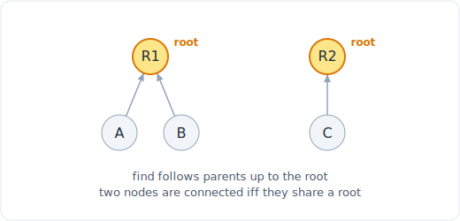

# 18 - 并查集(DSU)

> 中文版。English: [18-union-find](../patterns/18-union-find.md)

> **题目形态:**「有多少个省份 / 朋友圈?」「加上这条边会不会在无向图里形成环?」「合并共享邮箱的账户。」「哪条边是多余的?」凡是关于把条目分到不相交的集合、并在边逐条到来时回答「这两个在不在同一集合」的,尤其是连接一次来一条时,都属于这一类。

并查集,也叫不相交集合并(DSU),维护一个把条目分到各组的划分,并以近乎常数的摊还时间支持两个操作:`find`(这个在哪一组)和 `union`(合并两组)。配合路径压缩和按秩或按大小合并,`m` 次操作的序列在 O(m x alpha(n)) 内完成,其中 alpha 是反阿克曼函数,实际上是一个小常数。每当连通性是增量建立起来、而对每个查询都重启一次遍历会很浪费时,它就是对的工具。



*一个由两棵树组成的不相交集合森林。每个节点一路向上指向一个根(R1、R2);当两个节点共享同一个根时,它们属于同一集合。*

## 识别信号

看到以下情况就该想到并查集:

- **按连接分组 / 聚类:**「连通分量」、「省份」、「朋友圈」,以及当边以列表而非待洪泛的网格给出时的「岛屿数量」。
- **「这两个连通吗?」被问很多次**,同时边在不断加入。DSU 每个查询近 O(1);而每次查询重新做一次 BFS 或 DFS 都是 O(V + E)。
- **在*无向*图中检测环。** 如果一条边连接的两个节点已经共享同一个根,那这条边就闭合了一个环。
- **增量合并:**共享邮箱的账户、彼此接触的箱子、同一行或同一列上的石头。你不断做 union,并询问所得的各组。
- **Kruskal 最小生成树。** 按权重排序边,逐条加入,除非它会形成环(一次 DSU 查询),在 `V - 1` 条边处停止。

标志是不相交集合只会*合并*、从不分裂,而你在意的是成员关系而非节点之间的实际路径。如果你需要路径本身或距离,那是 [图遍历](16-graph-traversal.md) 或 [最短路](19-shortest-path.md)。

## 核心思想

把每一组表示成一棵树;根是这一组的身份标识。`find(x)` 沿父指针走到根。`union(x, y)` 把一个根指向另一个,从而把两棵树并成一棵。

两个优化让它近乎常数:

- **路径压缩。** 在 `find` 期间,把路径上的每个节点直接重指到根,这样这些节点后续查找就是 O(1)。这棵树在你使用中逐渐扁平。
- **按秩或按大小合并。** 总是把较小(或较矮)的树挂在较大的根下,这样树保持浅。没有这一点,一连串 union 会建出一个深度为 n 的退化链表。

两者结合给出反阿克曼界。数分量是免费的:计数从 `n` 开始,每次 `union` 真正合并两个不同的组时就减一。

## 模板

**可复用的 DSU 类,带路径压缩和按大小合并:**

```python
# Space: O(n)
class DSU:
    # Time: O(n)
    def __init__(self, n):
        self.parent = list(range(n))         # each node is its own root
        self.size = [1] * n                  # size of the tree at each root
        self.count = n                       # number of disjoint components

    # Time: O(alpha(n)) amortized
    def find(self, x):
        while self.parent[x] != x:
            self.parent[x] = self.parent[self.parent[x]]   # path halving
            x = self.parent[x]
        return x

    # Time: O(alpha(n)) amortized
    def union(self, x, y):
        rx, ry = self.find(x), self.find(y)
        if rx == ry:
            return False                     # already together: this edge is redundant
        if self.size[rx] < self.size[ry]:   # attach smaller under larger
            rx, ry = ry, rx
        self.parent[ry] = rx
        self.size[rx] += self.size[ry]
        self.count -= 1                      # two groups became one
        return True

    # Time: O(alpha(n)) amortized
    def connected(self, x, y):
        return self.find(x) == self.find(y)
```

**统计连通分量 / 省份:**

```python
# Time: O(n^2 * alpha(n)), Space: O(n)
def count_provinces(is_connected):           # n x n adjacency matrix
    n = len(is_connected)
    dsu = DSU(n)
    for i in range(n):
        for j in range(i + 1, n):
            if is_connected[i][j]:
                dsu.union(i, j)
    return dsu.count
```

**在无向图中检测环 / 找出多余的边:**

```python
# Time: O(E * alpha(n)), Space: O(E)
def find_redundant(edges):                   # nodes labeled 1..n
    dsu = DSU(len(edges) + 1)
    for u, v in edges:
        if not dsu.union(u, v):             # both ends already share a root
            return [u, v]                    # this edge closes a cycle
    return []
```

整个模式都押在 `union` 上:当两个端点已经在同一集合时它返回 `False`。那一个布尔值就是你的环检测器、你的多余边查找器,以及你的 Kruskal 跳过判据。

## 变体

- **按秩 vs 按大小合并。** 秩追踪树高,大小追踪节点数。两者都让树保持浅;当你还想要一组的大小(最大分量,或「包含 x 的岛屿的大小」)时,大小很方便。
- **字符串或任意键。** 先把每个标签映射到一个整数索引,或者用一个 `parent = {}` 字典来支撑 DSU,让 `find` 对没见过的键自初始化。账户合并就是这样对邮箱字符串做 union。
- **二维网格转一维。** 把格子 `(r, c)` 展平成 `r * cols + c` 并对相邻陆地格子做 union,是洪泛填充数岛屿的一种替代。
- **Kruskal MST。** 按权重升序排列边;对每条边,`union` 两个端点,只有当 union 成功(没形成环)时才保留这条边;凑够 `V - 1` 条边后停止。DSU 正是让这个贪心变便宜的东西。
- **带回滚 / 带权的并查集。** 高级变体会追踪到每个父节点的相对偏移(用于「等式是否可满足」或二分约束)。
- **连接一个网络所需的操作数。** 多余的线缆等于 `edges - (V - 1 - redundant)`;只有当你至少有 `components - 1` 根备用线缆时才可行。这是一个直接的 DSU 分量计数。

## 经典题目

| # | 题目 | 难度 | 训练点 |
|---|---------|-----------|----------------|
| 547 | Number of Provinces | 中等 | 从邻接矩阵数分量 |
| 684 | Redundant Connection | 中等 | 通过 union 做无向环检测 |
| 721 | Accounts Merge | 中等 | 按共享键 union,再按根分组 |
| 1319 | Number of Operations to Make Network Connected | 中等 | 分量数对比备用边数 |
| 200 | Number of Islands | 中等 | 把网格展平为 DSU 索引 |
| 323 | Number of Connected Components in an Undirected Graph | 中等 | 纯分量计数练习 |
| 990 | Satisfiability of Equality Equations | 中等 | 先 union 等式,再检查不等式 |
| 128 | Longest Consecutive Sequence | 中等 | union 连续值(或用哈希集合替代) |
| 1584 | Min Cost to Connect All Points | 中等 | 用 DSU 做 Kruskal MST |

## 常见坑

- **两个优化都跳过。** 路径压缩*或*按秩 / 按大小合并单独用一个还行;两个都没有意味着 `find` 会退化到 O(n),整个东西在大输入上会爬。稳妥起见两个都加。
- **节点标签差一。** 许多问题把节点标成 `1..n`,而不是 `0..n-1`。把 DSU 定尺寸为 `n + 1`,否则你会索引越界。
- **比较原始父节点而非根。** `connected` 必须比较 `find(x) == find(y)`,而不是 `parent[x] == parent[y]`;父节点可能指在树的中间。
- **在空操作的 union 上把分量数减一。** 只有当两个根确实不同时才减一。模板通过在 `rx == ry` 时提前返回来做到这一点。
- **忘了 DSU 只在*无向*图中检测环。** 有向环需要拓扑排序或 DFS 着色,见 [拓扑排序](17-topological-sort.md);对有向边做 union 会给出错误答案。
- **每次查询都重建 DSU。** 关键是构建一次、对同一个结构回答许多 `connected` 查询。

## 延伸与相关模式

- 「我需要两个节点之间的实际路径或距离,而不只是它们是否连通」推向 [图遍历](16-graph-traversal.md) 或 [最短路](19-shortest-path.md)。
- 「图是有向的,检测那个环」推向 [拓扑排序](17-topological-sort.md),那里 DSU 不适用。
- 「最小生成树」把它和贪心选边(Kruskal)或与一个 [堆](24-heap.md)(Prim)配对,交换论证见 [贪心](25-greedy.md)。
- 数分量也可以用来自 [图遍历](16-graph-traversal.md) 的反复 BFS 或 DFS 来做;当边增量到来或连通性被查询很多次时,DSU 胜出。
