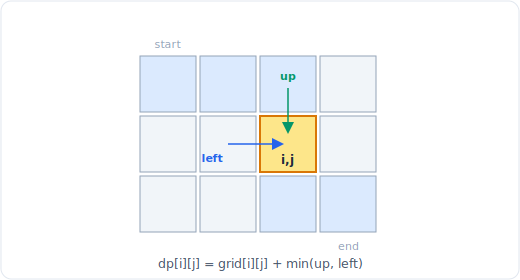

# 23 - DP III：网格、区间、位掩码

> 中文版。English: [23-dp-grids-intervals](../patterns/23-dp-grids-intervals.md)

> **问题形态：**「从左上到右下有多少条路径？」「穿过一个网格的最小和路径。」
> 「最大的全 1 正方形。」「戳破所有气球能得到的最多硬币。」「把这些石头堆合并成
> 一堆的最便宜方式。」「访问每个节点的最短路线。」凡是状态是一个二维格子、一个区间
> `[i, j]`、或一个编码为位掩码的子集，且答案由更小的格子、更短的区间或更小的子集
> 组合而成的问题，都属于这一类。

这个文件收集了当状态不再是单个索引时会出现的三种 DP 形态：网格 DP（状态是一个
格子）、区间 DP（状态是一个你从里往外构建的范围）、位掩码 DP（状态是一组已用元素）。
每一种都有一个标志性的求值顺序，那就是全部的诀窍。



*网格路径：每个格子由上方格子和左方格子到达（不同路径、最小路径和）。*

## 信号

出现以下情况时考虑这些：

- **一个带移动规则的二维网格**（右 / 下，或四个方向）以及「数路径」「最小 / 最大
  代价路径」或「最大正方形 / 矩形」。状态自然是 `dp[r][c]`。
- **一个你通过选择一个分割或一次末尾操作来求解的区间。** 「戳气球」「合并石头」
  「矩阵链乘法」「合并的最小代价」都在 `[i, j]` 内挑一个枢轴并合并两个子范围。标志是
  一个元素的代价依赖于它*在被处理那一刻*的邻居，所以顺序重要。
- **一个很小的 `n`（n <= ~20）加上「访问全部 / 分配全部 / 覆盖全部」。** TSP、
  分配、「访问每个节点的最短路径」。记住「哪些已完成」的那个状态是一个位掩码，而
  `2^20` 个状态是可承受的，`20!` 却不是。

`n <= 20` 这个上界专门在喊位掩码，正如 `n <= 15` 在喊
[回溯](20-backtracking.md)；多出来的余地来自缓存那 `2^n` 个子集状态，而不是重新
探索排列。

## 思路

**网格 DP。** 每个格子的答案由你能从其到达的那些格子构建而成，通常是上方那个和
左方那个。逐行填，好让那些邻居就绪。递推式是一个 `sum`（数路径）或一个
`min`/`max`（最便宜路径），且是 `O(rows * cols)` 时间。

**区间 DP。** 状态是子数组 `[i, j]` 上的 `dp[i][j]`，你从*更短*的区间构建它。强有力的
框架是「考虑 `[i, j]` 内最后被移除的那个元素（或最后一个分割点）」：固定哪个下标 `k`
被最后求解，这样两侧 `[i, k-1]` 和 `[k+1, j]` 就已经被完全解出且互相独立。按区间长度
递增遍历，好让更短的范围先被算出。代价通常是 `O(n^3)`：`O(n^2)` 个区间乘以 `O(n)` 个
分割选择。

**位掩码 DP。** 状态是 `dp[mask]` 或 `dp[mask][i]`，其中 `mask` 是已用元素的集合、
`i` 是你当前所在处。你通过向集合添加一个元素来转移。因为一个子集只转移到它的超集，
按数值递增顺序遍历掩码就尊重了依赖关系。有 `2^n` 个掩码（对 TSP 再乘 `n` 个位置），
所以是 `O(2^n * n^2)`：指数级，但是唯一能击败暴力 `O(n!)` 的东西。

贯穿这三者的统一主题：辨明状态，然后找到那个求值顺序，使得每个转移读取的值都已填好。
网格逐行走，区间从短到长走，位掩码按集合递增走。

## 模板

**网格路径计数，不同路径（只能右移和下移）：**

```python
# Time: O(m * n), Space: O(n)
def unique_paths(m, n):
    dp = [1] * n                           # first row: exactly one way to each cell
    for _ in range(1, m):
        for c in range(1, n):
            dp[c] += dp[c - 1]             # from above (old dp[c]) + from left
    return dp[-1]
```

**最小路径和（每个格子把自身代价加到更便宜的前驱上）：**

```python
# Time: O(m * n), Space: O(m * n) (compressible to O(n))
def min_path_sum(grid):
    m, n = len(grid), len(grid[0])
    dp = [[0] * n for _ in range(m)]
    dp[0][0] = grid[0][0]
    for r in range(m):
        for c in range(n):
            if r == 0 and c == 0:
                continue
            up   = dp[r - 1][c] if r > 0 else float('inf')
            left = dp[r][c - 1] if c > 0 else float('inf')
            dp[r][c] = grid[r][c] + min(up, left)
    return dp[m - 1][n - 1]
```

**最大正方形（以每个格子为右下角的最大全 1 正方形的边长）：**

```python
# Time: O(m * n), Space: O(m * n) (compressible to O(n))
def maximal_square(matrix):
    m, n = len(matrix), len(matrix[0])
    dp = [[0] * (n + 1) for _ in range(m + 1)]
    best = 0
    for r in range(1, m + 1):
        for c in range(1, n + 1):
            if matrix[r - 1][c - 1] == '1':
                # a square here is bounded by its three neighbors
                dp[r][c] = 1 + min(dp[r - 1][c], dp[r][c - 1], dp[r - 1][c - 1])
                best = max(best, dp[r][c])
    return best * best                     # area is side squared
```

**区间 DP，戳气球（「(i, j) 里哪个气球我最后戳？」）：**

```python
# Time: O(n^3), Space: O(n^2)
def max_coins(nums):
    a = [1] + nums + [1]                   # pad with virtual 1s at both ends
    n = len(a)
    dp = [[0] * n for _ in range(n)]       # dp[i][j] = coins from open range (i, j)
    for length in range(2, n):             # shorter ranges first
        for i in range(0, n - length):
            j = i + length
            for k in range(i + 1, j):      # k is burst LAST in (i, j)
                # when k bursts last, its neighbors are the fixed walls a[i], a[j]
                dp[i][j] = max(dp[i][j],
                               dp[i][k] + a[i] * a[k] * a[j] + dp[k][j])
    return dp[0][n - 1]
```

**位掩码 DP，TSP 式访问所有节点的最短路线：**

```python
# Time: O(n^2 * 2^n), Space: O(n * 2^n)
def shortest_tour(dist):
    n = len(dist)
    FULL = (1 << n) - 1
    INF = float('inf')
    # dp[mask][i] = shortest path that has visited exactly `mask`, now at node i
    dp = [[INF] * n for _ in range(1 << n)]
    for i in range(n):
        dp[1 << i][i] = 0                  # start at each node
    for mask in range(1 << n):             # increasing masks: supersets come later
        for i in range(n):
            if dp[mask][i] == INF:
                continue
            for j in range(n):
                if not (mask & (1 << j)):  # j not yet visited
                    nmask = mask | (1 << j)
                    dp[nmask][j] = min(dp[nmask][j], dp[mask][i] + dist[i][j])
    return min(dp[FULL][i] for i in range(n))
```

## 变体

- **带障碍的网格。** 同样的递推式，但在被堵的格子上强制 `dp = 0`，使没有路径从中
  经过。「不同路径 II」是训练题。
- **三角形 / 下降路径。** 网格 DP，其中可达的前驱是斜上方的两个或三个格子；只有邻居
  集合改变。
- **最大矩形。** 一个归约为每行一个直方图的网格问题，用单调栈而不是朴素的二维递推
  求解：值得知道并非每个网格问题都停留在干净的网格 DP。
- **矩阵链乘法 / 合并石头的最小代价。** 纯区间 DP：分割点 `k` 决定你在哪里切 `[i, j]`，
  然后你加上合并两半的代价。「考虑最后一次分割」与「最后戳」是同一个视角。
- **回文划分 II（最小切割）。** 区间可行性（`[i, j]` 是否为回文）喂给一个在切割位置上
  的线性 DP：区间 DP 当作一个子程序。
- **分配问题 / 「最短超串」。** 在哪些任务 / 字符串已被使用上做位掩码；`dp[mask]` 或
  `dp[mask][last]` 追踪覆盖那个集合的最优分配。
- **在「本行放了哪些」上的位掩码。** 用于铺砖和棋盘覆盖的断面 DP，逐列数填满网格的
  方法数，掩码是前沿的被占格子。

## 经典题目

| # | 题目 | 难度 | 训练点 |
|---|---------|-----------|----------------|
| 62 | Unique Paths | 中等 | 网格路径计数，`dp[c] += dp[c-1]` |
| 64 | Minimum Path Sum | 中等 | 从更便宜前驱出发的最小代价网格路径 |
| 221 | Maximal Square | 中等 | 由三邻居最小值得出的正方形边长 |
| 63 | Unique Paths II | 中等 | 带障碍格子的网格 DP |
| 120 | Triangle | 中等 | 带移位邻居集合的网格 DP |
| 312 | Burst Balloons | 困难 | 区间 DP，「最后戳」框架 |
| 1000 | Minimum Cost to Merge Stones | 困难 | 带 k 路合并约束的区间 DP |
| 847 | Shortest Path Visiting All Nodes | 困难 | 在已访问集合上的位掩码 DP |

## 陷阱

- **区间 DP 中错误的求值顺序。** `dp[i][j]` 需要更短的区间，所以外层循环必须是区间
  长度（或 `i` 递减、`j` 递增）。`i` 然后 `j` 都递增地循环会读到仍为零的格子。
- **把「最后」技巧当成「最先」用。** 在戳气球里，选 `k` 来*最先*戳会让它的邻居随着
  子范围求解而变化，所以子问题并不独立。选 `k` *最后*戳则固定了墙 `a[i]` 和 `a[j]`。
  弄反会给出一个微妙错误的递推式。
- **漏掉哨兵填充。** 戳气球及类似题需要两端各一个虚拟的 `1`，好让边缘气球有已定义的
  邻居；没有它们边界情形就会错。
- **位掩码遍历顺序。** 必须让子集先于超集被访问；数值递增顺序有效，因为加一个位只会
  增大数值。以任何其他方式遍历都会读到未完成的状态。
- **`2^n` 过了 n = 20 就爆炸。** 位掩码 DP 只用于极小的 n。如果 n 更大，意图中的解法
  是多项式的（贪心、流、或另一种 DP），而不是掩码。
- **网格边界的差一错误。** 第一行和第一列只有一个前驱；对它们加保护（或用一圈无穷 /
  零的边界填充），好让你不会读到 `dp[-1]` 而绕回去。
- **在最大正方形里把面积和边长弄混。** `dp` 存的是边长；答案是 `side * side`。返回
  原始的 `dp` 值是一个常见的失误。

## 后续问题与相关模式

- 「它是带一个容量预算的单个序列」退回到
  [DP I：线性与背包](21-dp-linear-knapsack.md)。
- 「它是两个字符串或一个子序列」是 [DP II：子序列与
  字符串](22-dp-strings.md)；这里的区间 DP 推广了那里的回文区间 DP。
- 「n 是 15 而且我必须枚举，不只是优化」会推向
  [回溯](20-backtracking.md)；位掩码 DP 是那种子集搜索的记忆化版本。
- 「这网格其实是一个带权图而我想要一条真正的最短路径」会推向
  [图遍历](16-graph-traversal.md) 和 Dijkstra；网格 DP 只在移动无环（单方向）时
  有效，而一般性的移动需要图搜索。
- 子集编码依赖 [位运算](26-bit-manipulation.md)：`mask & (1 << j)`、
  `mask | (1 << j)` 和 popcount 是基本操作。
- 当一个局部规则可被证明无需一张表就能选出全局最优时，它就坍缩为
  [贪心](25-greedy.md)。
