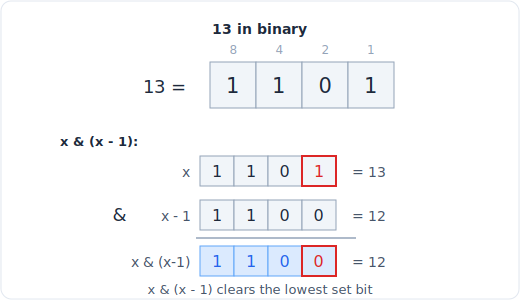

# 26 - 位运算

> 中文版。English: [26-bit-manipulation](../patterns/26-bit-manipulation.md)

> **问题形态：** 「每个元素都出现两次，只有一个例外，找出它。」「统计一个数里有
> 多少个 1。」「生成所有子集。」「不使用 + 把两个整数相加。」凡是把整数当作一袋
> 比特来处理、用 `&`、`|`、`^` 和移位而不是算术就能自然得出答案的问题。

位运算用机器字上一小把常数时间的操作，换掉了人类可读的算术。回报是 O(1) 的集合
操作、O(1) 的奇偶性与成员判断，以及靠计数枚举全部 2^n 个子集的能力。整个模式就是
一小套惯用法：一旦你知道 `x & (x - 1)` 和 `x & -x` 做的是什么，大多数问题都是
一行代码。



*x & (x - 1) 清除最低置位：13 (1101) 变成 12 (1100)。*

## 信号

看到以下情况时，考虑位运算：

- **「出现两次 / 三次，只有一个例外」** 或任何重复相消的表述。XOR 是自逆的
  （`a ^ a == 0`），所以成对的值互相抵消，落单的那个存活下来。
- **「统计 / 检查 / 翻转某一位」**、「1 的个数」、「是不是 2 的幂」、
  「第 k 位是否置位」。这些都是单次的掩码加移位操作。
- **「生成所有子集」且 n 很小（n <= 20 左右）**。每个子集对应一个 n 位整数，所以
  遍历 `0 .. 2^n - 1` 就枚举了每一个子集。
- **一组小整数（0..63）**，你想在 O(1) 内存储、求并、求交或测试它们。一个 `int`
  通过位掩码就成了一个集合；这是位掩码 DP 的状态类型。
- **「不使用 + 运算符」** 或其他禁用算术的设定。加、减、乘都能分解成 XOR
  （不带进位的和）加上 AND 移位（进位）。

判断标志是：天然的数据单位是一个比特或一个小集合，而你需要的操作是求并、翻转、
奇偶性，或者「隔离出某一位」。

## 思路

两个惯用法承担了大部分工作，都值得推导一遍，这样你永远不会忘：

- **`x & (x - 1)` 清除最低置位。** 减 1 会把最低置位翻成 0，并把它下面每个 0 变成
  1；与原值做 AND，只保留那个点以上的位。循环执行并统计迭代次数，就能在
  O(置位个数) 内得到 popcount，比扫描全部 32 位更好（Brian Kernighan）。
- **`x & -x` 隔离出最低置位。** 在补码里 `-x == ~x + 1`，所以 `-x` 就是把 `x` 最低
  置位以上的一切都翻转后的结果；AND 之后恰好留下那一位。这是 Fenwick 树（树状
  数组）的骨干。

XOR 的性质完成其余工作：`a ^ a == 0`、`a ^ 0 == a`，而且 XOR 满足交换律和结合
律，所以把整个列表 XOR 起来会抵消每个出现偶数次的值，留下出现奇数次的幸存者。
不用排序，不用哈希，O(1) 空间。

## 模板

**核心惯用法，记住这些：**

```python
# Time: O(1), Space: O(1) per operation
x & (x - 1)          # clear the lowest set bit
x & -x               # isolate the lowest set bit (value, not index)
x & (1 << k)         # test bit k (nonzero if set)
x | (1 << k)         # set bit k
x & ~(1 << k)        # clear bit k
x ^ (1 << k)         # toggle bit k
x & (x - 1) == 0     # true iff x is a power of two (x > 0)
```

**单个数字（XOR 相消）：**

```python
# Time: O(n), Space: O(1)
def single_number(nums):
    result = 0
    for x in nums:
        result ^= x          # pairs cancel, the lone value remains
    return result
```

**统计比特，用 Kernighan 做 popcount：**

```python
# Time: O(number of set bits), Space: O(1)
def hamming_weight(x):
    count = 0
    while x:
        x &= x - 1           # drop the lowest set bit each step
        count += 1
    return count
```

**用位掩码枚举子集（遍历 0 .. 2^n - 1）：**

```python
# Time: O(n * 2^n), Space: O(1) auxiliary (beyond the output list)
def subsets(nums):
    n = len(nums)
    out = []
    for mask in range(1 << n):               # every n-bit integer is one subset
        out.append([nums[i] for i in range(n) if mask & (1 << i)])
    return out
```

要记牢的规则：`mask & (1 << i)` 问的是「元素 i 在这个子集里吗」，而 `mask` 恰好
遍历 `2^n` 个值，每个子集对应一个。

## 变体

- **单个数字 II（每个元素三次，只有一个例外）。** XOR 不再能抵消三元组。把每个位的
  出现次数对 3 取模来统计（在 3 的倍数个值里出现的位贡献为 0），或者跑双变量的
  `ones`/`twos` 状态机，追踪每位计数对 3 的模。
- **单个数字 III（两个落单值）。** 把所有值 XOR 得到 `a ^ b`，用
  `diff = xor & -xor` 隔离任意一个置位（一个 `a` 和 `b` 不同的位），然后按那一位
  把数组分成两半，各自单独 XOR。
- **统计 0..n 的比特作为 DP。** `bits[i] = bits[i >> 1] + (i & 1)`：`i` 拥有与
  `i >> 1` 相同的置位，再加上它自己的最低位。O(n)，而不是 O(n log n)。
- **子掩码枚举。** 遍历掩码 `m` 的每个子集：
  `sub = m; while sub: ...; sub = (sub - 1) & m`。对所有掩码累计的总工作量是
  O(3^n)，即经典位掩码 DP 的内层循环。
- **不用 + 做加法。** `sum_no_carry = a ^ b`、`carry = (a & b) << 1`，重复直到进位
  为 0。在 Python 里要掩码到 32 位并重新解释符号，因为 Python 整数是无界的。
- **位掩码作为集合。** 并是 `|`，交是 `&`，差是 `& ~`，成员判断是 `& (1 << k)`，
  大小是 popcount。这是旅行商和「访问所有节点的最短路径」这类 DP 的状态表示。

## 经典题

| # | 题目 | 难度 | 训练点 |
|---|---------|-----------|----------------|
| 136 | Single Number | 简单 | XOR 相消，最基础的惯用法 |
| 191 | Number of 1 Bits | 简单 | Kernighan popcount |
| 338 | Counting Bits | 简单 | `bits[i] = bits[i >> 1] + (i & 1)` DP |
| 268 | Missing Number | 简单 | 用下标对值做 XOR |
| 190 | Reverse Bits | 简单 | 移出、移入，32 次迭代 |
| 137 | Single Number II | 中等 | 每位计数对 3 取模 |
| 260 | Single Number III | 中等 | 按一个隔离出的差异位分组 |
| 78 | Subsets | 中等 | 把 0 .. 2^n - 1 当作掩码枚举 |
| 371 | Sum of Two Integers | 中等 | XOR 求和加上 AND 移位进位 |

## 陷阱

- **Python 整数是无界且有符号的。** 假设固定 32 位字的位技巧（用 XOR 做加法、
  反转比特、任何涉及 `-x` 溢出的操作）需要用 `0xFFFFFFFF` 显式掩码并做符号修正，
  否则会无限循环或返回一个巨大的正数。
- **`x & -x` 给的是最低位的值，不是它的下标。** 如果你需要位置，取
  `(x & -x).bit_length() - 1`，不要直接把隔离出的值当作下标用。
- **运算符优先级。** 在 Python 里 `&`、`|`、`^` 的结合比 `==` 和 `+` 更松。
  `x & 1 == 0` 会被解析成 `x & (1 == 0)`。加括号：`(x & 1) == 0`。
- **对 0 做 2 的幂判断。** `x & (x - 1) == 0` 对 `x == 0` 也为真；如果 0 不应算，
  用 `x > 0` 保护。
- **XOR 只能抵消偶数次。** 「每个元素两次」的技巧一旦重复变成三个就失效；改用对 3
  取模的按位统计变体。
- **子集枚举超过约 20 个元素就会爆炸。** `2^n` 在 n = 20 时还行（一百万），但在
  n = 40 时毫无希望。如果 n 很大，子集不是对的模式。

## 后续追问与相关模式

- 「现在高效地做子集和或访问所有节点」把位掩码从枚举技巧推进成一种 DP 状态，见
  [DP III：网格、区间、位掩码](23-dp-grids-intervals.md)。
- 「n 很大或需要剪枝时生成子集」推向
  [回溯](20-backtracking.md)，那里你是增量地构建子集，而不是靠计数。
- 「用值作为下标找重复 / 缺失的数」与
  [循环排序和以下标为哈希](06-cyclic-sort.md)重叠；XOR 和循环排序是同一族问题的两个
  O(1) 空间答案。
- 隔离最低置位的 `x & -x` 是 Fenwick 树背后的机制；比特前缀的思路又出现在
  [字典树](15-trie.md)里，用于 XOR 最大化问题。
- 数论性质的位问题（奇偶性、进制转换、幂）与
  [数学与数论](27-math.md)相互渗透。
