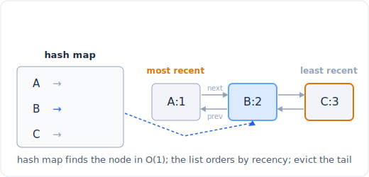

# 28 - 设计

> 中文版。English: [28-design](../patterns/28-design.md)

> **问题形态：** 「设计一个 O(1) get 和 put 的 LRU 缓存。」「实现一个迭代器。」
> 「插入、删除、getRandom，全都 O(1)。」「设计一个最小栈。」「设计 Twitter。」
> 任务不是单一算法，而是：构建一个满足规格的数据结构，其中每个命名操作都有一个
> 目标复杂度，你必须靠组合正确的基本结构来达成。

设计题考的是你能否挑选并粘合数据结构，而不是发明一个算法。方法总是一样的：列出
所有操作，在每个旁边写下复杂度目标，然后选结构使每个操作都落在 O(1) 或 O(log n)。
制胜组合就那么几种（哈希表加双向链表、哈希表加数组、两个堆、栈加辅助栈），大多数
问题都是其中之一披了件外套。



*一个 LRU 缓存：哈希表在 O(1) 内找到任意节点，双向链表按最近使用顺序把它们排好，尾部被淘汰。*

## 信号

当问题这样说时，考虑设计模式：

- **「实现一个类」/「设计一个结构」**，带一组固定的命名方法，而不是「返回这个
  查询的答案」。
- **一个苛刻的单操作复杂度目标**：「O(1) get 和 put」、「O(1) getRandom」、
  「O(log n) 插入」。目标决定结构；如果 `get` 必须 O(1)，你需要哈希表，如果还需要
  有序，你需要在它旁边再放第二个结构。
- **两个需求，没有任何单一结构能同时满足。** O(1) 查找想要哈希表；有序淘汰想要
  链表；随机访问想要数组。当规格一次要两个时，答案就是让两个结构同步运转，并让
  它们互相指向。
- **一个按需消费的流**：「实现一个迭代器」、「hasNext / next」、「窥视迭代器」。
  你包裹一个源，并只缓冲刚好够回答下一次调用的量。

判断标志是：没有巧妙的递推可找；巧妙之处完全在容器的选择和协调上。

## 思路

每个操作都有一个天然归宿：

- **O(1) 按键查找** -> 哈希表。
- **在已知位置 O(1) 插入 / 删除，且有序** -> 双向链表（只要你握有指向某节点的
  指针，就能在 O(1) 内把它拼接出来）。
- **按下标 O(1) 随机访问，O(1) 尾部追加 / 弹出** -> 动态数组。
- **O(log n) 提取最小 / 最大** -> 堆。

你组合它们，让哈希表持有指向另一个结构*内部*的指针。LRU 缓存是典范：哈希表给出
O(1) 的键 -> 节点查找，双向链表给出 O(1) 的移到头部和 O(1) 的从尾部淘汰。单独任何
一个都做不到两者；合起来每个操作都是 O(1)。O(1) 从中间删除（LRU、insert-delete-
getRandom）反复用到的技巧是：哈希表存一个*句柄*（节点引用，或一个下标），这样你
永远不用去搜索那个即将删除的项。

## 模板

**用 `OrderedDict` 的 LRU 缓存（简洁、面试快写版）：**

```python
from collections import OrderedDict

# Space: O(capacity)
class LRUCache:
    # Time: O(1)
    def __init__(self, capacity):
        self.cache = OrderedDict()      # insertion order == recency order
        self.cap = capacity

    # Time: O(1)
    def get(self, key):
        if key not in self.cache:
            return -1
        self.cache.move_to_end(key)     # mark as most recently used
        return self.cache[key]

    # Time: O(1)
    def put(self, key, value):
        if key in self.cache:
            self.cache.move_to_end(key)
        self.cache[key] = value
        if len(self.cache) > self.cap:
            self.cache.popitem(last=False)   # evict least recently used (front)
```

`OrderedDict` 底层*就是*哈希表加双向链表；`move_to_end` 和 `popitem(last=False)`
就是那些 O(1) 的拼接操作。如果面试官禁用它，就手工搭建这两个结构：

**LRU 缓存，显式哈希表 + 双向链表（OrderedDict 替你做的事）：**

```python
# Space: O(1)
class Node:
    __slots__ = ('key', 'val', 'prev', 'next')
    # Time: O(1)
    def __init__(self, key=0, val=0):
        self.key, self.val, self.prev, self.next = key, val, None, None

# Space: O(capacity)
class LRUCache:
    # Time: O(1)
    def __init__(self, capacity):
        self.cap = capacity
        self.map = {}                       # key -> Node
        self.head, self.tail = Node(), Node()   # sentinels: head<->...<->tail
        self.head.next, self.tail.prev = self.tail, self.head

    # Time: O(1)
    def _remove(self, node):                # unlink in O(1)
        node.prev.next, node.next.prev = node.next, node.prev

    # Time: O(1)
    def _add_front(self, node):             # splice right after head (most recent)
        node.prev, node.next = self.head, self.head.next
        self.head.next.prev = node
        self.head.next = node

    # Time: O(1)
    def get(self, key):
        if key not in self.map:
            return -1
        node = self.map[key]
        self._remove(node); self._add_front(node)   # bump to most recent
        return node.val

    # Time: O(1)
    def put(self, key, value):
        if key in self.map:
            self._remove(self.map[key])
        node = Node(key, value)
        self.map[key] = node
        self._add_front(node)
        if len(self.map) > self.cap:
            lru = self.tail.prev            # least recent is just before tail
            self._remove(lru)
            del self.map[lru.key]           # the node stored its key for this delete
```

两个哨兵（`head`、`tail`）消除了所有空值检查分支：每个真实节点两侧总有一个真实
邻居。注意节点存了它自己的 `key`，这样淘汰时能在 O(1) 内删掉哈希表项，无需反向
查找。

## 变体

- **最小栈。** 保留第二个栈，在每一层持有到目前为止的最小值。每次 push 时把
  (入栈值, 当前最小值) 的最小值一并压入；辅助栈的栈顶总是当前最小值，所以
  `getMin` 是 O(1)。替代方案：在一个栈里存 `(value, running_min)` 元组。
- **LFU 缓存。** 比 LRU 难：你淘汰使用*频率*最低的，平局时按最近最少使用打破。
  保留一个哈希表 键 -> 节点、一个哈希表 频率 -> 该频率下节点的有序列表，以及一个
  运行的 `min_freq`。访问时，把节点从它的频率桶移到 频率+1；从 `min_freq` 桶最旧的
  淘汰。
- **insert-delete-getRandom O(1)。** 哈希表 值 -> 动态数组里的下标。插入追加到
  数组；删除时把目标和最后一个元素交换、弹出，并在 map 里修正被移动元素的下标；
  getRandom 用一个随机整数索引数组。与最后一个交换的技巧就是让删除保持 O(1) 的
  关键。
- **迭代器。** 包裹一个源并缓冲下一项。*窥视*迭代器缓存一个前瞻；*展平嵌套列表*
  迭代器把结构压入一个栈，在 `hasNext` 时懒惰地展开。
- **设计 Twitter。** 哈希表 用户 -> 关注对象集合，以及 用户 -> (时间戳, 推文)
  列表。`getNewsFeed` 用一个堆（k 路归并）合并所有关注对象的近期推文，取最近的
  10 条。堆加哈希表。
- **用栈实现队列 / 用队列实现栈。** 两个栈给出摊还 O(1) 的队列：压入一个 `in` 栈，
  从一个 `out` 栈弹出，只在 `out` 空时才从 `in` 重新灌满 `out`。

## 经典题

| # | 题目 | 难度 | 训练点 |
|---|---------|-----------|----------------|
| 232 | Implement Queue using Stacks | 简单 | 两个栈，摊还 O(1) |
| 155 | Min Stack | 中等 | 追踪运行最小值的辅助栈 |
| 146 | LRU Cache | 中等 | 哈希表 + 双向链表，两者都 O(1) |
| 208 | Implement Trie (Prefix Tree) | 中等 | 嵌套字典节点，插入与查找 |
| 380 | Insert Delete GetRandom O(1) | 中等 | 哈希表 + 数组，与末尾交换的删除 |
| 355 | Design Twitter | 中等 | 在关注列表上做堆 k 路归并 |
| 460 | LFU Cache | 困难 | 频率桶加 min_freq 记账 |

## 陷阱

- **淘汰时忘记更新哈希表。** 在 LRU 里，当你把尾部节点断开时，必须也
  `del self.map[node.key]`，这正是节点存自己 key 的原因。漏掉这一步，map 就会泄漏
  陈旧的项。
- **getRandom 的删除没修正被移动的下标。** 把目标与最后一个数组元素交换之后，你
  必须在弹出*之前*更新被移动元素在 map 里的下标，否则 map 指向一个空洞。
- **最小栈弹出辅助栈时不同步。** 每次 `push` 必须两个栈都压，每次 `pop` 必须两个栈
  都弹，否则最小值历史会与值漂移开。
- **手工搭建的链表里缺少哨兵。** 没有 `head`/`tail` 哨兵，每次拼接都需要为空表和
  单节点情形做空值检查；哨兵让 `_remove` 和 `_add_front` 无分支。
- **LFU 的平局打破。** 使用频率最低的平局必须在频率桶内按最近最少使用打破，所以
  每个桶必须保持插入顺序（每个频率一个 `OrderedDict`）。
- **迭代器一上来就把一切算好。** 迭代器的要义是懒惰；在构造函数里就把整个序列
  物化会毁掉这一点，并可能在无限或巨大的源上撑爆内存。

## 后续追问与相关模式

- 「让队列里的 getMin / getMax 也是 O(1)」把最小栈的思路推进成一个单调双端队列，
  见[栈：单调与解析](11-stacks.md)。
- 「合并所有关注对象的信息流」是在
  [堆和优先队列](24-heap.md)上做 k 路归并；设计 Twitter 是一道披着设计外套的堆题。
- LRU 和 getRandom 的删除都依赖
  [链表技巧](10-linked-list.md)里 O(1) 的拼接和指针记账。
- 「实现字典树」其实是把[字典树](15-trie.md)模式摆成一道设计题；这里的设计技巧
  是选出嵌套字典的节点表示。
- 限流器、自动补全，以及其他「设计 X」的系统味问题都复用同一个组合两个结构的
  方法，常常再加一个[堆](24-heap.md)或一个来自
  [哈希与频率统计](04-hashing.md)的计数哈希表。
