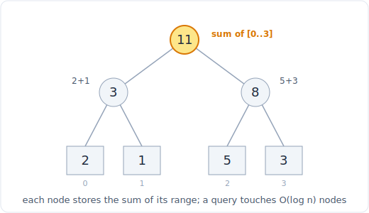

# 29 - 线段树与 Fenwick（树状数组）

> 中文版。English: [29-segment-tree-fenwick](../patterns/29-segment-tree-fenwick.md)

> **问题形态：** 「支持区间求和查询**以及**单点更新，交错进行。」「统计每个元素
> 右边有多少个数比它小。」「统计翻转对。」当[前缀和](03-prefix-sum.md)本来完美，
> 只是数组一直在变，导致重建前缀数组每次更新要花 O(n)。

前缀和能在 O(1) 内回答区间查询，但只对**静态**数组：一次更新就逼出一次 O(n) 重建。
当查询和更新交错时，你需要一个两者都做到 O(log n) 的结构。两种结构能做到：
**Fenwick 树**（树状数组，BIT）紧凑，对前缀和完美；**线段树**更通用（任意可结合的
区间聚合：sum、min、max、gcd）。这是「动态区间查询」的模式，也是那些可归约为它们
的计数问题（逆序对、比它小的数量）的模式。



*一棵覆盖 [2,1,5,3] 的线段树：每个节点存它区间的和，所以一次区间查询只碰 O(log n) 个节点。*

## 信号

在以下情况时，考虑 Fenwick 或线段树：

- 问题把**区间聚合查询**（区间上的 sum、min、max）与对单个元素的**更新**交错。
  前缀和无法廉价地吸收这些更新；你需要每次操作 O(log n)。
- 你在**统计逆序对**或**一侧比它小/大的元素数量**。这些归约为「之前见过的值里有
  多少落在 x 以下」，也就是在一个频率数组上做前缀计数查询，随扫描而更新。那就是一个
  BIT。
- 值域很大但不同值的数量很小：把该结构与**坐标压缩**结合（先把值映射到 1..k 的
  排名）。
- 你看到像 n 和查询数都到 10^5、且更新查询混合的约束。每次查询 O(n) 是 10^10 会
  超时；O(log n) 才是预期解。

如果数组一旦建好就不再改变，别用这里。静态的前缀和（或用于 min/max 的稀疏表）更
简单也更快。

## 思路

两种结构都把一个区间切成 O(log n) 块预计算的片，这样任何查询走过的节点都不超过
log n。

- 一棵 **Fenwick 树**在下标 i 处，存一块元素之和，块的大小是 i 的最低置位。走
  `i -= i & (-i)` 一次剥掉一块，所以一次前缀和碰 O(log n) 块。一次更新走
  `i += i & (-i)`，碰到包含 i 的那 O(log n) 块。它是「前缀和带更新」代码最少的
  写法，而位技巧 `i & (-i)`（隔离最低置位）就是它的整个引擎。
- 一棵**线段树**是覆盖数组的一棵二叉树：每个叶子是一个元素，每个内部节点存它孩子
  区间的聚合。一次查询把目标区间拆成恰好铺满它的那 O(log n) 个节点；一次更新走
  单条根到叶的路径并修正每个祖先。它推广到任意可结合运算，并且带**懒惰传播**时它还
  支持区间更新（把一个节点上待处理的更新延迟到你需要下降进它时才做）。

经验法则：前缀和带单点更新，用 **BIT**（代码更少）。区间 min/max，或区间更新，用
**线段树**。

## 模板

**Fenwick 树（BIT），从 1 开始下标，前缀和带单点更新：**

```python
# Space: O(n)
class BIT:
    # Time: O(n)
    def __init__(self, n):
        self.n = n
        self.tree = [0] * (n + 1)      # 1-indexed

    # Time: O(log n)
    def update(self, i, delta):        # add delta at position i
        while i <= self.n:
            self.tree[i] += delta
            i += i & (-i)              # move to the next block that covers i

    # Time: O(log n)
    def query(self, i):                # prefix sum of [1..i]
        s = 0
        while i > 0:
            s += self.tree[i]
            i -= i & (-i)              # peel off the lowest block
        return s

    # Time: O(log n)
    def range_query(self, l, r):       # sum of [l..r], inclusive
        return self.query(r) - self.query(l - 1)
```

**迭代式线段树，单点更新和 [l, r) 上的区间求和查询：**

```python
# Space: O(n)
class SegTree:
    # Time: O(n)
    def __init__(self, data):
        self.n = len(data)
        self.tree = [0] * (2 * self.n)
        for i in range(self.n):        # leaves live in the second half
            self.tree[self.n + i] = data[i]
        for i in range(self.n - 1, 0, -1):
            self.tree[i] = self.tree[2 * i] + self.tree[2 * i + 1]

    # Time: O(log n)
    def update(self, i, val):          # set position i to val
        i += self.n
        self.tree[i] = val
        i //= 2
        while i >= 1:
            self.tree[i] = self.tree[2 * i] + self.tree[2 * i + 1]
            i //= 2

    # Time: O(log n)
    def query(self, l, r):             # sum on the half-open range [l, r)
        res = 0
        l += self.n
        r += self.n
        while l < r:
            if l & 1:
                res += self.tree[l]
                l += 1
            if r & 1:
                r -= 1
                res += self.tree[r]
            l //= 2
            r //= 2
        return res
```

**计算每个元素之后更小的数的个数，BIT 加坐标压缩：**

```python
# Time: O(n log n), Space: O(n)
def count_smaller(nums):
    rank = {v: i + 1 for i, v in enumerate(sorted(set(nums)))}  # 1-indexed ranks
    bit = BIT(len(rank))
    res = []
    for x in reversed(nums):           # sweep right to left
        r = rank[x]
        res.append(bit.query(r - 1))   # count of already-seen values strictly smaller
        bit.update(r, 1)               # record this value
    res.reverse()
    return res
```

## 变体

- **区间求和带单点更新**（307）：教科书式的 BIT 或线段树用法。
- **右侧更小 / 更大的数量**（315）：在压缩排名上做 BIT，从右向左扫（如上）。同一
  思路也统计**逆序对**。
- **翻转对**（493，对 i < j 统计 `nums[i] > 2 * nums[j]`）：BIT 或归并排序计数。
  这里归并排序往往更干净（见下）。
- **区间 min 或 max**：用线段树（BIT 不支持带更新的 min 或 max，因为 min 不像 sum
  那样可逆）。
- **区间更新、区间查询**（给整个区间加 v，然后查询一个区间）：带**懒惰传播**的
  线段树，或用两个 BIT 做区间加区间和的技巧。
- **归并排序计数**：逆序对和翻转对也可以在归并时统计，O(n log n) 且不需额外结构。
  如果一个问题只需要一次计数（没有交错的更新），优先用这个而不是 BIT。
- **不带聚合的顺序统计**：如果你只需要「到目前为止第 k 小」或「区间内有多少个」，
  一个[有序容器](../data-structures/10-sorted-container.md)（bisect 或 SortedList）
  比线段树更简单。

## 经典题

| # | 题目 | 难度 | 训练点 |
|---|---------|-----------|----------------|
| 307 | Range Sum Query - Mutable | 中等 | 基础 BIT / 线段树：带单点更新的求和 |
| 303 | Range Sum Query - Immutable | 简单 | 静态对照：纯前缀和，不需要结构 |
| 315 | Count of Smaller Numbers After Self | 困难 | 在压缩排名上做 BIT，从右向左扫 |
| 493 | Reverse Pairs | 困难 | 带压缩的 BIT，或归并排序计数 |
| 327 | Count of Range Sum | 困难 | 前缀和加 BIT，或在和上做归并排序 |
| 218 | The Skyline Problem | 困难 | 带 max 结构（堆或线段树）的扫描线 |
| 699 | Falling Squares | 困难 | 带区间 max 和区间更新（懒惰）的线段树 |
| 2179 | Count Good Triplets in an Array | 困难 | 两个 BIT，统计之前和之后的位置 |

## 陷阱

- **差一错误和 0 与 1 下标。** BIT 天然从 1 开始下标（`i & (-i)` 需要 i > 0）。把你
  的数组位置映射到 1..n 并始终如一地保持在那里。
- **忘记坐标压缩。** 如果值能到 10^9，你无法按值给树定尺寸。先压缩到排名；树的大小
  是不同值的数量。
- **对带更新的 min 或 max 用 BIT。** BIT 依赖 sum 可逆（`range = query(r) -
  query(l-1)`）。min 和 max 不可逆，所以减小无法撤销。那些情况用线段树。
- **重建而不是更新。** 要义就在 O(log n) 的更新。如果你发现自己在每次变动后重算
  前缀和，那你写的是 O(n) 的更新，错过了这个模式。
- **归并排序够用时却去用线段树。** 一次性的逆序对计数不需要持久结构。别过度
  工程。

## 后续追问与相关模式

- 「数组是静态的，没有更新」把你拉回纯[前缀和](03-prefix-sum.md)，它每次查询 O(1)
  且简单得多。
- 「我只需要顺序统计或区间计数，不需要任意聚合」指向一个
  [有序容器](../data-structures/10-sorted-container.md)（bisect 或 SortedList），
  比线段树代码更少。
- 「只统计一次逆序对」指向归并排序，一种
  [分治](08-sorting.md)计数，而不是 BIT。
- 驱动 BIT 的最低置位技巧 `i & (-i)` 是纯粹的
  [位运算](26-bit-manipulation.md)。
- 对**静态**数组的区间 min 或区间 max 查询想要一个稀疏表，它是这个模式的表亲，在
  [二分查找](07-binary-search.md)的语境里提到过。
