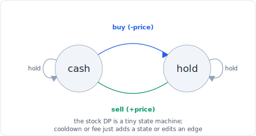

# 30 - 状态机 DP（股票系列）

> 中文版。English: [30-state-machine-dp](../patterns/30-state-machine-dp.md)

> **问题形态：** 「买卖股票的最佳时机，最多 k 笔交易。」「……卖出后带冷冻期。」
> 「……带交易手续费。」凡是你沿一个序列前进、每一步处于少数几个**状态**之一
> （持有、不持有、冷冻中），且状态间转移规则固定的问题。股票系列是典范一族，但
> 粉刷房子和类似问题共享同一形态。

这是[动态规划](21-dp-linear-knapsack.md)，只是状态不只是「位置 i」，而是「位置 i
**并且**我现在处于哪个模式」。一旦你给这些模式和它们之间的合法转移命名，递推就
自动写出来，那六道股票题就成了一个带小改动的模板。面试官喜欢这一族，因为它看着像
六道题，实则是一个思路。



*把股票 DP 看作一个两状态机：买入把现金移到持有，卖出把持有移回现金。*

## 信号

在以下情况时，考虑状态机 DP：

- 每一步你处于一个**小而固定的状态集合**之一，你的选项取决于你在哪个状态。对股票：
  「持有一股」与「持有现金」是两个状态；冷冻期再加第三个。
- 每条**转移上有成本或回报**（买入付出价格，卖出赚取它，也许再减一笔手续费），
  而你想在整个序列上最大化或最小化总额。
- 问题是在一个基础问题上加一条规则（一个冷冻期、一笔手续费、交易次数上限）的
  **变体**。那种「基础加一个花样」的味道，正是「一个状态机覆盖所有变体」的暗示。
- 像「最多 k 次」、「在……之前不能再次买入」、「你可以完成任意多笔交易」这样的
  措辞。

## 思路

把状态画成节点、合法移动画成箭头，然后每个状态保留一个 DP 值，沿序列从左到右更新
它们。对股票问题，核心机器有两个状态：

- **现金（cash）**：你不持有股票。你可以留在现金，或买入（付出 `price`，转到
  持有）。
- **持有（hold）**：你持有一股。你可以留在持有，或卖出（赚取 `price`，转到
  现金）。

对每个价格应用 `cash = max(cash, hold + price)` 和 `hold = max(hold, cash -
price)`，就是整个无限次交易的解。每个变体都是这台机器改一处：

- **一笔交易**（121）：买入从 0 重置，而不是从之前的现金重置。
- **最多 k 笔**（188，123 是 k = 2）：给每个状态按交易次数加索引。
- **冷冻期**（309）：加一个 **sold** 状态，必须先经过一个休息日才能再次买入。
- **手续费**（714）：在卖出转移上减去手续费。

状态数保持很小，所以 DP 是 O(n) 或 O(n * k) 时间，O(1) 或 O(k) 空间。

## 模板

**无限次交易（122），两状态核心：**

```python
# Time: O(n), Space: O(1)
def max_profit_unlimited(prices):
    cash, hold = 0, float('-inf')
    for p in prices:
        cash = max(cash, hold + p)     # sell, or stay in cash
        hold = max(hold, cash - p)     # buy, or stay holding
    return cash
```

**最多 k 笔交易（188，以及 k = 2 的 123）：**

```python
# Time: O(n * k), Space: O(k)
def max_profit_k(k, prices):
    n = len(prices)
    if n == 0 or k == 0:
        return 0
    if k >= n // 2:                    # k is effectively unlimited
        return sum(max(0, prices[i + 1] - prices[i]) for i in range(n - 1))
    cash = [0] * (k + 1)
    hold = [float('-inf')] * (k + 1)
    for p in prices:
        for t in range(1, k + 1):
            hold[t] = max(hold[t], cash[t - 1] - p)   # buying opens transaction t
            cash[t] = max(cash[t], hold[t] + p)       # selling closes it
    return cash[k]
```

**冷冻期（309），三状态机：**

```python
# Time: O(n), Space: O(1)
def max_profit_cooldown(prices):
    hold, sold, rest = float('-inf'), 0, 0
    for p in prices:
        prev_sold = sold
        sold = hold + p                # sell today, enter the sold state
        hold = max(hold, rest - p)     # keep holding, or buy from a rested state
        rest = max(rest, prev_sold)    # rest, or come off the cooldown
    return max(sold, rest)
```

**交易手续费（714）：** 无限次核心，在卖出边上加手续费：

```python
# Time: O(n), Space: O(1)
def max_profit_fee(prices, fee):
    cash, hold = 0, float('-inf')
    for p in prices:
        cash = max(cash, hold + p - fee)
        hold = max(hold, cash - p)
    return cash
```

## 变体

- **整条股票阶梯**：121（一笔交易）、122（无限）、123（两笔）、188（k）、
  309（冷冻期）、714（手续费）。先解 122，然后逐条加规则，看着一行代码在变。
- **粉刷房子 / 粉刷栅栏**（256、265）：状态是「上一栋房子我刷了哪种颜色」，转移
  禁止重复颜色。同一台机器，不同状态。
- **删除并获得点数**（740）：经过一个计数步骤后归约为打家劫舍，而后者本身就是一个
  两状态（取 / 跳过）机器。
- **通用有限状态 DP**：只要你能枚举出一小把模式以及它们之间的合法转移，这个模式就
  适用，不限于股票。

## 经典题

| # | 题目 | 难度 | 训练点 |
|---|---------|-----------|----------------|
| 121 | Best Time to Buy and Sell Stock | 简单 | 一笔交易，追踪至今最小值或一个状态 |
| 122 | Best Time to Buy and Sell Stock II | 中等 | 两状态的无限次核心 |
| 123 | Best Time to Buy and Sell Stock III | 困难 | 最多两笔交易 |
| 188 | Best Time to Buy and Sell Stock IV | 困难 | 最多 k 笔交易，状态按次数索引 |
| 309 | Best Time to Buy and Sell Stock with Cooldown | 中等 | 为冷冻期加的第三个状态 |
| 714 | Best Time to Buy and Sell Stock with Transaction Fee | 中等 | 卖出转移上的手续费 |
| 256 | Paint House | 中等 | 状态是上一次选的颜色 |
| 740 | Delete and Earn | 中等 | 归约为一个取/跳过的状态机 |

## 陷阱

- **把 `hold` 初始化成 0 而不是负无穷。** 在你买入任何东西之前，「持有」是不可能
  的；把它设为 `float('-inf')`，这样一股幽灵般的免费股票就不会漏进答案。
- **覆盖一个本步还需要的状态。** 在冷冻期机器里，在覆盖 `sold` 之前先保存
  `prev_sold`，否则 `rest` 的更新读到错误的值。当状态互相依赖对方的旧值时，更新
  顺序很重要。
- **漏掉 k >= n/2 的捷径。** 当 k 足够大时，上限从不生效，O(n * k) 的表可能爆掉
  （188 的 k 高达 10^9）。当 `k >= n // 2` 时回退到无限次公式。
- **建模太多状态。** 股票机器需要两三个状态，不是每天乘每个价格一个。如果你的状态
  空间巨大，你建错了模；去找那一小把模式。

## 后续追问与相关模式

- 「没有状态，只是一维选择」拉回到纯
  [DP I：线性和背包](21-dp-linear-knapsack.md)；打家劫舍是最简单的取/跳过机器。
- 「转移依赖两个序列」指向
  [DP II：子序列和字符串](22-dp-strings.md)。
- 「一个贪心选法就行」（122 也可以靠把每个正的价格步长加起来来解）指向
  [贪心](25-greedy.md)；当贪心不明显正确时，状态机 DP 是稳妥的通用形式。
- 通用技术（枚举状态、定义转移）与
  [位掩码 DP](23-dp-grids-intervals.md)背后是同一种建模技巧，那里状态是一个子集。
