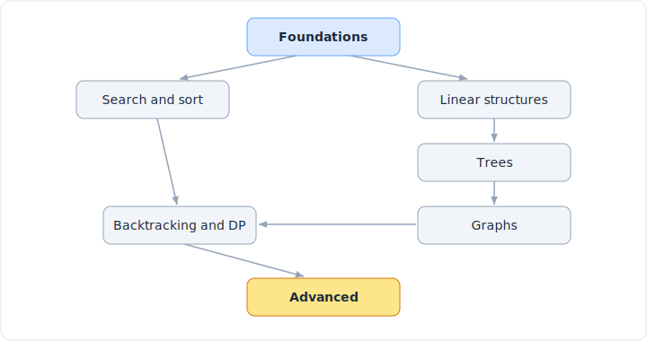

# LeetCode 题型模式(中文版)

> 中文版。English: [README](../README.md)

面向编程面试的、以「模式」为核心的指南。LeetCode 有几千道题,但它们是由为数不多的
可复用模式拼装而成的。一旦你能叫出模式的名字,大多数「新」题都会坍缩成你已经解过的
那一类。刷题量是慢路;学会下面这 ~31 个模式,并反复训练如何从题面认出每一个,才是
快路。

本仓库把这些模式按它们在 [leetcode.com/problemset](https://leetcode.com/problemset/)
(按标签)和 [leetcode.com/explore](https://leetcode.com/explore/)(按学习卡片)上
真实聚集的方式来组织:数组与字符串、二分查找、链表、栈、树、图、回溯、动态规划、堆,
以及到处都会用到的数学与位运算技巧。

每个模式都是一份自成一体的讲解:如何识别、核心思想、干净的代码模板、复杂度、训练它
的经典题、变体,以及会让人丢掉 offer 的常见坑。

*这 31 个模式每一个都配有这样一张图,外加一份标注了时间与空间复杂度、可背诵的代码模板。*

---

## 如何使用本仓库

1. **先读[解题框架](framework/solving-framework.md)。** 它是每道题都挂靠的主干:厘清、
   举例、暴力解、找瓶颈、优化、写码、测试。面试官对你思考过程的评分,不亚于对最终代码
   的评分。
2. **先学会识别,再去记忆。** [识别速查表](cheatsheet.md)是一张查询表:题面里的一个短
   语或约束,映射到它通常指向的模式。把这张表内化,前两分钟就赢了一半。
3. **按家族顺序过一遍模式。** 它们层层递进:双指针和哈希打底,引出滑动窗口;树的遍历
   引出图的遍历;图与递归引出回溯和 DP。
4. **想要一份排好的计划?** [学习计划](study-plan.md)是一份八周、按前置顺序排列的日程,
   由本仓库里的经典题组成。
5. **卡住时,反查。** [题目反查表](problems.md)把著名题目和题型原型映射到能破它的模式。

> 代码模板用 Python 3(LeetCode 上最常见的面试语言)。它们是给你练几遍后默写的,不是
> 拿来复制粘贴的。重点是形态,不是语法。

---

## 模式家族如何衔接

各家族层层递进。这是建议的学习依赖顺序,箭头表示「前者是后者的前置」。

*打好基础解锁一切。树推广成图。回溯和 DP 是同一个决策树思想,只是一个剪枝、一个记忆化。
进阶结构放最后,因为它们默认你已经掌握了其余部分。*

完整的 31 个模式索引见 [模式索引](patterns/README.md)。

---

## 参考资料

模式是核心。下面这些是配套的参考页,和模式一起看:

- **[数据结构](data-structures/README.md)** - 模式底下那一层:堆、字典树、并查集到底是
  什么,每个操作的代价,以及何时该用哪个。含「何时用哪种结构」的表。
- **[复杂度速查](complexity.md)** - Python 的 list、deque、set、dict、Counter、heapq、
  str 各操作的代价,必须烂熟;外加递归栈空间的坑。
- **[术语表](glossary.md)** - 决定你该用哪个模式的那些区分:子数组 vs 子串 vs 子序列、
  摊还、稳定排序、最优子结构,以及图与树的词汇。
- **[题单](resources.md)** - Grind 75、Blind 75、NeetCode 150,以及 LeetCode 官方的
  LeetCode 75 与 Top Interview 150,都映射回本仓库的模式。
- **[边界清单](edge-cases.md)** - 面试官专门埋雷的空、单元素、重复、负数、溢出等情况,
  写码前后各过一遍。
- **[worked example 演示](walkthroughs/README.md)** - 用六步框架把经典题从头解到尾,
  看模式是怎样被选中并套用的。
- **[DP 子模式地图](patterns/dp-patterns.md)** - 动态规划反复出现的十一种形态,各带其
  状态与转移。

---

## 覆盖八成的那两成

时间有限的话,下面这十个模式能覆盖大多数面试题,优先练:

双指针、滑动窗口、二分查找、哈希、树与图的遍历(BFS/DFS)、回溯、动态规划(线性 + 字
符串)、堆、单调栈、并查集。

---

## 关于本中文版

- 本目录镜像英文版的结构,代码块、图片、题号与英文版共用并保持一致。
- 讲解正文、标题、表格描述、图注为简体中文;每个文件顶部都有指回英文原版的链接。
- 参考页的少量外部链接(题单、官方 study plan)保留原始 URL。
