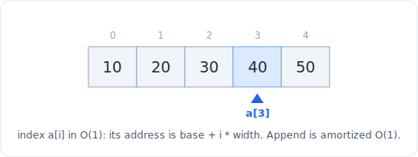

# 01 - 数组与动态数组

> 中文版。English: [01-array](../../data-structures/01-array.md)

数组是一块连续内存，存放着同样大小的元素，这正是 `a[i]` 之所以是 O(1) 的原因：元素 `i` 的地址就是 `base + i * width`，一次乘法加一次加法，无需遍历。Python 的 `list` 是动态数组，一种在填满时自我增长的数组。你在面试里做的几乎所有事情都建立在它之上，所以精确掌握它哪些操作是 O(1)、哪些会悄悄搬移整个数组，正是一个 O(n) 解法和一个 O(n^2) 解法之间的差别。



*连续的单元格：a[i] 是一次直接的地址计算，所以下标访问是 O(1)，append 是摊还 O(1)。*

## 它是什么

静态数组是一段固定大小、连续的内存。你预先选定长度，每个槽位都有已知地址，所以下标访问是一次指针计算，而非搜索。这种速度的代价是僵硬：你无法让它增长，而在中间插入意味着要把空隙之后的所有元素都搬移一遍。

动态数组（Python 的 `list`、C++ 的 `vector`、Java 的 `ArrayList`）包裹了一个静态数组并隐藏了扩容过程。它保有一个带若干空余容量的后备缓冲区和一个长度。追加时填入空余槽位；当缓冲区填满，它就分配一个更大的（CPython 大约按 1.125 倍增长，其他语言常按 2 倍），把旧元素拷贝过去，再继续。连续布局得以保留，所以下标访问仍是 O(1)，并在此之上得到摊还 O(1) 的追加。Python 的 `list` 存放的是指向对象的指针而非内联的对象本身，所以它可以是异构的，但那个指针数组本身仍然是连续的。

要牢记的不变量：元素背靠背地相邻排列、没有空隙，而这既是 O(1) 下标访问的来源，也是 O(n) 头部插入的来源。

## 操作与复杂度

| 操作 | 复杂度 | 说明 |
|---|---|---|
| `a[i]`、`a[i] = x` | O(1) | 地址为 `base + i * width`，直接算出 |
| `a.append(x)`、`a.pop()` | 摊还 O(1) | 偶尔会重新分配并拷贝 |
| `a.pop(0)`、`a.insert(0, x)` | O(n) | 每个元素都要移动一个槽位。改用 deque |
| `a.insert(i, x)`、`del a[i]` | O(n) | 搬移 `i` 之后的尾部 |
| `x in a` | O(n) | 线性扫描。成员判断请用 set |
| `a[i:j]`（切片） | O(k) | k = j - i，拷贝被切出的元素 |
| `len(a)` | O(1) | 存在对象上，而非现数 |
| `min(a)`、`max(a)`、`sum(a)` | O(n) | 完整扫描 |
| `a.sort()`、`sorted(a)` | O(n log n) | Timsort，稳定 |
| `a.reverse()`、`a[::-1]` | O(n) | 切片形式还会拷贝 |
| `a + b` | O(n + m) | 构建一个新 list |

为什么 `append` 是摊还 O(1)：大多数追加落在空余槽位里，开销为 O(1)。偶尔触发扩容的那次追加要花 O(n) 来拷贝，但由于缓冲区按常数倍增长，这些昂贵的拷贝发生得越来越稀疏（呈几何级数变少）。把总拷贝工作量摊到所有追加上，平均每次只付出一个常数。这就是摊还分析，而不是保证每一次追加都便宜。

为什么头部插入和 `pop(0)` 是 O(n)：连续性意味着下标 `k` 必须物理地位于位置 `k`。在头部删除或添加，剩下的每个元素都得滑动一个槽位来保持布局完整。没有捷径。这是最常见的意外 O(n^2)：一个建立在 `list.pop(0)` 上的 BFS 或队列。

想在其他结构旁边看到同一张表，参见[复杂度速查表](../complexity.md)。

## Python 实现

地道的 list 用法，你真正会用到的那些操作：

```python
a = [3, 1, 4, 1, 5]

a.append(9)          # O(1) amortized, add to the end
last = a.pop()       # O(1), remove and return the end
a[2] = 42            # O(1), index assignment

# Build with a comprehension instead of append in a loop when you can
squares = [x * x for x in range(10)]      # O(n)

# Slicing copies; a[:] is the standard shallow copy
head = a[:3]         # O(3)
copy = a[:]          # O(n), independent list

# Membership on a list is O(n); if you test it repeatedly, build a set once
seen = set(a)        # O(n) to build
found = 42 in seen   # O(1) average, not O(n)
```

二维数组与网格。把网格表示为由行 list 组成的 list。人人都栽过的那个陷阱：要独立地构建每一行，绝不要靠乘一个共享的内层 list，否则每一行都会别名同一个对象。

```python
rows, cols = 3, 4

grid = [[0] * cols for _ in range(rows)]     # correct: rows independent
grid[0][1] = 7                                # only row 0 changes

# WRONG: all rows are the SAME list object
bad = [[0] * cols] * rows
bad[0][1] = 7                                 # every row now shows 7

# Iterate with coordinates
for r in range(rows):
    for c in range(cols):
        cell = grid[r][c]                     # O(1) each, O(rows*cols) total
```

固定大小的环形缓冲区是经典的「静态数组表现得像队列」的封装，当你想要两端都 O(1)、又不想用 deque 且已知容量时很有用：

```python
class RingBuffer:
    def __init__(self, capacity):
        self.buf = [None] * capacity          # static backing array
        self.cap = capacity
        self.head = 0                          # next read
        self.size = 0

    def push(self, x):                         # O(1), overwrites oldest if full
        tail = (self.head + self.size) % self.cap
        self.buf[tail] = x
        if self.size < self.cap:
            self.size += 1
        else:
            self.head = (self.head + 1) % self.cap

    def pop(self):                             # O(1)
        if self.size == 0:
            raise IndexError("empty")
        x = self.buf[self.head]
        self.head = (self.head + 1) % self.cap
        self.size -= 1
        return x
```

## 何时用（何时不用）

在以下情况使用数组或 list：

- 你需要按下标访问，或按顺序遍历。没有什么能胜过 O(1) 下标和连续内存的缓存友好性。
- 你在追加和读取，这是压倒性常见的访问模式。追加和尾部弹出都是摊还 O(1)。
- 你需要一个网格、一个矩阵、一张 DP 表，或任何形状固定的二维结构。
- 问题本质上是顺序性的：前缀和、滑动窗口、双指针、原地划分。

在以下情况改选别的结构：

- 你反复做成员判断。`x in list` 是 O(n)；用[哈希集合](02-hash-map-set.md)获得 O(1) 平均。
- 你在头部、或在两端添加或删除。`pop(0)` 是 O(n)；用[双端队列](03-stack-queue.md)。
- 你在已握有某位置引用的情况下频繁在中间插入或删除。那是[链表](04-linked-list.md)，一旦握有节点，拼接就是 O(1)。
- 你反复需要最小或最大值。那是[堆](05-heap.md)。

## 权衡与陷阱

- **头部很昂贵。** `insert(0, x)` 和 `pop(0)` 都是 O(n)。如果你的循环里有其中之一，你就悄悄写出了 O(n^2)。建立在 list 上的队列是这类 bug 的典型形态。
- **切片会拷贝。** `a[i:j]` 是 O(k)，不是视图。在循环里每次切出一段前缀是隐藏的 O(n^2)。在热点路径上传下标，别传切片。
- **`x in a` 是线性扫描。** 它看着像 O(1)，实则是 O(n)。反复的成员判断该放进 set 里。
- **别名化的二维网格。** `[[0] * c] * r` 制造出对同一行的 `r` 个引用。外层维度始终要用推导式。
- **用 `+=` 拼字符串不是数组问题，但是同一个陷阱。** 字符串不可变，所以循环里的 `s += c` 是 O(n^2)；收集到一个 list 再 `''.join()`。参见[速查表](../complexity.md)的字符串一节。
- **`list.remove(x)` 和 `del a[i]` 是 O(n)。** 它们要查找或搬移。一次删一个地删除许多元素是 O(n^2)；改为一趟过滤进一个新 list。
- **摊还不是最坏情况。** 单次追加在扩容时可能飙到 O(n)。这很少要紧，但当你说「摊还 O(1)」时就要说到点上，尤其当面试官问的是延迟而非吞吐时。

## 相关模式

数组是大多数序列模式的基底：

- [双指针](../patterns/01-two-pointers.md)让下标向内行进，或成对地读写移动，全是 O(1) 的下标移动。
- [滑动窗口](../patterns/02-sliding-window.md)通过在数组上推进两个下标来维护一个连续子数组。
- [前缀和](../patterns/03-prefix-sum.md)预计算出一个 O(n) 的辅助数组，从而让任意区间求和成为 O(1)。
- [哈希](../patterns/04-hashing.md)是当数组成员判断（O(n)）成为瓶颈时你会切换过去的东西。
- 网格问题直接接入[图遍历](../patterns/16-graph-traversal.md)，其中每个单元格是一个节点，它的四个邻居是边。
- 想查原始的操作开销，把[复杂度速查表](../complexity.md)开着。
