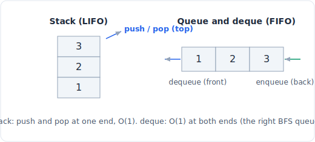

# 03 - 栈、队列与双端队列

> 中文版。English: [03-stack-queue](../../data-structures/03-stack-queue.md)

栈和队列是同一个思路（放入元素、取出元素），只是取出规则相反：栈交还最近放入的元素（后进先出），队列交还最早放入的元素（先进先出）。真正关键的机制在于哪一端是廉价的。Python 的 `list` 在尾部提供 O(1) 操作，这让它成为完美的栈，却是糟糕的队列，因为从头部出队是 O(n)。`collections.deque` 通过在两端都提供 O(1) 修正了这个问题。把这一点做对，决定了你的 BFS 是 O(n) 还是 O(n^2)。



*栈在一端压入和弹出；双端队列在两端都是 O(1)，这正是它作为 BFS 队列的原因。*

## 是什么

栈是一个 LIFO 容器：你把元素压到顶部，也从顶部弹出，两个操作都触碰同一端。想想一摞盘子、调用栈，或者撤销历史。因为每个操作都发生在同一端，动态数组的尾部天然契合，压入和弹出都是摊还 O(1)。

队列是一个 FIFO 容器：你在后端入队、从前端出队，因此两个操作触碰的是相反的两端。广度优先搜索的边界、任务调度器、打印队列，都是队列。麻烦在于对数组做"从前端移除"是 O(n)，所以纯 list 是错误的底层存储。

双端队列（double-ended queue，读作 "deck"）把两者一般化了：在前端和后端都能 O(1) 插入和移除。它可以充当栈、队列，或者一个你从任意一端压入和弹出的滑动缓冲区。CPython 把它实现为一个由固定大小块组成的双向链表，这就是为什么两端都是 O(1)，而对中间的随机访问是 O(n)（它必须走过去）。

决定一切的不变量：你只在结构本身设计得廉价的那一端才付出 O(1)。list 只在尾部廉价；双端队列在两端都廉价，但在中间不廉价。

## 操作与复杂度

| 操作 | 复杂度 | 说明 |
|---|---|---|
| 栈 `push` = `list.append(x)` | O(1) 摊还 | 在尾部添加 |
| 栈 `pop` = `list.pop()` | O(1) 摊还 | 从尾部移除 |
| 栈 `peek` = `a[-1]` | O(1) | 索引尾部，不要为了查看而弹出 |
| 在 list 上做队列：`list.pop(0)` | O(n) | 每个元素都要移位。这就是陷阱 |
| 在 list 上做队列：`list.insert(0, x)` | O(n) | 同样的移位，用错了工具 |
| `deque.append(x)`、`deque.appendleft(x)` | O(1) | 两端都廉价 |
| `deque.pop()`、`deque.popleft()` | O(1) | 为什么双端队列做队列胜过 list |
| `deque[i]`（随机访问） | O(n) | 它不是数组；索引中间要走过去 |
| `x in deque` | O(n) | 线性扫描 |
| `deque.rotate(k)` | O(k) | |

为什么 list 作为栈是 O(1)：压入和弹出都作用于尾部，正是动态数组摊还 O(1) 的那一端（偶尔的扩容除外，与 [数组 append](01-array.md) 是同样的论证）。为什么 list 作为队列是 O(n)：出队意味着移除索引 0，而连续数组必须把剩下的每个元素向下滑一格以保持布局完整。做 n 次，你的队列就是 O(n^2)。为什么双端队列两端都是 O(1)：它在块层面是一个链式结构，所以添加或移除一个端块从不移动任何东西；代价是要到达中间的元素 `i` 就得走过去。

这些数字与 [复杂度速查表](../complexity.md) 一致。

## Python 实现

栈：直接用 list。不需要包装类，`append` 和 `pop` 就是全部 API。

```python
stack = []
stack.append(1)          # push, O(1) amortized
stack.append(2)
top = stack[-1]          # peek, O(1), does not remove
x = stack.pop()          # pop -> 2, O(1) amortized
empty = not stack        # truthiness is the idiomatic emptiness check
```

队列：用 `collections.deque`，绝不要用 list。用 `append` 入队，用 `popleft` 出队，两者都是 O(1)。

```python
from collections import deque

q = deque()
q.append(1)              # enqueue at the back, O(1)
q.append(2)
first = q.popleft()      # dequeue from the front -> 1, O(1)

# The canonical BFS: deque frontier, O(1) per node
def bfs(graph, start):
    seen = {start}
    q = deque([start])
    while q:
        node = q.popleft()          # O(1); list.pop(0) here would be O(n)
        for nxt in graph[node]:
            if nxt not in seen:
                seen.add(nxt)
                q.append(nxt)
```

单调栈（及其双端队列变体），简述。单调栈通过在压入新元素之前弹出任何破坏顺序的元素，来保持其内容有序（递增或递减）。每个元素至多被压入和弹出一次，所以尽管有内层 while 循环，整趟扫描仍是 O(n)。它回答"下一个更大元素"和"最大矩形"这类问题。双端队列版本（单调双端队列）对滑动窗口最大值做同样的事，从后端弹出以保持顺序，从前端弹出以丢弃滑出窗口的元素。

```python
def next_greater(nums):
    # For each element, the next element to its right that is larger, else -1
    res = [-1] * len(nums)
    stack = []                        # holds indices, values decreasing
    for i, x in enumerate(nums):
        while stack and nums[stack[-1]] < x:
            res[stack.pop()] = x      # x is the next greater for that index
        stack.append(i)
    return res
```

用两个栈实现队列，经典的设计题。把反转摊还掉：压入一个收件栈（inbox），当你需要出队时，把收件栈一次性倒进发件栈（outbox）（这会反转顺序），然后从发件栈弹出。每个元素至多倒一次，所以尽管单次出队可能是 O(n)，两个操作都是摊还 O(1)。

```python
class MyQueue:
    def __init__(self):
        self.inbox = []               # newest on top
        self.outbox = []              # oldest on top

    def push(self, x):                # enqueue, O(1)
        self.inbox.append(x)

    def _shift(self):
        if not self.outbox:           # only refill when outbox is empty
            while self.inbox:
                self.outbox.append(self.inbox.pop())   # reverse once

    def pop(self):                    # dequeue, amortized O(1)
        self._shift()
        return self.outbox.pop()

    def peek(self):                   # amortized O(1)
        self._shift()
        return self.outbox[-1]

    def empty(self):
        return not self.inbox and not self.outbox
```

## 何时用（何时不用）

在以下情况用栈：

- 你按最近优先处理：括号匹配、撤销、表达式求值、回溯、迭代式 DFS。
- 你需要"最后一个未解决的东西"，这正是单调栈为下一个更大元素和直方图问题所追踪的。

在以下情况用队列或双端队列：

- 你按到达顺序处理：BFS、树的层序遍历、调度，以及任何必须最近优先扩展的边界。
- 你在两端添加或移除：滑动窗口最大值（单调双端队列），一个你可以把紧急项压到前端的工作列表。

在以下情况改用别的结构：

- 你需要按索引做 O(1) 随机访问。双端队列索引中间是 O(n)；请用 [list/数组](01-array.md)。
- 你需要优先级顺序，而不是到达顺序（"下一个处理代价最小的"）。那是 [堆](05-heap.md)，不是队列。
- 你需要对内容做成员判断。`x in deque` 是 O(n)；另外维护一个并行的 [集合](02-hash-map-set.md)。

## 权衡与陷阱

- **最大的一个错误：在 list 上做队列。** `list.pop(0)` 是 O(n)，把任何 BFS 变成 O(n^2)。队列永远用 `collections.deque`。如果这个文件你只记住一件事，就是这件。
- **双端队列的随机访问是 O(n)。** 它不是数组。如果你发现自己在循环里对任意 `i` 做 `dq[i]`，那你选错了结构。
- **查看但不弹出。** 对栈用 `a[-1]`；对双端队列前端用 `dq[0]`。不要为了查看而弹出再压回去，那是顺序错误的来源。
- **空检查。** 对空的 list 或 deque 弹出会抛出 `IndexError`。用 `while stack:` 或 `if q:` 守卫；容器的真值判断就是惯用的测试方式。
- **单调栈通常存索引，而不是值。** 你几乎总是想要位置（用于计算宽度或填充结果槽位），所以压入 `i` 并读 `nums[i]`，而不是直接压入 `nums[i]`。
- **`deque(maxlen=k)` 会静默丢弃。** 一个有界双端队列在溢出时从相反端逐出元素。用于固定窗口很方便，但若非本意则会让人意外。
- **两栈队列：仅当发件栈为空时才补充。** 每次出队都倒会破坏摊还并打乱元素顺序。要惰性补充。

## 相关模式

栈和队列是遍历与表达式模式的骨干：

- [栈](../patterns/11-stacks.md) 深入讲解单调栈、括号匹配和表达式求值。
- [图遍历](../patterns/16-graph-traversal.md) 就是 BFS（双端队列边界）和 DFS（显式栈或调用栈）。
- [树的 BFS](../patterns/13-tree-bfs.md) 是层序遍历，一个双端队列一次处理一层。
- [滑动窗口](../patterns/02-sliding-window.md) 在窗口最大值和窗口最小值变体中使用单调双端队列。
- [设计](../patterns/28-design.md) 类问题会要求你用栈构建队列、构建一个 O(1) 取最小值的栈，或在双端队列上构建一个命中计数器。
- 对于驱动这里每个选择的 O(1) 与 O(n) 端代价，把 [复杂度速查表](../complexity.md) 开着。
