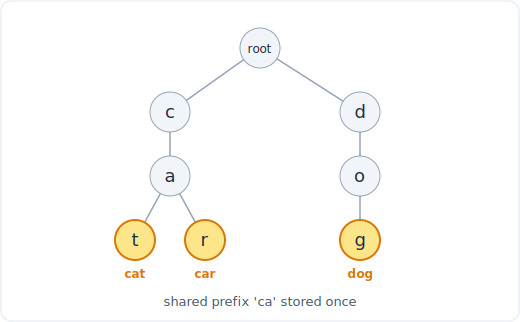

# 07 - 字典树（前缀树）

> 中文版。English: [07-trie](../../data-structures/07-trie.md)

字典树是一棵由字符组成的树。从根出发的每条路径都拼出一个前缀，而一个完整的单词不过是一条以被标记为终止节点结尾的路径。"共享公共前缀而不是整个整个地存储每个单词"这一个想法，就是把前缀类问题从 O(单词数量) 变成 O(查询长度) 的关键。如果你曾经想要自动补全、词典匹配，或者"是否有任何单词以此开头"，字典树就是让这件事变便宜的结构。



*字典树把共享前缀只存一次，因此无论词典多大，前缀查询都是 O(长度)。*

## 它是什么

字典树把一组字符串存成一棵有根树。每个节点持有一个从单个字符到子节点的映射，外加一个 `is_end` 布尔值，标记从根到该节点的路径是否拼出一个被插入过的完整单词。根本身拼出空字符串。

插入 `"cat"` 和 `"car"` 会创建一条共享的 `c -> a` 主干，然后路径分叉：一个子节点 `t`（`is_end = True`），一个子节点 `r`（`is_end = True`）。共享前缀 `ca` 恰好只存一次。这种共享就是全部要点：树的形状就是这组前缀，而任何前缀查询都是从根往下走的一趟。

不变量：一个节点恰好由一个字符序列（即它从根出发的路径）可达，而该节点上的 `is_end` 表示这个序列曾作为单词被插入。一个节点可以同时是更长单词的内部节点和一个单词的终止节点（插入 `"car"` 和 `"cars"`：`r` 节点既是 `is_end`，又有一个子节点 `s`）。

## 操作与复杂度

L 是单词或前缀的长度。A 是字母表大小（小写字母为 26）。N 是字典树中的单词数，而这些操作没有一个依赖于 N，这正是这个结构存在的全部理由。

| 操作 | 复杂度 | 说明 |
|---|---|---|
| `insert(word)` | O(L) | 走过 L 个节点，创建缺失的子节点 |
| `search(word)` | O(L) | 走过 L 个节点，然后检查 `is_end` |
| `startsWith(prefix)` | O(L) | 走过 L 个节点，存在与否即答案 |
| 通配符查找（`.` 匹配任意字符） | 最坏 O(A^k · L) | k 个通配符各分叉 A 路；用 DFS |
| 空间 | O(总字符数 · A) | 每个字符一个节点，各带一个子节点映射 |
| 收集某前缀下的所有单词 | O(子树大小) | 从前缀节点开始 DFS |

要点：无论字典树里有多少单词，`search` 和 `startsWith` 都是 O(L)。哈希集合回答整词 `search` 也是 O(L)，但它无法在不扫描每个键的情况下回答 `startsWith`，那是 O(N · L)。哈希集合的数字见[复杂度速查表](../complexity.md)。

## Python 实现

惯用的形式是一个小小的 `TrieNode` 加一个 `Trie` 包装器。用 `dict` 存子节点让它与字母表无关，并且只为存在的分支分配内存。

```python
class TrieNode:
    def __init__(self):
        self.children = {}      # char -> TrieNode
        self.is_end = False     # True if a word ends here


class Trie:
    def __init__(self):
        self.root = TrieNode()

    def insert(self, word):
        node = self.root
        for ch in word:
            if ch not in node.children:
                node.children[ch] = TrieNode()
            node = node.children[ch]
        node.is_end = True

    def search(self, word):
        node = self._walk(word)
        return node is not None and node.is_end

    def startsWith(self, prefix):
        return self._walk(prefix) is not None

    def _walk(self, s):
        node = self.root
        for ch in s:
            if ch not in node.children:
                return None
            node = node.children[ch]
        return node
```

通配符查找，其中 `.` 匹配任意单个字符，需要 DFS，因为 `.` 迫使你尝试每一个子节点。这就是"添加与搜索单词"这个数据结构：

```python
def search_wildcard(self, word):
    def dfs(node, i):
        if i == len(word):
            return node.is_end
        ch = word[i]
        if ch == '.':
            return any(dfs(child, i + 1) for child in node.children.values())
        if ch not in node.children:
            return False
        return dfs(node.children[ch], i + 1)

    return dfs(self.root, 0)
```

一个具体的字母仍然以 O(1) 收窄到单个子节点，所以只有 `.` 所在的位置才分叉。有 k 个通配符时，最坏情况下代价是 O(A^k)，这就是为什么"匹配任意"查询是这个原本线性的结构里最昂贵的角落。

## 何时使用（以及何时不用）

在以下情况选用字典树：

- 你需要**前缀查询**：自动补全、"统计带某前缀的单词数"、"这组词的最长公共前缀"、边打边搜。
- 你要**用许多单词去匹配一段文本**并想共享它们的公共前缀（单词搜索棋盘、把单词替换成词根、Aho-Corasick 家族）。
- 你需要**按前缀有序遍历**，例如按有序顺序列出 `"ca"` 下的所有单词，这自然从按键顺序遍历每个节点的子节点中得到。

在以下情况跳过它：

- 你只做**整词成员判定**。`set` 对此也是 O(L)，开销小得多，也没有逐节点的内存分配。只有当前缀重要时字典树才对得起它的代价。
- 字母表**庞大而集合很小**。逐节点的子节点映射开销会累积，而哈希集合更精简。
- 键**不是字符串**，或者没有有意义的共享前缀（比如任意整数）。没有东西可共享，这棵树对你毫无益处。

## 权衡与陷阱

- **空间是速度的代价。**字典树可能比原始字符串占用更多内存，因为你为每个字符付出一个节点（和一个子节点映射）。共享前缀能挽回一些，但一组互不相关的单词做成字典树是很吃内存的。
- **`is_end` 不等于"是叶子"。**一个单词可以在内部节点结束（`"car"` 在 `"cars"` 之内）。检查那个标志，永远不要用"没有子节点"，否则你会漏掉那些同时也是单词的前缀。
- **删除很琐碎。**你不能只是清掉 `is_end` 就不管了：要回收空间，你必须移除那些不再位于任何单词路径上的节点，一路往回走，在第一个仍是 `is_end` 或仍有其他子节点的节点处停下。大多数面试解法从不删除；如果你的必须删，要小心。
- **通配符会爆炸。**单个开头的 `.` 会扇出到每一个子节点。许多通配符会让 DFS 在通配符数量上呈指数级，所以不要把通配符查找当成 O(L)。
- **子节点用 dict 还是定长数组。**当字母表固定为小写时，一个 26 槽的列表作为子节点数组更快也更简单，代价是每个节点总要分配 26 个槽。dict 只分配用到的分支。按具体问题来选。

## 相关模式

- [字典树](../patterns/15-trie.md)是驱动这个结构的模式：自动补全、单词词典和前缀计数。
- [图遍历](../patterns/16-graph-traversal.md)与通配符查找、以及收集某前缀下每个单词所用的 DFS 机制相同。
- 关于底层操作的代价，以及字典树的 O(L) 与哈希集合的对比，把[复杂度速查表](../complexity.md)开着。
