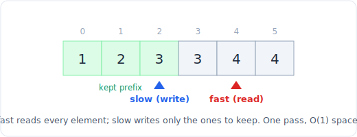

# 01 - 双指针
> 中文版。English: [01-two-pointers](../../patterns/01-two-pointers.md)

> **问题形态：** 「给定一个有序数组，找出两个相加等于目标值的数字。」或者：「反转元音字母」、「原地删除重复元素」、「判断是否为回文」、「盛最多水的容器」。两个下标在数组中行走，或相向而遇，或彼此追逐，把一次 O(n^2) 的成对搜索变成 O(n)。

双指针模式用一次遍历替代嵌套循环，靠的是维护两个按规则移动的下标。它是处理数组和字符串时首先该想到的模式，也是滑动窗口和快慢指针赖以构建的基础。


*双指针从有序数组的两端出发，向中间朝目标值靠拢。*

## 信号特征

看到以下情形时，考虑使用双指针：

- **一个有序数组（或一个允许你排序的数组）**，而你需要找一对、一个三元组，或做一次划分。排序让「该移动哪个指针」变得可判定。
- **从两端向中间比较或处理**：回文、原地反转、「两条线之间盛最多水」、「接雨水」。
- **原地数组改造**：删除重复元素、移动零、按谓词划分，都在 O(1) 额外空间内完成。这里一个指针负责读、一个指针负责写（即快慢或读写变体）。
- **暴力解法是「尝试每一对」**，而数组具有某种结构（有序性，或单调关系），能告诉你该推进哪个指针。

判断依据是：在检查完两端之后，你总能排除掉其中一端，因此永远不需要再回头看它。

## 核心思想

双指针之所以有效，是因为每一次移动都是一次**可证明安全的排除**。在有序的 two-sum 中，`left` 指向最小值，`right` 指向最大值：

- 如果 `a[left] + a[right] < target`，那么任何使用 `left` 的组合都不可能达到目标值（它的搭档已是最大值却仍然不够），于是推进 `left`，永不回头。
- 如果和太大，情况对称：可以舍弃 `right`，于是让它递减。
- 每个元素从每一侧最多被访问一次，因此整趟扫描是 O(n) 时间、O(1) 空间。

两端相向的变体向中间收敛。读写变体则让两个指针都从左往右走，`slow` 标记下一个要保留的元素应放的位置，`fast` 在前方扫描。

## 模板

**两端相向（收敛）：**

```python
# Time: O(n), Space: O(1)
def two_sum_sorted(a, target):
    left, right = 0, len(a) - 1
    while left < right:
        s = a[left] + a[right]
        if s == target:
            return [left, right]
        if s < target:
            left += 1          # need a bigger sum
        else:
            right -= 1         # need a smaller sum
    return [-1, -1]
```



*读写变体：两个指针都从左往右移动。fast 读取每一个元素，slow 只写入需要保留的那些。*

**读写（同方向快慢），从有序数组中删除重复元素：**

```python
# Time: O(n), Space: O(1)
def remove_duplicates(a):
    if not a:
        return 0
    slow = 0                   # last index of the unique prefix
    for fast in range(1, len(a)):
        if a[fast] != a[slow]:
            slow += 1
            a[slow] = a[fast]
    return slow + 1            # length of the deduped prefix
```

思维模型是：`slow` 是「已完成」区域的边界，`fast` 负责探索。只有当 `fast` 找到值得保留的东西时，你才推进 `slow`。

## 变体

- **三数（或 k 数）之和。** 用一层循环固定外层元素，然后对其余部分跑双指针扫描。先排序。在每一层跳过重复值以避免重复的三元组。3Sum 是 O(n^2)。
- **划分（荷兰国旗）。** 三个指针（`low`、`mid`、`high`）一趟就能把由 0、1、2 组成的数组排好。这是「颜色分类」的模板。
- **合并两个有序数组 / 链表。** 每个数组一个指针，每步取较小的那个。这是归并排序以及合并 k 个链表的骨架。
- **接雨水 / 盛最多水的容器。** 两端相向，移动位于较矮那堵墙处的指针，因为正是它限制了水量，留在原地不可能改善。
- **原地字符串清理。** 反转字符串、反转元音、忽略非字母数字字符判断回文：都是两端相向，跳过该跳的，然后交换或比较。

## 经典题目

| # | 题目 | 难度 | 训练点 |
|---|---------|-----------|----------------|
| 167 | Two Sum II - Input Array Is Sorted | 中等 | 基础的相向收敛模板 |
| 125 | Valid Palindrome | 简单 | 两端相向，跳过字符 |
| 283 | Move Zeroes | 简单 | 读写式原地划分 |
| 26 | Remove Duplicates from Sorted Array | 简单 | 快慢指针去重 |
| 344 | Reverse String | 简单 | 两端交换 |
| 11 | Container With Most Water | 中等 | 移动较矮的墙；贪心排除 |
| 15 | 3Sum | 中等 | 固定一个，其余跑双指针，跳过重复 |
| 16 | 3Sum Closest | 中等 | 收敛过程中记录最优解 |
| 75 | Sort Colors | 中等 | 荷兰国旗，三指针 |
| 42 | Trapping Rain Water | 困难 | 两端由较矮一侧限界 |
| 680 | Valid Palindrome II | 简单 | 在单次允许的删除处分支 |

## 陷阱

- **忘记排序**，而成对查找的逻辑依赖顺序。如果题目需要原始下标，就对 (value, index) 的对列表排序，而不是只对值排序。
- **循环边界的差一错误。** 相向收敛用 `while left < right`（绝不能让它们交叉，否则会重复计数）；只有当必须检查中间的单个元素时才用 `left <= right`。
- **kSum 中的重复结果。** 找到一个合法元组后，要在两侧都跳过所有相等的值，否则你会多次输出同一个三元组。
- **在容器/接水问题中移动了错误的指针。** 永远移动位于较矮那堵墙处的那个；移动较高的一侧绝不可能增大面积。
- **在比较下标的同时进行修改。** 在读写变体中，从 `a[fast]` 读，往 `a[slow]` 写，并确保 `slow` 永不超过 `fast`。

## 延伸与相关模式

- 「如果数组无序，而且你不能排序呢？」会把你推向 [哈希](04-hashing.md)（无序的 two-sum 是一道哈希表题，O(n) 时间、O(n) 空间）。
- 「如果这是一个流，无法向后索引呢？」会推向 [滑动窗口](02-sliding-window.md) 或 [堆](24-heap.md)。
- 「在链表上做」会推向 [快慢指针](10-linked-list.md)，在链表上你无法索引，必须用两种速度行走。
- 相向收敛的思想可推广到 [二分查找](07-binary-search.md)：两者每一步都排除掉剩余候选的一半。
