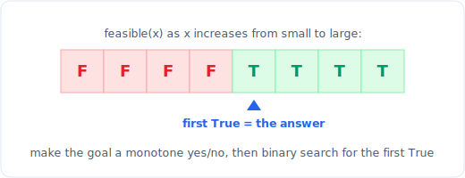

# 07 - 二分查找

> 中文版。English: [07-binary-search](../../patterns/07-binary-search.md)

> **问题形态：** 「给定一个有序数组，找到一个目标值（或它应该被插入的位置）。」
> 或者更隐蔽的版本：「仍能按时完成的最小船只载重 / 吃香蕉速度 /
> 数组分割代价是多少？」任何搜索空间是有序的，或者当你把某个数字往上调时，
> 一个是/否的可行性判断恰好从「否」翻转到「是」一次的场景，都能从 O(n)
> 坍缩到 O(log n)。

二分查找每一步都把候选区间对半砍掉，方法是提出一个问题，其答案能排除掉整整一半。
在有序数组上，这个问题就是「目标值在中点的左边还是右边」。更深层、更有价值的形式是
对答案做二分：你根本不是在给数组做索引，而是把一个数值答案空间与一个单调的可行性谓词
做对比来探测。两者是同一个机制，而下面基于循环不变式的框架，正是让你不会撞上差一错误
暗礁的关键。

## 信号

当你看到以下情况时，考虑二分查找：

- **一个有序数组（或旋转有序数组）**，而你需要找一个目标值、一个插入位置，
  或某个值的首次/末次出现。
- **在数值区间上的一个单调谓词。** 题目说「使其成立的最小 X」或
  「仍能容纳的最大 X」，且如果某个 X 成立，那么每个更大的 X 也成立（或反之）。
  那个单向翻转就是全部的信号。
- **暴力解法是「从 lo 到 hi 逐个尝试每个候选值」**，而每次尝试的可行性检查都很廉价。
  你在扫描一条本可以对半分割的直线。
- **答案边界很大但可检验。** 「速度可以是 1 到 10^9」在尖叫区间的对数级：
  你无法枚举十亿个速度，但你可以用 O(n) 测试其中一个。

答案变体的判断标志：把目标重新表述为返回布尔值的 `feasible(x)`，
然后检查 `feasible` 是否在 `x` 上单调。如果是，你就对 `x` 做二分，而不是对输入做。

## 思路

二分查找在一个半开或闭区间上维护一个不变式，并不断收缩它，
直到只剩一个候选。每次比较都是一次**可证明安全的排除**：
看过中点之后，你丢掉不可能包含答案的那一半，所以 `log2(n)` 步就够了。


*每一步都与 mid 比较，并丢弃不可能含有答案的那一半。*

陷阱不在概念，而在边界记账：端点是否包含、`mid` 向下取整，
以及循环是以 `lo == hi` 还是 `lo > hi` 结束。解药是固定一个不变式并绝不偏离。
对于下面的最左/下界模板，不变式是：**`lo` 左边的一切都不满足谓词，
`hi` 处及右边的一切都满足它**，循环驱动 `lo` 和 `hi` 一起收敛到边界上。
你从不在循环中途问「我找到了吗」；你让区间坍缩，最后再从边界读出结果。

对于对答案做二分，有序数组被替换成一个想象中的数组
`[feasible(lo), ..., feasible(hi)]`，它读起来是 `False False ... False True
True ... True`。找到第一个 `True` 恰好就是下界，所以同一个模板适用，
只是用 `feasible(mid)` 代替 `a[mid] >= target`。

## 模板

**有序数组上的标准二分（目标是否存在，以及在哪里）：**

```python
# Time: O(log n), Space: O(1)
def binary_search(a, target):
    lo, hi = 0, len(a) - 1          # closed range [lo, hi]
    while lo <= hi:
        mid = (lo + hi) // 2
        if a[mid] == target:
            return mid
        if a[mid] < target:
            lo = mid + 1            # target is strictly right
        else:
            hi = mid - 1            # target is strictly left
    return -1                       # lo is now the insertion point
```

**下界（最左）：第一个满足 `a[i] >= target` 的索引。** 半开区间，
无需 `+1/-1` 折腾，无需相等分支。这是主力模板；把它背下来，其余都从它推导。

```python
# Time: O(log n), Space: O(1)
def lower_bound(a, target):
    lo, hi = 0, len(a)              # half-open [lo, hi), hi can be len(a)
    while lo < hi:
        mid = (lo + hi) // 2
        if a[mid] < target:
            lo = mid + 1            # mid fails "does not satisfy", drop it
        else:
            hi = mid                # mid satisfies, keep it as a candidate
    return lo                       # first index that satisfies, or len(a)
```

**上界（最右边界）：第一个满足 `a[i] > target` 的索引。**
与下界只差一个字符（`<=` 而非 `<`）。

```python
# Time: O(log n), Space: O(1)
def upper_bound(a, target):
    lo, hi = 0, len(a)
    while lo < hi:
        mid = (lo + hi) // 2
        if a[mid] <= target:
            lo = mid + 1
        else:
            hi = mid
    return lo
```

有序数组中 `target` 的个数是 `upper_bound(a, t) - lower_bound(a, t)`，
而「查找首次和末次位置」就是这两次调用再减去一些调整。



*更有价值的变体：根本没有数组。你对一个数值答案做二分，对照一个恰好翻转一次 False 到 True 的单调 feasible(x)。*

**对答案做二分（赢下面试的模式）：** 定义 `feasible(x)` 使其单调，
然后取下界找到最小的可行 `x`。

```python
# Time: O(log(hi - lo) * cost_of_feasible), Space: O(1)
def min_feasible(lo, hi, feasible):
    # feasible is monotone: False...False True...True as x increases.
    # returns the smallest x in [lo, hi] with feasible(x) == True
    while lo < hi:
        mid = (lo + hi) // 2
        if feasible(mid):
            hi = mid                # mid works, maybe a smaller one does too
        else:
            lo = mid + 1            # mid too small, answer is strictly larger
    return lo
```

以 Koko 吃香蕉为例的接线（在 `h` 小时内吃完的最小速度）：

```python
import math

# Time: O(n log(max_pile)), Space: O(1)
def min_eating_speed(piles, h):
    def feasible(speed):
        hours = sum(math.ceil(p / speed) for p in piles)
        return hours <= h          # more speed => fewer hours => monotone
    return min_feasible(1, max(piles), feasible)
```

同样的骨架能解「D 天内运完包裹」（`feasible(cap)` = 该载重下所需天数 `<= D`，
搜索 `lo = max(weights)`，`hi = sum(weights)`）以及分割数组的最大值
（`feasible(cap)` = 贪心分块数 `<= k`）。

## 一个模板统御一切

被广泛引用的「强大的终极二分查找模板」背后的洞见是：**每一个**二分查找，
包括朴素的有序数组查找，都是「找到使 `condition(k)` 为 True 的最小 `k`」的特例。
上面的标准 `binary_search` 只是把 `condition(mid)` 定义为 `a[mid] >= target`
的 `min_feasible`。一旦你看到这一点，就可以扔掉那三个分开的模板，只带一个，
外加一个三行的配方：

1. **定义 `condition(k)`**，使答案空间读起来是 `False...False True...True`。
   这是唯一需要创造力的一步。对有序数组查找它是 `a[k] >= target`；
   对 Koko 它是 `hours(k) <= h`；对「制作 m 束花的最少天数」它是
   `bouquets(k) >= m`。
2. **设定边界** `[lo, hi]`，宽到足以包含答案。答案变体用值域
   （`1` 到 `max(piles)`），索引则用 `0` 到 `len(a)`。
3. **返回 `lo`**，在带有 `hi = mid` / `lo = mid + 1` 分割的 `while lo < hi`
   循环之后。它会落在第一个 True 上。

整个方法归结为「单调的是/否问题是什么，其边界是什么」。如果你能陈述这两件事，
循环永远是同样的五行。只有当有序数组让 `condition` 显而易见时，
才去用上面专门的 `lower_bound` 和 `upper_bound`；其他一切都用 `condition(k)` 来思考。

## 变体

- **搜索插入位置。** 恰好就是 `lower_bound`：返回目标所在处，或它应插入之处。
  无需单独的代码。
- **一个值的首次和末次位置。** `lower_bound(a, t)` 给出首次；
  `upper_bound(a, t) - 1` 给出末次。要防守值不存在的空情况。
- **旋转有序数组。** 每一步都有一半仍然有序。把 `a[mid]` 与 `a[lo]`
  （或 `a[hi]`）比较，判断哪一半是有序的，测试目标是否落在那有序的一半内，
  并递归进去。找旋转数组的最小值是同样的思路：把 `a[mid]` 与 `a[hi]`
  比较来定位枢轴。
- **答案是实数（而非整数）。** 对精度做二分：循环固定次数，或直到
  `hi - lo < eps`。用于「最小化最大距离」、平方根和几何中位数。
- **峰值 / 局部最大值（没有全局有序性）。** 只要每一步都有一个下降方向，
  二分查找依然有效：把 `a[mid]` 与 `a[mid+1]` 比较并向上坡走。「寻找峰值元素」。
- **在你计算而非存储的单调函数上做二分。** Sqrt(x)、
  「给定阈值下的最小除数」、「制作 m 束花的最少天数」：数组是虚拟的，
  `feasible(mid)` 是一次计算。

## 经典题目

| # | 题目 | 难度 | 训练点 |
|---|---------|-----------|----------------|
| 704 | Binary Search | 简单 | 标准闭区间二分 |
| 35 | Search Insert Position | 简单 | 下界即插入位置 |
| 69 | Sqrt(x) | 简单 | 对虚拟单调函数做二分 |
| 34 | Find First and Last Position of Element in Sorted Array | 中等 | 下界加上界 |
| 33 | Search in Rotated Sorted Array | 中等 | 哪一半有序，再递归 |
| 153 | Find Minimum in Rotated Sorted Array | 中等 | 用 `a[mid]` 对 `a[hi]` 定位枢轴 |
| 875 | Koko Eating Bananas | 中等 | 答案变体：能容纳的最小速度 |
| 1011 | Capacity To Ship Packages Within D Days | 中等 | 答案变体：D 天内的最小载重 |
| 410 | Split Array Largest Sum | 困难 | 答案变体：最小化最大分块 |
| 4 | Median of Two Sorted Arrays | 困难 | 跨两个数组对分割点做二分 |

## 陷阱

- **`mid` 取整导致的死循环。** 用 `mid = (lo + hi) // 2` 时，`mid`
  可以等于 `lo` 但永远不会等于 `hi`，所以 `hi = mid` 安全，而 `lo = mid`
  会永远循环。保持这种不对称：`lo = mid + 1`，`hi = mid`。如果你真的需要
  `lo = mid`，就用 `(lo + hi + 1) // 2` 把 `mid` 向上取整。
- **中途混用区间约定。** 要么选闭区间 `[lo, hi]` 配 `while lo <= hi`，
  要么选半开区间 `[lo, hi)` 配 `while lo < hi`，不要把一种的 `+1/-1`
  规则掺进另一种。要标准化就用半开的下界模板。
- **非单调的谓词。** 只有当 `feasible` 恰好翻转一次时，对答案做二分才成立。
  如果它能随 `x` 增大而 True、False、True，你就会落在错误的边界上。
  信任它之前先证明单调性。
- **错误的答案边界。** 对运包裹，`lo` 必须是 `max(weights)`（单件物品必须装得下），
  而不是 `1`；`lo` 取太低会让 `feasible` 在底部为假，这没关系，但 `lo`
  取太高会跳过真正的答案。对「最大和」，`hi = sum(nums)`（一个分块装下所有）。
- **其他语言中的整数溢出。** `(lo + hi) // 2` 在定宽整数上可能溢出；
  `lo + (hi - lo) // 2` 是可移植的写法。Python 整数无界，
  所以这是为 C++/Java 面试养成的习惯，而不是 Python 的 bug。
- **末次位置的差一错误。** `upper_bound` 返回的是最后一个匹配*之后*的索引；
  要减一，并处理值从未出现的情况。

## 后续追问与相关模式

- 「数组没有排序，你还能做到比 O(n) 更好吗？」通常会先推向
  [排序](08-sorting.md)（先付一次 O(n log n)，然后对多次查询做二分），
  或者如果你只需要判断存在性，则推向 [哈希](04-hashing.md)。
- 「现在不排序找第 k 小」会推向
  [Top-K 与快速选择](09-top-k-quickselect.md) 或一个 [堆](24-heap.md)；
  注意「有序矩阵中的第 k 小」本身就是一个对答案做二分的问题。
- 「使其成立的最小 x」这种表述是 [贪心](25-greedy.md) 的数值表亲：
  `feasible(x)` 内部的可行性检查往往是一次贪心模拟。
- 收敛两半的直觉与 [双指针](01-two-pointers.md) 中的两端相向移动相通：
  两者都在每一步丢弃一半候选。
- 虚拟函数搜索（平方根、除数、根）依赖 [数学与数论](27-math.md) 做每步计算。
