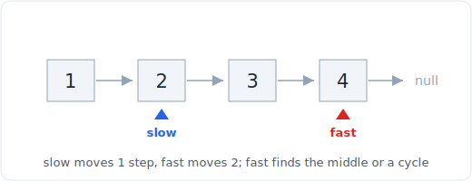
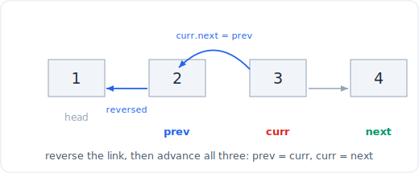

# 10 - 链表技巧

> 中文版。English: [10-linked-list](../../patterns/10-linked-list.md)

> **问题形态：** 「反转一个链表。」「检测它是否有环。」「一趟找到中间节点。」
> 「合并两个有序链表。」「删除倒数第 n 个节点。」任何你无法随机索引、
> 只能逐节点行走，且答案是重新接线 `next` 指针而非数值计算的场景。

链表剥掉了随机访问，所以依赖索引的数组技巧无法移植过来。你换来的是廉价的拼接：
重新接线一个 `next` 指针是 O(1) 且无需移位。整个模式就是用一两个指针行走并安全地重新接线，
两个小工具（一个虚拟头节点和两个不同速度的指针）覆盖了你将见到的几乎每一道链表题。



*逐节点行走。快慢指针一起出发，然后快指针每走两步、慢指针走一步。*

## 信号

当你看到以下情况时，考虑这些技巧：

- **「反转链表」或「反转位置 m 到 n 之间的子链表」**：一次原地指针翻转，无需额外内存。
- **「找中间」、「检测环」、「找环从哪里开始」、「倒数第 k 个」**：
  两个不同速度或固定间隔的指针，一趟，O(1) 空间。
- **「合并两个有序链表」、「删除一个节点」、「插入有序链表」、
  「按某个值分区」**：头节点本身可能改变的拼接问题，这是虚拟节点的判断标志。
- **任何头节点可能被删除或替换的链表编辑。** 一旦第一个节点不保证存活，
  虚拟头节点就消除掉一整类空值检查。

共同的主线：你在重新接线 `next` 指针，难点不在逻辑，
而在跨越重新接线时保持指针有效，使你不丢失链表其余部分，也不解引用空值。

## 思路

两个机制承担了大部分重量。

**原地反转**把链表走一趟，把每个 `next` 翻转指向后方。你持有三个指针：
`prev`（你身后已反转的部分）、`curr`（你正在翻转的节点），以及一个保存的 `nxt`
（这样你在覆写 `curr.next` 那一刻就不会丢失向前的链）。每一步是 O(1)，
整个反转是 O(n) 时间和 O(1) 空间。

**快慢指针**利用相对速度。如果 `slow` 走一步而 `fast` 走两步，
那么当 `fast` 到达末尾时 `slow` 恰好在中间。如果有环，`fast` 会套圈 `slow`
并在环内相撞（Floyd 龟兔），因为它们之间的间隔每一步缩小一。一个固定*间隔*的变体
（先让 `fast` 前进 k 个节点，然后两者一起移动）在 `fast` 落出时让 `slow`
落在倒数第 k 个节点上。

**虚拟头节点**是安静的英雄。你分配一个用完即弃的节点，其 `next` 是真正的头节点，
在它下面构建或编辑链表，然后返回 `dummy.next`。它之所以有效，是因为现在每个真实节点，
包括原本的第一个，都有一个你可以指向的前驱。不再有「万一我删了头节点」或
「万一结果为空」的特殊情况。

## 模板

**节点定义：**

```python
# Space: O(1)
class ListNode:
    # Time: O(1)
    def __init__(self, val=0, next=None):
        self.val = val
        self.next = next
```



*原地反转：把 curr.next 翻转指回 prev，然后三个指针各前进一步。*

**迭代反转（prev / curr / next）：**

```python
# Time: O(n), Space: O(1)
def reverse_list(head):
    prev, curr = None, head
    while curr:
        nxt = curr.next     # save the rest before we clobber the link
        curr.next = prev    # flip
        prev = curr         # advance the reversed frontier
        curr = nxt
    return prev             # new head is the last node we saw
```

**快慢指针：中间、环检测和环起点：**

```python
# Time: O(n), Space: O(1)
def middle(head):
    slow = fast = head
    while fast and fast.next:
        slow = slow.next
        fast = fast.next.next
    return slow             # on even length, this is the second middle

# Time: O(n), Space: O(1)
def has_cycle(head):
    slow = fast = head
    while fast and fast.next:
        slow, fast = slow.next, fast.next.next
        if slow is fast:
            return True
    return False

# Time: O(n), Space: O(1)
def cycle_start(head):
    slow = fast = head
    while fast and fast.next:
        slow, fast = slow.next, fast.next.next
        if slow is fast:                 # they met inside the loop
            walk = head
            while walk is not slow:      # distance head->start == meet->start
                walk, slow = walk.next, slow.next
            return walk
    return None
```

**虚拟头节点 + 合并两个有序链表（这个模式展示了虚拟节点为何有帮助）：**

```python
# Time: O(n + m), Space: O(1)
def merge_two_lists(a, b):
    dummy = ListNode()
    tail = dummy
    while a and b:
        if a.val <= b.val:
            tail.next, a = a, a.next
        else:
            tail.next, b = b, b.next
        tail = tail.next
    tail.next = a or b       # attach whichever still has nodes
    return dummy.next
```

`tail` 总有地方挂下一个节点，而我们从不必特殊处理选择第一个输出节点。那就是虚拟节点的回报。

## 变体

- **反转子链表（Reverse Linked List II）。** 在头节点前放一个虚拟节点，
  走到位置 m 之前的那个节点，然后通过反复拉取游标之后的节点并把它拼接到
  已反转段的最前面（头插法）来做 m..n 的反转。虚拟节点正是让 `m == 1`
  无需分支就能工作的原因。
- **按 k 大小分组反转。** 向前数 k 个节点；如果存在完整的一组，就恰好反转那 k 个，
  然后对其余部分递归（或迭代），把该组的新头接到上一组的尾。不足 k 的剩余尾部保持原样。
- **倒数第 k 个（固定间隔双指针）。** 让 `fast` 前进 k 步，然后 `fast` 和
  `slow` 一起移动直到 `fast` 落出。`slow` 就是倒数第 k 个；用虚拟节点使删除头节点
  （k == 长度）不成为特殊情况。
- **回文链表。** 用快慢指针找中间，原地反转后半部分，逐节点比较两半。O(n) 时间，
  O(1) 空间，如果被要求，你之后还能恢复链表。
- **重排链表（L0->Ln->L1->Ln-1...）。** 找中间，反转后半部分，然后交替合并两半。
  是上面三个基本操作的组合。
- **Floyd 为何有效。** 设环前的尾部长度为 `a`，环长为 `L`。它们在 `slow`
  走了 `a + b` 后相遇，其中 `b` 是进入环的偏移量；代数给出
  `a = L - b (mod L)`，所以从头出发的新指针和从相遇点出发的 `slow`
  恰好在环起点会合。

## 经典题目

| # | 题目 | 难度 | 训练点 |
|---|---------|-----------|----------------|
| 206 | Reverse Linked List | 简单 | prev/curr/next 迭代翻转 |
| 21 | Merge Two Sorted Lists | 简单 | 虚拟头节点 + 拼接较小者 |
| 876 | Middle of the Linked List | 简单 | 快慢指针，第二个中点约定 |
| 141 | Linked List Cycle | 简单 | Floyd 检测，环内相撞 |
| 234 | Palindrome Linked List | 简单 | 中间 + 反转半段 + 比较，O(1) 空间 |
| 92 | Reverse Linked List II | 中等 | 子链表的头插法反转 |
| 142 | Linked List Cycle II | 中等 | Floyd + 头与相遇点会合 |
| 19 | Remove Nth Node From End | 中等 | 固定间隔双指针，虚拟节点应对头情况 |
| 143 | Reorder List | 中等 | 组合中间 + 反转 + 交替合并 |
| 25 | Reverse Nodes in k-Group | 困难 | 带尾部重接线的分组反转 |

## 陷阱

- **翻转时丢失链表其余部分。** 你必须在覆写 `curr.next` *之前*把它保存进一个临时变量，
  否则向前的链就没了。这是头号反转 bug。
- **推进 `fast` 时不做空值防护。** 如果 `fast` 或 `fast.next` 为空，
  `fast = fast.next.next` 会炸。循环守卫必须是 `while fast and fast.next`。
- **「第二个中点还是第一个中点」的差一错误。** `slow = fast = head`
  在偶数长度上给出第二个中点；如果题目想要第一个，就从 `fast = head.next`
  开始（或换一种计数方式）。重排和回文在意你选哪个。
- **头节点可能改变时忘了虚拟节点。** 删除头节点、合并到空结果，
  或从位置 1 开始反转：没有虚拟节点，每一个都变成你在压力下会做错的单独空值分支。
- **没有终结尾部。** 拆分链表后（找中间，切断前半），把最后一个节点的
  `next = None`。一个悬垂进后半的 `next` 会把一次干净的拆分变成意外的环。
- **环相遇处比较值而非身份。** 检查两个指针是否是同一节点时，用 `is`（节点身份），
  而不是 `==`（它可能比较 `val`）。

## 后续追问与相关模式

- 「在一个你可以索引的数组上做双指针思路」回到
  [双指针](01-two-pointers.md)；链表版本是同样的逻辑，只是没有随机访问。
- 「合并 k 个有序链表，而不是两个」把合并推进一个
  [堆](24-heap.md)：每一步在 k 个链表的头中弹出最小的。
- 「给我链表上一个滑动视图里的最大值」或任何单调结构的编辑，
  连接到 [栈](11-stacks.md)。
- 「它是一棵树，不是链表」（反转层级、找一条中间路径）泛化了
  [树的 BFS 与层序](13-tree-bfs.md) 中的 BFS 行走。
