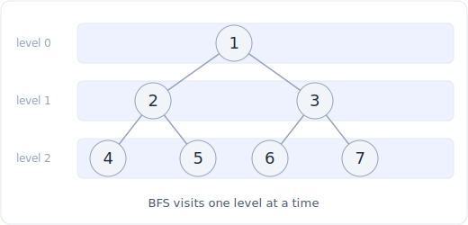

# 13 - 树的 BFS 与层序

> 中文版。English: [13-tree-bfs](../../patterns/13-tree-bfs.md)

> **题目形态:**「返回二叉树的层序遍历。」「给我右视图。」「最小深度是多少?」「按之字形输出各层。」「把每个节点连到它右边的下一个邻居。」凡是答案按*层*组织的,或者你想找到满足某条件的*最浅*节点的,都属于这一类。

树的 BFS 用一个队列以广度优先的顺序访问节点,一层完全处理完再到下一层。它的时间复杂度是 O(n),空间复杂度是 O(w),其中 w 是树的最大宽度。解锁整个模式的唯一诀窍,是在每轮外层循环开始时给队列长度拍一个快照,这样每轮外层循环恰好处理一层。

## 识别信号

当题目以层或到根的距离来描述时,就该想到树的 BFS:

- **「层序」、「按层」、「每一行」、「每层的平均值」**:输出是按深度分组的列表。BFS 天然按顺序产出各层。
- **「右视图」、「左视图」、「每行的最大值」**:你想要每层的一个代表元素,一旦能一次迭代一层,这就很容易了。
- **「最小深度」、「到叶子的最短路径」**:BFS 先到达最近的叶子,所以一看到叶子就能立刻返回,不必深入更深的分支。这正是 BFS 严格优于 DFS 的地方。
- **「之字形」、「连接右侧的 next 指针」**:两者都是层结构问题。之字形每层交替产出方向;next 指针把同一层的兄弟节点串起来。

如果题目在意某个节点位于*哪一层*,或想要*最近的*合格节点,BFS 就是这个模式。如果它在意根到叶的分支或子树聚合,那就用 [树的 DFS](12-tree-dfs.md)。

## 核心思想

BFS 用一个先进先出(FIFO)的队列。先把根放进去,然后反复弹出一个节点、压入它的孩子。



*第 0 层:[1]。第 1 层:[2, 3]。第 2 层:[4, 5, 6, 7]。BFS 每轮外层循环排空一层。*

要恢复层的边界(扁平队列会丢失这个信息),在每轮外层循环开始时给**当前队列长度拍一个快照**:这个计数恰好是当前层的节点数,所以做这么多次弹出的内层循环正好排空一层。

```
level_size = len(queue)     # everything now in the queue is one level
for _ in range(level_size): # drain exactly this level, enqueue the next
    ...
```

因为每个节点只入队和出队各一次,一趟遍历是 O(n)。队列每次最多容纳一层,所以空间是 O(w),即树的最大宽度(最坏情况下满的底层是 O(n))。

对于最小深度,BFS 之所以胜出,是因为它出队的第一个叶子必然是最浅的:你立刻返回,永远不碰更深的子树;而 DFS 会在找到最短路径之前先走完整条分支。

## 模板

**层序遍历,快照技巧(这是所有变体的基础):**

```python
from collections import deque

# Space: O(1)
class TreeNode:
    # Time: O(1)
    def __init__(self, val=0, left=None, right=None):
        self.val = val
        self.left = left
        self.right = right

# Time: O(n), Space: O(n)
def level_order(root):
    if not root:
        return []
    result = []
    queue = deque([root])
    while queue:
        level_size = len(queue)        # snapshot: nodes on THIS level
        level = []
        for _ in range(level_size):    # drain exactly one level
            node = queue.popleft()
            level.append(node.val)
            if node.left:
                queue.append(node.left)
            if node.right:
                queue.append(node.right)
        result.append(level)
    return result
```

**右视图(每层的最后一个节点):**

```python
# Time: O(n), Space: O(n)
def right_side_view(root):
    if not root:
        return []
    view = []
    queue = deque([root])
    while queue:
        level_size = len(queue)
        for i in range(level_size):
            node = queue.popleft()
            if i == level_size - 1:    # last node dequeued on this level
                view.append(node.val)
            if node.left:
                queue.append(node.left)
            if node.right:
                queue.append(node.right)
    return view
```

**最小深度,遇到第一个叶子就提前返回:**

```python
# Time: O(n), Space: O(n)
def min_depth(root):
    if not root:
        return 0
    queue = deque([(root, 1)])
    while queue:
        node, depth = queue.popleft()
        if not node.left and not node.right:   # first leaf reached is the shallowest
            return depth
        if node.left:
            queue.append((node.left, depth + 1))
        if node.right:
            queue.append((node.right, depth + 1))
```

## 变体

- **之字形层序。** 同样的快照循环,但在交替的层上反转产出顺序。像平常一样从左到右构建每一层,然后在奇数层反转它(或者用 `deque` 从正确的一端追加)。每轮翻转一个布尔标志。
- **每层聚合。** 每行最大值、每行平均值、每层和:在内层循环里直接计算聚合值,而不是收集全部值。
- **自底向上的层序。** 自顶向下产出各层,然后反转结果列表,或者每层都往前插。
- **填充右侧 next 指针。** 把每个节点的 `next` 连到同一层内紧随它出队的节点;最后一个节点的 `next` 是 `None`。对于*完美*二叉树,你甚至可以用上一层已建立好的 `next` 指针在 O(1) 额外空间内完成,而不用队列。
- **网格上的多源 BFS。** 同样是一次一层的循环,但用多个起始格子来播种,可以在网格中计算距离(「腐烂的橘子」、「01 矩阵」)。见 [图遍历](16-graph-traversal.md)。

## 经典题目

| # | 题目 | 难度 | 训练点 |
|---|---------|-----------|----------------|
| 102 | Binary Tree Level Order Traversal | 中等 | 快照长度的基础模板 |
| 111 | Minimum Depth of Binary Tree | 简单 | BFS 遇到第一个叶子就返回 |
| 199 | Binary Tree Right Side View | 中等 | 每层的最后一个节点 |
| 637 | Average of Levels in Binary Tree | 简单 | 每层聚合 |
| 103 | Binary Tree Zigzag Level Order Traversal | 中等 | 交替产出方向 |
| 515 | Find Largest Value in Each Tree Row | 中等 | 每层最大值 |
| 116 | Populating Next Right Pointers in Each Node | 中等 | 连接同一层内的兄弟节点 |
| 117 | Populating Next Right Pointers II (not perfect) | 中等 | 同上,但树不满 |
| 107 | Binary Tree Level Order Traversal II | 中等 | 自底向上,反转各层 |

## 常见坑

- **没有给长度拍快照。** 如果你在压入孩子之后、在内层循环里读 `len(queue)`,层的边界就错了,各层会混在一起。在内层循环之前把 `level_size` 捕获一次。
- **压入 `None` 孩子。** 入队前用 `if node.left` / `if node.right` 守卫,否则弹出时会对 `None` 解引用。(如果题目需要显式的空值,比如序列化,就有意压入它们并在弹出时处理。)
- **用列表当队列。** `list.pop(0)` 是 O(n),会让整个遍历变成 O(n^2)。用 `collections.deque` 和 `popleft`。
- **忘了空根守卫。** 空树应返回空结果,而不是在 `deque([None])` 上崩溃。
- **之字形里靠重新排序来反转每层。** 直接反转已构建的列表,或从正确的一端追加即可;不要排序。

## 延伸与相关模式

- 「遍历分支并聚合子树而非各层」把你推回 [树的 DFS](12-tree-dfs.md);深度问题两种方式都能解,但按层输出是 BFS 的主场。
- 「在网格或一般图上做 BFS」是同样的队列机制加一个已访问集合,见 [图遍历](16-graph-traversal.md);逐层 BFS 正是你在无权图中求最短路的方式。
- 「边带权,所以最近的节点不再是跳数最少的」会打破朴素 BFS,把你推向 [最短路](19-shortest-path.md)(Dijkstra)。
- 带长度快照的队列机制会在任何需要距离分层的地方重现,包括多源洪泛填充。
