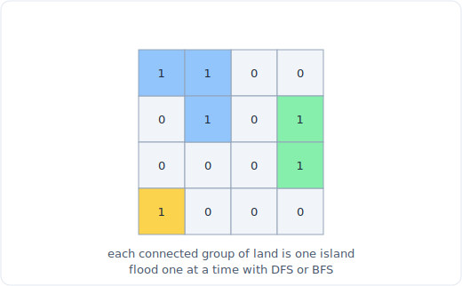

# 16 - 图遍历与网格

> 中文版。English: [16-graph-traversal](../../patterns/16-graph-traversal.md)

> **题目形态:**「数一数网格里有多少个岛屿。」「克隆这张图。」「多少分钟后每个橘子都腐烂。」「无权迷宫里从左上到右下的最短路径。」凡是你必须访问从某起点可达的每个节点,或者一层层向外扩散的,不论是在显式图上还是在藏于二维网格里的隐式图上,都属于这一类。

图遍历是图问题的主力:BFS 和 DFS 都恰好访问每个可达节点一次,真正要做的决定只有两个:你以什么顺序访问(广度还是深度),以及你如何表示邻居(邻接表,还是网格方格周围的四个或八个格子)。把已访问集合的纪律做对,大多数「中等」图题就会坍缩成两个模板之一。



*一个 4 乘 4 的网格,有三个陆地岛屿(蓝、绿、琥珀)。每一组连通的陆地是一个岛屿;对每个未访问的陆地格子做一次 DFS 或 BFS 来计数,这里是三个。*

## 识别信号

看到以下情况就该想到朴素遍历(BFS 或 DFS):

- **一个格子网格**,你从某起始格子向外洪泛:数区域、填一个区域、量面积。网格就是伪装的图,每个格子是一个节点,它的上下左右邻居是边。
- **「连通分量」、「岛屿」、「省份」、「区域」、「朋友圈」。** 你在把节点划分成可达性类别。对每个未访问节点做一次遍历,数你启动了多少次遍历。
- **无权图中的最短路径**(每条边代价为 1)。BFS 能找到它,因为 BFS 按到源点的非递减距离访问节点。
- **「腐烂」、「扩散」、「感染」、「到最近的 X 的距离」。** 常常是多源 BFS:把所有源以距离 0 播种进队列,然后扩展一次。
- **从起点到达每个节点**以克隆、着色或验证。当顺序无所谓时,DFS 是天然选择。

标志是边无权(或全相等),而你在意的是可达性或跳数,而不是最小化不同边代价之和。一旦权重不同,你就进入了 [最短路](19-shortest-path.md) 的地盘。

## 核心思想

BFS 和 DFS 之所以有效,是因为一个**已访问集合**保证每个节点只被展开一次。没有它,你会在环上永远循环,或重做指数级的工作。有了它,每个节点和每条边都只被碰 O(1) 次,所以遍历是 O(V + E) 时间、O(V) 空间。

唯一重要的区别:

- **BFS** 用队列(FIFO)。它以离源点递增的距离一波波展开节点,所以你第一次弹出一个节点时,已经以最短路径到达了它。这正是为什么 BFS,且只有 BFS,能免费给出最短跳数。
- **DFS** 用栈(或经由递归用调用栈)。它尽可能往深处扎,再回溯。它不给最短路径,但对「只要访问所有东西」的任务(比如数分量或洪泛填充)写起来更简单。

对网格来说,「邻接表」是隐式的:`(r, c)` 的邻居是 `(r+1, c), (r-1, c), (r, c+1), (r, c-1)` 中在界内的那些格子。你从不构建边表,而是即时计算邻居。

## 模板

**网格 DFS(递归),岛屿数量 / 洪泛填充:**

```python
# Time: O(m * n), Space: O(m * n)
def num_islands(grid):
    if not grid:
        return 0
    rows, cols = len(grid), len(grid[0])

    def dfs(r, c):
        if r < 0 or r >= rows or c < 0 or c >= cols or grid[r][c] != '1':
            return
        grid[r][c] = '0'                     # mark visited in place
        dfs(r + 1, c); dfs(r - 1, c)
        dfs(r, c + 1); dfs(r, c - 1)

    count = 0
    for r in range(rows):
        for c in range(cols):
            if grid[r][c] == '1':            # a new, unvisited land cell
                count += 1                   # launch one traversal per component
                dfs(r, c)
    return count
```

**在以邻接表给出的图上做 BFS(从 `src` 出发的最短跳数):**

```python
from collections import deque

# Time: O(V + E), Space: O(V)
def bfs_shortest(adj, src, dst):
    visited = {src}
    q = deque([(src, 0)])                    # (node, distance)
    while q:
        node, dist = q.popleft()
        if node == dst:
            return dist
        for nxt in adj[node]:
            if nxt not in visited:
                visited.add(nxt)             # mark on ENQUEUE, not on dequeue
                q.append((nxt, dist + 1))
    return -1                                # unreachable
```

**多源 BFS(腐烂的橘子),所有源从距离 0 开始:**

```python
from collections import deque

# Time: O(m * n), Space: O(m * n)
def oranges_rotting(grid):
    rows, cols = len(grid), len(grid[0])
    q = deque()
    fresh = 0
    for r in range(rows):
        for c in range(cols):
            if grid[r][c] == 2:
                q.append((r, c, 0))          # seed every rotten cell
            elif grid[r][c] == 1:
                fresh += 1

    minutes = 0
    while q:
        r, c, t = q.popleft()
        minutes = max(minutes, t)
        for dr, dc in ((1, 0), (-1, 0), (0, 1), (0, -1)):
            nr, nc = r + dr, c + dc
            if 0 <= nr < rows and 0 <= nc < cols and grid[nr][nc] == 1:
                grid[nr][nc] = 2             # infect and mark in one step
                fresh -= 1
                q.append((nr, nc, t + 1))
    return minutes if fresh == 0 else -1
```

最重要的一个习惯:在你**入队的那一刻**就把节点标记为已访问,而不是在出队时。出队时才标记,会让同一个节点在任何一个弹出之前被多个邻居压入,这会让队列重新膨胀,并可能破坏距离保证。

## 变体

- **用显式栈的迭代式 DFS。** 和递归版一样,但你把邻居压进一个 `list` 并从末尾弹出。当递归深度可能撑爆调用栈时用它(一个像蛇一样绵延的巨大陆地网格可能递归 10000 层深)。
- **八方向网格。** 有些问题(二进制矩阵中的最短路径)也对角相连。把邻居列表扩展到全部八个偏移。
- **「到最近距离」的多源 BFS。** 「01 矩阵」和「墙与门」用每个零(或每个门)以距离 0 播种队列,然后一次 BFS 就为每个格子填上到最近源的距离。比每格一次 BFS 便宜得多。
- **显式图上的连通分量。** 遍历所有节点,从每个未访问的节点启动一次遍历,数启动次数。和数岛屿是同一个骨架。
- **克隆 / 复制一张图。** 做 DFS 或 BFS,同时维护一个 `{原节点: 副本}` 映射,它同时充当已访问集合:在映射里出现就表示已经克隆。
- **二分图检测 / 二着色。** 用 BFS 或 DFS 给邻居着相反的颜色,冲突就意味着非二分图。

## 经典题目

| # | 题目 | 难度 | 训练点 |
|---|---------|-----------|----------------|
| 733 | Flood Fill | 简单 | 基础网格 DFS / BFS,标记并扩散 |
| 200 | Number of Islands | 中等 | 每个未访问分量一次遍历 |
| 133 | Clone Graph | 中等 | 带已访问 / 副本映射的遍历 |
| 994 | Rotting Oranges | 中等 | 多源 BFS,按波计距离 |
| 542 | 01 Matrix | 中等 | 从所有零出发的多源 BFS |
| 1091 | Shortest Path in Binary Matrix | 中等 | BFS 最短路,8 个方向 |
| 130 | Surrounded Regions | 中等 | 从边界向内遍历 |
| 417 | Pacific Atlantic Water Flow | 中等 | 两次多源洪泛,取交集 |
| 127 | Word Ladder | 困难 | 隐式图,用 BFS 求最少步数 |
| 785 | Is Graph Bipartite? | 中等 | 带二着色的遍历 |

## 常见坑

- **在出队而非入队时标记已访问。** 这是最常见的 BFS bug。它让重复项堆进队列,浪费时间,还可能产生错误的距离。在你压入的那一刻就加进已访问集合。
- **用 DFS 回答最短路径问题。** DFS 找到的是*某条*路径,不是最短的。无权最短路永远是 BFS。
- **忘了网格的边界检查。** 每一步邻居在索引前都需要 `0 <= r < rows and 0 <= c < cols`,否则你会绕回去 / 崩溃。
- **递归深度溢出。** 大的或蛇形的网格可能超过 Python 的默认递归上限(约 1000)。改用迭代式 DFS 或 BFS。
- **把网格当已访问集合来改,之后又需要原始网格。** 当网格可丢弃时,就地标记没问题。如果调用方需要它完好无损,就用一个单独的 `visited` 集合。
- **在距离里把源也数进去。** 对「腐烂所需分钟」或「阶梯中的步数」,先决定起点算第 0 步还是第 1 步,并保持一致。

## 延伸与相关模式

- 「现在各条边权重不同了」把你推向 [最短路](19-shortest-path.md):Dijkstra、0-1 BFS 或 Bellman-Ford。
- 「存在先决条件 / 依赖顺序」推向 [拓扑排序](17-topological-sort.md),它是带入度或后序记账的 BFS 或 DFS。
- 「我只需要知道两个节点是否连通,而且有大量并查询」推向 [并查集](18-union-find.md),对增量连通性它胜过反复遍历。
- 树上的层序遍历只是在保证无环的图上做 BFS,见 [树的 BFS](13-tree-bfs.md);递归 DFS 对应 [树的 DFS](12-tree-dfs.md)。
- 「枚举所有路径,而不只是到达每个节点」推向 [回溯](20-backtracking.md),在那里你要在回溯途中撤销已访问标记。
