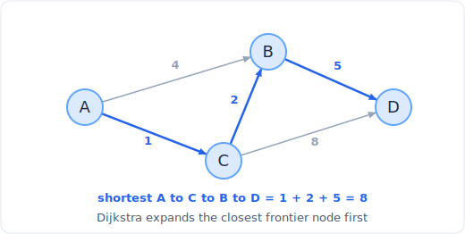

# 19 - 最短路

> 中文版。English: [19-shortest-path](../../patterns/19-shortest-path.md)

> **题目形态:**「信号到达每个节点的最短时间。」「从 A 到 B 最多经 k 次中转的最便宜航班。」「网格里使最大爬升最小的路径。」凡是要求穿过一个带权图的最小代价路线,边带不同代价、你必须最小化沿途的和(或最大值)的,都属于这一类。

最短路是一个家族,而不是单个算法,选对成员完全取决于**边权**。均匀权重:朴素 BFS。只有 0 和 1 的权重:用双端队列的 0-1 BFS。任意非负权重:用堆的 Dijkstra。有负边,或对使用的边数有硬性上限:Bellman-Ford。从题面读出权重结构就是全部的本事;一旦你知道要用哪个,每个的代码都很短。



*一个带权有向图。从 A 到 D 的最短路径是 A, C, B, D,代价 1 + 2 + 5 = 8,比权重为 4 的 A 到 B 直连边更便宜。*

## 识别信号

当题目要求**最小化一条路线上的代价**时就该想到最短路算法,并按权重来匹配算法:

- **所有边代价相同**(无权,或每步都是「1」):朴素 **BFS**。递增距离的波在首次弹出时以最短路径到达每个节点。见 [图遍历](16-graph-traversal.md)。
- **边代价只有 0 或 1**(免费移动 vs 付费移动、「移除最少障碍」):用双端队列的 **0-1 BFS**,把 0 代价邻居压到前面、1 代价压到后面。O(V + E)。
- **非负的不同权重**(「网络延迟时间」、「最小体力消耗路径」、「到达的最小代价」):用最小堆的 **Dijkstra**。O(E log V)。
- **允许负边,或对跳数有限制**(「k 次中转内的最便宜航班」):**Bellman-Ford**,它把所有边松弛 `V - 1` 次(跳数被限时正好 `k+1` 次)。O(V x E)。

标志是**要最小化的代价之和**加上并非全相等的边。如果边全相等,除了 BFS 你不需要以上任何东西;如果你想触及每个节点而不是便宜地到达一个,那是朴素遍历或 [拓扑排序](17-topological-sort.md)。

## 核心思想

每个最短路算法都会松弛边:如果到 `u` 的已知距离加上边 `u -> v` 优于到 `v` 的已知距离,就更新 `v`。它们的区别在松弛的*顺序*上,这正是买来正确性和速度的东西。

- **Dijkstra** 总是接下来敲定最近的未完成节点。一个以距离为键的最小堆在 O(log V) 内把那个节点交给你。一旦你弹出一个节点,它的距离就是最终的,这正是为什么**负边会破坏 Dijkstra**:一条更晚、更便宜的绕行可能压低一个已敲定的节点,而 Dijkstra 从不回访它。
- **0-1 BFS** 是 Dijkstra 的特例。只有 0/1 权重时,双端队列免费让前沿保持有序:0 权重邻居去前面(同样距离),1 权重邻居去后面(距离 + 1)。不需要堆。
- **Bellman-Ford** 对权重不作任何假设。它松弛*每一条*边,做 `V-1` 整趟,因为一条最短路径最多有 `V - 1` 条边。把趟数封顶在 `k + 1` 自然回答了「最多 k 次中转」。它还能检测负环:第 `V` 趟仍能松弛出东西就意味着存在负环。

在 Dijkstra 适用时(非负权重)它最快。只在你不得不(负边或跳数约束)时才退回 Bellman-Ford,因为它更慢。

## 模板

**用堆的 Dijkstra(非负权重),从 `src` 到所有节点的距离:**

```python
import heapq

# Time: O((V + E) log V), Space: O(V)
def dijkstra(adj, src, n):                   # adj[u] = list of (v, weight)
    dist = [float('inf')] * n
    dist[src] = 0
    heap = [(0, src)]                        # (distance so far, node)
    while heap:
        d, u = heapq.heappop(heap)
        if d > dist[u]:                      # stale entry, a better one was processed
            continue
        for v, w in adj[u]:
            nd = d + w
            if nd < dist[v]:                # relax: found a cheaper route to v
                dist[v] = nd
                heapq.heappush(heap, (nd, v))
    return dist
```

**用双端队列的 0-1 BFS(边权 0 或 1):**

```python
from collections import deque

# Time: O(V + E), Space: O(V)
def zero_one_bfs(adj, src, n):               # adj[u] = list of (v, weight in {0,1})
    dist = [float('inf')] * n
    dist[src] = 0
    dq = deque([src])
    while dq:
        u = dq.popleft()
        for v, w in adj[u]:
            if dist[u] + w < dist[v]:
                dist[v] = dist[u] + w
                if w == 0:
                    dq.appendleft(v)         # same distance, process first
                else:
                    dq.append(v)             # distance + 1, process later
    return dist
```

**封顶在 k+1 次松弛的 Bellman-Ford(k 次中转内的最便宜航班):**

```python
# Time: O(k * E), Space: O(V)
def cheapest_flight(n, flights, src, dst, k):
    dist = [float('inf')] * n
    dist[src] = 0
    for _ in range(k + 1):                   # at most k stops = k+1 edges
        snapshot = dist[:]                   # relax from the PREVIOUS round only
        for u, v, w in flights:
            if snapshot[u] + w < dist[v]:
                dist[v] = snapshot[u] + w
    return dist[dst] if dist[dst] != float('inf') else -1
```

两个重要的习惯:在 Dijkstra 里,用 `d > dist[u]` 守卫**跳过陈旧的堆项**(你会多次压入一个节点,只有最小的那次弹出才有效);在跳数封顶的 Bellman-Ford 里,**基于上一轮的快照做松弛**,这样一趟就不会串起好几个航班而冲破中转上限。

## 变体

- **网格 Dijkstra。** 节点是格子,权重来自格子的值或移动代价。「最小体力消耗路径」最小化的是路径上的*最大*边而非和:用 `max(effort_so_far, abs(height diff))` 代替求和来松弛,堆的逻辑其余部分完全一样。
- **求「最小代价 / 最大概率」的 Dijkstra。** 要最大化概率的乘积,就用最大堆并做乘法;这是换了个幺半群的 Dijkstra。
- **A\* 搜索。** Dijkstra 加上一个可采纳的启发式,把堆偏向目标。同样的骨架,以 `dist + heuristic` 为键。
- **0-1 BFS 变体。** 「移除最少障碍」、「让迷宫可通过」:可通过的移动代价 0,砸墙代价 1。
- **Bellman-Ford 负环检测。** 多跑一趟;如果还有东西被松弛,就说明某条最短路径上存在负环。
- **BFS 就够用的时候。** 如果每条边权都是同一个常数,*不要*去用 Dijkstra:朴素 BFS 更简单,O(V + E) 且没有 log 因子。只有不均匀的权重才值得用堆。

## 经典题目

| # | 题目 | 难度 | 训练点 |
|---|---------|-----------|----------------|
| 743 | Network Delay Time | 中等 | 教科书式 Dijkstra 到所有节点 |
| 787 | Cheapest Flights Within K Stops | 中等 | 带跳数封顶的 Bellman-Ford |
| 1631 | Path With Minimum Effort | 中等 | 网格 Dijkstra,最小化最大边 |
| 1091 | Shortest Path in Binary Matrix | 中等 | 权重全相等时用 BFS |
| 1514 | Path with Maximum Probability | 中等 | 对乘积用最大堆的 Dijkstra |
| 1368 | Minimum Cost to Make at Least One Valid Path in a Grid | 困难 | 网格上的 0-1 BFS |
| 1293 | Shortest Path in a Grid with Obstacles Elimination | 困难 | 在增广的(格子,预算)状态上做 BFS |
| 505 | The Maze II | 中等 | 一条边是一整次滚动的 Dijkstra |
| 882 | Reachable Nodes In Subdivided Graph | 困难 | 在细分图上做 Dijkstra |

## 常见坑

- **对负边跑 Dijkstra。** 它会悄悄给出错误答案,因为已敲定的节点永不重新考虑。任何边可能为负时,用 Bellman-Ford(或 SPFA)。
- **忘了 Dijkstra 里的陈旧项守卫。** 没有 `if d > dist[u]: continue`,你会重复处理过时的堆项;结果可能仍然对,但工作量暴涨,而在就地修改的情况下你会踩到 bug。
- **Bellman-Ford 在一趟里串起多条边。** 对 k 次中转约束,你必须基于上一轮的*快照*松弛;就地松弛会让一趟走过多个航班而超出 k。
- **中转数与边数的差一。** 「最多 k 次中转」意味着最多 `k + 1` 条边。循环 `k + 1` 次,而不是 `k` 次。
- **在 BFS 就够时用了 Dijkstra。** 相等权重不需要堆;那个 log 因子是浪费,而代码更容易出错。
- **题目要最大边的最小值,你却去最小化和。** 「最小体力消耗」不是一个和;用 `max` 而不是 `+` 来松弛,否则你优化了错误的量。

## 延伸与相关模式

- 「所有边都相等」坍缩回 [图遍历](16-graph-traversal.md) 里的 BFS;最短路是它的带权推广。
- 「堆是瓶颈」是和 [堆与优先队列](24-heap.md) 一样的优先队列机制;Dijkstra 是伪装的堆问题。
- 「这是个 DAG,利用它的顺序」让你能扔掉堆,按 [拓扑排序](17-topological-sort.md) 的顺序在 O(V + E) 内做松弛。
- 「最小生成树,而非最短路」是不同的目标,见经由 [并查集](18-union-find.md) 的 Prim 和 Kruskal,以及 [贪心](25-greedy.md)。
- 跳数封顶的 Bellman-Ford 其实是一个在轮次上的 [线性 DP](21-dp-linear-knapsack.md):`dist[i][v]` = 用最多 `i` 条边到 `v` 的最便宜代价。
