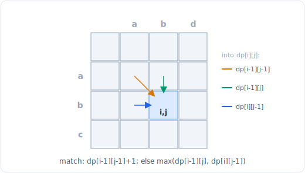

# 22 - DP II：子序列与字符串

> 中文版。English: [22-dp-strings](../../patterns/22-dp-strings.md)

> **问题形态：**「最长递增子序列的长度。」「两个字符串的最长公共子序列。」「把
> 单词 A 变成单词 B 所需的最少编辑次数。」「最长回文子串。」「一个字符串作为另一个
> 的子序列出现了多少次？」凡是答案在一两个字符串的子序列或对齐上取值，且状态是指向
> 它们的一个索引（或一对索引）的问题，都属于这一类。

这个文件覆盖的 DP 中，序列是一个（或两个）字符串，且对象是子序列，而不是连续的
窗口。反复出现的手法是一个双索引网格：`dp[i][j]` 把一个字符串的前缀与另一个的前缀
做比较，转移询问当前这对字符是否匹配。掌握 LCS 与编辑距离，这个家族的大部分就自然
落出来了。



*双字符串网格：一个格子读取它的对角线（匹配则延伸它）加上上方和左方邻居（失配则取
最优者）。*

## 信号

出现以下情况时考虑子序列 / 字符串 DP：

- **「子序列」**（不是「子串」）：保持顺序，允许有间隔。一旦允许间隔，滑动窗口就
  出局，DP 就登场。
- **两个字符串被比较**，为求一个公共结构、一种对齐或一次变换：LCS、编辑距离、
  不同子序列、交错、通配符 / 正则匹配。两个输入几乎总意味着在两个前缀上的一个二维
  `dp[i][j]`。
- **回文问题**，措辞为「最长回文子序列 / 子串」或「使其成为回文的最少插入 / 删除
  次数」。这些是在一个区间 `[i, j]` 上向外生长的 DP。
- **「最长 / 最短 / 有多少」作用于一种排序**，其中贪心遍历会失败，因为一个局部更短
  的选择可能让之后有更长的链（LIS 是贪心的经典陷阱）。

如果目标是连续的，回头看 [滑动窗口](02-sliding-window.md)：必须连续且匹配一个简单
约束的「子串」通常是一个窗口，但回文*子串*仍然是 DP，因为其合法性依赖于内部。

## 思路

核心对象是一张表，其索引是你已消耗了每个字符串的多少。对两个字符串 `s` 和 `t`，
在 `s` 的前 `i` 个字符和 `t` 的前 `j` 个字符上定义 `dp[i][j]`，并根据
`s[i-1] == t[j-1]` 是否成立来驱动转移：

- **字符匹配**：答案延伸一个更小的已对齐对，通常是 `dp[i-1][j-1] + 1`（LCS）或
  `dp[i-1][j-1]`（编辑距离，一次免费的匹配）。
- **字符不同**：你取「从任一字符串跳过一个字符」中的最优者，`dp[i-1][j]` 和
  `dp[i][j-1]` 的 `max` 或 `min`（编辑距离还要加一个代价）。

这种「匹配延伸对角线，失配取最优邻居」的形态是整个双字符串家族的骨架。网格有
`(m+1) * (n+1)` 个格子，每个用 `O(1)` 填，所以代价是 `O(m * n)` 时间。因为每行只依赖
上一行（以及当前行左边），你可以用两个滚动行压缩到 `O(min(m, n))` 空间。

对单字符串区间 DP（回文），状态是 `s[i..j]` 上的一个区间 `dp[i][j]`，转移看两端
`s[i]` 和 `s[j]`。关键细节是**求值顺序**：`dp[i][j]` 依赖更短的区间，所以要按长度
递增来遍历（或 `i` 递减、`j` 递增）。

你买到的复杂度：LCS / 编辑距离从指数级（枚举所有子序列或所有编辑脚本）降到
`O(m * n)`，而 LIS 从 `O(2^n)` 降到 `O(n^2)`，再用下文的耐心技巧降到 `O(n log n)`。

## 模板

**O(n^2) 的 LIS（每个元素延伸此前结尾更小的最优链）：**

```python
# Time: O(n^2), Space: O(n)
def lis_quadratic(nums):
    n = len(nums)
    dp = [1] * n                           # dp[i] = LIS ending exactly at i
    for i in range(n):
        for j in range(i):
            if nums[j] < nums[i]:
                dp[i] = max(dp[i], dp[j] + 1)
    return max(dp) if dp else 0
```

**O(n log n) 的 LIS（耐心排序：`tails[k]` = 长度为 k+1 的链的最小结尾）：**

```python
from bisect import bisect_left

# Time: O(n log n), Space: O(n)
def lis_nlogn(nums):
    tails = []
    for x in nums:
        i = bisect_left(tails, x)          # first tail >= x
        if i == len(tails):
            tails.append(x)                # x extends the longest chain
        else:
            tails[i] = x                   # x gives a smaller tail for length i+1
    return len(tails)                      # length only, not the sequence itself
```

**LCS（双字符串网格，匹配延伸对角线）：**

```python
# Time: O(m * n), Space: O(m * n) (compressible to O(min(m, n)))
def lcs(s, t):
    m, n = len(s), len(t)
    dp = [[0] * (n + 1) for _ in range(m + 1)]
    for i in range(1, m + 1):
        for j in range(1, n + 1):
            if s[i - 1] == t[j - 1]:
                dp[i][j] = dp[i - 1][j - 1] + 1
            else:
                dp[i][j] = max(dp[i - 1][j], dp[i][j - 1])
    return dp[m][n]
```

**编辑距离（把 `s` 变成 `t` 的最少插入 / 删除 / 替换）：**

```python
# Time: O(m * n), Space: O(m * n) (compressible to O(min(m, n)))
def edit_distance(s, t):
    m, n = len(s), len(t)
    dp = [[0] * (n + 1) for _ in range(m + 1)]
    for i in range(m + 1):
        dp[i][0] = i                       # delete all of s's prefix
    for j in range(n + 1):
        dp[0][j] = j                       # insert all of t's prefix
    for i in range(1, m + 1):
        for j in range(1, n + 1):
            if s[i - 1] == t[j - 1]:
                dp[i][j] = dp[i - 1][j - 1]         # match, no cost
            else:
                dp[i][j] = 1 + min(dp[i - 1][j],    # delete from s
                                   dp[i][j - 1],    # insert into s
                                   dp[i - 1][j - 1])# replace
    return dp[m][n]
```

**最长回文子序列（区间 DP，把区间向外生长）：**

```python
# Time: O(n^2), Space: O(n^2)
def longest_palindrome_subseq(s):
    n = len(s)
    dp = [[0] * n for _ in range(n)]
    for i in range(n - 1, -1, -1):
        dp[i][i] = 1                       # single char is a palindrome
        for j in range(i + 1, n):
            if s[i] == s[j]:
                dp[i][j] = dp[i + 1][j - 1] + 2
            else:
                dp[i][j] = max(dp[i + 1][j], dp[i][j - 1])
    return dp[0][n - 1]
```

## 变体

- **不同子序列（数 `t` 在 `s` 中出现了多少次）。** LCS 的计数版本：匹配时
  `dp[i][j] = dp[i-1][j-1] + dp[i-1][j]`（用这次匹配或跳过这个 `s` 字符）；失配时
  `dp[i][j] = dp[i-1][j]`。
- **最长回文子串。** 连续性改变了递推式：`s[i..j]` 是回文当且仅当 `s[i] == s[j]` 且
  `s[i+1..j-1]` 是回文。要么填一张布尔型区间表，要么用更简单的中心扩展，做到
  `O(n^2)` 时间和 `O(1)` 空间。
- **使其成为回文的最少插入 / 删除次数。** 等于 `n` 减去最长回文子序列，或 `s` 与
  `reverse(s)` 的 LCS。是一个归约，不是一个新的 DP。
- **交错 / 通配符 / 正则匹配。** 同样的双索引网格；转移根据模式字符（`*`、`?`、`.`）
  分叉，而不是一次朴素的相等判断。
- **重建序列本身，而不只是它的长度。** 存父指针，或从 `dp[m][n]` 反向走填好的表，
  选择产生了每个值的那个邻居。只求长度的 DP 会丢掉这个，所以如果你需要真正的子序列，
  就保留整张表。

## 子序列对比子串的区分

这一个词决定了整个方法，所以要仔细读题：

- **子串 / 子数组**：连续。通常是 [滑动窗口](02-sliding-window.md) 或
  [双指针](01-two-pointers.md) 问题，尽管回文子串仍然是 DP，因为其合法性依赖于被
  包住的那些字符。
- **子序列**：保持顺序但允许间隔。几乎总是 DP，因为你必须把「跳过这个字符」当作一个
  真实的选择，而窗口无法表达它。

当题目说「最长公共子串」（连续）时，递推式在失配处重置为零（`dp[i][j] = 0`）且你追踪
全局最大值；「最长公共子序列」（允许间隔）在失配处取最优邻居。同一个网格，差一行，
答案完全不同。

## 经典题目

| # | 题目 | 难度 | 训练点 |
|---|---------|-----------|----------------|
| 300 | Longest Increasing Subsequence | 中等 | `O(n^2)` DP 与 `O(n log n)` 耐心排序 |
| 1143 | Longest Common Subsequence | 中等 | 双字符串网格骨架 |
| 72 | Edit Distance | 中等 | 网格上的插入 / 删除 / 替换 |
| 5 | Longest Palindromic Substring | 中等 | 区间合法性 / 中心扩展 |
| 516 | Longest Palindromic Subsequence | 中等 | 向外生长的区间 DP |
| 115 | Distinct Subsequences | 困难 | LCS 的计数版本 |
| 1092 | Shortest Common Supersequence | 困难 | LCS 加上重建 |
| 583 | Delete Operation for Two Strings | 中等 | 限定为删除的编辑距离 |

## 陷阱

- **把子序列和子串弄混。** 代价最高的读错：它翻转失配转移（重置为零对比取最优邻居），
  并可能把整个模式从 DP 翻转成滑动窗口。
- **`+1` 偏移的差一错误。** 有一张 `(m+1) x (n+1)` 的表时，`s[i-1]` 和 `t[j-1]` 是
  处于 DP 索引 `i` 和 `j` 的字符。把字符串索引和表索引弄混会污染每一次匹配检查。
- **区间 DP 中错误的求值顺序。** `dp[i][j]` 需要 `dp[i+1][j-1]`（一个更短的区间），
  所以你必须先填更短的区间：`i` 递减遍历或按长度递增。一个朴素的 `i` 递增循环会读到
  未计算的格子。
- **忘了基础行和列。** 编辑距离需要 `dp[i][0] = i` 和 `dp[0][j] = j`（变换到 / 自
  空字符串）。把它们留成零会悄悄少计。
- **以为 LIS 的 `O(n log n)` 给你的是序列。** `tails` 数组不是 LIS 本身，只是它的
  长度。恢复真正的序列需要父指针。
- **在它跑通之前就压缩空间。** 对角线依赖 `dp[i-1][j-1]` 在滚动为一行时容易被冲掉；
  先把二维版本弄对，再用一个保存对角线的临时变量来压缩。

## 后续问题与相关模式

- 「它作用于单个序列，带一个容量或取 / 跳过预算」退回到
  [DP I：线性与背包](21-dp-linear-knapsack.md)。
- 「它是一条网格路径、一次区间合并、或一个子集上的位掩码」会推向
  [DP III：网格、区间、位掩码](23-dp-grids-intervals.md)；这里的回文区间 DP 是通向
  那里区间 DP 的入口。
- 「给我那个 `O(n log n)` 的 LIS」依赖在 `tails` 数组上的
  [二分查找](07-binary-search.md)。
- 「目标是连续的，不是子序列」会推向
  [滑动窗口](02-sliding-window.md) 或 [双指针](01-two-pointers.md)。
- 「枚举所有公共子序列，不只是度量它们」会推回到
  [回溯](20-backtracking.md)。
