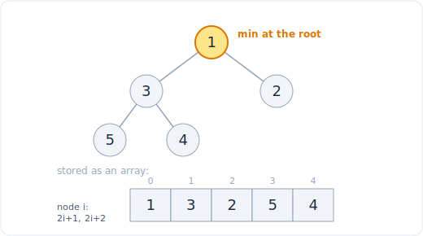

# 24 - 堆与优先队列

> 中文版。English: [24-heap](../../patterns/24-heap.md)

> **问题形态：**「返回最大的（或出现最频繁的、或最接近的）k 个元素。」「合并 k 个
> 有序链表。」「找出一个数据流的中位数。」「按优先级调度任务，使机器尽可能少空闲。」
> 每当你反复需要一个变化集合当前的最小或最大元素，又不想付出让整个集合保持有序的
> 代价时，堆就是那个工具。

堆是一棵存在数组里的二叉树，其中每个父节点都比它的子节点小（最小堆）。那一条不变式
让你在 O(1) 拿到最小值、在 O(log n) 压入或弹出，而当「最优元素」随着数据到来不断
移动时，这正是你想要的接口。Python 自带一个叫 `heapq`，而大多数堆问题真正的关键在于
你选择往里存什么。

## 信号

出现以下情况时考虑堆：

- **「前 k 个」「最大的 k 个」「最小的 k 个」「最接近的 k 个」「最频繁的 k 个」。**
  你不需要整个东西有序，只要最优的 k 个，而一个大小为 k 的堆用 O(n log k) 就把你送到
  那里，而不是 O(n log n)。
- **「合并 k 个有序序列」。** 一个装着 k 个当前表头的堆每步用 O(log k) 挑出全局
  最小值。
- **「一个流的中位数」「保持中间」「平衡两半」。** 双堆技巧维护一个装着低半部分的
  最大堆和一个装着高半部分的最小堆。
- **调度与模拟**：「处理优先级最高的作业」「会议需要多少个房间」「重排使得相邻两个
  不相等」。你不断拉出当前的极值，修改它，再压回去。
- **一个运行中的「下一个事件」队列**：Dijkstra、Prim、事件驱动的扫描。堆是按代价或
  时间排序的前沿。

标志是：一次朴素的排序很浪费，因为集合随时间变化，或者因为你只关心它的一端。

## 思路

一个二叉堆把一棵完全树存在数组里：节点 `i` 的子节点是 `2i+1` 和 `2i+2`。堆性质
（最小堆的父节点 <= 子节点）是局部的，所以插入或移除只需沿单条根到叶的路径把一个
元素上浮或下沉，那是 O(log n)。根始终是最小值，用 O(1) 读取。你从不付出完全排序的
代价，只为你实际做的那些移动付费。



*一个最小堆：每个父节点都小于或等于它的子节点，所以根是最小值。*

三个想法撑起了大多数堆问题：

- **为 top-k 限定大小。** 要保留最大的 k 个，运行一个大小上限为 k 的最小堆。压入
  每个元素，当堆超过 k 时弹出最小的。留存下来的就是最大的 k 个，而根是第 k 大的。
  代价是 O(n log k)，内存是 O(k) 而不是 O(n)。
- **用一个堆做 k 路合并的 k 个指针。** 用每个链表的第一个元素为堆播种。弹出最小值、
  输出它、再从它来自的那个链表压入下一个元素。每次弹出是 O(log k)。
- **用两个堆求中位数。** 把值分成一个低半（一个最大堆，所以其根是这些小值里最大的）
  和一个高半（一个最小堆）。让两者大小相差不超过一。中位数是较大那个堆的顶，或当
  两者大小相等时是两个顶的平均。

## 模板

**最小堆基础，以及通过取负得到最大堆：**

```python
# Usage idioms: push/pop are O(log n), peek h[0] is O(1), heapify is O(n)
import heapq

h = []
heapq.heappush(h, 5)            # O(log n)
heapq.heappush(h, 1)            # O(log n)
heapq.heappush(h, 3)            # O(log n)
smallest = heapq.heappop(h)     # 1, O(log n)
peek = h[0]                     # current minimum, O(1), do not pop

# Python only has a min-heap. For a max-heap, negate on the way in and out.
maxh = []
for x in [5, 1, 3]:
    heapq.heappush(maxh, -x)
largest = -heapq.heappop(maxh)  # 5

# heapify turns a list into a heap in place in O(n), cheaper than n pushes.
nums = [5, 1, 3, 2]
heapq.heapify(nums)             # O(n)
```

**用大小为 k 的最小堆做 top-k，O(n log k)：**

```python
import heapq

# Time: O(n log k), Space: O(k)
def k_largest(nums, k):
    h = []
    for x in nums:
        heapq.heappush(h, x)
        if len(h) > k:
            heapq.heappop(h)    # drop the smallest, keep the k largest
    return h                    # h[0] is the kth largest
```

**k 路合并（合并 k 个有序链表），在总共 N 个元素上是 O(N log k)：**

```python
import heapq

# Time: O(N log k) over N total elements, Space: O(k)
def merge_k(lists):
    h = []
    for i, lst in enumerate(lists):
        if lst:
            # store (value, list_index, elem_index); the index breaks ties
            heapq.heappush(h, (lst[0], i, 0))
    out = []
    while h:
        val, i, j = heapq.heappop(h)
        out.append(val)
        if j + 1 < len(lists[i]):
            heapq.heappush(h, (lists[i][j + 1], i, j + 1))
    return out
```

**用两个堆求运行中的中位数：**

```python
import heapq

# Space: O(n) (all values held across the two heaps)
class MedianFinder:
    # Time: O(1)
    def __init__(self):
        self.low = []           # max-heap (store negatives) of the smaller half
        self.high = []          # min-heap of the larger half

    # Time: O(log n)
    def addNum(self, num):      # LeetCode 295 requires this exact method name
        heapq.heappush(self.low, -num)
        # move the largest of low into high to keep order between the halves
        heapq.heappush(self.high, -heapq.heappop(self.low))
        # rebalance so low is never smaller than high
        if len(self.high) > len(self.low):
            heapq.heappush(self.low, -heapq.heappop(self.high))

    # Time: O(1)
    def findMedian(self):       # LeetCode 295 requires this exact method name
        if len(self.low) > len(self.high):
            return -self.low[0]
        return (-self.low[0] + self.high[0]) / 2
```

合并里的元组技巧值得内化：当你压入可比较的载荷时，加一个单调的打破平局者（一个
计数器或一个索引），使 Python 永远不会去比较载荷本身。

## 变体

- **按频率求 top-k。** 用 `Counter` 计数，然后在 `(freq, value)` 对上运行大小为 k
  的堆。`heapq.nlargest(k, counter, key=counter.get)` 是一行写法，但大小为 k 的堆是你
  应该会写的那个版本。
- **最接近的 k 个点。** 同样的大小为 k 的堆，以平方距离为键（不需要开平方根）。保持
  一个大小为 k 的最大堆，好让你能逐出最远的。
- **按优先级调度（任务调度器）。** 把任务计数放进一个最大堆，弹出最频繁的、递减、
  并把它搁置 `n` 个冷却时刻再让它回归。时间每步推进一个时隙，无就绪任务时空闲。
- **会议室 II。** 按开始时间排序，保持一个装着结束时间的最小堆。对每个会议，如果最早
  的结束 <= 它的开始，就弹出（复用一个房间），然后压入它的结束。任一时刻堆的大小是
  在用的房间数，其最大值就是答案。
- **重排字符串。** 按剩余计数用最大堆。弹出最频繁的字母、追加它、并把它搁置直到你
  放下了一个不同的字母，使得没有两个相同字母相邻。当某个字母超过 `(n + 1) // 2` 时
  不可行。
- **惰性删除。** 堆无法廉价地支持「移除这个特定元素」。取而代之，把条目标记为陈旧
  （在一个单独的集合里或通过一个版本戳），当它们浮到顶部时跳过它们。压入替代者；当
  幽灵条目弹出时丢弃它。这在没有可索引堆的情况下把摊还代价保持在 O(log n)。

## 经典题目

| # | 题目 | 难度 | 训练点 |
|---|---------|-----------|----------------|
| 1046 | Last Stone Weight | 简单 | 通过取负的最大堆，弹两个再压回 |
| 215 | Kth Largest Element in an Array | 中等 | 大小为 k 的堆；与快速选择对比 |
| 347 | Top K Frequent Elements | 中等 | 先计数再在频率上用大小为 k 的堆 |
| 973 | K Closest Points to Origin | 中等 | 以平方距离为键的大小为 k 的最大堆 |
| 621 | Task Scheduler | 中等 | 带冷却窗口的最大堆调度 |
| 253 | Meeting Rooms II | 中等 | 按开始排序，结束时间的最小堆 |
| 767 | Reorganize String | 中等 | 贪心最大堆，把上一个字母搁置 |
| 23 | Merge k Sorted Lists | 困难 | 用一个装表头的堆做 k 路合并 |
| 295 | Find Median from Data Stream | 困难 | 双堆平衡两半的中位数 |

## 陷阱

- **忘了 Python 只有最小堆。** 要做最大堆，你必须在压入时取负、在弹出时再取负一次，
  或存 `(-key, payload)` 元组。忘了第二次取负会返回错误的符号。
- **比较不可排序的载荷。** 压入 `(dist, point)`（其中 `point` 是一个列表）会在两个
  距离打平、Python 去比较那两个列表时炸掉。加一个索引或计数器作为中间的打破平局者：
  `(dist, i, point)`。
- **top-k 的堆方向弄错。** 对最大的 k 个你要一个大小为 k 的最小堆（逐出最小的）；
  对最小的 k 个，一个大小为 k 的最大堆。弄反会逐出错误的一端。
- **只朝一个方向重平衡中位数堆。** 每次插入后你必须既跨堆推送、又重平衡大小，否则
  两半会漂移，中位数就从错误的堆里读出。
- **该用 heapify 时却用堆。** 用 n 次单独压入建堆是 O(n log n)；对整个列表用
  `heapq.heapify` 是 O(n)。如果你手头有全部数据，就用 heapify。
- **一次性 top-k 就够时却去找堆。** 如果你只需要一次前 k 个（没有流、没有反复查询），
  快速选择平均是 O(n)，对比堆的 O(n log k)。见后续。

## 后续问题与相关模式

- 「你只需要一次前 k 个，而不是当作一个流」会推向
  [top-k 与快速选择](09-top-k-quickselect.md)：基于划分的选择平均是 O(n)，当只有
  单次查询且允许修改输入时优于堆。
- 「堆按代价对一个前沿排序」正是 [最短路径](19-shortest-path.md) 里的
  Dijkstra 和 Prim；优先队列是同一个结构应用到图的边上。
- 「先排序，然后贪心地拉出极值」链接到
  [排序与自定义比较器](08-sorting.md) 以及 [贪心](25-greedy.md)；许多调度堆是一个
  被高效实现的贪心选择。
- 「重叠区间和房间计数」推广到 [区间](05-intervals.md) 里的扫描线，那里装着结束
  时间的堆是运行扫描的一种方式。
```
