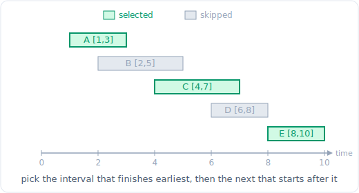

# 25 - 贪心

> 中文版。English: [25-greedy](../../patterns/25-greedy.md)

> **问题形态：**「选出最多数量的互不重叠的区间。」「用最少的跳跃到达最后一个下标。」
> 「你能从某个加油站出发跑完整个环路吗？」「用最少的箭戳破所有气球。」凡是一连串以
> 正确顺序做出的局部最优选择能被证明构建出全局最优答案、且你永远无需重新考虑过去的
> 某个选择的问题，都属于这一类。

贪心做出此刻看起来最好的选择并对它承诺，永不回溯。当它正确时，它是可能存在的最便宜
算法：通常是一次排序加一遍扫描，O(n log n) 或 O(n)。陷阱，也是这个模式的全部难点，
在于「此刻看起来最好」只有当你能证明局部最优的选择永不阻碍全局最优时才安全。没有那
个论证的贪心，只是一个碰巧通过了某些测试的猜测。



*区间调度：按结束时间排序，取最早结束的区间，然后取下一个在它之后开始的区间。*

## 信号

出现以下情况时考虑贪心：

- **「最多数量的……」「最少数量的……」「最少」「最早」「最小」**，作用于一个你能
  排序的集合，其中每个选择都足够独立、可由一个局部规则决定。
- **要选择、合并或穿刺的区间**：「最多互不重叠」「戳破气球的最少箭数」「最少会议室」。
  按开始或按结束排序解锁一遍扫描。
- **可达性与覆盖**：「你能否跳到终点」「最少跳跃数」「最少站台数」。你追踪你能到达的
  最远处并贪心地延伸它。
- **一次交换感觉安全**：你能论证，把任一最优解的某个选择换成贪心的选择永不让情况变
  糟。那个论证就是可以贪心的许可证。

反信号：如果一个选择的收益依赖于你尚未做出的选择，或同一个子问题带着重叠状态反复
出现，贪心就会悄无声息地返回错误答案，此时你想要的是 [DP](21-dp-linear-knapsack.md)。

## 思路

当问题具有**贪心选择性质**时贪心是正确的：存在一个与贪心的第一个选择一致的全局最优
解。你用一个**交换论证**来证明它。取任一最优解，并证明把它朝贪心选择变换（把它最先
做的那件事换成贪心的选取）能保持它合法且不更差。如果每一步都能这样交换，那么全贪心
的解就是最优的。

具体地，对「最多互不重叠区间」：按结束时间排序，并总是取仍然放得下的那些里结束最早
的那个区间。交换论证：任一最优安排的第一个区间都能被替换为结束最早的相容区间而不
减少数量，因为更早结束只会给其余的留下更多空间。重复这个过程，你就把最优解转换成了
贪心解且大小相同，所以贪心是最优的。

这就是这个模式要求的纪律：挑一个排序键，陈述局部规则，并能说清为什么交换成立。当你
说不清时，贪心就是未经证明的，而且多半是错的。

**贪心失败、需要 DP 的地方。** 任意面额的零钱兑换是经典反例：贪心地取不超过目标的
最大硬币可能超出最优解（硬币 `[1, 3, 4]`，目标 `6`，贪心给 `4+1+1 = 3` 枚，最优是
`3+3 = 2` 枚）。各个选择互相影响，没有交换论证成立，你需要在子问题上做 DP。0/1 背包
是同样的故事：按单位重量价值贪心对分数版本是最优的，但对 0/1 版本不是。

## 模板

**排序，然后做出局部最优的选取（最多互不重叠区间）：**

```python
# Time: O(n log n) (dominated by the sort), Space: O(1) auxiliary
def max_non_overlapping(intervals):
    intervals.sort(key=lambda iv: iv[1])   # sort by END time
    count = 0
    current_end = float('-inf')
    for start, end in intervals:
        if start >= current_end:           # fits after the last chosen one
            count += 1
            current_end = end              # commit, never reconsider
    return count
```

**最远可达扫描（跳跃游戏 I：你能到达终点吗？）：**

```python
# Time: O(n), Space: O(1)
def can_reach_end(nums):
    furthest = 0
    for i, jump in enumerate(nums):
        if i > furthest:                   # a gap we could never bridge
            return False
        furthest = max(furthest, i + jump)
    return True
```

**逐层前沿（跳跃游戏 II：最少跳跃数）：**

```python
# Time: O(n), Space: O(1)
def min_jumps(nums):
    jumps = 0
    current_end = 0                        # boundary of the current jump's reach
    furthest = 0                           # best reach seen within this level
    for i in range(len(nums) - 1):
        furthest = max(furthest, i + nums[i])
        if i == current_end:               # must jump now to go further
            jumps += 1
            current_end = furthest
    return jumps
```

**带运行赤字的一遍可行性判断（加油站）：**

```python
# Time: O(n), Space: O(1)
def can_complete_circuit(gas, cost):
    if sum(gas) < sum(cost):
        return -1                          # not enough fuel overall, impossible
    start = 0
    tank = 0
    for i in range(len(gas)):
        tank += gas[i] - cost[i]
        if tank < 0:                       # cannot reach i+1 from current start
            start = i + 1                   # every station up to i is also invalid
            tank = 0
    return start
```

加油站的论证值得记住：如果总油量覆盖总花费，那么一个合法起点存在，且它必定是运行
油箱变负的最后那一点之后紧邻的那个加油站，因为更早的任何加油站也熬不过那一段。

## 变体

- **按结束排序对比按开始排序。** 对「最多互不重叠」和「最少箭数」，按结束排序并贪心
  地延伸一个边界。对「合并区间」，按开始排序。选错键是最常见的贪心 bug。
- **戳破气球的最少箭数。** 按结束排序，在第一个气球的结束处射一支箭，跳过每个与那个
  x 重叠的气球。它就是区间调度贪心，只是数分组而不是数选取。注意箭可以落在一个共享
  端点上，所以决定是否需要新箭时用 `>` 而不是 `>=`。
- **无重叠区间（最少移除数）。** 是最多互不重叠的补集：总数减去保留数。同样的按结束
  排序扫描。
- **买卖股票的最佳时机 II。** 贪心地把每一步上涨都收入囊中
  （`sum of max(0, price[i] - price[i-1])`）。既然允许无限次交易，捕捉每一次上涨就
  等价于对上涨的任何一种最优分组。
- **划分字母区间。** 记录每个字符的最后下标，然后把当前划分的结束延伸到目前所见任一
  字符的最远最后下标；当扫描到达那个结束时切开。是一个伪装的贪心最远可达扫描。
- **保持诚实：当交换失效时去找 DP。** 如果在某一个维度上贪心地选取（最大硬币、最高
  价值）能被一个组合击败，那么问题就有互相影响的选择。那是 [DP](21-dp-linear-knapsack.md)
  的信号，不是贪心。

## 经典题目

| # | 题目 | 难度 | 训练点 |
|---|---------|-----------|----------------|
| 122 | Best Time to Buy and Sell Stock II | 中等 | 把每一步上涨收入囊中 |
| 55 | Jump Game | 中等 | 最远可达的可行性扫描 |
| 45 | Jump Game II | 中等 | 逐层前沿求最少跳跃数 |
| 134 | Gas Station | 中等 | 运行赤字挑出起点 |
| 435 | Non-overlapping Intervals | 中等 | 按结束排序，数移除数 |
| 452 | Minimum Number of Arrows to Burst Balloons | 中等 | 区间穿刺，共享端点 |
| 763 | Partition Labels | 中等 | 最远最后下标扫描 |
| 621 | Task Scheduler | 中等 | 贪心地放置最频繁的任务 |

## 陷阱

- **跳过正确性论证。** 头号贪心失败是因为局部规则通过了例子就假定它最优。如果你勾勒
  不出一个交换论证，就把贪心当作未经证明的，并检查是否需要 DP。
- **按错误的键排序。** 该按结束时却按开始（或反之）会悄悄产生一个貌似合理却错误的
  答案。对区间选择，按结束排序；把为什么内化（最早结束留下最多空间）。
- **端点相等处的差一错误。** 「在一点接触的区间」可能算重叠也可能不算。为具体问题
  决定 `>=` 还是 `>` 才对（箭共享端点；某些调度问题不共享）。
- **在有互相影响选择的问题上用贪心。** 任意面额的零钱兑换、0/1 背包、最长递增子序列：
  贪心给出错误答案。重叠子问题意味着 DP。
- **跳跃游戏 II 的循环边界。** 遍历到 `len(nums) - 1`，而不是最后一个下标，否则当
  最后一个元素本身会触发一次边界推进时你会多数一次跳跃。
- **忽略全局可行性检查。** 在加油站里，总油量对比总花费的检查正是许可那次单遍起点
  搜索的东西；没有它贪心的起点就毫无意义。

## 后续问题与相关模式

- 「贪心在这里给出错误答案」是转向
  [DP：线性与背包](21-dp-linear-knapsack.md) 的标准枢轴；零钱兑换和 0/1 背包是
  经典的贪心失败 DP 取胜例子。
- 「这些是区间，扫描它们」连接到
  [区间与扫描线](05-intervals.md)；区间调度贪心是一次带承诺规则的扫描。
- 「先排序」让贪心成为 [排序与自定义比较器](08-sorting.md) 的伙伴；排序键通常就是
  全部的洞见。
- 「反复拉出当前最优」当候选集合随进程变化时（任务调度器、重排字符串）就把一个贪心
  选择变成一个 [堆](24-heap.md)。
```
