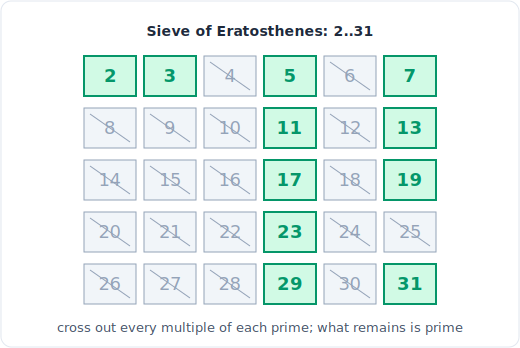

# 27 - 数学与数论

> 中文版。English: [27-math](../../patterns/27-math.md)

> **问题形态：** 「计算 pow(x, n)。」「统计 n 以下的质数。」「反转一个整数而不
> 溢出。」「n 的阶乘末尾有多少个零。」「把 Excel 列标题转成一个数字。」凡是算法
> 是一条已知数论恒等式（欧几里得、筛法、快速幂），真正难点在边界情形和溢出的问题。

数学题奖励的是知道那个闭式技巧，而不是在压力下现推。核心工具箱很小：欧几里得
gcd、埃拉托斯特尼筛法、模运算、平方快速幂、一点组合数学，以及逐位处理。大部分
面试风险不在思路，而在溢出、零的符号，以及边界上的差一错误。



*埃拉托斯特尼筛法：划掉每个质数的所有倍数，幸存者就是质数。*

## 信号

看到以下情况时，考虑数学模式：

- **gcd / lcm /「约分一个分数」/「化简一个比」**。欧几里得算法就是答案，
  O(log(min(a, b)))。
- **「统计质数」、「是不是质数」、「n 以下的质因数」**。埃拉托斯特尼筛法在
  O(n log log n) 内预计算出 n 以下的全部质数；单次查询则回退到试除法。
- **「对 1e9 + 7 取模」、「答案可能很大」**。你从不真正生成那个大数；你把一切都对
  m 取模来携带，用模加法、模乘法和模幂。
- **「计算 x^n」** 且 n 很大。平方快速幂把 O(n) 次乘法变成 O(log n)。
- **「从 n 里选 k 个有多少种方法」、帕斯卡三角形、二项式系数**。
  组合数学：`nCr`，可以用乘法公式，也可以用帕斯卡递推。
- **数位手术**：反转整数、回文数、数位之和、快乐数。你用 `% 10` 和 `// 10` 逐位
  剥离。
- **进制转换**：Excel 列标题（26 进制，从 1 开始）、「数字转十六进制」、二进制来
  回转。通用的「反复对底数做 divmod」循环。

判断标志是：这个问题代码量很小，但背后有一条命名的恒等式，而评分真正考的是处理
边界。

## 思路

每个工具都是一条恒等式的干净应用：

- **欧几里得 gcd。** `gcd(a, b) == gcd(b, a % b)`，因为 `a` 和 `b` 的任意公约数也
  整除 `a % b`。递归到余数为 0。然后
  `lcm(a, b) == a // gcd(a, b) * b`（先除以避免溢出）。
- **埃拉托斯特尼筛法。** 每个合数都有一个最小质因数，所以从每个质数 `p` 开始划掉
  `p*p, p*p+p, ...`；从 `p*p` 开始，因为更小的倍数早已被更小的质数划掉。幸存下来的
  就是质数。
- **模运算。** `(a + b) % m`、`(a * b) % m` 和 `(a - b) % m` 都对运算分配，所以你
  可以在每一步取模，绝不让运行值增长。这让乘积留在字长内（在 Python 里则很廉价）。
- **快速幂。** 偶数 n 时 `x^n = (x^(n/2))^2`，奇数 n 再乘一个额外的 `x`。每步把
  指数减半就得到 O(log n) 次乘法。同一递推也驱动模幂。

数位和进制问题里统一的动作是 `divmod`：`q, r = divmod(x, base)` 剥出最低有效位
`r`，把其余移入 `q`。

## 模板

**gcd 和 lcm（欧几里得）：**

```python
# Time: O(log(min(a, b))), Space: O(1)
def gcd(a, b):
    while b:
        a, b = b, a % b      # invariant: gcd(a, b) unchanged
    return a

# Time: O(log(min(a, b))), Space: O(1)
def lcm(a, b):
    return a // gcd(a, b) * b # divide before multiply to limit growth
```

**埃拉托斯特尼筛法，统计 n 以下的质数：**

```python
# Time: O(n log log n), Space: O(n)
def count_primes(n):
    if n < 3:
        return 0
    is_prime = [True] * n
    is_prime[0] = is_prime[1] = False
    p = 2
    while p * p < n:
        if is_prime[p]:
            for multiple in range(p * p, n, p):   # start at p*p, earlier ones done
                is_prime[multiple] = False
        p += 1
    return sum(is_prime)
```

**快速幂（平方求幂），可选取模：**

```python
# Time: O(log n), Space: O(1)
def fast_pow(x, n, mod=None):
    if n < 0:
        x, n = 1 / x, -n          # for modular pow, use modular inverse instead
    result = 1
    while n:
        if n & 1:                 # odd bit: fold in one factor of x
            result *= x
            if mod: result %= mod
        x *= x                    # square the base
        if mod: x %= mod
        n >>= 1
    return result
```

**数位剥离（反转整数，带 32 位溢出保护）：**

```python
# Time: O(number of digits), Space: O(1)
def reverse(x):
    sign = -1 if x < 0 else 1
    x = abs(x)
    result = 0
    while x:
        x, digit = divmod(x, 10)
        result = result * 10 + digit
    result *= sign
    return result if -2**31 <= result <= 2**31 - 1 else 0   # clamp to int range
```

## 变体

- **模逆元与 nCr mod p。** 当 p 是质数时，`a^(p-1) == 1 (mod p)`（费马），所以
  `a^(-1) == a^(p-2) (mod p)`，用快速模幂算。这就是你在质数模下计算二项式系数的
  方法。
- **用帕斯卡三角形算 nCr。** `C(n, k) = C(n-1, k-1) + C(n-1, k)`。当你需要许多小
  系数时逐行构建三角形；单个系数则用乘法公式 `C(n, k) = prod((n-i)/(i+1))`。
- **n! 的末尾零。** 零来自因子 10 = 2 * 5，而 5 更稀缺，所以统计因子 5 的个数：
  `n//5 + n//25 + n//125 + ...`。不需要真的算阶乘。
- **不做字符串转换的回文数。** 只反转后半部分：当 `x > rev` 时从低位构建 `rev`，
  然后比较 `x == rev`（偶数长度）或 `x == rev // 10`（奇数长度）。
- **通用进制转换。** 反复 `divmod(x, base)` 从最低有效位开始收集数位，然后反转。
  Excel 列是 26 进制但从 1 开始（A = 1，没有零位），所以每次 divmod 前先减 1。
- **整数平方根（牛顿法或二分）。** 向下取整的 `Sqrt(x)`：在 `[0, x]` 上二分答案，
  或用牛顿迭代 `r = (r + x // r) // 2` 直到不再减小。

## 经典题

| # | 题目 | 难度 | 训练点 |
|---|---------|-----------|----------------|
| 204 | Count Primes | 中等 | 埃拉托斯特尼筛法，从 p*p 开始 |
| 7 | Reverse Integer | 中等 | 数位剥离加 32 位溢出钳制 |
| 9 | Palindrome Number | 简单 | 反转一半，不做字符串转换 |
| 50 | Pow(x, n) | 中等 | 平方求幂，处理负 n |
| 69 | Sqrt(x) | 简单 | 二分或牛顿法求整数根 |
| 171 | Excel Sheet Column Number | 简单 | 26 进制、从 1 开始的转换 |
| 172 | Factorial Trailing Zeroes | 中等 | 统计因子 5 的个数，而非阶乘本身 |
| 268 | Missing Number | 简单 | 高斯求和 n(n+1)/2 减去数组之和 |

## 陷阱

- **反转值或累加值的溢出。** 在 C++/Java 里乘积在你还没来得及检查前就溢出了；要在
  乘法*之前*保护（`if result > MAX/10`）。Python 里没有溢出，但题目仍要求钳制到 32
  位范围，所以要显式做。
- **lcm 里先乘后除。** `a * b // gcd` 会在 `a // gcd * b` 不会溢出的地方溢出。永远
  先除。
- **筛法的边界。** n 是否包含在内，以及记住 `0` 和 `1` 不是质数。内层循环从 `p*p`
  开始，而不是 `2*p`，外层循环只需要 `p*p < n`。
- **数位问题里的符号和零。** 负数、带末尾零的输入（1200 反转成 21），以及单个值
  `0` 是常见的失败用例。
- **Excel 从 1 开始、没有零位。** 它是双射 26 进制，不是普通 26 进制；忘掉那个
  `-1` 偏移是两个方向上的经典 bug。
- **负数取模。** Python 里对正模数 `%` 已经返回非负结果，但 C 系语言里不会；如果你
  移植代码，加 `m` 再取一次 `% m`。
- **费马逆元需要质数模。** `a^(p-2)` 只有在 p 是质数时才是逆元；对合数模用扩展欧几
  里得算法。

## 后续追问与相关模式

- 「n 很大且你必须返回它 mod 1e9+7」把大多数计数问题变成一条
  [DP](23-dp-grids-intervals.md)递推的模运算版本。
- 「改用位技巧来做」（奇偶性、2 的幂、二进制转换）与
  [位运算](26-bit-manipulation.md)重叠。
- 「用二分法求 Sqrt(x)」和「找边界」是
  [二分查找](07-binary-search.md)里单调谓词的思路；数学版只是提供了一个数值答案
  空间。
- 没有闭式的组合计数（路径、选择）会回退到
  [DP III](23-dp-grids-intervals.md)或[回溯](20-backtracking.md)。
- 「1..n 里的缺失 / 重复数」在
  [循环排序和以下标为哈希](06-cyclic-sort.md)里有一个 O(1) 空间的伙伴，与高斯求和
  技巧并列。
