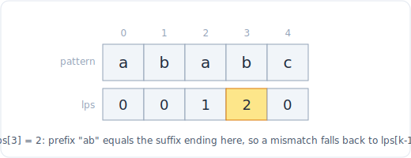

# 31 - 字符串匹配（KMP 与滚动哈希）

> 中文版。English: [31-string-matching](../../patterns/31-string-matching.md)

> **问题形态：** 「找出一个模式串在文本中第一次出现的位置。」「这个字符串是不是由
> 一个更短的块重复而成？」「出现两次的最长子串是什么？」「通过在前面添加字符，
> 能做出的最短回文是什么？」凡是朴素子串搜索（检查每个起点，O(n*m)）太慢，或者
> 问题实际关乎一个字符串内部周期性的情形。

「在文本中找模式」的暴力做法在每个位置都从头重新检查模式，是一次 O(n*m) 的扫描，
每遇到失配就把已学到的一切丢掉。两种技术修正它。**KMP** 预计算模式的自重叠
（它的前缀函数），使失配时向前跳而不是重启，得到 O(n+m)。**滚动哈希**（Rabin-
Karp）把每个长为 m 的窗口变成一个能在 O(1) 内更新的数字，于是比较子串就变成比较
整数。两者都是现代面试字符串部分的主力，也都解锁了一族没有干净双指针或 DP 答案的
周期性和重复检测问题。

## 信号

看到以下情况时，考虑字符串匹配：

- **O(n*m) 太慢的子串搜索**：n 和 m 都很大，「找模式」、「首次出现的下标」。
- **周期性**：「s 是否由一个重复块构成」、「既是前缀又是后缀的最长部分」、
  「通过前置添加得到最短回文」。这些正是 KMP 前缀函数所度量的。
- **重复或反复出现的子串**：「最长重复子串」、「所有重复出现的 10 字母序列」
  （DNA）。滚动哈希让每个窗口在 O(1) 内可比，常与
  [二分查找](07-binary-search.md)在长度上结合。
- **一次匹配多个模式，或流式文本**：滚动哈希（或多模式的 Aho-Corasick）胜过为每个
  模式各跑一次搜索。

判断标志是：答案取决于一个字符串如何与自身重叠，或取决于廉价地比较许多等长窗口。

## 思路

**KMP 与前缀函数。** 对模式的每个位置，预计算在此处结尾、既是真前缀又是后缀的最长
长度（「lps」或失配数组）。搜索中一旦失配，你不把模式移回起点，而是回退到
`lps[k-1]` 让它向前滑：已匹配的前缀保证那些字符仍然对齐，所以你从不重看一个文本
字符。这就是把 O(n*m) 变成 O(n+m) 的东西。

**滚动哈希（Rabin-Karp）。** 把一个长为 m 的窗口当作模一个大质数的 B 进制数。在
O(m) 内预计算模式的哈希和第一个窗口的哈希；然后把窗口滑一步，减去离开字符的贡献、
乘以底数、加上进入的字符，全在 O(1) 内。哈希相等意味着很可能匹配，你用一次直接比较
来核实以排除罕见的碰撞。因为比较现在是摊还 O(1)，滚动哈希驱动重复检测和「在子串
长度上二分」的解法。

经验法则：单个精确模式或一个周期性问题，用 **KMP**。重复检测、多模式，或一个要
二分的长度，用**滚动哈希**。



*前缀函数：lps[i] 是 pattern[0..i] 中既是真前缀又是后缀的最长长度。失配时跳回 lps[k-1] 而不是重启。*

## 模板

**KMP：构建前缀函数，然后在 O(n+m) 内搜索。**

```python
# Time: O(m), Space: O(m)  (m = pattern length)
def build_lps(pattern):
    lps = [0] * len(pattern)
    k = 0                                  # length of the current prefix-suffix
    for i in range(1, len(pattern)):
        while k and pattern[i] != pattern[k]:
            k = lps[k - 1]                 # fall back, do not restart
        if pattern[i] == pattern[k]:
            k += 1
        lps[i] = k
    return lps

# Time: O(n + m), Space: O(m)
def kmp_search(text, pattern):
    if not pattern:
        return 0
    lps = build_lps(pattern)
    k = 0
    for i in range(len(text)):
        while k and text[i] != pattern[k]:
            k = lps[k - 1]                 # slide the pattern, never rescan text
        if text[i] == pattern[k]:
            k += 1
        if k == len(pattern):
            return i - k + 1               # first match start index
    return -1
```

**滚动哈希（Rabin-Karp）：把窗口当作整数来比较。**

```python
# Time: O(n + m) average, Space: O(1)
def rabin_karp(text, pattern):
    n, m = len(text), len(pattern)
    if m == 0:
        return 0
    if m > n:
        return -1
    MOD, BASE = 1_000_000_007, 256
    high = pow(BASE, m - 1, MOD)           # value of the top digit
    ph = th = 0
    for i in range(m):                     # hash the pattern and the first window
        ph = (ph * BASE + ord(pattern[i])) % MOD
        th = (th * BASE + ord(text[i])) % MOD
    for i in range(n - m + 1):
        if ph == th and text[i:i + m] == pattern:   # verify to defuse collisions
            return i
        if i < n - m:                      # roll: drop text[i], add text[i+m]
            th = ((th - ord(text[i]) * high) * BASE + ord(text[i + m])) % MOD
    return -1
```

**从前缀函数得到周期性（重复子串模式）。**

```python
# Time: O(n), Space: O(n)
def repeated_substring(s):
    lps = build_lps(s)
    k = lps[-1]                            # longest prefix that is also a suffix
    return k > 0 and len(s) % (len(s) - k) == 0
```

## 变体

- **Z 函数。** 前缀函数的替代：`z[i]` 是从 `i` 开始、与字符串前缀匹配的最长子串
  长度。解决同样的问题；有些人觉得它对「与前缀匹配」更容易。
- **最短回文（214）。** 构建 `s + "#" + reverse(s)` 的前缀函数；`lps[-1]` 是 `s`
  的最长回文前缀，所以把其余部分反转后前置。
- **最长快乐前缀（1392）。** 答案直接是 `s[:lps[-1]]`。
- **最长重复子串（1044）。** 在长度 L 上二分；对每个 L，用滚动哈希在 O(n) 内检测
  任意重复的长为 L 的窗口。这是典范的滚动哈希加二分组合。
- **重复的 DNA 序列（187）。** 滑动一个固定的长为 10 的窗口并哈希（或者干脆用一个
  子串集合）；经典的滚动哈希热身。
- **双哈希。** 对抗性输入下，用两个不同的模（或一个随机底数）哈希并同时比较，使
  碰撞的概率小到天文数字级。
- **一次匹配多个模式。** Aho-Corasick 构建所有模式的字典树加 KMP 风格的失配链接，
  一次遍历就把它们全部匹配。即便面试里很少手写也值得点名。见
  [字典树](15-trie.md)。

## 经典题

| # | 题目 | 难度 | 训练点 |
|---|---------|-----------|----------------|
| 28 | Find the Index of the First Occurrence in a String | 简单 | 基础的 KMP 或 Rabin-Karp 搜索 |
| 459 | Repeated Substring Pattern | 简单 | 从前缀函数得到周期性 |
| 686 | Repeated String Match | 中等 | 跨重复副本的搜索 |
| 187 | Repeated DNA Sequences | 中等 | 固定窗口滚动哈希（或一个集合） |
| 214 | Shortest Palindrome | 困难 | s + 分隔符 + reverse 的前缀函数 |
| 1392 | Longest Happy Prefix | 困难 | 直接读出前缀函数 |
| 1044 | Longest Duplicate Substring | 困难 | 滚动哈希加在长度上二分 |

## 陷阱

- **重启而不是回退。** KMP 的全部要义就是失配时 `k = lps[k-1]`。如果你把 `k = 0`
  重置并把文本指针移回去，你就重写了 O(n*m) 的暴力法。
- **前缀函数里的差一错误。** 内层回退是 `k = lps[k - 1]`，而 `lps[i]` 在比较之后
  才设置。手动为几个模式（`"aabaaab"`、`"ababc"`）构建它，直到递推成为肌肉记忆。
- **盲目相信哈希匹配。** 哈希相等不等于字符串相等。命中时总是用一次直接比较核实，
  或者在你负担不起核实时用双哈希。跳过这个检查在对抗性测试上是实打实的 bug。
- **其他语言里的溢出。** Python 整数无界，所以取模只是为了让数字保持小。在 C++ 或
  Java 里，乘法在取模前就溢出一个 64 位整数，所以你需要 `__int128` 或小心的模乘。
  要说出这一点。
- **弱的模或底数。** 一个小质数或比字母表还小的 `BASE` 会招来碰撞。用一个大质数
  （约 1e9+7）和一个至少为字母表大小的底数。

## 后续追问与相关模式

- 「按前缀搜索，或匹配多个模式」指向[字典树](15-trie.md)，而 Aho-Corasick 是一棵
  加装了 KMP 失配链接的字典树。
- 「最长重复子串」和「第 k 个……长为 L 的」把滚动哈希与
  [在答案上二分](07-binary-search.md)配对。
- 「只要检测到任意重复」往往不需要比把一个固定窗口
  [哈希](04-hashing.md)进一个集合更花哨的东西；只有在窗口很大或长度要被二分时才动用
  完整的滚动哈希。
- 周期性和回文前缀问题是纯粹的前缀函数读取，与用于编辑距离和子序列的
  [字符串 DP](22-dp-strings.md)是不同的工具。
