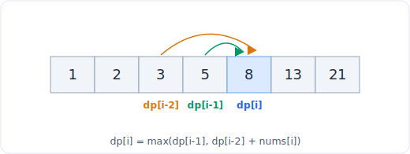

# 精解：零钱兑换 (LC 322)

> 中文版。English: [coin-change](../../walkthroughs/coin-change.md)

一个在一道题上叙述六步解题框架的例题，让你看到过程在运转，而不只是最终的代码。这一篇走完完整的 DP 弧线：从暴力递归到记忆化再到填表。

## 题目

**LeetCode 322，零钱兑换，中等。** 给你一个表示硬币面额的整数数组 `coins` 和一个整数 `amount`。返回凑出该金额所需的最少硬币数。如果任何硬币组合都凑不出该金额，返回 `-1`。每种硬币的供应是无限的。

例子：`coins = [1, 2, 5]`，`amount = 11` 返回 `3`（11 = 5 + 5 + 1）。



*在一维选择上的动态规划。完整模式见下方链接的文件。*

## 1. 厘清与复述

我在动代码前会问的问题：

- **每种硬币供应无限吗？** 是的。这让它成为**完全背包**的形状（每件物品可复用），而不是 0/1 背包。如果供应有限我就需要不同的状态。
- **我要返回什么？** 最少硬币数，不是硬币的集合。而且关键在于，当金额无法达到时返回 `-1`，所以我需要一个能在 min 操作中存活下来的「不可能」哨兵值。
- **amount 可以是 0 吗？** 可以，答案是 `0` 枚硬币。那是边界情况，不是之后要特判的边角。
- **coins 可以为空，或者比 amount 大吗？** coins 可以比 amount 大（它们只是永远用不上）。如果 `coins` 为空而 `amount > 0`，答案是 `-1`。
- **n 有多大？** 约束：`1 <= coins.length <= 12`，`1 <= coins[i] <= 2^31 - 1`，`0 <= amount <= 10^4`。关键数字是 `amount <= 10^4`，且至多 12 种硬币。所以一张 `O(amount * len(coins))` 的表（约 120,000 个格子）快得不费吹灰之力。那个约束就是提示：它直接指向一个在金额上的 DP，而不是枚举组合（那会是指数级的）。
- **边界情况。** `amount = 0` 返回 0。无法达到的金额，例如 `coins = [2], amount = 3`，返回 -1。一枚等于金额的硬币返回 1。

复述：找出和为 `amount` 的最小基数的硬币多重集，或者报告不存在这样的多重集。

## 2. 手算一个例子

`coins = [1, 2, 5]`，`amount = 11`。我会用「每个子金额的最优解」来思考，自底向上构建：

- 凑 0 的最优：0 枚硬币。
- 凑 1 的最优：1（用一枚 1）。
- 凑 2 的最优：1（用一枚 2）。
- 凑 3 的最优：2（2 + 1）。
- 凑 4 的最优：2（2 + 2）。
- 凑 5 的最优：1（用一枚 5）。
- 凑 6 的最优：2（5 + 1）。
- ……
- 凑 10 的最优：2（5 + 5）。
- 凑 11 的最优：在硬币 1、2、5 上取 (1 + best[10])、(1 + best[9])、(1 + best[6]) 的最优 = 1 + best[10] = 1 + 2 = 3，或 1 + best[6] = 1 + 2 = 3。所以是 3。

注意发生了什么：为了解出 11，我只需要 10、9、6 的答案，也就是移除一枚硬币能到达的那些金额。它们每一个我都已经解过了。那种对更小答案的复用，就是 DP 结构自己浮现出来。

## 3. 暴力解

显然的递归：要凑 `amount`，尝试把每种硬币作为「最后」用的那枚，对余额递归，取最小值。边界情况：凑 0 花 0 枚硬币；负余额无效。

```python
def coin_change_brute(coins, amount):
    def dfs(remaining):
        if remaining == 0:
            return 0
        if remaining < 0:
            return float("inf")          # invalid path
        best = float("inf")
        for coin in coins:
            best = min(best, 1 + dfs(remaining - coin))
        return best

    result = dfs(amount)
    return result if result != float("inf") else -1
```

复杂度：每次调用分叉成 `len(coins)` 个子节点，递归深度可达 `amount`（全用 1 元硬币），所以这是 `O(len(coins) ^ amount)` 时间，指数级。对 `amount = 10^4` 它永远跑不完。它是正确的，也通过 `inf` 哨兵正确返回 `-1`，但在给定约束下无法使用。

## 4. 找到瓶颈并挑选模式

看看递归树。`dfs(6)` 在经由硬币 5 走向 11 的路上被算了一次，又经由其他路径被算，而其中每一次都重算 `dfs(5)`、`dfs(4)`，如此类推。**同样的子金额被一遍又一遍地求解**。那正是**动态规划**的确切信号：重叠子问题加上最优子结构（凑 11 的最优方式是由凑某个更小金额的最优方式构建的）。

这是**完全背包**的味道，因为每种硬币可复用，所以当我拿一枚硬币时，我对 `remaining - coin` 递归，而*同一套*硬币集仍然完全可用（我并不消耗掉那枚硬币）。DP 配方：

- **状态：** `dp[a]` = 凑金额 `a` 的最少硬币数。
- **转移：** `dp[a] = min(dp[a - coin] + 1)`，在每个 `coin <= a` 上取。
- **边界情况：** `dp[0] = 0`。其余每个 `dp[a]` 都从「无穷大」起步（我用 `amount + 1` 作为安全哨兵，因为任何真实答案都不会超过 `amount` 枚硬币）。

我会同时展示记忆化的自顶向下形式（也就是暴力解加一个缓存）和自底向上的表，后者才是我会交出去的。

**记忆化（自顶向下）：**

```python
from functools import lru_cache

def coin_change_memo(coins, amount):
    @lru_cache(maxsize=None)
    def dfs(remaining):
        if remaining == 0:
            return 0
        if remaining < 0:
            return float("inf")
        return min((1 + dfs(remaining - coin)) for coin in coins)

    result = dfs(amount)
    return result if result != float("inf") else -1
```

缓存把指数级的树塌缩掉：从 0 到 `amount` 的每个不同的 `remaining` 只被计算一次，所以这是 `O(amount * len(coins))`。

## 5. 写出代码

自底向上填表，完全避开递归深度：

```python
from typing import List

class Solution:
    def coinChange(self, coins: List[int], amount: int) -> int:
        # dp[a] = fewest coins to make amount a. amount + 1 is an "impossible"
        # sentinel: no reachable amount needs more than `amount` coins.
        dp = [0] + [amount + 1] * amount

        for a in range(1, amount + 1):
            for coin in coins:
                if coin <= a:
                    dp[a] = min(dp[a], dp[a - coin] + 1)

        return dp[amount] if dp[amount] != amount + 1 else -1
```

不变式：当外层循环到达金额 `a` 时，每个更小金额的 `dp[a - coin]` 都已经确定，所以 `dp[a]` 看到的是正确的子问题答案。哨兵 `amount + 1` 之所以这么选，是因为它严格大于任何真实答案（最坏的真实情况是 `amount` 枚面额为 1 的硬币），这意味着它永远赢不了一次 `min`，并在最后干净地标记「无法达到」。

## 6. 测试、追踪与分析

追踪 `coins = [1, 2, 5]`，`amount = 11`。填完后的表（每个格子是最少硬币数）：

```
a    : 0  1  2  3  4  5  6  7  8  9  10 11
dp[a]: 0  1  1  2  2  1  2  3  3  4  2  3
```

抽查 `dp[11]`：候选是 `dp[10] + 1 = 3`、`dp[9] + 1 = 5`、`dp[6] + 1 = 3`。最小是 3。与手算吻合。正确。

边界情况：

- `coins = [2], amount = 3`：`dp[1]` 保持在 `amount + 1 = 4`（没有硬币合适），`dp[2] = 1`，`dp[3]` 尝试 `dp[1] + 1 = 5`，那是哨兵加一，所以 `dp[3]` 保持 `4`。最终检查 `dp[3] == 4` 为真，于是返回 `-1`。正确，无法达到的情形被处理了。
- `amount = 0`：`dp = [0]`，循环不执行，`dp[0] = 0 != 1`，返回 `0`。正确。
- `coins = [1], amount = 2`：`dp[1] = 1`，`dp[2] = dp[1] + 1 = 2`，返回 `2`。正确。
- 硬币大于金额，`coins = [5, 10], amount = 3`：没有硬币能适配任何 `a <= 3`，全部停在哨兵，返回 `-1`。正确。

复杂度：**O(amount * len(coins)) 时间**，因为 `amount` 个格子中每个做 `len(coins)` 的工作，在最大约束下约 120,000 次操作。**O(amount) 空间**用于表。这对于标准表述是最优的。时间更充裕的话，我会提一下转移可以重排为硬币在外、金额在内的迭代（这里结果相同，因为我们在所有硬币上取 min），以及重建实际的硬币集合（而不只是数量）需要一个父指针数组。

## 面试官真正考察的是什么

你能否认得出重叠子问题，把状态 / 转移 / 边界情况的配方明确写下来，并把一个解从指数级递归一路带到记忆化再到干净的自底向上表。`-1` 哨兵的处理是一个刻意的陷阱：忘掉它的候选人在无法达到的输入上会给出错误答案，而修复它揭示了你是否真的推理过在这个递推里「不可能」意味着什么。

> 模式：[21 DP 线性与背包](../patterns/21-dp-linear-knapsack.md)
