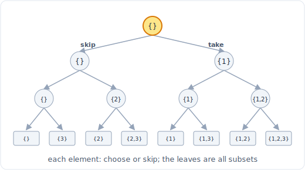

# 精解：子集 (LC 78)

> 中文版。English: [subsets](../../walkthroughs/subsets.md)

一个在一道题上叙述六步解题框架的例题，让你看到过程在运转，而不只是最终的代码。

## 题目

**LeetCode 78，子集，中等。** 给定一个元素互不相同的整数数组 `nums`，返回所有可能的子集（幂集）。解集不能包含重复的子集，你可以按任意顺序返回这些子集。

例子：`nums = [1, 2, 3]` 返回 `[[], [1], [2], [3], [1,2], [1,3], [2,3], [1,2,3]]`（任意顺序）。



*选/跳的决策树。完整模式见下方链接的文件。*

## 1. 厘清与复述

我在动代码前会问的问题：

- **元素是互不相同的吗？** 题目说是的。这很重要：如果有重复，我就需要 LC 90「子集 II」的去重逻辑（先排序，再跳过相等的兄弟节点）。互不相同意味着我生成的每个子集自动互异，所以不需要去重步骤。
- **输出类型是什么？** 一个由整数列表组成的列表。子集之间的顺序无所谓，子集内部的顺序也无所谓，但为了可读性我会保持元素按输入顺序排列。
- **n 有多大？** 约束是 `1 <= nums.length <= 10`。那是房间里最重要的一个数字。子集有 `2^n` 个，所以 n = 10 时答案本身就有 1024 个子集。n <= 10 是经典的「回溯没问题，指数级输出是意料之中」的信号。我不会去打败 `2^n`，因为输出就是那么大。
- **边界情况。** 空数组（题目说长度 >= 1，但一个健壮的解法仍应返回 `[[]]`）。单个元素返回 `[[], [x]]`。负数和零是允许的值但不改变逻辑，这里的值只是不透明的记号。

复述：构建幂集。每个元素要么在某个子集里、要么不在，所以恰好有 `2^n` 个子集，我需要枚举出全部。

## 2. 手算一个例子

取 `nums = [1, 2, 3]`。我会通过从左到右遍历、并在每个元素处决定「包含它」或「跳过它」来构建子集。那是每个元素上的一个二元决策，所以这些选择构成一棵深度为 3 的决策树：

```
                          start []
                 include 1 /        \ skip 1
                    [1]                []
          inc 2 /      \ skip 2   inc 2 /   \ skip 2
        [1,2]          [1]         [2]        []
       i3/  \s3       i3/ \s3     i3/ \s3    i3/ \s3
  [1,2,3] [1,2]   [1,3] [1]   [2,3] [2]  [3]   []
```

读出这些叶子就得到全部 8 个子集。结构很干净：在深度 `i` 我决定元素 `i`，而每一条从根到叶的路径就是一个子集。八个叶子，`2^3 = 8` 个子集。这棵树就是算法。

## 3. 暴力解

「显然的」枚举是位掩码技巧：每个子集对应一个从 `0` 到 `2^n - 1` 的 n 位数，其中第 `j` 位为 1 表示「包含 `nums[j]`」。这确实是一个有效的解法，不只是稻草人，但我把它叫作暴力解，因为它是我伸手去抓模式之前的机械枚举。

```python
def subsets_bitmask(nums):
    n = len(nums)
    result = []
    for mask in range(1 << n):           # 0 .. 2^n - 1
        subset = []
        for j in range(n):
            if mask & (1 << j):          # is bit j set?
                subset.append(nums[j])
        result.append(subset)
    return result
```

复杂度：外层循环跑 `2^n` 次，内层循环跑 `n` 次，所以是 `O(n * 2^n)` 时间和 `O(n * 2^n)` 输出空间。就时间而言那是最优的，因为输出就是那么大。我在面试中不止步于此的原因是，面试官通常想要那棵递归决策树，它能推广到「子集 II」、「组合」、「排列」以及所有其他枚举问题。

## 4. 找到瓶颈并挑选模式

这里没有可以消除的重复工作瓶颈，`O(n * 2^n)` 是下限，因为答案本身就有那么多项。位掩码版本没有展现出来的是**决策的结构**，而那个结构正是面试官在考察的、也是能迁移到更难问题上的东西。

信号是教科书式的：「返回所有可能的子集」、「每一种组合」。那是**回溯**的信号。回溯是对决策树的一次深度优先遍历，你做一个选择、递归、再撤销那个选择（选择 / 探索 / 撤销选择）。它构建一个共享的 `path` 列表并就地修改它，这正是它相比在每个节点复制而言更省内存的原因。

每个节点上的决策：对元素 `i`，要么把它包含进当前 path、要么不包含。我在树的每个节点都记录一个子集，而不只是在叶子处，因为每一段选择的前缀本身都是一个有效的子集（这是与「大小为 k 的组合」的区别，那里你只在叶子处记录）。

## 5. 写出代码

```python
from typing import List

class Solution:
    def subsets(self, nums: List[int]) -> List[List[int]]:
        result = []
        path = []

        def backtrack(start: int) -> None:
            # Every node is a valid subset: record a copy of the current path.
            result.append(path[:])
            # Try adding each remaining element as the next choice.
            for i in range(start, len(nums)):
                path.append(nums[i])        # choose
                backtrack(i + 1)            # explore with i consumed
                path.pop()                  # unchoose (backtrack)

        backtrack(0)
        return result
```

不变式：当 `backtrack(start)` 被调用时，`path` 持有一个由 `start` 之前的元素构建的有效子集，而循环只用下标 `start` 或更后的元素来扩展它。传 `i + 1`（而不是 `start + 1`）正是防止重访更早元素、从而防止像 `[2,1]` 和 `[1,2]` 这样的重复子集的关键。`path[:]` 这个复制不可或缺：`path` 全程都在被修改，所以我必须给它拍个快照，而不是存一个引用。

## 6. 测试、追踪与分析

追踪 `nums = [1, 2, 3]`：

- `backtrack(0)` 记录 `[]`。循环 i=0：压入 1，递归。
  - `backtrack(1)` 记录 `[1]`。循环 i=1：压入 2，递归。
    - `backtrack(2)` 记录 `[1,2]`。循环 i=2：压入 3，递归。
      - `backtrack(3)` 记录 `[1,2,3]`，循环为空，返回。弹出 3。
    - 弹出 2。循环 i=2：压入 3，递归。
      - `backtrack(3)` 记录 `[1,3]`，返回。弹出 3。
    - 返回。弹出 1。
  - 循环 i=1：压入 2，递归。
    - `backtrack(2)` 记录 `[2]`。循环 i=2：压入 3，递归。
      - 记录 `[2,3]`，返回。弹出 3。
    - 返回。弹出 2。
  - 循环 i=2：压入 3，递归。
    - 记录 `[3]`，返回。弹出 3。

收集到：`[], [1], [1,2], [1,2,3], [1,3], [2], [2,3], [3]`。那是全部 8 个子集，与手算追踪吻合。正确。

边界情况：

- `nums = []`：`backtrack(0)` 记录 `[]`，循环不执行，返回 `[[]]`。空集的幂集就是含有空集的那个集合。正确。
- `nums = [0]`：记录 `[]`，然后压入 0 并记录 `[0]`，返回 `[[], [0]]`。正确，注意零和任何值一样被处理。
- 负数，例如 `nums = [-1, 5]`：值是不透明的，返回 `[[], [-1], [-1, 5], [5]]`。正确。

复杂度：**O(n * 2^n) 时间**（有 `2^n` 个子集，把每个复制进结果耗时可达 `O(n)`），这是最优的，因为输出就是那个大小。**空间：O(n * 2^n)** 用于输出，若排除输出则为 **O(n)** 辅助空间（递归深度和 `path` 列表都受 n 界定）。时间更充裕的话，我会提一下位掩码版本作为一个避免递归深度的迭代替代方案，以及针对非互异输入的「子集 II」去重后续。

## 面试官真正考察的是什么

你能否把一个问题建模成一棵决策树，并把那棵树翻译成干净的选择 / 探索 / 撤销选择递归，且不在分支之间泄漏状态。子集是一大家族（组合、排列、划分、N 皇后）中最简单的成员，所以在这里把 `path[:]` 快照和 `i + 1` 递归边界弄对，就标志着你在更难的成员上也会弄对。

> 模式：[20 回溯](../patterns/20-backtracking.md)
