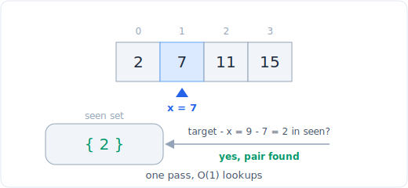

# 精解：两数之和 (LC 1)

> 中文版。English: [two-sum](../../walkthroughs/two-sum.md)

一个从头到尾在一道题上跑完六步框架的例题。目标是展示过程，而不只是答案。

## 题目

**LeetCode 1，简单。** 给定一个整数数组 `nums` 和一个整数 `target`，返回加起来等于 `target` 的两个数的下标。每个输入恰好有一个解，且你不能重复使用同一个元素。可以按任意顺序返回这两个下标。

例子：`nums = [2, 7, 11, 15]`，`target = 9` 返回 `[0, 1]`，因为 `nums[0] + nums[1] = 2 + 7 = 9`。



*在哈希表中查补数。完整模式见下方链接的文件。*

## 1. 厘清与复述

我会问的问题：

- **输入类型。** `nums` 是一个整数列表，`target` 是一个整数。值可以是负数吗？可以，所以我不能对顺序或符号做任何假设。数组排好序了吗？没有，而这很重要：一个有序数组会打开双指针解法的大门，但这里输入是任意顺序。
- **我要返回什么？** 两个**下标**，而不是值本身。这是一个常见的绊脚点：如果我对数组排序，就毁掉了原始下标，所以任何基于排序的方法都需要把原始位置一起带上。
- **唯一性。** 题目保证恰好一个解，所以我不必处理「无解」或「多解」。我也不能重复使用同一个元素，所以下标 `i` 不能和它自己配对。
- **约束。** `nums` 长度在 2 到 `10^4` 之间。那小到 O(n^2) 技术上能通过，但有意思的答案是 O(n)，而这个规模是一个提示，暗示单趟扫描是预期目标。
- **边界情况。** 恰好两个元素（最小规模）；构成配对的重复值（比如 `[3, 3]`，target `6`）；求和为零的负数（比如 `[-3, 4, 3, 90]`，target `0`）。

复述：找出那一对值之和为 `target` 的互异位置，并返回这些位置。

## 2. 手算一个例子

`nums = [2, 7, 11, 15]`，`target = 9`。

我从左往右走，对每个数问「我需要之前已经见过什么值才能凑成这一对？」那个需要的值就是 `target - current`。

- 下标 0，值 `2`。补数是 `9 - 2 = 7`。我见过 7 了吗？没有。记住值 2 位于下标 0。
- 下标 1，值 `7`。补数是 `9 - 7 = 2`。我见过 2 了吗？见过，在下标 0。答案是 `[0, 1]`。

注意是什么让这变快了：在下标 1 我没有重扫更早的元素，我只问了一个「我见过 2 吗？」的问题，就得到了瞬时的「是」。那个「我见过这个值吗」的问题就是整道题的全部。

## 3. 暴力解

检查每一对下标，返回第一对求和为 `target` 的。

```python
def two_sum_brute(nums, target):
    n = len(nums)
    for i in range(n):
        for j in range(i + 1, n):
            if nums[i] + nums[j] == target:
                return [i, j]
    return []
```

外层循环跑 n 次，内层循环至多跑 n 次，所以这是 **O(n^2)** 时间和 **O(1)** 空间。正确且容易推理，但每个内层循环都重扫我已经走过一次的值。那种重扫就是浪费。

## 4. 找到瓶颈并挑选模式

暴力解对每个 `i` 问「有没有更后面的 `j` 能凑成这一对？」并通过扫描数组的其余部分来回答。但这个问题其实是一次查找：「补数 `target - nums[i]` 在数组里的某处吗？」线性扫描用 O(n) 回答一个成员判定问题；**哈希表**用 O(1) 回答同一个问题。

这是**哈希**的教科书信号：我在重复一个「我见过这个值吗」的查找，而一个哈希表（字典）把每次查找塌缩到常数时间。额外的洞见是我甚至不需要两趟。当我扫一趟数组时，我可以检查补数是否已经在哈希表里（来自更早的下标），如果不在就记录当前的值和下标。任何要和更后面的元素配对的值，都会在那个后面的元素被检查到时找到它的伙伴。

所以我边走边存 `value -> index`，对每个新值我在插入之前查它的补数。哈希表里始终只包含严格位于当前元素左边的元素，这自动强制了「两个互异下标」的规则。

## 5. 写出代码

```python
def two_sum(nums, target):
    seen = {}                      # value -> index, for elements to the left
    for i, x in enumerate(nums):
        need = target - x          # the value that would complete the pair
        if need in seen:
            return [seen[need], i] # earlier index first, then current
        seen[x] = i                # record x only after checking, avoids self-pair
    return []                      # unreachable given the one-solution guarantee
```

两处读起来很讲究的细节。第一，我在插入 `x` **之前**检查 `need in seen`，所以一个值绝不会和它自己配对：在我测试下标 `i` 的那一刻，哈希表只持有下标 `0..i-1`。第二，我返回 `[seen[need], i]`，把更早的下标放在前面，即便题目接受任意顺序，这样也更整洁。

循环不变式：处理完下标 `i` 后，`seen` 把 `nums[0..i]` 中的每个值映射到它的下标，而在这前 `i + 1` 个元素中不存在有效配对（否则我早就返回了）。

## 6. 测试、追踪与分析

追踪 `nums = [3, 2, 4]`，`target = 6`。

| i | x | need = 6 - x | need 在 seen 里吗？ | 之后的 seen |
|---|---|--------------|---------------|-----------------|
| 0 | 3 | 3 | 否 | {3: 0} |
| 1 | 2 | 4 | 否 | {3: 0, 2: 1} |
| 2 | 4 | 2 | 是，在下标 1 | 返回 [1, 2] |

返回 `[1, 2]`，正确：`nums[1] + nums[2] = 2 + 4 = 6`。注意在下标 0 时 3 的补数也是 3，但那时哈希表还是空的，所以它没有把 3 错误地和自己配对。

边界情况：
- **两个元素**，`nums = [3, 3], target = 6`：下标 0 记录 `{3: 0}`，下标 1 查补数 `3`，在下标 0 找到，返回 `[0, 1]`。重复的值被正确处理，因为我们以值为键、并在插入前检查。
- **求和为零的负数**，`nums = [-3, 4, 3, 90], target = 0`：下标 0 记录 `{-3: 0}`，下标 2（值 3）查补数 `-3`，找到，返回 `[0, 2]`。正确。
- **最小规模**，任何求和为 target 的两元素数组：这对在第二次迭代就被找到。

**复杂度：O(n) 时间**，一趟扫描，每个元素做一次 O(1) 的哈希查找和插入，以及最坏情况下哈希表所占的 **O(n) 额外空间**（直到最末才出现配对）。相比 O(n^2)、O(1) 的暴力解，这是用空间换时间，也就是经典的哈希交易。

时间更充裕的话，我会提一下后续：如果数组本来就是**有序的**，我可以丢掉哈希表，用从两端出发的双指针达到 O(n) 时间和 O(1) 空间。模式的选择完全取决于输入是否有序，而这里它不是。

## 面试官真正考察的是什么

你是否认得出一次两两扫描里藏着一个「我见过这个值吗」的问题，以及你是否伸手去抓哈希表把那次查找变成 O(1)。更深的信号是那个单趟洞见：你不需要先建好整张哈希表再去搜索它，因为每个需要更早伙伴的元素都会恰好在它被检查时找到伙伴。不先说出 O(n^2) 暴力解就直接跳到 O(n) 的候选人会丢掉过程分；强的做法是陈述暴力解、指出重复查找是瓶颈、并点名哈希是消除它的工具。

> 模式：[04 哈希](../patterns/04-hashing.md)
